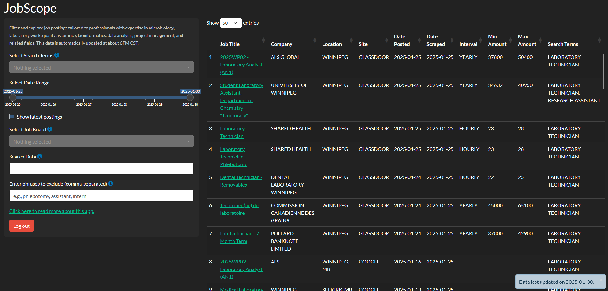

## The Endless Tedium of Job Searching

Job searching has become an overwhelming and tedious task. It’s not just an unenjoyable chore—it can also be incredibly stressful, especially when faced with mounting deadlines or financial pressures. The sheer number of job boards, career websites, and company hiring portals has turned what should be a straightforward process into an exhausting scavenger hunt. Instead of a single, centralized resource, job seekers must sift through LinkedIn, Indeed, Glassdoor, ZipRecruiter, and countless niche industry boards—each with its own interface, filters, and quirks.

On top of that, many employers exclusively post openings on their company career pages, forcing applicants to track multiple sources just to stay updated. Job alerts and scheduled emails flood inboxes with duplicate listings or irrelevant postings, often burying the few opportunities that are actually worth considering. Searching for a specific role across multiple platforms means constantly tweaking keywords, adjusting filters, and dealing with misleading job titles. The result? A frustrating and time-consuming process that often feels like searching for a needle in a haystack.

Your daily job search routine has become an exhausting checklist of repetitive tasks. First, you sift through a flood of email notifications from various employers and government agencies, hoping that something relevant appears in your inbox. Then comes the tedious process of manually visiting multiple job boards—City of Winnipeg, Red River College, Province of Manitoba, Canada Life, and the list goes on—each with its own interface, search filters, and quirks.

But the real grind begins when tackling the major job boards like LinkedIn, Indeed, Glassdoor, and ZipRecruiter. Instead of a simple search, you're forced to enter a long list of carefully chosen keywords, tweaking and refining them in an attempt to capture every possible relevant posting. Even then, duplicate listings, vague job descriptions, and misleading titles make it difficult to sift through the noise. What should be a streamlined process has become an inefficient, time-consuming scavenger hunt—one that repeats day after day.

## JobScope

Thus, I created **JobScope**—a tool designed to cut through the clutter and streamline the job search process. Instead of manually searching multiple job boards and tweaking endless keyword combinations, JobScope automates this tedious task, aggregating job postings from various sources into one centralized, easily searchable table.  
With daily updates, JobScope eliminates the need to visit multiple websites, re-enter search terms, and sift through duplicate listings. It ensures that relevant opportunities are compiled in one place, making the job search more efficient and less frustrating. Instead of spending hours navigating different platforms, I can now focus on what truly matters—evaluating opportunities and applying to the jobs that best fit my skills and career goals.

Essentially, everyday at midnight GMT, a GitHub Actions workflow is triggered via cron job which runs a script that scrapes job poster information from Google, Indeed, Glassdoor, LinkedIn, and ZipRecruiter for pre-defined search terms. The data is then compiled, cleaned, and presented in an easily searchable table with custom filtering options in a Shiny App. The app can be accessed [here](https://colewb.shinyapps.io/JobScope/). 

## Steps 

### GitHub Actions Workflow

**GitHub Actions** are a powerful automation tool built into GitHub, allowing developers to streamline workflows, automate tasks, and integrate with external services. They work by defining workflows, which are sets of instructions triggered by specific events such as code pushes, pull requests, or scheduled times. These workflows run in virtual environments (like Ubuntu, Windows, or macOS) and execute commands such as running scripts, testing code, deploying applications, or managing data updates.

For **JobScope**, I use a [GitHub Actions workflow](https://github.com/colebaril/JobScope/blob/main/.github/workflows/init_scrape_jobs.yaml) to automate the job-scraping process. Instead of manually running the script every day, I’ve set up a cron job to trigger my workflow at midnight GMT. This means that once per day, GitHub automatically runs my Python script, which scrapes job postings from multiple sources and compiles them into a structured dataset.

### Web Scraping 

The [Python script](https://github.com/colebaril/JobScope/blob/main/job_scraper.py) triggered by the actions workflow automates the process of aggregating job postings from multiple sources into a single dataset. It first retrieves the latest job listings from GitHub to ensure continuity, then scrapes fresh postings from job boards like Indeed, LinkedIn, Glassdoor, ZipRecruiter, and Google using a predefined set of search terms. Newly scraped jobs are stamped with the current date and merged with the existing dataset to maintain historical records. Finally, the updated dataset is saved locally, ensuring that the most up-to-date job listings are compiled and ready for analysis or further processing.

### Clean-up and Display 

Finally, data is cleaned up and displayed in a searchable table in a [Shiny app](https://github.com/colebaril/JobScope/blob/main/app.R). 

## References 

R Core Team (2023). _R: A Language and Environment for Statistical Computing_. R Foundation for Statistical Computing, Vienna, Austria.
<https://www.R-project.org/>.

Python Software Foundation. (2024). _Python Language Reference, version 3.10_. Available at https://www.python.org.

Wickham H, Averick M, Bryan J, Chang W, McGowan LD, François R, Grolemund G, Hayes A, Henry L, Hester J, Kuhn M, Pedersen TL, Miller E, Bache
SM, Müller K, Ooms J, Robinson D, Seidel DP, Spinu V, Takahashi K, Vaughan D, Wilke C, Woo K, Yutani H (2019). “Welcome to the tidyverse.”
_Journal of Open Source Software_, *4*(43), 1686. doi:10.21105/joss.01686 <https://doi.org/10.21105/joss.01686>.

Wickham H (2024). _rvest: Easily Harvest (Scrape) Web Pages_. R package version 1.0.4, <https://CRAN.R-project.org/package=rvest>.

Chang W, Cheng J, Allaire J, Sievert C, Schloerke B, Xie Y, Allen J, McPherson J, Dipert A, Borges B (2023). _shiny: Web Application Framework
for R_. R package version 1.8.0, <https://CRAN.R-project.org/package=shiny>.

Firke S (2023). _janitor: Simple Tools for Examining and Cleaning Dirty Data_. R package version 2.2.0,
<https://CRAN.R-project.org/package=janitor>.

Grolemund G, Wickham H (2011). “Dates and Times Made Easy with lubridate.” _Journal of Statistical Software_, *40*(3), 1-25.
<https://www.jstatsoft.org/v40/i03/>.

Xie Y, Cheng J, Tan X (2023). _DT: A Wrapper of the JavaScript Library 'DataTables'_. R package version 0.31,
<https://CRAN.R-project.org/package=DT>.

Chang W (2021). _shinythemes: Themes for Shiny_. R package version 1.2.0, <https://CRAN.R-project.org/package=shinythemes>.

JobSpy (2025). *JobSpy job scraping library!* Available at https://github.com/Bunsly/JobSpy.

