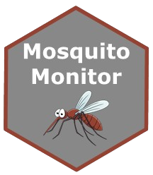
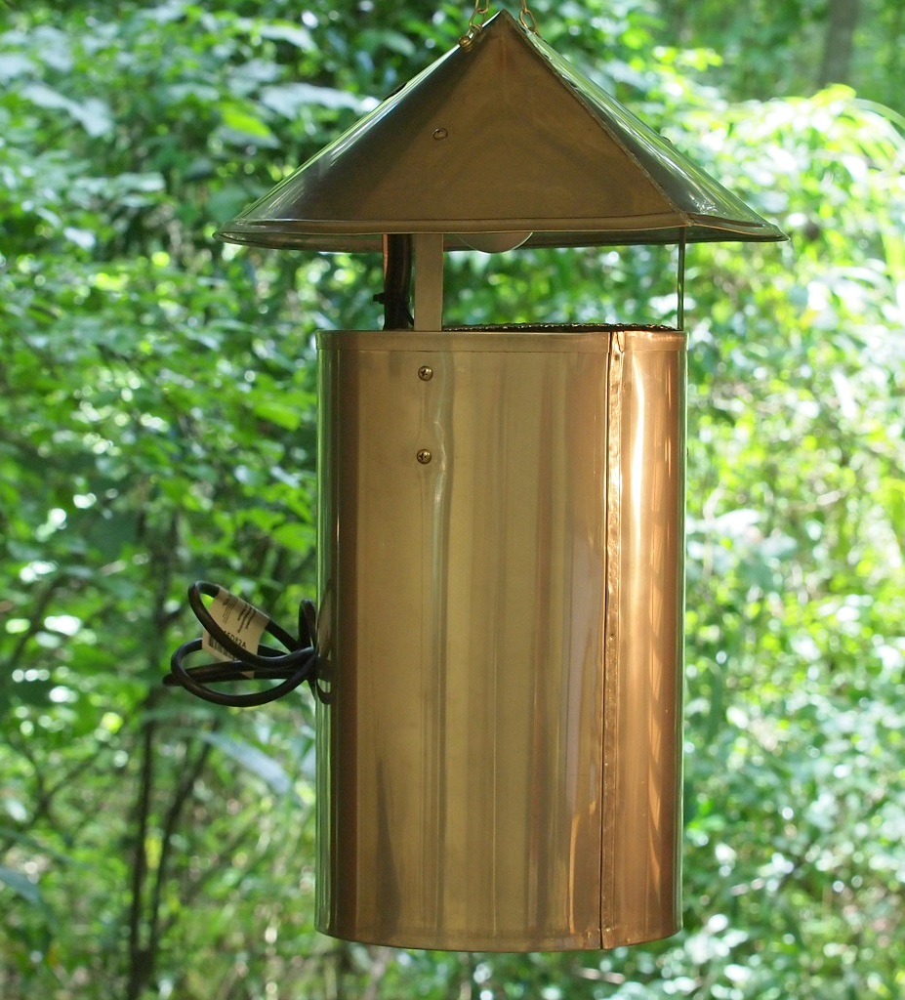
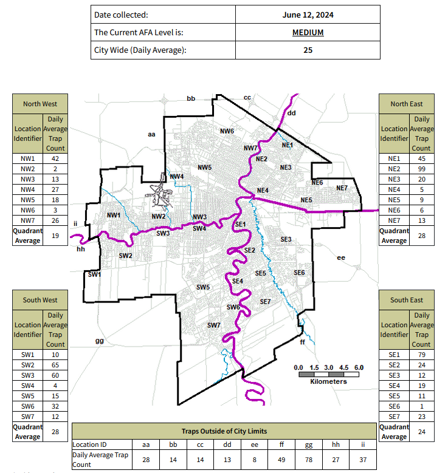
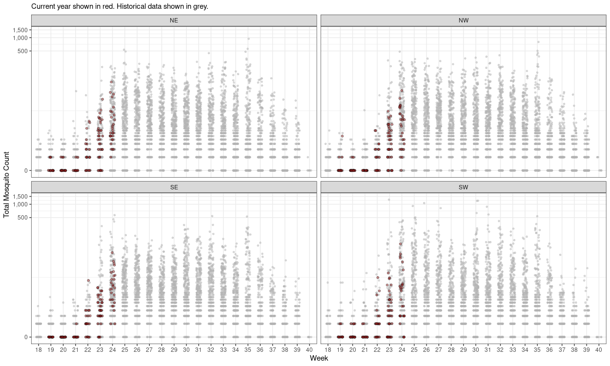
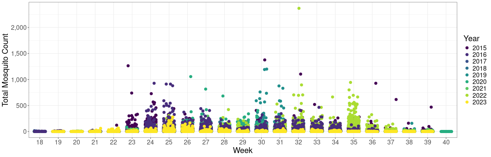

<style>
  img.rounded-corners {
    border-radius: 15px;
    text-align: justify;
    padding: 10px;
  }
  .text-container {
    text-align: center;
    font-style: italic;
  }
</style>

## Mosquito Monitor 




The City of Winnipeg conducts adult mosquito surveillance using New Jersey Light Traps from May to September, which is the active mosquito season in Winnipeg. Traps are collected on an irregular basis, but by and large on a daily basis on weekdays during peak periods (June-August). Trap counts are updated on the [City of Winnipeg Website](https://legacy.winnipeg.ca/publicworks/insectcontrol/mosquitoes/trapcounts.stm) by the city. While the website displays data, there is no historical data available, and the map is dated and is difficult to interpret easily. Moreover, citizens are not notified of updates and must actively check the website to learn about changes to mosquito activity. 

In this article, I will critique the presentation of City of Winnipeg mosquito trap count data and document the steps I took to improve upon their approach, augmenting the data with web applications, programmatic workflows, and a health alert notification system.

## Trapping Methods

New Jersey Light Traps are a standard tool used in mosquito control operations due to their effectiveness and reliability. The City of Winnipeg operates 37 of these traps. New Jersey Light Traps are designed to capture mosquitoes by utilizing light as an attractant, typically employing ultraviolet light, which mosquitoes are naturally drawn to. Once the mosquitoes approach the light source, they are captured by the trap, which often contains an insecticide, killing the specimens. Thus, these traps are only useful for mosquito surveillance, and not for mosquito-borne virus surveillance, for which the CDC Light Trap is superior.

<div class="block">
  <div style="float: right; width: 50%;">
    
    <p class="text-container">New Jersey Light Trap, manufactured by <a href="https://www.johnwhock.com/products/mosquito-sandfly-traps/new-jersey-stainless-steel-light-trap/">John W. Hock</a></p>
  </div>
</div>

The traps are permanent fixtures, strategically placed in locations where mosquito populations are known to be high or where monitoring is critical. This strategic placement helps in consistently gathering data on mosquito activity and density, which is crucial for effective control measures.

A key feature of New Jersey Light Traps is the incorporation of photoswitches with programmable timers. Photoswitches enable the traps to operate automatically based on the presence of light, turning on at dusk when mosquitoes are most active and off at dawn. The programmable timers allow for further customization of the trapping schedule, ensuring that the traps operate during peak mosquito activity periods, which maximizes the number of mosquitoes captured.

The data collected from these traps is invaluable for mosquito control programs. It helps in identifying trends in mosquito populations, determining the effectiveness of control measures, and assessing the risk of mosquito-borne diseases. By analyzing this data, mosquito control professionals can make informed decisions on where and when to implement additional control measures, such as larviciding or adulticiding, to reduce mosquito populations and minimize the risk of disease transmission.

Overall, New Jersey Light Traps are a crucial component of integrated mosquito management strategies, providing reliable, long-term monitoring and control of mosquito populations.

## Data from the City

The presentation of mosquito trap counts for the city of Winnipeg has several issues that make it challenging to interpret and utilize effectively. Firstly, there is no access to historical data, which prevents any analysis of trends or comparison with previous data to understand changes in mosquito populations over time. This lack of context limits the ability to assess the effectiveness of mosquito control measures. Additionally, the absence of color coding makes it difficult to quickly identify areas with high or low mosquito counts. Implementing a gradient or color-coded system would enhance visual interpretation and allow for immediate recognition of problem areas.

<div class="block">
  <div style="float: left; width: 50%;">
    
    <p class="text-container">City of Winnipeg Data Example, viewable <a href="https://legacy.winnipeg.ca/publicworks/insectcontrol/mosquitoes/trapcounts.stm">here</a></p>
  </div>
</div>

Moreover, the overall layout is cluttered and overwhelming. The combination of a detailed map and multiple data tables makes it challenging to analyze the information at a glance. The presentation lacks visual distinctions or significant markers to highlight the highest or lowest counts, making it less intuitive. This complexity could be mitigated by simplifying the layout, using separate sections for each quadrant, and including a clear legend.

Additionally, there are no notifications when the data is updated. Citizens need to visit the site in order to view updates, and the site is updated at varying points throughout the day on different days. 

Lastly, the presentation lacks graphical elements such as bar charts or line graphs, which could help visualize daily averages or trends over time, making the data more accessible and easier to analyze. 

Thus, my goal was to improve upon the existing data by creating a better way to visualize the data by using colour coding, store historical data so that data for previous days can be observed and compared, include additional plots such as jitter plots comparing the current year to previous years, include summary datatables, and include weather data mapped against trap counts. Moreover, I sought to improve accessibility of the data by implenting a "health alert" notification system such that citizens can be notified when an update to the data occurs. 

<br>

## Step 1: Obtain City Data 

To start, I needed to obtain the data as it was updated. To accomplish this, I used the `rvest` R package to read the elements of the City of Winnipeg website and extract the data, namely the trap counts for each trap and the date the website was last updated. This is accomplished in relatively few lines of code:

```r
# Define the URL you want to scrape
url <- "https://legacy.winnipeg.ca/publicworks/insectcontrol/mosquitoes/trapcounts.stm"

# Check date updated

webpage <- read_html(url)

date_updated <- html_nodes(webpage, "#lastUpdateDate") %>% 
  html_text() %>% 
  str_extract(., "\\b[A-Za-z]+ \\d{1,2}, \\d{4}\\b") 

date_updated <- format(as.Date(date_updated, "%B %d, %Y"), "%Y-%m-%d")

# Function to scrape and save data
scrape_and_save_data <- function() {
  # Scrape data from the website
  webpage <- read_html(url)

  data <- webpage %>%
    html_table(fill = TRUE) %>%
    .[[2]]  # Assuming the data is in the first table

  return(data)
}

```

There is a check in the script to identify if the data needs to be updated. Essentially, if the latest date in the data is equal to today's date OR the date updated is not equal to the current date, the script to obtain the data will not run. This assumes that the data will only be updated at a maximum of once per day.

```r
if(max(master_data_old$date) == Sys.Date() | date_updated != Sys.Date()) {
  
  message(paste0("Data is already up to date as of ", Sys.Date(), "."))
  
  message(paste0("Website last updated: ", date_updated, "."))
  
}
```

After the data is obtained, there are a number of cleaning steps carried out using primarily `tidyverse` packages. The data is then saved as a `.csv` file to the [Mosquito Monitor Github Repository](https://github.com/colebaril/Mosquito_Monitor/tree/main). 


The raw data is available in the Mosquito Monitor GitHub repository [here](https://github.com/colebaril/Mosquito_Monitor/blob/main/mosquito_data.csv). Append `?raw=TRUE` to the link to download raw data or read it as a `.csv` using code. While this data was obtained from the City of Winnipeg, please cite this repository using the citation provided in the `README`. 


### Scheduling 

One problem that presented itself is that the time and day when the data is updated on the City of Winnipeg website is not consistent. Thus, to ensure the data is always up-to-date, I used a [GitHub Actions Workflow](https://github.com/colebaril/Mosquito_Monitor/blob/main/.github/workflows/scrape_data.yaml) to run the script to check if the data needs to be updated once per hour as a Cron job. If the data needs to be updated, the rest of the script will run and save the data.  

Notably: 

```yaml
name: Scrape Data
on:
  schedule:
    - cron: '0 * * * *' # This will run the workflow at the beginning of every hour

jobs:
  import-data:
    runs-on: ubuntu-latest
    steps:
      - name: Set up R
        uses: r-lib/actions/setup-r@v2

      - name: Install packages
        uses: r-lib/actions/setup-r-dependencies@v2
        with:
          packages: |
            any::tidyverse 
            any::janitor
            any::rvest

      - name: Check out repository
        uses: actions/checkout@v3
        with:
          token: ${{ secrets.SCRAPE_DATA_SECRET }}


      - name: Import data
        run: Rscript -e 'source("scrape_mosquito_data.R")'

      - name: Commit results
        run: |
          git config --local user.email "actions@github.com"
          git config --local user.name "GitHub Actions"
          git add mosquito_data.csv
          git commit -m 'Data updated' || echo "No changes to commit"
          git push origin || echo "No changes to commit"
```

<br>


GitHub Actions workflows scheduled as Cron jobs can be inconsistent and run at varying times depending on the number of flows scheduled to run at a certain time. For example, the workflow above is scheduled to run at the top of every hour. However, it typically runs several minutes after the top of the hour. Thus, I do not suggest using GitHub Actions Cron jobs for time-sensitive tasks.


## Step 2: Data Visualization 

### Shiny App

I made use of Shiny to build an app to display City of Winnipeg mosquito trap count data. The app can be viewed [here](https://colewb.shinyapps.io/Mosquito_Monitor/) and is embedded below. 

The app reads data directly from the Mosquito Monitor GitHub repository, so it always has access to the most up to date data.

The app displays: 

1. Map of City of Winnipeg with an absolute colour legend displaying the number of specimens trapped in each Forward Sortation Area (FSA). For traps outside of city limits, the trap counts are displayed as text. The date you wish to view can be selected; dates with data are marked by a dot in the selection calendar. 
2. Jitter plots displaying the number of mosquitoes trapped each week for the current year (red) and previous years (grey). The date range you wish to view can be selected, as well as the dataset (City of Winnipeg or City of Winnipeg Metro region). Moreover, the historical data years can be toggled. 
3. Datatables showing a summary of each region as well as raw data. 
4. Historical data 
5. Historical weather data 


Example of a jitter plot showing current data (red) plotted against historical data (grey) for many weeks:

<div class="block">
  <div style="float: center; width: 100%;">
    
    <p class="text-container"></p>
  </div>
</div>

Example of City of Winnipeg historical data (2015-2023):

<div class="block">
  <div style="float: center; width: 100%;">
    
    <p class="text-container"></p>
  </div>
</div>

**App:**
<iframe src="https://colewb.shinyapps.io/Mosquito_Monitor/" width="100%" height="600px" frameborder="0"></iframe>

### Winnipeg Map

In addition to the Shiny app, a separate Winnipeg map figure is generated, coloured by FSA, as shown below. This figure is saved in the GitHub repository after the data is updated and is used by the script that posts the mosquito trap count update to Twitter / X. 

A GitHub Actions workflow is programmed to only run the script to update the figure below when the data (`mosquito_data.csv`) is updated. 

```yaml
on:
  push:
    branches:
      - main
    paths:
      - mosquito_data.csv
```


The above code will only work for changes pushed using a personal GitHub token. The default GitHub Actions token will not trigger other GitHub Actions workflows. A personal GitHub token can be specified as follows:


```yaml
 - name: Check out repository
        uses: actions/checkout@v3
        with:
          token: ${{ secrets.SCRAPE_DATA_SECRET }}
```

The resulting image is then saved to the GitHub repository and can be accessed by external sources. 


<div class="block">
  <div style="float: center; width: 100%;">
    
    <p class="text-container"></p>
  </div>
</div>



Known Issue: The R3C (Broadway / The Forks / Portage and Main) Forward Sortation Area (FSA) includes geometry for Northwest Winnipeg, out of city limits, with a land area of 143 square kilometres. If the R3C FSA is included in the colour scale, a large portion outside the city is also coloured and distorts the map. Thus, this FSA in the city map is not coloured and appears white (or transparent). A ticket has been sent to Statistics Canada.



## Step 3: Health Alert 

When the image above is updated in the GitHub repository, another GitHub workflow runs that triggers a tweet to be sent from the Mosquito Monitor Twitter/X account, `@MosquitoMonitor`. Tweets will only be sent when the image is updated, which at most is once per day. Below is an example of such a Tweet. 

<div style="display: flex; justify-content: center; align-items: center; flex-direction: column;">

  

  

</div>

### Tweepy 

I used the `Tweepy` Python library to send the Tweet. Then script below is triggered when the image above is updated (i.e., when the data gets updated). My Twitter API keys have been cloaked as secrets in GitHub and are called from the environment in the script. Both versions of the Twitter APIs (API 1.1 and API 2.0) were used. API Version 2.0 is required to actually send the tweet, while API Version 1.1 is required to append media to the tweet. 

```python
import tweepy
import os
import requests
from datetime import datetime


consumer_key = os.getenv('CONSUMER_TOKEN')
consumer_secret = os.getenv('CONSUMER_TOKEN_SECRET')
access_token = os.getenv('ACCESS_TOKEN')
access_token_secret = os.getenv('ACCESS_TOKEN_SECRET')

def get_twitter_conn_v1(consumer_key, consumer_secret, access_token, access_token_secret) -> tweepy.API:
    """Get twitter conn 1.1"""

    auth = tweepy.OAuth1UserHandler(consumer_key, consumer_secret)
    auth.set_access_token(
        access_token,
        access_token_secret,
    )
    return tweepy.API(auth)

def get_twitter_conn_v2(consumer_key, consumer_secret, access_token, access_token_secret) -> tweepy.Client:
    """Get twitter conn 2.0"""

    client = tweepy.Client(
        consumer_key=consumer_key,
        consumer_secret=consumer_secret,
        access_token=access_token,
        access_token_secret=access_token_secret,
    )

    return client

client_v1 = get_twitter_conn_v1(consumer_key, consumer_secret, access_token, access_token_secret)
client_v2 = get_twitter_conn_v2(consumer_key, consumer_secret, access_token, access_token_secret)

if not all([consumer_key, consumer_secret, access_token, access_token_secret]):
    raise ValueError("Twitter API credentials are not set properly")

# URL of the image
image_url = 'https://raw.githubusercontent.com/colebaril/Mosquito_Monitor/main/wpg_mosquito_map_tmp.png'
local_image_path = 'wpg_mosquito_map_tmp.png'

# Download the image
response = requests.get(image_url)
if response.status_code == 200:
    with open(local_image_path, 'wb') as file:
        file.write(response.content)
    print(f"Image downloaded and saved to {local_image_path}")
else:
    print(f"Failed to download image. Status code: {response.status_code}")

media_path = local_image_path
media = client_v1.media_upload(filename=media_path)
media_id = media.media_id

# Get the current date
current_date = datetime.now().strftime('%Y-%m-%d')

# Create a tweet
message = f"City of Winnipeg mosquito trap counts have been updated as of {current_date}. See a detailed update here: https://shorturl.at/LkDqU. \n#Winnipeg #Mosquitoes #Mosquito #CityOfWinnipeg #HealthAlert"
client_v2.create_tweet(media_ids=[media_id], text=message)
print("Tweeted!")
```

## Closing

In summary, the Mosquito Monitor project addresses the shortcomings of the City of Winnipeg's mosquito surveillance data presentation by developing programmatic tools to improve data accessibility and visualization. The project involves scraping and cleaning data from the city's website, implementing a Shiny app for interactive visualization, and setting up an alert system to notify citizens of updates. By using New Jersey Light Traps, the city collects valuable mosquito population data, which is then enhanced with color-coded maps, historical data, weather comparisons, and graphical representations to better inform and protect the public.

Overall, Mosquito Monitor offers a significant improvement in mosquito surveillance, enabling better access to information and timely public health alerts. This project exemplifies how data science and technology can enhance public health initiatives and foster a more informed community.

## References 

Baril, C., Pilling, B.G., Mikkelsen, M.J. et al. The influence of weather on the population dynamics of common mosquito vector species in the Canadian Prairies. _Parasites Vectors 16_, 153 (2023). <https://doi.org/10.1186/s13071-023-05760-x>. 

City of Winnipeg (2024). _Nuisance Mosquito Trap Counts_. <https://legacy.winnipeg.ca/publicworks/insectcontrol/mosquitoes/trapcounts.stm>.

City of Brandon (2024). _Mosquito Abatement Program_. <https://brandon.ca/mosquito-abatement/mosquito-abatement-program>. 

Environment and Climate Change Canada (2024). _WINNIPEG A CS Weather Station_. <https://climate.weather.gc.ca/climate_data/>. 

R Core Team (2023). _R: A Language and Environment for Statistical Computing_. R Foundation for Statistical Computing, Vienna, Austria.
<https://www.R-project.org/>.

Python Software Foundation. (2024). _Python Language Reference, version 3.10_. Available at https://www.python.org.

Wickham H, Averick M, Bryan J, Chang W, McGowan LD, François R, Grolemund G, Hayes A, Henry L, Hester J, Kuhn M, Pedersen TL, Miller E, Bache
SM, Müller K, Ooms J, Robinson D, Seidel DP, Spinu V, Takahashi K, Vaughan D, Wilke C, Woo K, Yutani H (2019). “Welcome to the tidyverse.”
_Journal of Open Source Software_, *4*(43), 1686. doi:10.21105/joss.01686 <https://doi.org/10.21105/joss.01686>.

Wickham H (2024). _rvest: Easily Harvest (Scrape) Web Pages_. R package version 1.0.4, <https://CRAN.R-project.org/package=rvest>.

Chang W, Cheng J, Allaire J, Sievert C, Schloerke B, Xie Y, Allen J, McPherson J, Dipert A, Borges B (2023). _shiny: Web Application Framework
for R_. R package version 1.8.0, <https://CRAN.R-project.org/package=shiny>.

Pebesma E, Bivand R (2023). _Spatial Data Science: With applications in R_. Chapman and Hall/CRC. doi:10.1201/9780429459016
<https://doi.org/10.1201/9780429459016>, <https://r-spatial.org/book/>.

LaZerte S, Albers S (2018). “weathercan: Download and format weather data from Environment and Climate Change Canada.” _The Journal of Open Source Software_,
*3*(22), 571. <https://joss.theoj.org/papers/10.21105/joss.00571>.

Firke S (2023). _janitor: Simple Tools for Examining and Cleaning Dirty Data_. R package version 2.2.0,
<https://CRAN.R-project.org/package=janitor>.

Grolemund G, Wickham H (2011). “Dates and Times Made Easy with lubridate.” _Journal of Statistical Software_, *40*(3), 1-25.
<https://www.jstatsoft.org/v40/i03/>.

Xie Y, Cheng J, Tan X (2023). _DT: A Wrapper of the JavaScript Library 'DataTables'_. R package version 0.31,
<https://CRAN.R-project.org/package=DT>.

Chang W (2021). _shinythemes: Themes for Shiny_. R package version 1.2.0, <https://CRAN.R-project.org/package=shinythemes>.

Roesslein, Joshua. (2024). *Tweepy: Twitter for Python!* Available at https://www.tweepy.org.

Reitz, Kenneth, & Chisom, Cory. (2024). *Requests: HTTP for Humans* [Software]. Available at https://docs.python-requests.org/en/latest/.


