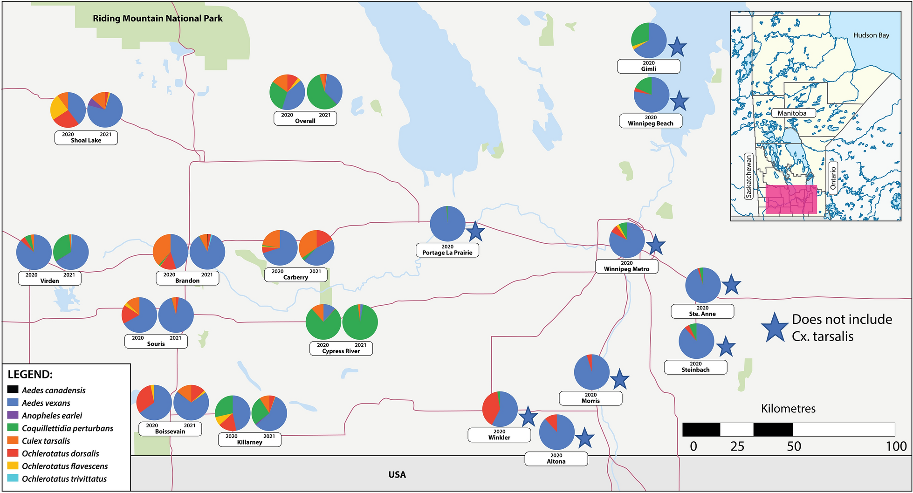
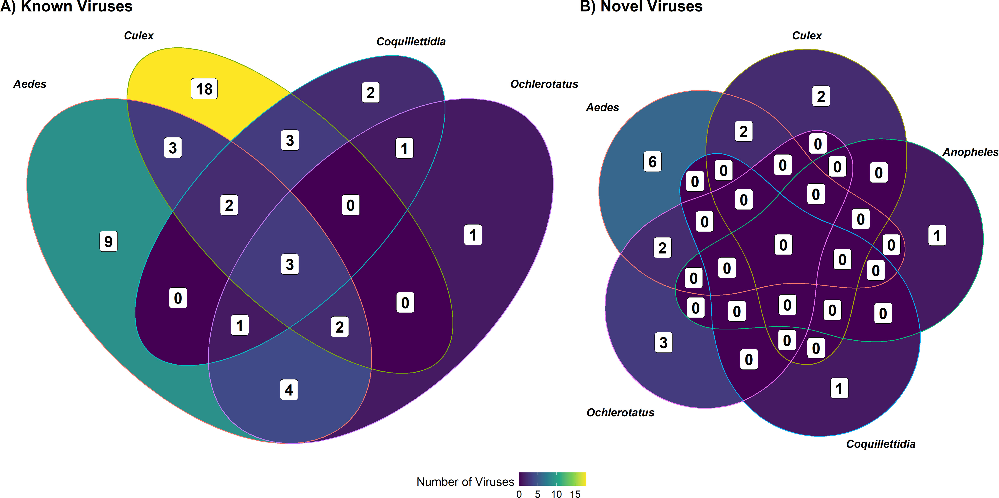
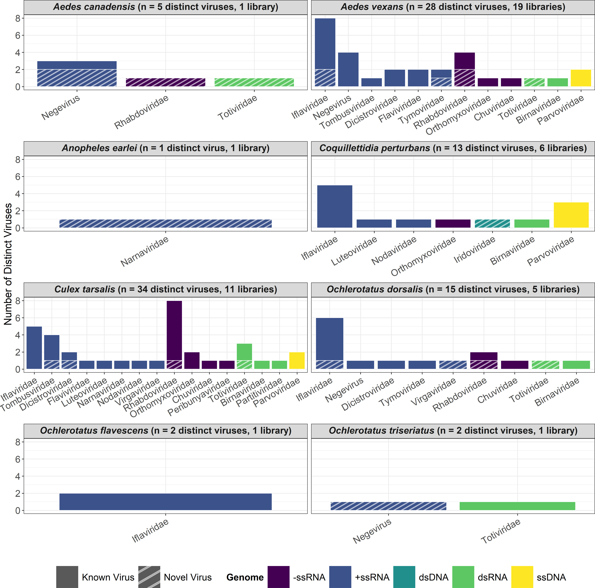

When we think about the natural world, we often picture the grandeur of forests, the expanse of oceans, or the majesty of mountain ranges. Yet, hidden beneath the surface of what we see lies an intricate microscopic universe teeming with life—an ecosystem largely unnoticed but profoundly impactful. My recent research on mosquito microbiomes, [Metatranscriptomic Analysis of Common Mosquito Vector Species in the Canadian Prairies](https://journals.asm.org/doi/10.1128/msphere.00203-24), published in *mSphere* in 2024, sheds light on this overlooked frontier, demonstrating just how much of our world flies under the radar.

<figure>
  
  <figcaption>Relative trap counts for the eight most common mosquito species in 2020 and 2021, sampled weekly (May–September) across 17 Manitoba sites. Counts for Culex tarsalis exclude eastern locations (*), and data for Ae. canadensis, An. earlei, Oc. trivittatus, and Oc. triseriatus were unavailable for 2020. A single Oc. triseriatus collected in 2021 is omitted. Figure adapted from Baril et al., (2023). </figcaption>
</figure>

## The Invisible Architects of Life

Microorganisms, though invisible to the naked eye, shape the very fabric of life on Earth. They are the unseen engineers of ecosystems, driving processes from nutrient cycling to disease dynamics. For mosquitoes, these microbial passengers—viruses, bacteria, fungi, and protozoa—are not merely passive residents. They are active participants, influencing everything from the insects’ development and immunity to their lifespan and capacity to transmit diseases. Yet, for all their importance, these communities of microorganisms remain shrouded in mystery, particularly in underexplored regions like the Canadian Prairies.

Our research sought to illuminate this hidden world, and over three years, we delved into the microbiomes of mosquitoes in Manitoba. The scale of our study was ambitious: more than 35,000 mosquitoes representing eight species were collected, meticulously sorted, and analyzed using cutting-edge RNA sequencing technology. The sheer diversity and complexity of the microbial communities we uncovered were nothing short of staggering.

Among our findings were known pathogens like Cache Valley Fever and avian malaria, organisms that pose significant risks to wildlife, livestock, and, in some cases, humans. But perhaps even more exciting was the discovery of 17 entirely new viruses spanning 10 families. Each of these novel viruses represents an uncharted chapter in the story of mosquito microbiomes, raising questions about their origins, roles, and potential applications.

The idea that such a familiar creature—one that buzzes through our summers and has long been vilified for its role in spreading disease—could harbor such a vast and largely unknown world of microorganisms is both humbling and awe-inspiring. Mosquitoes are among the most studied insects on the planet, yet their microbiomes reveal just how much we still have to learn.

These discoveries underscore an essential truth: the most impactful aspects of life are often those we cannot see. Microorganisms are the invisible architects of ecosystems, their activities rippling through food webs and influencing every level of the biosphere. In mosquitoes, their influence extends to public health, as the composition of a mosquito's microbiome can determine whether it becomes a vector for devastating diseases like malaria or West Nile virus.

What’s particularly striking about our findings is the diversity and specificity of the microbial communities within different mosquito species. Even mosquitoes of the same genus harbored markedly different microbiomes, suggesting that each species carries a unique microbial fingerprint. This individuality may hold the key to understanding why some mosquitoes are more effective vectors of disease than others, and how we might exploit these differences for pest and disease control.

The technology that enabled this research—high-throughput RNA sequencing—was crucial in peeling back the layers of this hidden world. Unlike traditional methods that focus on DNA, RNA sequencing allowed us to capture a more complete picture of the microbiome, including viruses that would otherwise remain undetected. What's more, is that our approach allowed us to find organisms that we were not expecting to find, whereas other methods of molecular detection rely on pre-existing knowledge about an organism (e.g., polymerase chain reaction). This approach not only expands our knowledge of mosquito biology but also opens new avenues for studying microbial ecosystems more broadly.

Our work in Manitoba is a reminder that even the smallest creatures can teach us profound lessons about the natural world. Microorganisms may be invisible, but their influence is monumental. They connect the dots between species, ecosystems, and even human health, serving as both architects and gatekeepers of life. By studying them, we gain not only insights into the world of mosquitoes but also a deeper appreciation for the complexity and interconnectedness of life on Earth.

As we continue to explore this microscopic frontier, one thing becomes clear: the invisible architects of life are anything but insignificant. They are a driving force behind the processes that shape our world, and their stories are only beginning to be told.

<figure>
  
  <figcaption>Venn diagram showing the partitioning of (A) previously reported and (B) novel viruses by mosquito genus. In both cases, the majority of viruses are specific to a given genus. Adapted from Baril & Cassone (2024). </figcaption>
</figure>

## Unknown but Influential

One of the most surprising aspects of our work was the sheer dominance of viruses in the mosquito microbiome, comprising over 99% of non-host microbial sequences. This viral preeminence isn’t just a statistical anomaly—it’s a profound reminder of the microbial world’s vast, uncharted terrain. While some of these viruses, like Cache Valley virus, are well-known culprits of animal and human disease, most belong to a lesser-known category called insect-specific viruses (ISVs). These ISVs don’t infect humans or other vertebrates, but they have an undeniable impact on the mosquitoes themselves, influencing their development, immunity, and even capacity to spread diseases.

What makes ISVs particularly intriguing is their potential to be leveraged for good. These viruses are uniquely positioned at the intersection of mosquito biology and public health. Recent studies suggest that ISVs may suppress the replication of harmful pathogens within mosquito hosts, effectively reducing their ability to transmit diseases. This phenomenon, known as pathogen interference, could be a game-changer in the fight against mosquito-borne illnesses like malaria, dengue, and Zika.

Imagine a world where mosquitoes are no longer agents of disease but carriers of microscopic guardians. By introducing ISVs that compete with or neutralize harmful pathogens, we could transform mosquitoes from villains into unlikely allies in public health. This concept, while still largely theoretical, opens the door to innovative biocontrol strategies. Instead of relying solely on insecticides or genetic modifications, we could harness nature’s own microbial arsenal to disrupt the transmission of diseases.

However, ISVs remain enigmatic, their exact roles and mechanisms still shrouded in mystery. How do these viruses interact with their mosquito hosts? Do they influence mosquito behavior, reproductive success, or survival? And most importantly, could they be safely deployed in the wild without unintended ecological consequences? These are the questions that drive the growing field of ISV research.

Our study identified 17 novel viruses, many of which belong to families with known insect-specific lineages, such as Rhabdoviridae, Totiviridae, and Negevirus. These discoveries are just the tip of the iceberg, highlighting how little we truly know about the viral diversity within mosquitoes. **During our research, for every question we answered, we had ten more questions we thought of!** Each novel virus represents a new puzzle piece in understanding the intricate interplay between hosts and their microbial passengers.

The potential of ISVs extends beyond disease suppression. They could also serve as biomarkers for identifying areas at risk of outbreaks, acting as early warning systems for mosquito-borne diseases. For example, the detection of certain ISVs may signal changes in mosquito populations or environments that favor pathogen transmission.

Still, these possibilities come with challenges. Harnessing ISVs for practical applications requires extensive research to ensure safety and efficacy. The introduction of ISVs into mosquito populations must be carefully monitored to avoid disrupting ecosystems or inadvertently selecting for more virulent pathogens. Additionally, the sheer genetic diversity of ISVs complicates efforts to standardize their use in control programs.

For now, ISVs remain a scientific frontier, offering tantalizing possibilities but requiring cautious exploration. They remind us that even the smallest, least understood elements of the natural world can hold the key to solving some of humanity’s greatest challenges. The dominance of ISVs in mosquito microbiomes may have gone unnoticed for centuries, but their influence on public health and ecosystems is becoming impossible to ignore.

<figure>
  
  <figcaption>Number of previously reported and novel viruses identified for each mosquito species. Viruses are sorted by family and color-coded by genome configuration. Hash marks indicate novel viruses, alongside total virus counts and sequencing libraries per species. Adapted from Baril & Cassone (2024). </figcaption>
</figure>

## Flying Under the Radar

Our research uncovered an intriguing phenomenon: mosquitoes can pick up unexpected microbial passengers, including viruses that naturally infect honeybees and other insects. These "hitchhikers" likely infiltrate mosquito microbiomes through shared nectar sources, highlighting an unseen network of microbial exchange. It’s fascinating to think that a mosquito, while foraging on a flower, might acquire not only the sugary sustenance it seeks but also an entirely new set of microscopic companions.

This microbial hitchhiking is a vivid reminder of how interconnected life truly is. Something as seemingly trivial as a mosquito’s choice of nectar can ripple through the microbial web, influencing not only the mosquito but potentially the entire ecosystem. For instance, we detected Black Queen Cell Virus, a pathogen known to affect honeybees, in mosquito samples. Such findings suggest that mosquitoes and bees, despite their very different ecological roles, share a hidden connection through their feeding habits.

This unnoticed flow of microscopic life between species underscores a central theme: much of our world operates outside our awareness. The microbial world is like a silent undercurrent, weaving together the lives of organisms in ways we are only beginning to understand. Every droplet of water, patch of soil, or flower carries a hidden narrative written by microorganisms—stories of survival, adaptation, and exchange that influence life on every scale.

In mosquitoes, these unseen passengers shape not only the biology of their hosts but also broader ecological and public health landscapes. For example, when mosquitoes pick up plant viruses through nectar feeding, they may inadvertently introduce these pathogens into new environments. Conversely, the acquisition of insect-specific viruses could alter a mosquito’s susceptibility to human pathogens, either amplifying or suppressing their capacity to transmit diseases.

The implications extend beyond mosquitoes. Microbial exchanges like these hint at an intricate web of interactions among plants, insects, and the microorganisms they harbor. Flowers become more than just sources of nectar—they are hubs of microbial traffic, where viruses and bacteria can leap from one species to another. Understanding these dynamics could have profound implications for both conservation and agriculture.

Yet, this invisible exchange also highlights how much we still don’t know. How often do these microbial swaps occur? Do they affect the behavior or fitness of the host insects? Could they influence broader ecological patterns, such as pollination networks or disease dynamics? These are questions that remain unanswered, but they open exciting avenues for future research.

What’s clear is that the microbial world operates on a different scale from our own, often evading our notice. It’s a world that quite literally flies under the radar, yet it plays a pivotal role in shaping the ecosystems we see and depend on. By delving into the hidden microbial lives of mosquitoes, we’re not only learning more about these infamous insects but also uncovering the profound interconnectedness of life at every level.

In this way, mosquitoes serve as a reminder that no organism exists in isolation. Whether it’s a honeybee, a flower, or a virus, each plays a role in the intricate tapestry of life. And while much of that tapestry remains invisible to us, its threads are what hold the world together.

## The Vast Unknown

The most humbling takeaway from this study is just how much we still don’t know. Despite advances in sequencing technologies and bioinformatics, vast portions of the microbial world remain uncharted. Each novel virus we discovered raises new questions: What role does it play in its host’s biology? Could it impact disease transmission? What can it teach us about virus evolution or even our own health?

As researchers, we’re only scratching the surface of these mysteries. For every question we answer, ten more emerge, reminding us of the complexity and wonder of the unseen world.

ISVs continue to be discovered at staggering rates. In one study out of China, over [1,000 ISVs were discovered in various insects and invertebrates](https://pubmed.ncbi.nlm.nih.gov/27880757/), including mosquitoes. This discovery not only highlights the immense viral diversity that exists within insect populations but also underscores the complexity of the ecological relationships between insects and the viruses they host. These viruses, often specialized to their insect hosts, may not pose direct threats to humans, yet they play important roles in their host's biology, potentially influencing immune responses, behavior, and even ecological interactions.

What’s particularly fascinating is that many of these viruses are likely evolutionarily old, co-evolving with their insect hosts over millions of years. As a result, they offer a treasure trove of insights into viral evolution and host-virus dynamics. Their study could reveal novel mechanisms of virus-host interactions, possibly shedding light on how viruses adapt to new environments, including the ability to jump between species or impact disease transmission. The sheer number of ISVs discovered emphasizes just how little we know about the full spectrum of viruses inhabiting our world and their potential implications for both human health and the broader ecosystem. With each new viral discovery, we are reminded of the complexity of life at the microscopic level and the countless unanswered questions that remain.

## Embracing the Microscopic Frontier

The microbial world may fly under the radar, but its influence is undeniable. From shaping ecosystems to driving the evolution of species, microorganisms are silent architects of life as we know it. By studying mosquito microbiomes, we gain not only insights into disease and ecology but also a deeper appreciation for the complexity of the world around us.

This research is a call to look closer, to marvel at the small and the unseen, and to acknowledge that even the tiniest organisms can have a massive impact. After all, it’s not just the visible world that matters; it’s the one flying under the radar.

## References 

1. Cole Baril, Christophe M R LeMoine, Bryan J Cassone, Black queen cell virus detected in Canadian
mosquitoes, *Journal of Insect Science 23*, 2 (2023). https://doi.org/10.1093/jisesa/iead016

2. Baril, C., Pilling, B.G., Mikkelsen, M.J. et al. The influence of weather on the population dynamics of
common mosquito vector species in the Canadian Prairies. *Parasites Vectors 16*, 153 (2023).
https://doi.org/10.1186/s13071-023-05760-x

3. Baril C, Cassone BJ. Metatranscriptomic analysis of common mosquito vector species in the Canadian
Prairies. *mSphere9:e00203-*24 (2024). https://doi.org/10.1128/msphere.00203-2

4. Shi, Mang et al. “Redefining the invertebrate RNA virosphere.” *Nature vol.* 540,7634 (2016): 539-543. https://doi:10.1038/nature20167