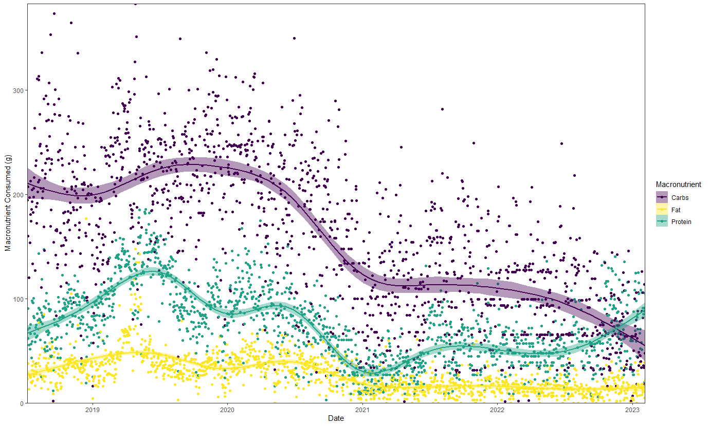

Analyzing my diet habits over the years using the LoseIt app and R.  

<!--more-->

## Introduction

Since I started losing weight in 2018, I have been diligently tracking my food daily using the [LoseIt app](https://www.loseit.com/). I went from about 220lbs to 150lbs in the span of 6 months by eating less, healthier and exercising. Since then I have managed to successfully keep off the weight and have pivoted my goal to *gaining* weight as muscle. My gym progress is being tracked using a Shiny app and can be viewed [here](https://colewb.shinyapps.io/Cole_Gym_Progress/). 

This post will analyze my eating habits from 2018 to 2023 and highlight how my eating habits contributed to weight loss. 

Libraries Used:
``` r
library(tidyverse)
library(here)
library(janitor)
library(lubridate)
```


## Data Accessibility

To get data from LoseIt, users can only download data in one-week blocks at a time. I had many years of data stored on the app and this was an onerous process. However, once downloaded, I made use of the `map_df` function from `purrr` to read all of the individually downloaded `.csv` files. I should note, that I learned after the fact by contacting LoseIt, that it is possible to download *all* your data at once, but you need to receive a link via email to access data this way. That said, using `map_df` to read hundreds of `.csv` files feels very satisfying and is a good opportunity to showcase the power of `purrr`. The next steps involved some data cleaning. I also saved the output file from `map_df` to save time in future sessions.

``` r
data <- map_df(list.files(pattern = "*.csv",
                    path = here("Raw/Food/"),
                    full.names = TRUE),
               ~read_csv(., col_types = cols(.default = "c")) %>% clean_names() 
               )
               
food <- data %>% 
  mutate(across(where(is.character), ~ na_if(., "n/a"))) %>% 
  mutate(across(calories:last_col(), ~ as.numeric(.))) %>% 
  mutate(quantity = as.numeric(quantity)) %>% 
  mutate(date = as.Date(date, "%m/%d/%Y")) %>% 
  glimpse(20)
               
Rows: 10,568
Columns: 16
$ date            <date> …
$ name            <chr> …
$ icon            <chr> …
$ type            <chr> …
$ quantity        <dbl> …
$ units           <chr> …
$ calories        <dbl> …
$ deleted         <dbl> …
$ fat_g           <dbl> …
$ protein_g       <dbl> …
$ carbohydrates_g <dbl> …
$ saturated_fat_g <dbl> …
$ sugars_g        <dbl> …
$ fiber_g         <dbl> …
$ cholesterol_mg  <dbl> …
$ sodium_mg       <dbl> …
```

## Cleanup

The types of foods tracked were, thanks to the app, largely consistent and predictable. However, over five years, there is a *lot* of different foods logged. To overcome this to be able to categorize foods for downstream analysis, I used a combination of `case_when`, `str_detect` and `regex` to identify and categorize foods. While this was an onerous process, there was no way around this that I could find. 

``` r
food <- food %>% 
mutate(food_category = case_when(
    str_detect(name, regex("Yogurt", ignore_case = TRUE)) ~ "Yogurt",
    str_detect(name, regex("0% Key", ignore_case = TRUE)) ~ "Yogurt",
    str_detect(name, regex("GOLEAN", ignore_case = TRUE)) ~ "Kashi Cereal",
    str_detect(name, regex("Chicken Breast", ignore_case = TRUE)) ~ "Chicken Breast",
    str_detect(name, regex("Chicken Strips", ignore_case = TRUE)) ~ "Chicken - Other",
    str_detect(name, regex("Chicken Tenders", ignore_case = TRUE)) ~ "Chicken - Other",
    str_detect(name, regex("Chicken, Drumstick", ignore_case = TRUE)) ~ "Chicken - Other",
    str_detect(name, regex("chicken nugget", ignore_case = TRUE)) ~ "Chicken - Other",
    str_detect(name, regex("rotisserie", ignore_case = TRUE)) ~ "Chicken - Other",
    str_detect(name, regex("Chicken Burger", ignore_case = TRUE)) ~ "Chicken - Other",
    str_detect(name, regex("chicken buddy", ignore_case = TRUE)) ~ "Chicken - Other",
    str_detect(name, regex("wings", ignore_case = TRUE)) ~ "Chicken - Other",
    str_detect(name, regex("Calories", ignore_case = TRUE)) ~ "Misc Calories",
    str_detect(name, regex("Chocolate Chip Cookie Nolan", ignore_case = TRUE)) ~ "Misc Calories",
    str_detect(name, regex("Xlean beef", ignore_case = TRUE)) ~ "Extra Lean Ground Beef",
    str_detect(name, regex("Xlean gr beef", ignore_case = TRUE)) ~ "Extra Lean Ground Beef",
    str_detect(name, regex("Lean beef", ignore_case = TRUE)) ~ "Lean Ground Beef",
    str_detect(name, regex("Lean Ground beef", ignore_case = TRUE)) ~ "Lean Ground Beef",
    str_detect(name, regex("Ground Turkey", ignore_case = TRUE)) ~ "Ground Turkey",
    str_detect(name, regex("Minced Turkey", ignore_case = TRUE)) ~ "Ground Turkey",
    str_detect(name, regex("Wow butter", ignore_case = TRUE)) ~ "Soy Butter",
    str_detect(name, regex("Viva Puffs", ignore_case = TRUE)) ~ "Cookies",
    str_detect(name, regex("Cookies", ignore_case = TRUE)) ~ "Cookies",
    str_detect(name, regex("Fig bar", ignore_case = TRUE)) ~ "Cookies",
    str_detect(name, regex("Oreo", ignore_case = TRUE)) ~ "Cookies",
    str_detect(name, regex("Double Shot", ignore_case = TRUE)) ~ "Energy Drink",
    str_detect(name, regex("Doubleshot", ignore_case = TRUE)) ~ "Energy Drink",
    str_detect(name, regex("Red Bull", ignore_case = TRUE)) ~ "Energy Drink",
    str_detect(name, regex("Pizza", ignore_case = TRUE)) ~ "Pizza",
    str_detect(name, regex("Meat Lovers", ignore_case = TRUE)) ~ "Pizza",
    str_detect(name, regex("Thin crust", ignore_case = TRUE)) ~ "Pizza",
    str_detect(name, regex("Crust, Thin", ignore_case = TRUE)) ~ "Pizza",
    str_detect(name, regex("Sausage", ignore_case = TRUE)) ~ "Sausage",
    str_detect(name, regex("Diesel", ignore_case = TRUE)) ~ "Protein Powder",
    str_detect(name, regex("Protein Whey", ignore_case = TRUE)) ~ "Protein Powder",
    str_detect(name, regex("Whey Isolate", ignore_case = TRUE)) ~ "Protein Powder",
    str_detect(name, regex("Pure Protein", ignore_case = TRUE)) ~ "Protein Bar",
    str_detect(name, regex("Chocolate Mint Protein", ignore_case = TRUE)) ~ "Protein Bar",
    str_detect(name, regex("Bacon", ignore_case = TRUE)) ~ "Bacon",
    str_detect(name, regex("Cereal", ignore_case = TRUE)) ~ "Misc Cereal",
    str_detect(name, regex("Krave", ignore_case = TRUE)) ~ "Misc Cereal",
    str_detect(name, regex("Cap N Crunch", ignore_case = TRUE)) ~ "Misc Cereal",
    str_detect(name, regex("Mini Wheats", ignore_case = TRUE)) ~ "Misc Cereal",
    str_detect(name, regex("Special K", ignore_case = TRUE)) ~ "Cookies",
    str_detect(name, regex("Seven Grain", ignore_case = TRUE)) ~ "Granola Bar",
    str_detect(name, regex("Chocolate Chip Chia", ignore_case = TRUE)) ~ "Granola Bar",
    str_detect(name, regex("Honey Oat Flax", ignore_case = TRUE)) ~ "Granola Bar",
    str_detect(name, regex("Chips", ignore_case = TRUE)) ~ "Chips",
    str_detect(name, regex("Cheetos", ignore_case = TRUE)) ~ "Chips",
    str_detect(name, regex("Doritos", ignore_case = TRUE)) ~ "Chips",
    str_detect(name, regex("Salt & Vin", ignore_case = TRUE)) ~ "Chips",
    str_detect(name, regex("Protein Bread", ignore_case = TRUE)) ~ "Protein Bread",
    str_detect(name, regex("Bread, Protein", ignore_case = TRUE)) ~ "Protein Bread",
    str_detect(name, regex("Grains and Protein", ignore_case = TRUE)) ~ "Protein Bread",
    str_detect(name, regex("Bread", ignore_case = TRUE)) ~ "Misc Bread",
    str_detect(name, regex("Dempsters", ignore_case = TRUE)) ~ "Misc Bread",
    str_detect(name, regex("Flax and Seeds", ignore_case = TRUE)) ~ "Misc Bread",
    str_detect(name, regex("Protein Bran", ignore_case = TRUE)) ~ "Bran Muffins",
    str_detect(name, regex("Bran", ignore_case = TRUE)) ~ "Bran Muffins",
    str_detect(name, regex("Egg", ignore_case = TRUE)) ~ "Eggs",
    str_detect(name, regex("Milk, 1%", ignore_case = TRUE)) ~ "Milk",
    str_detect(name, regex("Milk, Skim", ignore_case = TRUE)) ~ "Milk",
    str_detect(name, regex("Milk Skim", ignore_case = TRUE)) ~ "Milk",
    str_detect(name, regex("Flourish", ignore_case = TRUE)) ~ "Protein Pancakes",
    str_detect(name, regex("Creamer", ignore_case = TRUE)) ~ "Creamer",
    str_detect(name, regex("Iced Coffee", ignore_case = TRUE)) ~ "Coffee - Non-Black",
    str_detect(name, regex("Latte", ignore_case = TRUE)) ~ "Coffee - Non-Black",
    str_detect(name, regex("Cracker", ignore_case = TRUE)) ~ "Crackers",
    str_detect(name, regex("Popcorn", ignore_case = TRUE)) ~ "Popcorn",
    str_detect(name, regex("Jam", ignore_case = TRUE)) ~ "Jam",
    str_detect(name, regex("Pork", ignore_case = TRUE)) ~ "Pork",
    str_detect(name, regex("Ham", ignore_case = TRUE)) ~ "Ham",
    str_detect(name, regex("Granola Protein", ignore_case = TRUE)) ~ "Granola Protein",
    str_detect(name, regex("Taco", ignore_case = TRUE)) ~ "Taco Shells",
    str_detect(name, regex("Cheese", ignore_case = TRUE)) ~ "Cheese",
    str_detect(name, regex("Potato", ignore_case = TRUE)) ~ "Potatoes",
    str_detect(name, regex("Fries", ignore_case = TRUE)) ~ "Fries",
    str_detect(name, regex("Smoothie", ignore_case = TRUE)) ~ "Misc Drink",
    str_detect(name, regex("Coleslaw", ignore_case = TRUE)) ~ "Vegetables",
    str_detect(name, regex("Zucchini", ignore_case = TRUE)) ~ "Vegetables",
    str_detect(name, regex("Zucchini", ignore_case = TRUE)) ~ "Vegetables",
    str_detect(name, regex("Salad", ignore_case = TRUE)) ~ "Vegetables",
    str_detect(name, regex("Banana", ignore_case = TRUE)) ~ "Fruit",
    str_detect(name, regex("Kit Kat", ignore_case = TRUE)) ~ "Chocolate Bar",
    str_detect(name, regex("Coffee Crisp", ignore_case = TRUE)) ~ "Chocolate Bar",
    str_detect(name, regex("Lasanga", ignore_case = TRUE)) ~ "Noodles",
    str_detect(name, regex("Noodles", ignore_case = TRUE)) ~ "Noodles",
    str_detect(name, regex("Chicken Noodle", ignore_case = TRUE)) ~ "Soup",
    str_detect(name, regex("Soup, Tomato", ignore_case = TRUE)) ~ "Soup",
    str_detect(name, regex("Soup, Chicken & Gnocchi", ignore_case = TRUE)) ~ "Soup",
    str_detect(name, regex("Haddock", ignore_case = TRUE)) ~ "Fish",
    str_detect(name, regex("Haddock", ignore_case = TRUE)) ~ "Fish",
    
    ))
```

## Calories 

To start off, I wanted to get a better idea of the frequency with which I consumed certain amounts of calories over the years. I opted for a histogram, shown below. I highlighted two key calorie numbers: 1,500, which was always my goal for while losing weight, and 2,000, my theoretical total daily energy expenditure (TDEE). Interestingly, on the majority of days I consumed less calories than my TDEE which I believe was the main driver of weight loss ([Strasser et al., 2007](https://pubmed.ncbi.nlm.nih.gov/18025815/)). That said, it is important to note that while calorie deficits are an important part of weight loss, how they are implemented and managed depends on individuals ([Kim, 2021](https://www.ncbi.nlm.nih.gov/pmc/articles/PMC8017325/), [Benton & Young, 2017](https://www.ncbi.nlm.nih.gov/pmc/articles/PMC5639963/)). 


While the data in general is a good reflection of my eating habits and efforts are made to omit incomplete data, in some cases the data may not be accurate due to certain foods not being tracked or when calories cannot be accurately calculated or estimated.  **Consequently, in some cases the calories consumed may have been over or under estimated**.


<div class="block">

</div>

``` r
food %>% 
  group_by(date) %>% 
  summarise(daily_cals = sum(calories)) %>% 
  drop_na() %>% 
  filter(daily_cals > 1000) %>% 
  ggplot(aes(x = daily_cals)) +
  geom_histogram(fill = "#28708EFF") +
  scale_y_continuous(expand = c(0, 0)) +
  
  geom_vline(xintercept = 2000, linetype = "dashed", colour = "ghostwhite") +
  annotate("text", 
           x = 1990,
           y = 25,
           angle = 90,
           label = 'atop(bold("Theoretical TDEE"))', 
           parse = TRUE,
           colour = "white") +
  
  geom_vline(xintercept = 1500, linetype = "dashed", colour = "ghostwhite") +
  annotate("text", 
           x = 1490,
           y = 25,
           angle = 90,
           label = 'atop(bold("Weight Loss Goal"))', 
           parse = TRUE,
           colour = "white") +
  theme_bw() +
  theme(panel.grid.major.x = element_blank(),
        panel.grid.minor.x = element_blank(),
        panel.grid.major.y = element_blank(),
        panel.grid.minor.y = element_blank()) +
  labs(title = "Calorie Histogram",
       y = "Number of Days",
       x = "Kilocalories") 
```

I excluded data with under 1,000 calories per day because these days are likely missing data and not an accurate representation of my eating habits. I did not consume less than 1,000 calories on any day. 



Next, I wanted to look at calories consumed over time, shown below. Again, on the majority of days, I was at or below my theoretical TDEE of 2,000 calories. Interestingly, there is a spike in 2019 when I finished losing all my weight and then it reaches equilibrium. 

<div class="block">

</div>

``` r
food %>% 
  group_by(date) %>% 
  summarise(daily_cals = sum(calories)) %>% 
  drop_na() %>% 
  filter(daily_cals > 1000) %>% 
  ggplot(aes(x = date, y = daily_cals)) + 
  geom_point(colour = "#287D8EFF") +
  geom_smooth(colour = "black") +
  geom_hline(yintercept = 2000, linetype = "dashed", colour = "red") +
  geom_hline(yintercept = 1500, linetype = "dashed", colour = "red") +
  theme_bw() +
  theme(panel.grid.major.x = element_blank(),
        panel.grid.minor.x = element_blank(),
        panel.grid.major.y = element_blank(),
        panel.grid.minor.y = element_blank()) +
  labs(title = "Daily Caloric Intake",
       y = "Calories",
       x = "Date") 
```

## Macronutrients 

To get an idea of the nutrients I have consumed over the years, I plotted the three macronutrients (carbohydrates, fats and proteins) over time. The first plot is an area plot (derived from `stat_smooth` and the second includes the raw data as points.

``` r
macros <- food %>% 
  group_by(date) %>% 
  mutate(across(contains("_g"), ~replace(., is.na(.), 0))) %>% 
  summarise(daily_cals = sum(calories),
            protein_g = sum(protein_g),
            protein_cal = protein_g*4,
            protein_percent = protein_cal/daily_cals*100,
            carb_g = sum(carbohydrates_g),
            carb_cal = carb_g*4,
            carb_percent = carb_cal/daily_cals*100,
            fat_g = sum(fat_g),
            fat_cal = fat_g*9,
            fat_percent = fat_cal/daily_cals*100) 


macros_g <- macros %>% 
  select(1,3, 6, 9) %>% 
  drop_na() %>% 
  pivot_longer(!date, names_to = "macro", values_to = "grams")
```

<div class="block">

</div>

``` r
macros_g %>% 
  ggplot(aes(x = date, y = grams, colour = macro, fill = macro)) +
  stat_smooth(
    geom = "area",
    linewidth = 1,
    alpha = 0.2,
    span = 0.3) +
  scale_y_continuous(expand = c(0, 0)) +
  scale_x_date(expand = c(0,0)) +
  coord_cartesian(ylim = c(0,230)) +
  theme_bw() +
  theme(panel.grid.major.x = element_blank(),
        panel.grid.minor.x = element_blank(),
        panel.grid.major.y = element_blank(),
        panel.grid.minor.y = element_blank()) +
  labs(y = "Macronutrient Consumed (g)",
       x = "Date",
       fill = "Macronutrient") +
  scale_colour_manual(name = "Macronutrient", 
                      labels = c("Carbs", "Fat", "Protein"), 
                      values = c("#440154FF", "#FDE725FF", "#20A387FF")) +
  scale_fill_manual(name = "Macronutrient", 
                    labels = c("Carbs", "Fat", "Protein"), 
                    values = c("#440154FF", "#FDE725FF", "#20A387FF")) 
```

<div class="block">

</div>

``` r 
macros_g %>% 
  ggplot(aes(x = date, y = grams, colour = macro, fill = macro)) +
  geom_point() +
  geom_smooth() +
  scale_y_continuous(expand = c(0, 0)) +
  scale_x_date(expand = c(0,0)) +
  theme_bw() +
  theme(panel.grid.major.x = element_blank(),
        panel.grid.minor.x = element_blank(),
        panel.grid.major.y = element_blank(),
        panel.grid.minor.y = element_blank()) +
  labs(y = "Macronutrient Consumed (g)",
       x = "Date",
       fill = "Macronutrient") +
  scale_colour_manual(name = "Macronutrient", 
                      labels = c("Carbs", "Fat", "Protein"), 
                      values = c("#440154FF", "#FDE725FF", "#20A387FF")) +
  scale_fill_manual(name = "Macronutrient", 
                    labels = c("Carbs", "Fat", "Protein"), 
                    values = c("#440154FF", "#FDE725FF", "#20A387FF")) 
```

### Protein 

The highest source of protein came from Kashi Cereal, with 33.5 kilograms of protein coming from the cereal alone. This is a cereal I found at the beginning of my weight loss journey that really helped me. The cereal is very high in fibre which helped to keep me full and also contained a lot of protein. With 9 grams of protein per serving, having consumed 33.5 kilograms of protein from the cereal alone, this equates to about 410 pounds of Kashi cereal being eaten over 5 years. 

The next highest sources of protein comes from yogurt with 21,670 grams of protein and extra lean ground beef with 11,583 grams of protein. I also consumed a lot of protein bread (typically with soy butter and jam), which accounts for 11,057n grams or about 12% of my total protein intake in 5 years. Whey sources such as protein powder and protein bars account for 6,175 and 2,630 grams of protein, respectively. 

<div class="block">

</div>

``` r
macros_protein <- food %>% 
  group_by(food_category) %>% 
  mutate(across(contains("_g"), ~replace(., is.na(.), 0))) %>% 
  select(1:8, 11, 18) %>% 
  summarise(total_protein = sum(protein_g)) %>% 
  mutate(percent_protein =  (total_protein / sum(total_protein))*100)

macros_protein %>% 
  arrange(desc(percent_protein)) %>% 
  slice(1:20) %>% 
  ggplot(aes(y = fct_reorder(food_category, percent_protein), x = percent_protein)) +
  geom_col(show.legend = F, fill = "#20A387FF") +
  geom_vline(xintercept = 0, lwd = 0.3, colour = "black") +
  geom_text(aes(label = format(ceiling(total_protein), big.mark = ","), x = -0.01*max(macros_protein$percent_protein)),
            size = 3.5, hjust = 1) +
  scale_x_continuous(expand = c(0.05, 0)) +
  labs(x = "Percent of Total Protein Recorded",
       y = "Food",
       title = "Proportion of Logged Protein Comsumption by Source",
       subtitle = "Shown in percent (x axis) and total weight in grams (left of plot)") +
  theme_bw() +
  theme(panel.grid.major.x = element_blank(),
        panel.grid.minor.x = element_blank(),
        panel.grid.major.y = element_blank(),
        panel.grid.minor.y = element_blank()) 
```

## Carbs and Fats

The data for carbs and fats is too weak (explained in more detail below) and so I have chosen to omit that from the data for now. The reason for this is because I tracked protein diligently as I was going for certain protein goals. However, I did not track carbs and fats as diligently which resulted in a lot of calories from carbs and fats which do not include those macronutrients. While I am relatively confident in the protein data, the carbs and fats not so much. 

## Proportion of Miscellaneous Tracked Calories 

In cases where there was a one-off food or a seemingly random food, or I had to estimate the calories in a food item, I would simply add calories rather than adding an actual food. As a result, these calories do not have macros associated with them. I am identifying the number of calories tracked each day in this fashion and as a result that would not have any more detailed nutritional information attached. As you can see below, in the first 2-3 years, the majority of my calories were tracked by specific food items. In 2020-2021, significantly more calories were tracked by non-specific calories. 


Interestingly, this drop in specific-food tracking corresponds with a drop in carbohydrate consumption (seen above). I think that I tracked more of my carbs non-specifically, which resulted in an artificial dip in carbohydrate consumption. This is also about the same time I started grad school and had less time to devote to tracking my foods.


<div class="block">

</div>

``` r
food %>% 
  mutate(misc = case_when(
    food_category == "Misc Calories" ~ "misc",
    food_category != "Misc Calories" ~ "non_misc")) %>% 
  group_by(date, misc) %>% 
  summarise(daily_cals = sum(calories)) %>% 
  drop_na() %>% 
  pivot_wider(names_from = misc, values_from = daily_cals) %>% 
  mutate(across(where(is.numeric), ~ ifelse(is.na(.), 0, .))) %>% 
  mutate(total = (misc + non_misc),
         percent_misc = (misc / total)) %>% 
  ggplot(aes(x = date, y = percent_misc)) +
  geom_point(colour = "#287D8EFF") +
  geom_smooth(colour = "black") +
  scale_y_continuous(labels = scales::percent) +
  theme_bw() +
  labs(title = "Percent of daily caloric intake represented by miscellaneous calories",
       subtitle = "Misc calories do not have any macro nutrients linked to them",
       x = "Date",
       y = "Percent Misc Calories Consumed Daily")
```

## References

### Packages

Wickham H, Averick M, Bryan J, Chang W, McGowan LD, François R, Grolemund G, Hayes A, Henry L, Hester J, Kuhn M,
Pedersen TL, Miller E, Bache SM, Müller K, Ooms J, Robinson D, Seidel DP, Spinu V, Takahashi K, Vaughan D, Wilke C,
Woo K, Yutani H (2019). “Welcome to the tidyverse.” _Journal of Open Source Software_, *4*(43), 1686.
doi:10.21105/joss.01686 <https://doi.org/10.21105/joss.01686>.

Firke S (2023). _janitor: Simple Tools for Examining and Cleaning Dirty Data_. R package version 2.2.0,
<https://CRAN.R-project.org/package=janitor>.

Müller K (2020). _here: A Simpler Way to Find Your Files_. R package version 1.0.1,
<https://CRAN.R-project.org/package=here>.

Grolemund G, Wickham H (2011). “Dates and Times Made Easy with lubridate.” _Journal of Statistical Software_,
*40*(3), 1-25. <https://www.jstatsoft.org/v40/i03/>.

Wickham H (2016). _ggplot2: Elegant Graphics for Data Analysis_. Springer-Verlag New York. ISBN 978-3-319-24277-4,
<https://ggplot2.tidyverse.org>.

Fox J, Weisberg S (2019). _An R Companion to Applied Regression_, Third edition. Sage, Thousand Oaks CA.
<https://socialsciences.mcmaster.ca/jfox/Books/Companion/>.

Wickham H, François R, Henry L, Müller K, Vaughan D (2023). _dplyr: A Grammar of Data Manipulation_. R package
version 1.1.0, <https://CRAN.R-project.org/package=dplyr>.

Wickham H, Henry L (2023). _purrr: Functional Programming Tools_. R package version 1.0.1,
<https://CRAN.R-project.org/package=purrr>.

### Papers

Benton D, Young HA. Reducing Calorie Intake May Not Help You Lose Body Weight. Perspect Psychol Sci. 2017 Sep;12(5):703-714. doi: 10.1177/1745691617690878. Epub 2017 Jun 28. PMID: 28657838; PMCID: PMC5639963.

Kim JY. Optimal Diet Strategies for Weight Loss and Weight Loss Maintenance. J Obes Metab Syndr. 2021 Mar 30;30(1):20-31. doi: 10.7570/jomes20065. PMID: 33107442; PMCID: PMC8017325.

Strasser B, Spreitzer A, Haber P. Fat loss depends on energy deficit only, independently of the method for weight loss. Ann Nutr Metab. 2007;51(5):428-32. doi: 10.1159/000111162. Epub 2007 Nov 20. PMID: 18025815.

