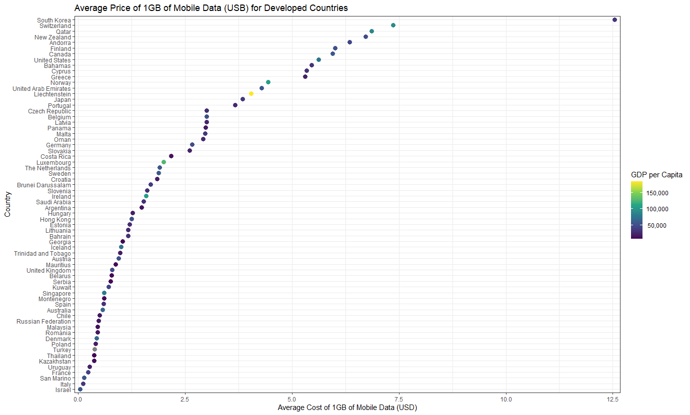
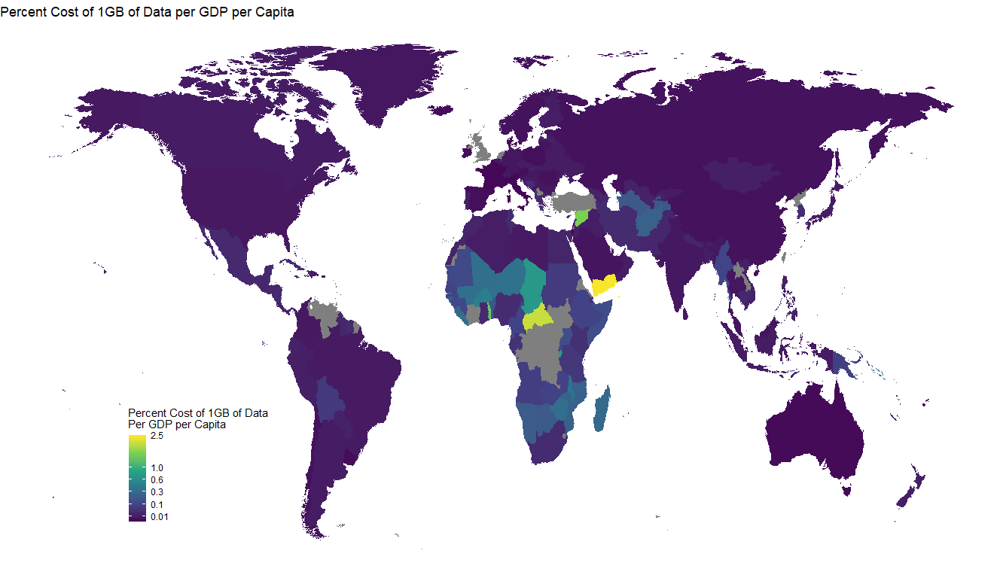
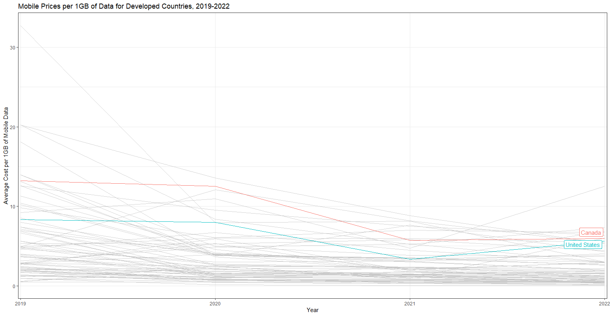

Visualizing global mobile data trends.

<!--more-->

Mobile data is expensive and varies widely by country and even plan to plan within countries. I wanted to see how Canada measures up to the rest of the world. 

## Libraries 

```r
require(pacman)
p_load(tidyverse, here, janitor, readxl, gt, countrycode, gtExtras)
```

## Load Data

Data was retrieved from [cable.co.uk](https://www.cable.co.uk/mobiles/worldwide-data-pricing/), a data aggregator for mobile prices. Developed countries are based on those countries identified by [World Population Review](https://worldpopulationreview.com/). 

```r
df <- read_excel(here("Raw/mobile_data.xlsx"),
                 sheet = "2022 1GB Mobile data cost") %>% 
  select(-15:-last_col()) %>% 
  clean_names()
```


## Global Average

Each country is ranked from most expensive to least expensive. Also displayed is the sample size for the number of plans evaluated for each country.


Globally among 233 countries for which data is available, Canada has the **30th** most expensive mobile data cost per 1GB of data, on average, based on 52 plans.


```r

df %>% 
  select(country_code, name, average_price_of_1gb_usd, plans_measured) %>% 
  arrange(desc(average_price_of_1gb_usd)) %>% 
  mutate(Rank = row_number()) %>% 
  relocate(Rank, .after = name) %>% 
  gt() %>% 
  fmt_flag(., columns = country_code) %>% 
  cols_label(name = "Country",
             average_price_of_1gb_usd = "Average Price for 1GB (USD)",
             country_code = "",
             plans_measured = "Plans") %>% 
  cols_align(., align = "center", columns = average_price_of_1gb_usd) %>% 
  fmt_number(., columns = average_price_of_1gb_usd, decimals = 2) %>% 
  tab_header(., title = "Global Average Mobile Data Costs",
             subtitle = "Ranked Highest to Lowest (2022)") %>% 
  tab_footnote(., "Data retrieved from https://www.cable.co.uk/mobiles/worldwide-data-pricing/") %>% 
  gtsave(., filename = "Global_Average.html")
  ```

<p align = "center"><iframe src="Global_Average.html" width="500" height="600"></iframe></p>

## Average - Developed Countries

Many of the countries with high costs are small remote islands or developing nations which may lack infrastructure to host reliable data plans at a competative cost. Therefore I refined a list down to developed countries based on data published by [World Population Review](https://worldpopulationreview.com/).


Among 66 developed countries, Canada ranks quite high at **7th** place with an average cost per 1GB of data of $5.94 USD, still not at the top, and the average plans are competatively priced with the U.S. 


```r
dev <- read_csv(here("Raw/developed-countries-2023.csv")) %>% 
  mutate(country_code = countrycode(country, "country.name", "iso2c"))

df %>% 
  filter(country_code %in% dev$country_code) %>% 
  select(country_code, name, average_price_of_1gb_usd, plans_measured) %>% 
  arrange(desc(average_price_of_1gb_usd)) %>% 
  mutate(Rank = row_number()) %>% 
  relocate(Rank, .after = name) %>% 
  gt() %>% 
  fmt_flag(., columns = country_code) %>% 
  cols_label(name = "Country",
             average_price_of_1gb_usd = "Average Price for 1GB (USD)",
             country_code = "",
             plans_measured = "Plans") %>% 
  cols_align(., align = "center", columns = average_price_of_1gb_usd) %>% 
  fmt_number(., columns = average_price_of_1gb_usd, decimals = 2) %>% 
  tab_header(., title = "Average Mobile Data Costs (Developed Countries)",
             subtitle = "Ranked Highest to Lowest (2022)") %>% 
  tab_footnote(., "Data retrieved from https://www.cable.co.uk/mobiles/worldwide-data-pricing/") %>% 
  gtsave(., filename = "Developed_Average.html")
```

<p align = "center"><iframe src="Developed_Average.html" width="500" height="600"></iframe></p>

```r
dev <- read_csv(here("Raw/developed-countries-2023.csv")) %>% 
  mutate(country_code = countrycode(country, "country.name", "iso2c"))

GDP <- read_excel(here("Raw/GDP_per_capita_edited.xls"),
                  sheet = "Data") %>% 
  row_to_names(3) %>% 
  clean_names() %>% 
  mutate(x2022 = coalesce(x2022, x2021)) %>% 
  mutate(x2022 = coalesce(x2022, x2020)) %>% 
  rename("GDP" = "x2022") %>% 
  select(1, last_col()) %>% 
  mutate(country_code = countrycode(country_name, "country.name", "iso2c"))

df %>% 
  left_join(., GDP, by = "country_code") %>% 
  filter(country_code %in% dev$country_code) %>% 
  select(country_code, name, average_price_of_1gb_usd, GDP) %>% 
  arrange(desc(average_price_of_1gb_usd)) %>% 
  ggplot(aes(x = average_price_of_1gb_usd, y = reorder(name, average_price_of_1gb_usd), colour = as.numeric(GDP))) +
  geom_point(size = 3) +
  theme_bw() +
  scale_x_continuous(expand = c(0.01,0)) +
  scale_colour_viridis_c("GDP per Capita", labels=function(x) format(x, big.mark = ",", scientific = FALSE)) +
  labs(title = "Average Price of 1GB of Mobile Data (USB) for Developed Countries",
       x = "Average Cost of 1GB of Mobile Data (USD)",
       y = "Country")
```


<div class="block">

</div>

## Mobile Data by GDP per Capita

While prices differ greatly across the globe, so too does GDP per capita. I wanted to see how the price of 1GB of mobile data per GDP per capita varies by country. Below, I have mapped the price of 1GB of data (USD) per GDP per capita for each country. Interestingly, there is little variance across most countries with the exception in Africa where 1GB of mobile data per GDP per capita is higher. In general, it looks like mobile prices tend to scale with GDP per capita.

```r
# Getting GDP for most recent year data is available

GDP <- read_excel(here("Raw/GDP_per_capita_edited.xls"),
                  sheet = "Data") %>% 
  row_to_names(3) %>% 
  clean_names() %>% 
  mutate(x2022 = coalesce(x2022, x2021)) %>% 
  mutate(x2022 = coalesce(x2022, x2020)) %>% 
  rename("GDP" = "x2022") %>% 
  select(1, last_col()) %>% 
  mutate(country_code = countrycode(country_name, "country.name", "iso2c"))


phone_income <- df %>% 
  left_join(., GDP, by = "country_code") %>% 
  mutate(cost_per_gdp = as.numeric(average_price_of_1gb_usd)/as.numeric(GDP)) %>% 
  mutate(percent_gdp = cost_per_gdp*100) %>% 
  select(name, last_col()) %>% 
  rename("country" = "name") %>% 
  mutate(country = gsub("United States", "USA", country)) %>% 
  mutate(country = gsub("Russian Federation", "Russia", country))

world <- map_data("world")
world <- subset(world, region != "Antarctica")

world %>% 
  merge(phone_income, by.x = "region", by.y = "country", all.x = T) %>% 
  arrange(group, order) %>% 
  ggplot(aes(x = long, y = lat, group = group, fill = percent_gdp)) + geom_polygon() +
  theme_void() +
  scale_fill_viridis_c("Percent Cost of 1GB of Data \nPer GDP per Capita", 
                       trans = "sqrt",
                       breaks = c(0, 0.01, 0.1, 0.3, 0.6, 1.0, 2.5),
                       labels = c("0", "0.01", "0.1", "0.3", "0.6", "1.0", "2.5"),
                       limits = c(0.0000000000001, 2.5)) +
  theme(legend.position = c(0.2, 0.2)) +
  labs(title = "Percent Cost of 1GB of Data per GDP per Capita")
```


<div class="block">

</div>

## Mobile Costs over Time (Developed Countries)

Next I wanted to see how costs have changed in the last four years for developed countries. Here we can see that while Canada has been consistently among the top prices for 1GB of mobile data on average, prices have dropped considerably in the last couple of years, but is comparitavely still high. 

```r
dev <- read_csv(here("Raw/developed-countries-2023.csv")) %>% 
  mutate(country_code = countrycode(country, "country.name", "iso2c"))

df_hist %>% 
  filter(country_code %in% dev$country_code) %>% 
  ggplot(aes(x = year, y = value, group = name, colour = name)) +
  geom_line() +
  gghighlight(name == "Canada" ||
              name == "United States") +
  theme_bw() +
  labs(title = "Mobile Prices per 1GB of Data for Developed Countries, 2019-2022",
       x = "Year",
       y = "Average Cost per 1GB of Mobile Data") +
  scale_x_discrete(expand = c(0.001,0.01))
```

<div class="block">

</div>

## References

Wickham H, François R, Henry L, Müller K, Vaughan D (2023). _dplyr: A Grammar of Data Manipulation_. R package version 1.1.2,
<https://CRAN.R-project.org/package=dplyr>.

Wickham H, Vaughan D, Girlich M (2023). _tidyr: Tidy Messy Data_. R package version 1.3.0,
<https://CRAN.R-project.org/package=tidyr>.

Wickham H, Henry L (2023). _purrr: Functional Programming Tools_. R package version 1.0.1,
<https://CRAN.R-project.org/package=purrr>.

Müller K (2020). _here: A Simpler Way to Find Your Files_. R package version 1.0.1, <https://CRAN.R-project.org/package=here>.

Firke S (2023). _janitor: Simple Tools for Examining and Cleaning Dirty Data_. R package version 2.2.0,
<https://CRAN.R-project.org/package=janitor>.

Wickham H, Bryan J (2023). _readxl: Read Excel Files_. R package version 1.4.2, <https://CRAN.R-project.org/package=readxl>.

Iannone R, Cheng J, Schloerke B, Hughes E, Lauer A, Seo J (2023). _gt: Easily Create Presentation-Ready Display Tables_. R package
version 0.9.0, <https://CRAN.R-project.org/package=gt>.

Arel-Bundock V, Enevoldsen N, Yetman C (2018). “countrycode: An R package to convert country names and country codes.” _Journal of
Open Source Software_, *3*(28), 848. <https://doi.org/10.21105/joss.00848>.

Mock T (2022). _gtExtras: Extending 'gt' for Beautiful HTML Tables_. R package version 0.4.5,
<https://CRAN.R-project.org/package=gtExtras>.

Becker OScbRA, Minka ARWRvbRBEbTP, Deckmyn. A (2022). _maps: Draw Geographical Maps_. R package version 3.4.1,
<https://CRAN.R-project.org/package=maps>.

Yutani H (2022). _gghighlight: Highlight Lines and Points in 'ggplot2'_. R package version 0.4.0,
<https://CRAN.R-project.org/package=gghighlight>.