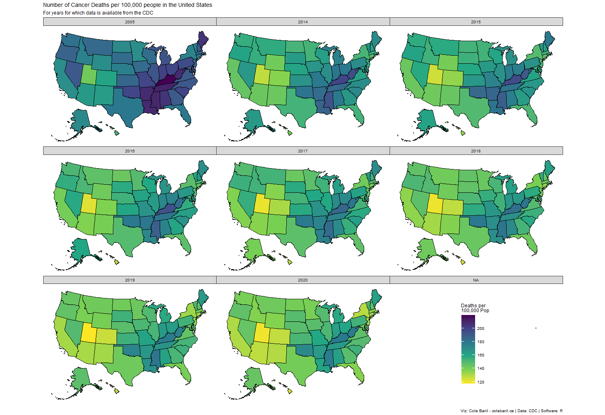

Visualization in response to a thread on r/dataisbeautiful. My post ended up going viral.

<!--more-->

After I saw a post on r/dataisbeautiful that in my opinion was misleading, I decided to redo their visualization to make it more transparent and visually appealing. 

## Libraries

```r
library(tidyverse)
library(here)
library(janitor)
library(usmap)
```


Using the incredible `usmap` package to map data onto US States.


I retrieved the data from the Centers for Disease Control and Prevention. 

## Data 

```r
df <- read_csv("Raw/data-table.csv") %>% 
  clean_names() %>% 
  select(-"url") %>% 
  drop_na()
```

## Plot

```r
plot_usmap(data = na.omit(df), values = "rate", color = "black") +
  scale_fill_viridis_c("Deaths per \n100,000 Pop",
                       direction = -1) +
  facet_wrap(~year) +
  theme(legend.position = c(.8, 0.05),
        legend.key.size = unit(0.9, "cm")) +
  labs(title = "Number of Cancer Deaths per 100,000 people in the United States",
       subtitle = "For years for which data is available from the CDC",
       caption = "Viz: Cole Baril - colebaril.ca | Data: CDC | Software: R")
```

<div class="block">

</div>

As seen, the overal rate of cancer per 100,000 people decreases over time. Additionally, there is a cluster of high rate states in the mid-west. The rates in these states also decreases, though by 2020 this region still has the highest rate of cancer per 100,000 people. Furthermore, the state of Utah is a consistent outlier in that it has far lower rates of cancer per 100,000 people compared to all of the other states.