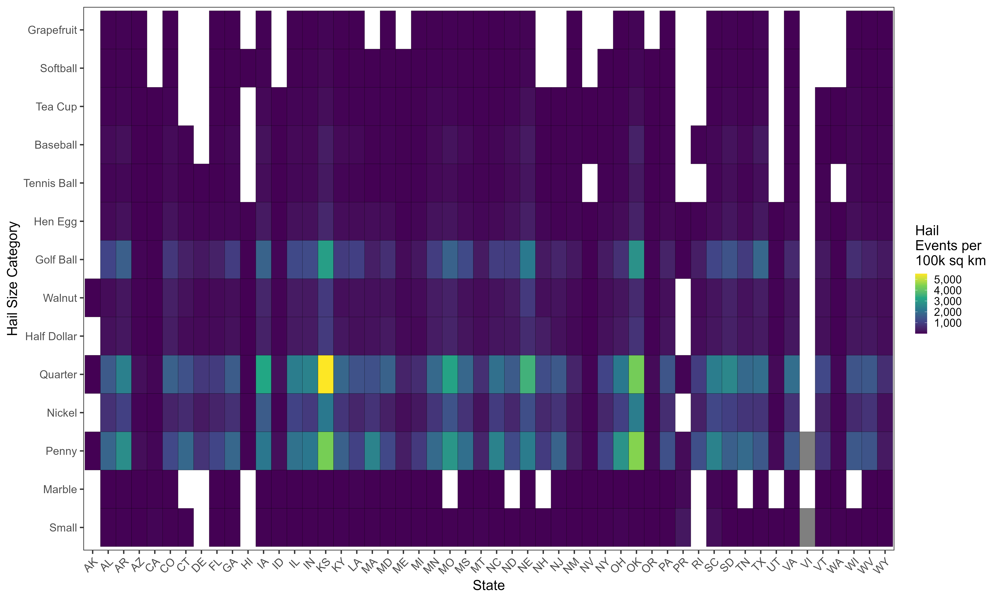

Visualization I made to post on r/dataisbeautiful

<!--more-->

In the 2024 hurricane season, social media discussion about insurance rates prompted me to look into trends in insurance rates and extreme weather. The code for this project can be found in the [GitHub Repository](https://github.com/colebaril/US-Home-Insurance-Natural-Disasters). 

## Tornadoes & Hurricanes

The following plot uses tornado occurence and hurricane landfall data from NOAA and home insurance premium data from Bankrate (up to homes valued at $300K USD). 

The overall trend indicates a relationship between natural disasters and home insurance premiums across the U.S. The hurricane and tornado data were sourced from NOAA, while the home insurance data came from Bankrate. Although insurance premiums are influenced by many factors such as local regulations, construction costs, less severe weather events such as hail, and individual home characteristics, a clear trend emerges: states with a higher frequency of destructive storms, such as Florida, tend to have significantly higher home insurance premiums. This highlights the increasing financial impact of natural disasters on homeowners. 

## Hail

Interestingly, one major piece of feedback I got on this plot was that **hail** is a major contributor to insurance rates, and explains the relatively high insurance premiums in Oklahoma, Kansas, and Nebraska. Sure enough, these states receive considerably more hail than other states. 

The connection between frequent hail events and elevated insurance premiums is a logical one, especially in hail-prone states like Oklahoma, Kansas, and Nebraska. Hail damage can be extensive, impacting roofs, vehicles, and even agricultural crops. This damage, in turn, leads to higher insurance claims in areas where large hail events are common, driving up the overall insurance premiums to account for the increased risk.

The plot below reveals that the central U.S.—often referred to as "Hail Alley"—experiences a higher density of hail events across multiple size categories, particularly in Oklahoma, Kansas, and Nebraska. This density is especially notable in the more damaging hail sizes, such as "Golf Ball," "Hen Egg," and larger categories. The frequent occurrence of these sizable hail events helps explain why insurance premiums are relatively high in these states, as insurers need to account for the potential of frequent and severe hail-related claims.

Interestingly, while the central U.S. bears the brunt of hail-related insurance impacts, other states outside of Hail Alley, like Colorado and Texas, also exhibit higher frequencies of hail events. These states may also face elevated insurance premiums, though the effects are likely moderated by additional regional factors. The plot provides a clear visual demonstration of how hail events correlate with increased insurance costs, reinforcing the importance of hail frequency and size in understanding regional variations in insurance premiums.

