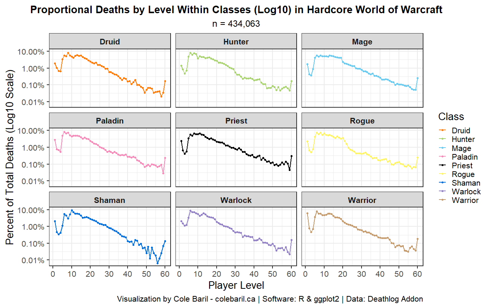
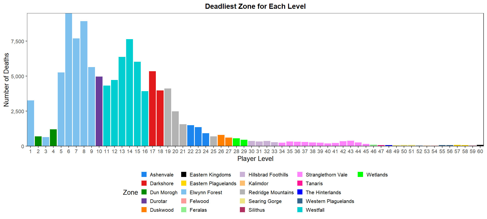

## Hardcore World of Warcraft

Hardcore World of Warcraft (HC WoW) offers Vanilla-Classic enthusiasts a fresh and challenging way to play the game. In this mode, you only have one life, and if you die, your Hardcore character is permanently lost. Inspired by similar modes in other games, this concept adds an extra layer of difficulty and aims to rekindle the excitement of exploring the game world as if it were your first time.

On these servers, everyone starts from level 1 simultaneously on a completely new server. Unlike the usual gradual release of content in fresh servers, all game phases and content will be unlocked right from the start, providing a unique experience.

More information about HC WoW can be found [here](https://www.wowhead.com/classic/guide/hardcore-wow-overview).

## About

The data from the [Deathlog](https://github.com/aaronma37/Deathlog) addon comes in the form of ids which can be referenced against the WoW Classic API to retrieve details. For example, a non-player character (NPC) ID of 589 corresponds to [Defias Pilagers](https://www.wowhead.com/classic/npc=589/defias-pillager). In order to retrieve this data, you can access the API or download and join existing datasets corresponding to class IDs, map IDs, and NPC IDs.

Raw data was obtained from the Deathlog addon's current [database](https://github.com/aaronma37/Deathlog/tree/master/db) as of October 14, 2023. It can be retrieved in .json format.


This raw data frame can be made available upon request. Send an email to me [here](mailto:cole@colebaril.ca) to request it. The original data is available [here](https://github.com/aaronma37/Deathlog/tree/master/db).


The initial data set consists of **434,226** observations with 27 columns after combining data obtained from the API. In general, there is raw data from Deathlog, map data, player class data, and NPC (source of death) data.


Note that the data from Deathlog does not contain all deaths ever recorded. While there is a substantial sample size, the data is just that: a sample. Additionally, this is count data, and the total population data is not available. Therefore, this bias displays [survivorship bias](https://en.wikipedia.org/wiki/Survivorship_bias).


> There are several problematic data points. Namely, there were 163 entries where the player level was over level 60 or level 0, which is impossible. Thus, 163 of 434,226 entries were removed from the data as I believe there to be an error in the data. This leaves us with 434,063 data points.

## Class Representation

 Warriors  represent the majority of characters dying in the hardcore game mode with a total of 81,055 warrior deaths (18.7% of all deaths) in this data set. While  warriors  represent the majority of hardcore deaths, compared to classic era servers where warriors disproportionately represent played classes (33.3%), the proportion of  warriors  dying is only 3% higher than the closest highest number of deaths (hunters, representing 15.7% of deaths).

 Warriors  are played at a high rate in classic era servers due to their high damage per second and availability to all races. In hardcore, however, DPS is not always favored over survivability, and warriors become especially risky to play due to being in close range. For this reason, it becomes difficult to take on more than one enemy at a time while playing solo.

Moreover,  Shamans  and  Paladins  both have a low number of deaths compared to the other classes. While this may be an indication of their ability to survive, it may also reflect the rate at which these classes are chosen, since  Shamans  are restricted to the Horde and  Paladins  are restricted to the Alliance.

  
  <table class="gt_table" data-quarto-disable-processing="false" data-quarto-bootstrap="false" style="-webkit-font-smoothing: antialiased; -moz-osx-font-smoothing: grayscale; font-family: system-ui, 'Segoe UI', Roboto, Helvetica, Arial, sans-serif, 'Apple Color Emoji', 'Segoe UI Emoji', 'Segoe UI Symbol', 'Noto Color Emoji'; display: table; border-collapse: collapse; line-height: normal; margin-left: auto; margin-right: auto; color: #333333; font-size: 16px; font-weight: normal; font-style: normal; background-color: #FFFFFF; width: auto; border-top-style: solid; border-top-width: 2px; border-top-color: #A8A8A8; border-right-style: none; border-right-width: 2px; border-right-color: #D3D3D3; border-bottom-style: solid; border-bottom-width: 2px; border-bottom-color: #A8A8A8; border-left-style: none; border-left-width: 2px; border-left-color: #D3D3D3;" bgcolor="#FFFFFF">
  <thead style="border-style: none;">
    <tr class="gt_heading" style="border-style: none; background-color: #FFFFFF; text-align: center; border-bottom-color: #FFFFFF; border-left-style: none; border-left-width: 1px; border-left-color: #D3D3D3; border-right-style: none; border-right-width: 1px; border-right-color: #D3D3D3;" bgcolor="#FFFFFF" align="center">
      <td colspan="4" class="gt_heading gt_title gt_font_normal gt_bottom_border" style="border-style: none; color: #333333; font-size: 125%; padding-top: 4px; padding-bottom: 4px; padding-left: 5px; padding-right: 5px; background-color: #FFFFFF; text-align: center; border-left-style: none; border-left-width: 1px; border-left-color: #D3D3D3; border-right-style: none; border-right-width: 1px; border-right-color: #D3D3D3; border-bottom-style: solid; border-bottom-width: 2px; border-bottom-color: #D3D3D3; font-weight: normal;" bgcolor="#FFFFFF" align="center">Number of Deaths in Hardcore World of Warcraft</td>
    </tr>
    <tr class="gt_col_headings" style="border-style: none; border-top-style: solid; border-top-width: 2px; border-top-color: #D3D3D3; border-bottom-style: solid; border-bottom-width: 2px; border-bottom-color: #D3D3D3; border-left-style: none; border-left-width: 1px; border-left-color: #D3D3D3; border-right-style: none; border-right-width: 1px; border-right-color: #D3D3D3;">
      <th class="gt_col_heading gt_columns_bottom_border gt_left" rowspan="1" colspan="1" scope="col" id="&lt;strong&gt;Class&lt;/strong&gt;" style="border-style: none; color: #333333; background-color: #FFFFFF; font-size: 100%; font-weight: normal; text-transform: inherit; border-left-style: none; border-left-width: 1px; border-left-color: #D3D3D3; border-right-style: none; border-right-width: 1px; border-right-color: #D3D3D3; vertical-align: bottom; padding-top: 5px; padding-bottom: 6px; padding-left: 5px; padding-right: 5px; overflow-x: hidden; text-align: left;" bgcolor="#FFFFFF" valign="bottom" align="left"><strong>Class</strong></th>
      <th class="gt_col_heading gt_columns_bottom_border gt_center" rowspan="1" colspan="1" scope="col" id="&lt;strong&gt;Number of Deaths&lt;/strong&gt;" style="border-style: none; color: #333333; background-color: #FFFFFF; font-size: 100%; font-weight: normal; text-transform: inherit; border-left-style: none; border-left-width: 1px; border-left-color: #D3D3D3; border-right-style: none; border-right-width: 1px; border-right-color: #D3D3D3; vertical-align: bottom; padding-top: 5px; padding-bottom: 6px; padding-left: 5px; padding-right: 5px; overflow-x: hidden; text-align: center;" bgcolor="#FFFFFF" valign="bottom" align="center"><strong>Number of Deaths</strong></th>
      <th class="gt_col_heading gt_columns_bottom_border gt_center" rowspan="1" colspan="1" scope="col" id="&lt;strong&gt;Percent of Total Deaths&lt;/strong&gt;" style="border-style: none; color: #333333; background-color: #FFFFFF; font-size: 100%; font-weight: normal; text-transform: inherit; border-left-style: none; border-left-width: 1px; border-left-color: #D3D3D3; border-right-style: none; border-right-width: 1px; border-right-color: #D3D3D3; vertical-align: bottom; padding-top: 5px; padding-bottom: 6px; padding-left: 5px; padding-right: 5px; overflow-x: hidden; text-align: center;" bgcolor="#FFFFFF" valign="bottom" align="center"><strong>Percent of Total Deaths</strong></th>
      <th class="gt_col_heading gt_columns_bottom_border gt_center" rowspan="1" colspan="1" scope="col" id="&lt;strong&gt;Percent Vanilla Class Players&lt;/strong&gt;" style="border-style: none; color: #333333; background-color: #FFFFFF; font-size: 100%; font-weight: normal; text-transform: inherit; border-left-style: none; border-left-width: 1px; border-left-color: #D3D3D3; border-right-style: none; border-right-width: 1px; border-right-color: #D3D3D3; vertical-align: bottom; padding-top: 5px; padding-bottom: 6px; padding-left: 5px; padding-right: 5px; overflow-x: hidden; text-align: center;" bgcolor="#FFFFFF" valign="bottom" align="center"><strong>Percent Vanilla Class Players</strong></th>
    </tr>
  </thead>
  <tbody class="gt_table_body" style="border-style: none; border-top-style: solid; border-top-width: 2px; border-top-color: #D3D3D3; border-bottom-style: solid; border-bottom-width: 2px; border-bottom-color: #D3D3D3;">
    <tr style="border-style: none;"><td headers="player_class" class="gt_row gt_left" style="border-style: none; padding-top: 8px; padding-bottom: 8px; padding-left: 5px; padding-right: 5px; margin: 10px; border-top-style: solid; border-top-width: 1px; border-top-color: #D3D3D3; border-left-style: none; border-left-width: 1px; border-left-color: #D3D3D3; border-right-style: none; border-right-width: 1px; border-right-color: #D3D3D3; vertical-align: middle; overflow-x: hidden; text-align: left; background-color: #C79C6E;" bgcolor="#C79C6E" valign="middle" align="left"><img src="data:image/png;base64,iVBORw0KGgoAAAANSUhEUgAAAEAAAABACAYAAAHdbkFIAAAABGdBTUEAAK/INwWK6QAAABl0RVh0U29mdHdhcmUAQWRvYmUgSW1hZ2VSZWFkeXHJZTwAAB8zSURBVHjaLI6xSgNBEIa/y+7BghYLplgCwoEKV16RQtHiGiEPYOEjpExhaWFj5QtYKlhY2gQst/ABrrA40CJlCpUtUixcwrjk8sEww8z8/H9G4vSiFmMMRrMlhEBcw8nRIVhrJe360kbcuBbvvTRNIwdnl7LT9BjnsGWFS73Yh7zr0EmFGTrShB3XvN1NiatAeftE+G7J7NDJ8rOgnFVU63Q4Lnj9UQQ/JyzaPoO7mknjrcyfzyXGIMX1VMwu22Brvlry+NDx9/VL+1Eni4jSOSpTDGKM6SFSjkbcL2omLxPebzwbvUeuNvwLIEag3w9YuHjYc0B9AtIACgcQAHrVkAEWBszMzP+B3vyvkFDxH6gAiF+AAu8/XAEDkCPhEPD/7v27/0+fPfFfIaYArICFgUcAHMQcMhoMCgoSDNeuXGO4e/Usw4crJxgYgMHNwsGjwCBgYAAMJAuGAh0BBltbU4bcuWsZfoDCgAWEWH4wPFhxgmHxCgaGB08UGCxKLoAD6MfHzwwc7KwMTAx/fjAErMhgeHriMIOv7WYGZZHfYB8ws7GCaaYfwLhQ2FLB8Jr1E0P0+liGv8+vMhgoKDDwcjCD3QAQgGzyB2kjiuP4R3NK4KIcKDRYhRQtBhy8DoUbb1AI7eKuQxZ3wQ6CSl3cHDK46aSLkMUxkwg1mEHIDUILUojB4YYLvaLRZy45/L2cuPgePHgPfr/3/fcbEOe8mufN58TB9yutvUjMFDKltaLw7fW/z05+xHG+Jma2/7eIouitTNswlDElHjnMmTyfpcnBz3WazSbTs9MUSyf8uaoR1ioYr4BJDQ7DAPRkD2WSX3W2XAs2NtaoVqs4dh537wQlEvZVQssoIihrCnPcSkBnBLYUZ2dsCmlfYLqMWCO4jtz3K6irc8I7KQ78pIHSp5XleFseRk12z5YppP6S/TQmyc5R+F4A38cunRJ6Arvh0WsllPUcJRQeGqweO+TdRSqbv1B+g5uqT2guoW2yD89RQUOCFtJTEZIr4jhO2EuXnW6sx2acSe8II3fNRblF+azNxNw/PkRb/Pjm83QbcFl/INbR63SJnp8wDEPLhr20Uqzf/PaY+uKgfaeblqHw+4OhNboPWnTUo1jYIQxCos4j6r6Nu+DyIgBjVdDaRBBGn9msnWS7MbrEBtfQ0FIsBPEULHgwHoSKFCJeeqiQQ3+A4CXgJQcPBSl4UCj0EgShoJ6CIEix4CUQhKqXxYBsTZautgmxaTRmuk2/maRGqwcHhmV39pt53/e990ZskLqZnnntbDd7BSRyMP+fbBAaOZyQB7RhWdYGvccFkWzXdUfxz/E3kSgQgnTZh3mgam0gk8kMjOe3qQT0rhYf75pX0lKE7b22FKLjOFKM+oVL3dm52b4pHBmCiSwUQjASg8+MY3n+uqxHuVwG73Ik5nPAzw7hY0JNR6PJSYZD8IVPgZnj0OjTmHkGq6urJC0P0/fy9ODgu8I/27QBFUxlWq84NJVAEMd1kbeJkBlDcSlHLeMwDAMfK9QZTsV0P8P7Vh8QaZ+CmKLI6qpGFIygs7EE9JaLUqkk4cdiEWRW1sEdG9+rn7Dfbkn38gsY6pBBJw60wM4lED4ZwUJ6RlgbUqkUltdKUFotNDcr8HZ36FTeFxPBbqyHEZ2mk6Nh6PEYFIKfJX+i9oouCSbghV1DyyqhU/8Kj4jkeV7PcaSWUkz6Vpicz9BPI0fBDeFZAZI3IZzK5aF8cdBu1CidOjghORzS08Jno3RdzOLRrQLiWzU0Gy+hvX9MSkxDo5T4iQh2Nm1CzbH/g9hInj/YgCrJmy40Q8cdUuTSAxtX/Q4m3pryh9zTNajbFaJWT33w+6D6+/Txo88DMWl9svoEmWm6uIYNeDkXH96cx9o7m9KhZV9QxnhQiEyKvHl+1QB7XJAX6jHKNz6JlcIr3F/cQkTXcPvic5TuFpAc2iK+UIeYKv0gyHw9Hog2Yq9DFV5HYkLc1B7YiAcruYj0Mwt2sYjsNRcLWRtTc5QuoVV9HZgjGoQ4hZzt5OXUqKYz6cL/6wcaC8LZrNw4EIDxqgtp64rjP3O98eo1LiquSmq91HYEtJANCoKWCXbQsQm+FIQxcIyCLzIftocxOjr2MlgHhW5MZh86howNyoSuI2DL3NpBIBSEIQu4sjArzcwi0WtcSLze/f7n3OjsPtiBwzUX7znn//H7OLLAGI/kmHXedPZhrqemjdGgsdQJa9DGX7jicc7YLuP/DEq+fjar59NiKfxUKvWPlPBvk2j3CRnfOur4Vk/c7xw657c//5LfKZKcGKaPKCv6kLn4w10/93tOv+Mcn5zyrRMJJd0zszNcq77+0vb2NpaXl/eJ+m/0wqL5vg/TNNkNYdTbERgNLHpLK1pan4R55KgCf32oHg+/vobCRgGhvRDufX8PPd3HmP4KGhp8nHhxAtniFjzp58IjWLalfdR/Drabt6c5TgRUdVGDhabukwi3RBHqcmBQ1pxiFslr72H1l1X1WTqVRiwWg9moTYJwoEFm9kQPyYW6qHIA1YU6StE6edZwXgOOcKS8CbFt0RwhW8Vg2KQ8HsIkBJ7rtvH2O++yqQqKP9bX13HMiSnUfHDjDhZ+WtUcml8TgVFcWusvnYF6RUuKydQhBKGmhpgURfjWaLQRampSqQ630TYcc2CSdye6KIvPnEKBFJJMJpGg2RLujRCnk9eTyErzFnKKg6v5PFmjAG9nBwLjA2HnqLK+pm2jCQHP1AV0ETYQbmKqWfcwlcJjBiLxAURyS5h55RzyrktsVkEDTXd3hsnSNDv1GTdncqt0EhVRj40cqsW8yrZwueFrV669TcDpmdsDuPDmCtIrNEgBXMISeUsbDHFbjFx86Sm7jFcnxpH5+QFTnqf3dDBydkT9v7lbwtiH83A3S/C2NuCJ9S+socq/FXNIyUULTDPwRpJ61YgWUull3PzYwM27Fn0qN+PCJutoO33K4PfBxfn+bvWh1DqTWcH09HSNCfD+3C3MrTBKEk81v4rKFjfPcXM3rzu/UlFPddDaAVAjGkZ88ZMyrnwRRfLyEmZfc/nyR4zeeBnTfgED/e2UCU/pjIyZqxexmMqoOsp4Y/YWFri5xShLLiMvkQEpIV7JZcCeiv5Qcx/iMzkEqXPjCQeuFac2xZGIFjF/OYWlxksaVpkxrGWj6HXv4+RUFePupN48COCbHB0CIVstsuFKW6jSCCp00VHvEcdenamJ2z98CN1pKoqynmWtbeX4Gd4IXsD060WsbSYwOpylOGRxHDF4Vx1Y0YNFhqm4Jjc3KiV9IH/feSr5Eigb9ENG6IDYauEHGXhs8vvIZhoRQiz2yMbqt1mkvzKQ6UxhanQAvUOdqC7OUC/nYHo2LvQ7eCuZqLVCoJ0FxRs2iasksYXZA0JonFKKgx6ojd1AV1UETOXCPPp6i9RURns2B+uOiSgXFJ0F52LvFd0LIx9hJL6ERNd9feFFLwYHRZwcOEO8TzEDBiVWFHKP3e/5umQxXnK0HpfL3xGGz5bltNRlieA8WPeeKJzWToWQ7Oc2lreB/LaN3OlxvcDuMrt8A1NfJrC38xRKvxV0IMHVA7tL2kEI7jkjwg9eBdEIM/IHD8Kf2Qdrqi1UGZmL66cHh3t2Apq0oh0abr9mgwUNtB2P6+YS4ioHcJJFO2NK82VEmu19WMpwCy46jnTsX4EFhu0dHVi8nfyUPyf+FIA36wtt6ozix9wkpsborRrtjLGRGpepD2UuEhBdtyH2ZawgQsE9FETow4YdW5mgQkEGHdvAsQkDB/NF7BBZRcYKThaYZd2KrFvXLVunRrQua1d315ia5nrjfud8994m2m6yh31ySGKafN93/v1+vxM+AKdTBzQCE8B61gmu2HJCQw9rhgeXaIc5Hl2ws6sl/niczp87/y7e73ByoMm2+uMfnKD/g5Dsp/0Hznx8hl92eEFIjnV2dtaznKiz1fJDiGjDcnUNB9wGJq9W2EobTOfkG4fIYOTDYkGUwK1ZXTc0NNCeV47Qye5DoGXmgb7P+mILdu/eLVOHs2fPPtINmBd4vBDVTEpq0MY5UZfqZIaWy/vHX2qjlue2ux5yPbrYpmKbU/J47PV26ni5gzxTU1NyykdZUrs+3ByEROOnzA3keYBCq6JiLbvU5hyS9OdpsmYsyv+ZF4kca26lYFgl96lTpyo64aPcXJuVAxoOojFHYAMn8EEFyq327XT/ZhJinnnBNLB/EXhEX7/qEwz51a3YozH7+HdaxjkBSuZjLlgTgiNCaNmIezAgk4bYPYOak1vk5mzDw8MUCoWEkrEsffWj80LJpKpQIX78ezQPcPJ5PGoQxrYwKMZsSG4UawTm5+hQ+173I0xOePN8XpV028Fu9z3zTv4BNLxnqRY83+LMxwEs1s5eTYhEAJKHOaEHiRcwVOfbnkrS2I0xkcPsrSV6UDjh8E+jlFtcB15hCCf0Cbu0qGSVHvZAZZzd15x4eGRe6Iea8SH7xfTlICpxNeDrbqfMDxn39itXrnS/o/Nsv+qA4AVsxTvKZnOAb+W152vIZnavI/gFw+3NpfyWKvGvcenBxRoEf3syRgPXcgIsg18PUiKREA8wKe0EL2SMKYKUMhk1OSTggz4Agd8/Rw5o9kG43DQvb+xzN2dWzOasIDK/MJaltn1tLkWrXCfSCoxAo8SYEVtQ5uZdZfRQQ0WjEGZsUywNLZi9YS0AdiPeWo0uma+FcftInAK5DPUebpcpRjQalZpPJpMuK/7+Rk5YMf1lUAEAx99jziAMMwryOUllcFpZ21yjuCvgs0SempAcwAP8dmh5EKinYXMfd73CDffsPE5kFeSsU5+mabTgZL2hbBIewM0tsxozvGWe9ti0XDgcQKgyFYPwjIYNrYUID3Ig5MO76GrdNi0PIETc6XZs24GbFkBaNLrwW1FGMiWblrPrrVKRqRBpFpRRhf+rciCTTs22XZ6yAZx4c9YFATQdPa5oV3eqDjEfA3hFKJvN2qMcotj6mGgCXry5ydPcu3kxAiWH7JIE5epycsbjQbaXYS07g1SnZ+j5Z9BgvNgYtastjdCiho3Qgoh7NCEYv3cNVzTniSYll0qpQ4dXhKj/22EyeO4EslK+AwlWULfXeOPSNHIACXivLIdwkNf1QO8FBbUnDin00jgfABx+faUIE157aIyiayJVMeSycxYLE1USYyJKTM5+FiUzhXn7nAekXUkluLy9C0oGMpuHXqHaKAVAJEN4O4AE2r94gjZt3qSECW458FUfKHuHCFlmT0dOX6QcuDoPxKz7rIJMUVMlxN5kYeKoojl1gb160sotX36n09DhLvf/Oxp8FEHXyxuTpC8P09BAmpqebVa5YpfthZ9nq4JjX5qecl9z6c03/PDK7eEFHnFxc0kcbqSB13qo//oWmdxNXCtRJrsBckQ1KfOLHtq+tUxrN7S5yig9MCTTPN/YKBVZlqFx8VRPkM8sSVNjduwoo8qWPycapt5unY1xbBT2i8gytmVb1U3i8dnY8wEq14OIZzHg3bfmyQEbbBxp5vOZpEMV89jxvfw7FGtsQT4Eqb1tiFpzo6R/ExWrXGnkLUszYb42yjmrbNe7xs8qD+Glf+YDemIjUK6L3jqapm1Px6h4aZa0lJ8kumL/eJIesXVDwai+mZ0bzB8djGHXP0h4PQLP96t1oQgMaMPU4iGazEy489Oh9VN0tXaIPJEcTWSa6crlbdR1Oi2fa9BukHFPB28IilWFgBTiCrqWaf4qqFz+WxkyIyrOzakY9fYNovXeop0HG6v+bn9jWh4v3wyp+Beqa94v02GNOc08OeCKU8uOoSWcvzCSoWRNmhKbIatyTL+nqGga1NHYQ0c/CcuPH0HNouDCSeppPUbZ9wfoZHO3DIW31RbUEAq9xeIQiJtVGHhIHAJPnLSl3JznKmSHKFxbpJErOunb0Xjri2SMl8n43aLiOtUVGz88SJ0XWyi1TtX/yOURCj8Wpl5AAVv2kl0lLHi5LNEHOP55CNMli/yzuSg/Y8wUKW/6qA5MJQ+QiIXGKLIE4BLWyTiH3g9qnV/kobqURekseP8TLRQDH/gxa1HyzeeFbKTqDeraY1BmQCVl6kWboHiDELIFCiEnDYQnuipIQWbKMyrnvLdu3rq+es3q+iu/TtBtiJT42ilqigyCxehVXhkf99PIMJJrVxIlMAhQKQnilaeLdjUEqGkEnfQP5xOOigYUM+lFTHTgy/R0iSYmC9T8FDBlcPAc96ZjdSv0A6nmFhrsT1N8U8L+fVyJjaKrbgO2CM1VidGALV4deS5jeWHTJbo9fhvJp6LMI3r5XL5AqaYmlufXGcGd+UBvZF3shdVrY1Q5Hxi/ehVQrb5g2dpNdPtqRn6F4Snpf50PsDoeAIxDddeym/4WoHarDW3rvMLHupZzK8WOYk2tGjeLE8dD1PPizvbwcMwMqYu3fEz70V8jYDbMOvZBYDME0kGgFAJhw9AVDEnB0A4K2w83H5tZCTNt0zlz3SlLy9S5KUoduWocOWpsJYqsK+98vO/VvbIcJSt74XIlS5buOfe85zzneY40P0AH7a8ott8d+w8c3PO9A4dkG5k+162o39rgTrsFd+bzeOrc27A8zI0qPEPWDdmsojuFV+zay/sYZya2JPGcOXOGeInLiGkob4xTNwGqPI0qB9A9b37l9Kkd6AA4f+4s/PncGSDCpLurE2bem3UTJ05uy0ka1MKXWjax8oDP16kNBffr1Pgf/P5BOHToEJ+P/PwIjI+PX6ZtQ44geoK2LQvAIyMj8MKLL8L5s2fh/7dU1/GInK1NJtMb/EoD5k2fJPS6Rmnusp8Jz0Kci5P2sLd6xl0CNQ1S8lgGAl0CnaJP90F/ZxsMfneQqZHJv0xeIwV8rZdoRdVdlPdXD710SFIokpqMRYD5HNX3kcFOBxC/w2flBM3zeBH3UScz8OQuNr5CIweJa/N8vURAVXLA2NiYKPXOdT3ODqCFDmCWFIgjoraK6JR02j0W8rD0jd6j/ByRMdV/jzLa4vYPmNbxqNzC/JIiOjwYAdohfMcG+2H0Z4eF7lFJzm9KkpuenuYzsW7UlZVvwSMnTzElRMiOI4mkIgUT0rfSTBNXYBr/9+U0nFI/VV4m1Gq8dt8r7L0YbyhDyHgyXD/Wa/CpFpvv0sYHvxLk8qONb21t5e/JomF+rHEhJt9yEIk+98DXLYKdR4VtNZ6swl23yjuNGjR+TXgWRkCbDMGDhgmeOjFcU1skeQJtBXxOsie3thlBEqM/eZbPJIGGFKs4e2kWFvFOEqtAEbu0tMTwJ/CIfN6bf5+Gw78dh9bdEVjStPjNlDQIJJOqBErcnKly0TospsO/IlO1Qbjbe94Q/lZjcCefx8ZvchtPjz1ouDY+F5uEvq521n65N3zviv3xJGpr4xsaGmzuT6+X/zDBRyuGvDY+XZYgK0cAa8ZWSaqpEuLl4W7/nTsrdCBYdnkiDGERyeWXzG74hFdkz2OyM2hOh75TcYwvHRuBgYF9zDMuY/dNszvEN/L8Di6i/UyfV2UTQIATZv5RU4CwOcydOOnTRWyKA7llkQkxAuiWLa8Io0HcpJYfaisR4RQFtI+1oKWNpP2m97eGeJbHluBUl+63ARQ99mzyQp2vQfHTwmvy62g8P1bS0skfDsBAe4vNc9ZvqWcn6P3e1tamMHEKHRFm4xFOwolpd9VifRSNp7NAVjlnUkn7PU4eTYn2hhLuZTSBKCQ6W3pPqxzhqaX9XeQ7XdTNtnKhpjGlxInAz1mf5jtVbde8qg5/ojd7azNMcXY81QHT/4zxzSXWaB5LHI0/kRxOh673LY/LdnnpT5Mwm0gx/8oU6G0F/mkoAJNiETsYOmtgRJws06J4vbSViNHcsAo4jamUD6SmY2hTk1eGxLTxmsslapWmHKS2YxOpKLFMPMYDk6PPD0EMDadDLzKc6jtNQBB2d+J4yvI0DWEvbfyySnpO48khd7NVckB5EtSGKznFIDLR6Yy1UtqnxEZTFW4HKPHCLE1Z0H6va2hkWtdMiaH7uyIwPNjD/LJzXf3oqmgOfX12UxMI2JO/9jSGvb4Q+jevaGB2AraAxXt3mA7WUJ0mNSQaTE6k7NRCBQfoek0DDsxXk2zgcMD6O27ad1rAjsWGk4imk52/qZVDM5ucgwD6axgBTufuZpj9OAFffUxyAs3bzs/PQ+eeTibak8mk63uuzCWE9zbDZRyY23hCj3wd6s4TH17M59bx4iVz0CtFNbpi8+RUh4+3wuTUEkx94O6uDNN0UU+sJCj4ykhsW4kz02MuhMe7wxhRePy4T0gd4tYpxrJfZJniZuR3IMoUdwIdQ9suFA7xrM3JyRm4+HGSszzVb6Y+Ff1NWb54dxmsO8rgfE6XKsll+azUel2xat3xvyESHOwP8hF7JwFDozm30Q4neLdsVyhOOWEtJ4YHw64Bgm80mtAeNJnXdy5tvOb4F1OL4Mee3rdZoLJtvJP31cbzHl9mHpg1AGYkRAeohG0qRgAxHh41O1RU4R0dMFgrYEccADi1xYQzb5k8T2SQYuKXRMd32W/yXSJBS88X6baV5oy2wSL09nQ7SBp3q0oZPhqN2n8jncHuBY6OQoKmY+i6qJzRACzW9iJpTtlS0oN7OdEglAyw6pADrCp9TcUIIK1iaAQv4BkPO+NgX44PGagK8Jd6FTytY72yzfX/ZPiTcJvP0NMD89fdugYZTsfRo0fZAZUWGW8vbfwKqT0ZW/sQ5h8THg323suuM5gfO8ccaowNkKBmXVgnEcMmMDnPYrqdxUA4dljCdKAdQ3ZsGt78dxuiL+HOSD8BlXj4wo2rEOnoURUKazKCmfr6Bjt5Tr8tEtbY6TE1MYURhNGiZQ5IZWDk7EXWWvh1mjbM3ob8sgp7msHJi9RFYa8BDw+H0RalLeCUQhwMkeF5wAigtT2Us7Wawcsd7IS+PRk2nmv188f58YXYj4QG3aq8G+hhw9k5hPRo6GjuQz7sOS+l7ZRwh6nQWop/OOHav2rP28/L97yqWCy/kgNqNqDO7rsFimpciyJhJcUobSkvaG1ZlZ3hP0Zg37/m4ZURMeTi5U6gNDD0bSErJqb2QzzRCpGwc/Zkjift2r9VhOAP5IKmzg1Cy9ci9sifk8IafW0CLAzTImIGDxptEKojtQ2Nyq/c5kiBGou1J4OUfHxOk3lM7LEGZfGMN2iyrwJHWNEBCwspaHo8XNVbFz7aDtFfS5IaOTwHvXvSEFcALtqv9MmwlDnSsmammiF9yeBj6R8q/na6tS2nxsVC294oG36/RZWo6OAGi4WijU4ZnmvDy/a8HtgjlKlFWnbAth3bZXyRIW+2NMaoRhm9DiSXC4sDfvVqEDLHPoSXR8IsX9kUXCohUhZ2tC1752Dxp0oNfl8N8gQqGzU1j0kNobFJVYQuXI9Bas1trbjBLaRexlJC4CqPSAq1IXIIj/kokkaXw/AT4eo54EEX6XcnX5DH5IhfDDeDuVe+iBzhVTtidRgvsBOdcjMCY+Mn4Lmho/Zn0O8dbJ2vgtZXbRH/UFT0vO5SnZqwx+OpkgMsRW+vVZgj1Zqh+jxz8zJ4k3EIX8dsvhlz3hY/hBt9kFq6w1ri2AkDUV4SInubIDrYDVYgxbOmjPPfSUF94Qj0ttTD9KRUgasZTJqfYwQVJIpacldg9jONBQKMIhnFerC7NGSGRW8DzgHENmGXmgchYooaAqtcYNTIFrE2yAUPHQFkvH9mgrXLbHcU+uOjMDmdgI7WEISDfqpiENktNf/E7ycggiH6CTpgFx7kiBze6CyWLp+vAdvSJHSGE3wMa2S4EoFvXq+H9683sOZJRGb+zp2S9qkcQDmAEKmXymTBofh6nHveEQE0tLtmPYADClorVZWhoD4JPZpNxGEV7zwFaKgmBr43MAMeMCH6dABSrwWZ2MkZgglIymze4YfYjTDELmHkvC5C7uTTr8PAzjg8syuOZ2sdPtxecxE695UGvv6zUEKG776LIAqfn//bsg3HczmDK4CBMcDXbJi2Lk1Wk5TmY3lKjtU1IVkfmhXOK9qKdNtHG0sZOPM24v5PcxBWcmjgA1XTH/Wwpmu/b9+zrO0O1EhS+OsnEdZ3I6JQsc7bs+tTaG0s5YIbCzcITZSm30aI4cEL/02SnSAWeNdReTrZObEAacIkTK+awbJegH4zuCrdIOnEPOFGA8aYVFZvpcG7tQmasrPQ3LAgNIGBqK1gQsCHh196iMySBbHT8oFJXYeVCBh/DPv6LsT6t7ChSS5Axl9vNzJNNQiQ7gqen5s34dW3aAq7dIH9bSEY+HrJIb8bMyEWz0H6VsYVsXpCm1T4kInGY1+SYycYUG+KHk0T2wnan1jZQqFtQhAX4FoN/bxTzS5/pxubFvJQGuHr3Lx0YOFmqdmkWZNw3mxiu7qYsR2QuycCekYxMMk1IVIWP/dCW3sWLpi/FON1YK4ZLpSXWakyA32zTKkqZMr4gLTo37oFt7LKePIDNmgY42Q8U+5PBCDSNQipZBJiMzNvUAHSeInQC/Wj0aadzTu6e/vFmPkEy9UhB0jSurl9wevESbPMoNR9DTTLxEyztvz/y0vi/d9frhXq5iiomjelyx9XCrENGO1eBrPCkHJIZfW3WhotfEl1uNpvy6p+/n0dFMOtflxL47T+C30kos8Vc3S0AAAAAElFTkSuQmCC" style="height:30px;"></td>
<td headers="n" class="gt_row gt_center" style="border-style: none; padding-top: 8px; padding-bottom: 8px; padding-left: 5px; padding-right: 5px; margin: 10px; border-top-style: solid; border-top-width: 1px; border-top-color: #D3D3D3; border-left-style: none; border-left-width: 1px; border-left-color: #D3D3D3; border-right-style: none; border-right-width: 1px; border-right-color: #D3D3D3; vertical-align: middle; overflow-x: hidden; text-align: center; background-color: #C79C6E;" bgcolor="#C79C6E" valign="middle" align="center">81,055</td>
<td headers="percent" class="gt_row gt_center" style="border-style: none; padding-top: 8px; padding-bottom: 8px; padding-left: 5px; padding-right: 5px; margin: 10px; border-top-style: solid; border-top-width: 1px; border-top-color: #D3D3D3; border-left-style: none; border-left-width: 1px; border-left-color: #D3D3D3; border-right-style: none; border-right-width: 1px; border-right-color: #D3D3D3; vertical-align: middle; overflow-x: hidden; text-align: center; background-color: #C79C6E;" bgcolor="#C79C6E" valign="middle" align="center">18.7</td>
<td headers="percent_parses" class="gt_row gt_center" style="border-style: none; padding-top: 8px; padding-bottom: 8px; padding-left: 5px; padding-right: 5px; margin: 10px; border-top-style: solid; border-top-width: 1px; border-top-color: #D3D3D3; border-left-style: none; border-left-width: 1px; border-left-color: #D3D3D3; border-right-style: none; border-right-width: 1px; border-right-color: #D3D3D3; vertical-align: middle; overflow-x: hidden; text-align: center; background-color: #C79C6E;" bgcolor="#C79C6E" valign="middle" align="center">33.3</td></tr>
    <tr style="border-style: none;"><td headers="player_class" class="gt_row gt_left" style="border-style: none; padding-top: 8px; padding-bottom: 8px; padding-left: 5px; padding-right: 5px; margin: 10px; border-top-style: solid; border-top-width: 1px; border-top-color: #D3D3D3; border-left-style: none; border-left-width: 1px; border-left-color: #D3D3D3; border-right-style: none; border-right-width: 1px; border-right-color: #D3D3D3; vertical-align: middle; overflow-x: hidden; text-align: left; background-color: #ABD473;" bgcolor="#ABD473" valign="middle" align="left"><img src="data:image/png;base64,iVBORw0KGgoAAAANSUhEUgAAAEAAAABACAYAAAHdbkFIAAAABGdBTUEAAK/INwWK6QAAABl0RVh0U29mdHdhcmUAQWRvYmUgSW1hZ2VSZWFkeXHJZTwAABerSURBVHjaYmQAAg4egQkcQPoHAwTA2D++fGBgUVBR+P/gzgOwxIEIZoYfb/4y7DgClGRhYJgAEpSQUfgPpP6fzWf438DBAGaDsHBzxf8IEY7/YAVAI/8fjgByGJjBksxADBJL1Zb9z8QAte/FW6Aww1+wVSDyh4AEw+yrjxnACgyA9u29/JeBW0IUrGDBBAcGhg8vIC5WUFD4/+LJif8FPEC7BQT+M7Ag3AHCTC9evGB48OAFwwoOAQaOH0DL/jCgAIAAYgRiB2A4BCCHAwwAw6GAgZWVFWzUjwNAn0xn/l/AwfG/AGQNEHMA2QysjMz/f+wBKriAsBfkxQwJ7v/KqhogPsP/rd4c/3MFUB2nm+L7H2j1fwaQMRdyOP4HcLLCJQM8DCAmgRUA7ToQwPHfg4UDxQSwAqBmpoxAX4bXgcUMNxiwAGAAMiRYSPzXNVf+L1FR8H/ClQWopgBNBwggBgUZCYcbHz5gSiD5iAEHvnHnBjC2JST+CwDdwgoUkADiD3+AQXKF4f+DLcDY5mb4ryCAalgC0PBiXla4H4AGKEAYQIELwCRzNob1vzc7UAMzM4pt3FBaNSf6v0aCx39foOECIgKg5PSD4e/fv+BkvPsiA8PjF2wMprwcDMx//6KEx1dQUgcGyuUUVYYHRx4w7FY1AEY1KJxYgIp//wYr0pBjZvj6j4HhxocfDH/RAhSkmZmRlYHDoAEhxiMAyRICQH+9eHPhf4AIw38PoJ8dgHwJHQW48529dbEGItjroPS8YfXk/zfOdPy/cGLFf40Ij/8CpblwBRwlGThjASQPSs4CFtYW7398/cHw+sMHhr+/gY7/+5uBlYOD4fGTF2CnoyQMaH748ecHg4ONAwNAAMaqJjKOMAw/3dnhK4lu6eiQREO6pCpasmEuPa2KiuhGNgxVQpXQyx5KQy+99JLTEiWXEHLJoWWOI80hpIdhcwhLsuRvacJGo75D2K3dMX3fbyf70x3RlzGf+eabeZ73fd7nvRVu5RWf0BMQ0Rv/9gt7BkWOheT0wPsPIT2dmOB7HlMvprp50VWZF4FnU5+VqTMgVBMukue8uiOC5F299QPbtoO4cd9owXozqSG/5EPXalhJAZYLOAycsWsahpIm0gdlmLTeaTQLHevk+bZfh9wFFlMCa5SsBdmxScL6VSyj9NDEY1p/fDkWfiDMcnkhAUlyMx6EKWz0dmedUi7f54BHJuRmkc2APtBoZ9lnPD8ECogOn5jnLorYq0oktbCyXE8OeQnsn9Bf/miQQdtmO2N22sL3k3N4RzUUEgnM0dkYw1DWf0b6r5K07+l4ruuRCKbTo/i2ut1EQ6IDGW38moKkzvJv+2pulOJaz2Hvqw0ru9ZtvI2wCizXwkVdQRfM6KoXvpXdiESlqrC+/gXHVR+Hl8TttI6fVKpuHYvIw60qfH79Dm7Jw6etDRzHDJw/GWu95Jw5imtU1Oi5ouBW9mANW6r87sgoapXf6oVnM2lkBjO4MVjPbN3LH+aUgQrPbZsFT4YbXDmTzajZ4/DCMIxA0IDkccJOPZ6i8ULTRJnK9dXXvPO+OWCqbvwrAO1VG9JUFIYfvc6uWXRDlyMNRxkZIiwqCla0imAV1soCwR8JGfQnCCwSDOpPkFAhlBBIsKhA6ANDKoMifxREQY4wkEq4ldYiP27M1W3XO3vPx63NnH1AB87O3dg95z3nfT7e4+gBE4OwYUS3O7rwv5uao96kIZRFeqK3tLaWhrZXT/+G5Fzb5nw+zlQSfFRkvKZh4ekgMBgVII6MJAVH4/aU0wU3BxHcEqRpVbW042onKwRgSXdIy1EVHU0bUaxLQULPRsybgCeooHUfYfeOwsG8uMiG9VmFTvTrt8Uc/pkq3CTTmCWJQpALGz9FovtBN7Q5GnF5zBS7SybTFmZI1nsJv+1E0QeAa4WNJ8M2Lu3nuoKwKUbePtJJ0HPqXvXPJtyVXiiE08ALHQVZNhryXDgdsyYTSZIkZf0qP0V4xAX9ko1uKgtHvgBX6Htnk9BJ1hnZUwnvLM4S5CgJ08/Yrho82hFEvFRD/KsFqh5xobkaxQu8MoBxkd9kijSfrdTw+KEC/bkCd4mLa+yNexZeTcgjHBcLTpXdhDwXU+rv7OaTSH4gcGTRfBt98NGJPzt+HcOjUakE0iqzpTmosrs1oc/dvZTvQyoW5lEeOWeUabFqTdJv36pK3D9VyzVcXxtA53o/IgE/3IXFEtukyVzTs39uiWl7dEg8LyoUC8YGVBJLK8O+p6IZ4eB1O+7f7YK3/jwUYod9tCVFBzWYKypFbaSmiKUpvcFbQkG8B/pHE/AvzkcknuA+8eLbnwUQ7W2B5q35BSNptOZ+ApECVqAVsN1Lb7HGFAwaCeTniruJOSMX0bE41EKKfMjIuHBwzQKhbOUHfxvkDz9yIjKol1Nv7zMRJQGZV6Cg76OC6IDNPepdoQcktxkn7LocosvUO95/26SV5zifu3dsxbadWwjGX7B26yaEDx/H484OHuWjN+S0BC9DU9NrvZR24nQ1gvW3/k6OGQtUyYLqnSHiby727TnMc7MoUIGVe6pQ3lgHhRDbt7QC/TUhyq2eNgn3S5qjqeF6Rt/MJO3MT3l5XFdXNxEo9/Aam5XJbc21Exq7MlC5XHGglpfMnmthdqsSVkjXB+Zq7QNd09rldJ29HwqFJhSKYm5ZWdnqQ421GHr/FtfOtKFs2Qb0z8nB7ac9eLnEh9j8EozUE6jGx/mxHTu5F59cKs41nKOUmf/khkXFRaSGxfhhxzRxh2+5bx2r8/kPEmzmpGO1JHhmS9uO0f/dRR6nXOeYcXTAuQc4TDOolFPzBOUjPZGL7Br5XQDarDekrSuKH33JGqbWtzrlldQtGgr5MCHDdgu6soCTydJuYfZDQQRhjAki5EvBkX0IDKHgl4A4HFImFKEsdZWNsBRXFqgyOxFCrVs2CbzNpk2NoXEaCeTfzr33JXkvf0xUeuGiL+/x7rnn/M65v995cj5glrRzkS5QpE4lYFV4TjKUSAqv7GfOODs7k0FCkkGLX/rsv9pPcGCkWERCMtRnsXwXxRzgeaEiISkk/ZoqPSMfztlZiMViC56fPcaa4S8+o8Ru+tubFdPmytsa+FjgKjIi/39pioVybIgaMekE26jtH9XWvyHY2Nw4NKZWZEVTnciYsASIEigT77P7PzpYMSWMiPAAJMU4GRjDjXiAYQFzE60RjSs8OP/9PMmoN4vqmhphmcjkr7Ptodg03tOlwDjM6MbQOfZ7a1N+l25cjMNLA9pE6AahZM24AxsKOmfBOlqtFlZXV0GVyqSAlyE/nVFSssRzZnndVXbSD+vY34ZT7LlvUAPEEjImgPLTj1K9FenYwXYUrkRYehI6NoV0LF6kbQpFYJbT4eLue6h3XfjQH+w361v552ZibMYKeazUIyF0jHBCsTm/uZEGdQlxhVQpVHC8zuBxQPig9jcOwm24qfMA6/c4MGAVjGXynLDieCJC8D0T1dWED2Y5IdHXwWcYW+QitaHtbRAkpV/HqXOkNBrggNenYPsRe9ecnd1zlQC23Bh5GRP9UdgcGGIXhnw3ofe6BZ4+ZeCqFYSWHCOOSZw+7mGCnxBTiKgh7OVopjuTSlJaBGCpLQUyUmrYESHyQQ94L3QCaj/0QhxsfTegvb2VqtYiDFj0krJBTiGcBmgxpmHbV3uop1MlSClXw0hpYnaOTh26XDwrwBu42daMHANpJRQ/bX8F7gcwVngy3EZB0ryvhok7HKTQWk2yvBFcCUZMRnBpHca+HIAwejfb3ehB49IpRh/KeqBwdGqgai/Ih3/lRr6mDA2D61I3nbkCS47XVDKfnS4f24frPumYIJCQjmuSyOmTGoxrdRWfw1qgRimWpeWkNbP2ywaoHyMo4wwlXUYjxZKq3EvOnGbzpOOH30WYf8hoXCIULD5i1Kc0wKk1MiQzZ2olXUAoOn+OiRWeMOdk5UVJEzfil3QBeXei2HNapPerqhIYWIsoo7kVSWC9Vx9p13M3R2DIJvWkEoeHrZZuOCPv/MiFSYre1p5BUYI3DEJzVZJs608fLHh8FUWJ4iyQV7CN3RR0tKphfUtZ6KP1dRUN8N6+Bg7nctXeyhlA5Bex/iCeBuFVRP8OYh5LlfiMuLEWz3XMAkE49GX20Yu0oxdPVrk6aVaSs0A+Ai9SoH+Ng00E3XmShjspeJmjVjjbAqHnYSrNovsiXOrvhenHcXCjPiStR8KAeBVHa0CsHmtCY+kwrPjGYHxm/UiyTBGCmVtT8NNdN9inJsAjKgG0+SKPhfhurFiULjnAZHIezwNxIrkx9qZ6HdWGJA08d9y0b8obdWDAeAb+ioGIGNi7YCx6Qfcn3fD1xCJLnyNoQyp4snVAFEXw7ofAMfg52Ibt0He5B9y35sAyOADwFTvPoxgafn5R8ZKL73ZA10ddsOxePj4IzGYzFYtEmJI5+GEHnUSYWntMVJgWiVNJXJ5EnBJhSj8CKoD06wOwjw/Q/x12JzjGWZeDa26C+MM1heEjk9dhanTi5FlAP74hIscu9wHfALDoWoN3jAYI7IfB2ncNwhiqwMAgRCcmaYzJs70WE0QO9uDB4trxV1ZJwlWv1/uIK6JxH22brywtZMashkz3YC+dpH0uvM4rXO/1TbNWeoV2esVWuwpEoo6tBoPByTfx9JNP4O8AFQ1+kR2hfF0DRHf3UDtoqLw2m03gXfLlZHu5lk05LUl2bewwQvBJEMLhcE1Wnlt1bbq7dMFGPtcfiOCCdQXfO07SH8i+17fug1Aw1EYS8H8Burf+0DbuK/6sH56K4vhqx45mzeRaLa2XNJ2gM/HIUrR1ZgpeaNakYEjLPErBEAoGLyNgxjyYwcMrE6SBgP8xrGGGLExbolWpk9btKvDqelOSmbrYXpUmpvLOWtXYai6Wz973ve+ddHc6KfKPdLAvfLmLIuu+733f9/34fN5VWKwdq6peVq7/mJzMlXdLbuX9AnV2k0bq3OTvZeUvcvcX/nABOQokgeP6YCjwafcT+3Lk8MfpdJKED4f/DP8v47ljz6E1PNve3v4PJIfUjQYigNmMI0yB4EloaGgteOTIhg8XOEzzfmCdacIDnqHTIeqACB4KcsqMCb8WbGvjMTUSYUVA0rLkUYrWowoxEbCm5A7/4EsCYTk0ZozhUXCYwqUuwwrHFcJ5tIF4T9VdF0x9nn86oiyiO18Lj7HkdWpBLlqcKIpSlC3reqWLGDNAjKiutg7qvI2EE5iBSaVEIUZiMuGRVUMciTNrGciO8d9IyFnwBHm8Q6YNYwkybe//xZZj3PRKFV120/nneJMhk9YlR0G2gKDKyk0zgSM6UEyxWDnGMXS0Y7Exujc4cSklFdCGiFdVsvUvrxpxK4rWxwBOvWZyWqJCM5tY5XhWE7eEZFSBaJMMw0tGr450Iy1+ngseMpeepjDiFz2Ee+2VCvmS3Wy3OwSWxGcVGFVhI8167UU2kihLxMhQFYiTSbY5yOjMBoXGzhS7zmLbfmCHM6/y/VHe5gte3aMqYId2VSB2GeB3QaNAgW0yTLC1/X0Z6Ip0p96/2+XSC56aScKtnQLcCvghM58GH7NYUacMpEaRdHrKhMcp9wnXecbRxN1a4XaERl7mn7R9Zvqi2nUw0A2kAI8J0ehMl4dwWCoBoVZmoSh4Zj4O4vf9MMqUgQpAXtg8hna44CxLYEYT6RIZmcMFSSmFbWF0/t0VTlb/Kar525kF5JeQDDMnFMtC+l828M5ym5j08p2rZ+G27pvcZE+1cKnR+ufWZEtIr5yhmPIB8/GU/jYJtT/rhkW0jHscBvCnF/l/LmRg9G6WLBY5at+B3fTxSz8Jw/hEHJqf8hM+SRbgqa/n5r2zDibnrKk+BE3JAkaMqYl0jV/3vsivmvA5qGkdwhfsOHNqbvU4Llt8P8NMHAvUFEst4XgH1Fxn+Y2kNhdOcSXgGBmIsAk5JTQ0eHQWsKKmQw7eObCqo671u9+6KIAcZRbAHFDyjuqQGoFIfYQwIa2AFLcTsb+bOc5p5jsiClg2U5UL8GFL4LIpA5RV6FNDID2/7oeajuMsjdsH2ctzkHALBIOC2AQdl6JwK5P3QZGrNyDlElRs1kX4bIEPsNlsBbHzTCsHAiKzTONfcNzWU83yhn8i3WQnBaDwk0NOJvzmUQzNEmxlpr6EAeMxYYqA6UkITPBMd5SZeeCdONxiCvvExnHhRAEupO68Zgnmc+YyTeQcmny8eXNqBsD9BMeQEx84YYj9G3Fkv8A7LDiebN/w2S8mPO68hj8nl3hnxuiVfuj+KhAOPb6zlibez/oac5g0TkxxVpU8CugoZ0F6zBo79XDseZQ5wI8B3mdnrbnpf5PfdxzzQ+9PeWNGlJl39K3r4Lw5y5Un+iATaIXzLLM9f1D3R69HTVGAlYtZtXUFcXKr9BEx81Z21g9UOyF2RyElpBY5fo5tLYnbTkgtZNmOZ6CWedYEUtNrGIMVtv8KbCW0p5W5Z053QduhFsLfNQj86H4R4jfZc2fYrsxMAlyZtMgEBVheyfIyecUCnXY6ixe4I7ezUFulJhzs2mKx81pbzZ5KW8kEZDMDBccZeWPMgP/jlYRfFzLDdgw5AvSKyBOYdx996PXUMvEGqBrmXGlGLwExae5tHE3H/lPiEeZx9wG8bO8FR7YsPmE9A/uREHnv7Oy/LwJfLPVDbkJzAI5SNI9VJZX8lBMn2vjkP8sqZ+2kmZjfOmH1azj6bDPxHu0vhDYmeMlUWIvXa7yBi0KKws+uS8eZIG3hra6EwF4nnGPbP8cyTN/XKvlbIQ7Oo8hfAWrwQirD83UR0lOJDS+OEEsHpzyolPZ0lM88lMHNAFj4AK3gEcDYLjP5eaE1IH8Tv2HE6oWljOGKnW4bHYIjz/cE2ocfSCRxWH2iLx3aHrYTZ4S0Tee3XFD1kEKUDXbVyZKdvoscklid55EIrMQWP1ZfYC5QqtWv2Di430t80yu/ugrjcWnrJNYxwsRP0bk2cVRUzYV6ID4VhUdrbCQ8RQGWCUaYk42ojna3WvqiQnCKO+ybOfEGog1n8IXw1gpf1AIq+J3Gk1ELI5r4+Cx0x8ahW0NfRD8oKmE3vWA8T9jeKC1W5rh0bHMkPs1Vfv538Lt7YeC3h6GnJwJ9g1H+CoAsb7nQ+m5ZXg166nMfIEeHA5VwmEjDvPkibycIIvV0hl7uMPzoY8wBmofEnKAnUZ4TRI4PR0tL/5eaTTrQyyJHCCt1kLydgPDvBznc9eLL0AcnoOu1PqLraJGXroL7IY6zH3+1h+/8WzGWHydg9kMuKPKI8jd8nM77cLag19SKXzx55iRcjcRg4MTAuqrHDXNSmlUVywMCPzpMfOXoHy/C8LnhHGcZOtsHyQUuEPKXuXE0AIAKYIqQZTcJT178wgiUcn9Dr/eDEGgiwTfFcW6GHbRACZlFMOEvnoeW1mbo7W2FsQ/6wZn9N70w09sdovSw7fnj4K7xQfSeC6LxJL/6WIr4i5MgPOEHuf8sJBzW5w/n8O0o3LibgaPPdEPsT7FcH9YDHyvGe8MSRVGE0M/76H74vXzV9FdWaT39vSdpRt6chUALT0wCz7SAfY+Pa7K+hnhccoCnB4s+v/nQgRy3O/5GDJQH4OTWdSKSyeS1xsZGgZ2LXfhi7lB4APyBg9AVCHIQ8zdnYd+BJpj76AaMXzwHs0tZaNzPhY5PjIF8bQoyp7og+50WcL43BoudHUU9bnQsBHFWe7Q3tWseCNbXc7sVWWAeBMD7CrbAAJbWXq830NDQsMuXnSYF+ANP81D49rskvPfxfdDw2JMw+CnvuFr8iNfdEyd4kBR+yIUyN2CiAlBwHH09QzDyjqlaW0p/qQpo/nYz0d/hMPZvwy/13eP45luv+Ii4y9PgYQUPp8jsNmNyI7P8vEb3HoUkpUDYvh2E6qqChyGfnmEmLjGl1Kkp8fZtxu/dWVyE+vo8SLksG1Pr7Cpb3MO1BXgAjtRnKXBXuUsSKfI9WQV8+TMmJiZuSpKE0mPcTVdYOClszOgqkUWUfKAh1cyZeX5Uqf1e0kKqQKANJe8rZZh8fiTY91HwUe2D/wLjsytI2i0PEwAAAABJRU5ErkJggg==" style="height:30px;"></td>
<td headers="n" class="gt_row gt_center" style="border-style: none; padding-top: 8px; padding-bottom: 8px; padding-left: 5px; padding-right: 5px; margin: 10px; border-top-style: solid; border-top-width: 1px; border-top-color: #D3D3D3; border-left-style: none; border-left-width: 1px; border-left-color: #D3D3D3; border-right-style: none; border-right-width: 1px; border-right-color: #D3D3D3; vertical-align: middle; overflow-x: hidden; text-align: center; background-color: #ABD473;" bgcolor="#ABD473" valign="middle" align="center">68,293</td>
<td headers="percent" class="gt_row gt_center" style="border-style: none; padding-top: 8px; padding-bottom: 8px; padding-left: 5px; padding-right: 5px; margin: 10px; border-top-style: solid; border-top-width: 1px; border-top-color: #D3D3D3; border-left-style: none; border-left-width: 1px; border-left-color: #D3D3D3; border-right-style: none; border-right-width: 1px; border-right-color: #D3D3D3; vertical-align: middle; overflow-x: hidden; text-align: center; background-color: #ABD473;" bgcolor="#ABD473" valign="middle" align="center">15.7</td>
<td headers="percent_parses" class="gt_row gt_center" style="border-style: none; padding-top: 8px; padding-bottom: 8px; padding-left: 5px; padding-right: 5px; margin: 10px; border-top-style: solid; border-top-width: 1px; border-top-color: #D3D3D3; border-left-style: none; border-left-width: 1px; border-left-color: #D3D3D3; border-right-style: none; border-right-width: 1px; border-right-color: #D3D3D3; vertical-align: middle; overflow-x: hidden; text-align: center; background-color: #ABD473;" bgcolor="#ABD473" valign="middle" align="center">3.8</td></tr>
    <tr style="border-style: none;"><td headers="player_class" class="gt_row gt_left" style="border-style: none; padding-top: 8px; padding-bottom: 8px; padding-left: 5px; padding-right: 5px; margin: 10px; border-top-style: solid; border-top-width: 1px; border-top-color: #D3D3D3; border-left-style: none; border-left-width: 1px; border-left-color: #D3D3D3; border-right-style: none; border-right-width: 1px; border-right-color: #D3D3D3; vertical-align: middle; overflow-x: hidden; text-align: left; background-color: #FFF569;" bgcolor="#FFF569" valign="middle" align="left"><img src="data:image/png;base64,iVBORw0KGgoAAAANSUhEUgAAAEAAAABACAYAAAHdbkFIAAAABGdBTUEAAK/INwWK6QAAABl0RVh0U29mdHdhcmUAQWRvYmUgSW1hZ2VSZWFkeXHJZTwAAB+lSURBVHjaYmQAAgcHh/8cHBwMHz58YADRIACif/z5wcBgbWP9AMj5DxT7nzChAkzDsEOKw38GZQXl/9Ky0v8XLJgBl9i9Z/F/D5CpLEC+gYHpfwUdhf8MQI6vvzdYQURk8H8JCQWIBmVl5f8MPAz/OQQ4/nPESPzvXlD8/8WbB/8VZKAKDAwM/itckPh/4MXm/9HTrf9/+PEBaBrQTTwQdzGBXH5AZQLDgSexDLKmogze9R4MQOsYGH78APuGSUBAgIGDRYIhQGEFQ4FBB8Mj0ccMQOsYJHwMwAoAAogR6MUJwHDI/wHUAcIMQL9z8AiAw2HHnh2MDGD7gHZZOFiA6Y6WWjDNYaPwf8Wchv9gBQYmBv/hCnU0/ju4ePyv+LPgv4WFxX+m2NxQhoKWDIaCigSwnQUNDQwWJhIMHSwQPou0tTBDbnsFA8NPZobJ8ycz3H18g+Hundfw+GA5ceAGw2/PHwwXMjYAHSjBoJHhwMC89StYAcjRLA88bjBcsDjAIMGjwMDBAHT9EaBPuDkYWLmZIeEwQ8OBQZj3NQPHH6DfUyQYODSAWEea4cebHwx///5lAAhANhmDJBBGcfyfpySK9JVcCCod2MEtQhQXNgSCg0TU4hQuhm0V3ChE4BIILUFLIIEQghCBq5QQ2HCL4OgSODS4BA4FB5683l0kSg8efPA9/rz3/73HJkGp1WtMzj+HWtEUOjWKv+8/LrP/YUGFo9wA6rrqWnBzVyaNLchkM2QYxlyx+dac2iRSCqVeS5R6ytPujk4et4TZDS2HAPe+MMHg4x2zUTi5xMFeGs8vdeS39mGmKzBzdYxJglesCGzIQYiYD71eDyFFYDy0XNFgVOD8uIh+v4uklkS73eE058ShKIx0VCHEmKIdIfVWpZp5T6Mvix46F9Ro1chyVpB3Fj6JLHs49csh7ZUkCVelOnAGNG0T3cMGqp1rqGsRxOObSJdz0BbZ+YiAzyshFNWAJUb0CTib6vF4PdjO8kUafUzsRySEjEKqACWQQKVVZa5+DEt+FgjyaN+QfDzaasDt3rkFJzZ0XaewHCY2kWRZdu+P1UksC/c9TfzPHwEYK4OQKKIwjv/bdXJkW3m5bj5YoyFZ3FilIY32kLAhwsAmCCkOeCkIvBjZIQhK2kPCXqSNiDwUeQk2UhLqYKAwkMFCSYIEe/CwkAMbFQytkrCOr29m3YHNSwPDzJt53/vmm+///z3HD3BqqfHA80WNDduW64/a2J1DnjEM4xH2MAl9TC/+KyIHB30Xz7v36fu3D2WlZUT24bST9KpvbW3j1NXxMa8rJ2Md6Ls2gm/lan2yJNd1jYyIZEIFD1ZIxfILdHTGhdoTF7PPsoK3c1eFkQgnifgPvkYWqcGUp0Kuk2G30+5Xcs5FA/ZtrK8VsPDmLXgriYjqM82Sl9Gpd/Kmjp0/NtQOjrxtojj6nJ4f2NFRHCPKHG2SQCsizEP1SmuQMXVvBsbqItSYhsJmoe61j7UEMHJLx+kzCn6Uy0hnppH/bHgTtP4BJOlM9A5hycjh0KEmVJGZJ1LJcHXAklUOu2OqMffOgZMqhoaTolAw6rtB1PfZTglKgHBDPBln2F0vQdY5eG8Mufk7yOUWET0bRzaTBW9X6jvi6EJRYiL1NCmiH8Mi9b5fJDMJsWGuiPXSnNBo/1hYfl01krMrjA7WgcdRK8JdXLAJLuSMLOaKM6JgLYm5zSGRfKCKxQ8UPMyE1MaqQVSiv0mqW6ChWQ6g5ZKEzIXHaG4MIm/Nwiha0C9fgdY1gJgtY4f7YS2TMlqDsFaLYMRFq1Bttc8uSTjRyBAPnYMk5WH+DOJG910q0MbUShrmRAWlV79R2dpF+YvpBu9YZe8/HOGtivhqZkl3Cpa2dHSzJ9gnHUrHOfVdBeujbJ/IXFskbUIeKhXsfq9y3eWBY7yKYPglXqI/Qjw41oMwBSeuJ8ASHP62APx7NuyABNareME15yISiYhoZ9RjQagt9F8s0DTNubK/AjBe/SGNlnH8s7bpq3Pnrjkb7syhrhaXOO8opRKsPDDsYnA3MEgQ5GDdGS1KWmiwSEmQ4/zjpEFZQknGEAZ3q10pCXJ1cBmDO/PHHHvNH7zHOnqvJezc3Pq+z7udLTV64OXd3vd9nu/z/fX5fB5FNp+64eHhPzo7O/P6Ps9Sti/YSOUXY+45pfjA+XttId+6u7sxNTX1Aa3jUbzf38eHo5GqYCBI4PMvQ/8YJqsZlbVyIZ6srcGEdwKiRCVUBe53zyP0y6/wXwngv0aTRZ7fcf4cwehJtLXaodxNpy+tRn7DlhDDZe8QhDt3sLGx9WCSwWSC3lSO0pIS1NtfQHR+EQFfgDYphyGVIlxSF6G//y18+tmX+4xyL1uhKi/BI89bUPrKY8DTRrRqy/HDtWncus1DITFrWlmASCTC5AlhGyofNaO9/ZQ0HT6fj4V2ZWUF4XD4QM+k9x4PofNrHbjwRh8CFAmjwYDkw0rsHiVNcNYGs9OOBHgIT44Q8YogHkE4ug5VOpWmYt7d40mLBRqCNgkfY5ubsqhxuYidXYeGVkqZnzAjGKRrNoi5OScGB0cZftpPt8Dtn0Co1g3xdyH7PRirS7WlsNRQBAqUiER5uIdciCyEEb4VgemYESfq69gEpaKA3T39g4cUFwd3j0sKGJFVUBI8tBE/3n5zGDPXZvZhMKuHpiZSDEtQSFJWqUnDQVLOO+DFKUcLnm1sgtPu2ivGbFHrVLo8Ps4N93t9lLo6+Kd84KMRWK1ysXkGPAzHBYE/dAOqWGwLBs5A+UnA6enEbPBHdH00zj7StxihPkaiwZ8NXVGS3TWlOhSX69DdfoYM1CG8xhN0e0n/PAXL49WoqTJhaWWJUbqENoJwSOokSpN6VuKEhEqE0WxEcHIG2kYdTL008aKI3bUEdG7Zo+PbNXim+gTONLSz//xfNzBymaLW2IYLr7tQd9xGBNVE4lOOkLvPjebnbORpaH/hkt0sn5gzEqfkBJrlVTMTafpL+gx6uIyL7yJuCbFLEmyBxQ8zvWOOTJvbllnaCD0Qb8ZWs8w7Jfn6ZPLrT2gen3GctWeg2HsniSEJMRXSYWQzJaCcvBe75VjdXRYRdFEaRA3MnAXh+Bfs+fjVWVRXF5NGHcZ85Cba6x3wjPZi5Ccfe6+eo+q+K5821Hpi2YKHSKJqIP4sr6smuZrcFPNrIE5C4MhRDbR2DgvLAsZdbrS95GQfzd+fxML9BXyz+B0qyo5g7FwA87Hr8N4eorOPA4GQH+uFMVh7SEC+Q93SILUzqceUQXZkNgYxJrLNEJEypZTMpkCqDdZA7KAg0AJGAXzHpIzzShkXTKXU36sjGGxdwk3he/iio+y50+aGucSKFz9uwXUS3NwGKfsyUq+EUzt/7kBZSGYS0hoUCa0G3BEO6Z0dJO7tQXyuk1TqQjXixAGuNjO0xN7KDOlnxKnAbASxY+iwXMSmuIAKrgLNZafl4lORcCGvuWkOeqJMg4ccGKB965LQPlFMUppAhgg8EcuSU5EGwg1+H4mxDcTvxddszZVVs45tdH1FOYKA7UwAVp2IeHIdWrWWJsrhcnzbgSvLQRg1Opg76UxGRpOhXcSnNVDXkoerScRXExCmY/msmYrtMyyJSDrSrCly5yDi9c8rKysPpuMsIOXYMkerXBahpMPV/xk5Wud54gRBaKCfob8F4M36Q9pM7/hHk3i5S195W2t9u9T5clYuWypNF8OCVpadJ3N4GxniJnNl+WMywR5za+X+6AaBIiu4Y4GuNNAKge04hwhurSzDHWSkMo94d2EuWyCz5mbDhXm3vSONfbc0577P876JRpP61/bIY5I3+n5/PN8fn8/3rdOFUfq6iYuirSYWUNXDmJArpaN4nUMc/P6gEcQrPqAXL3knXiLsPMNIo2//P8CIXoA+oPuwkQEvlYGsojG/g0TnIOkpEZ/gLwLlsQdj0dVIUDVSxLbjrLwbeRBmsDyyu7uL+sCtgNcm2zA2OVbz7BgakggNOQY8/PP62npFg3FcsB95/lKTyDdDQpO+cUxOTX2hrq7OZ4zH4m1UYmEnZsbddMDFIrVl8ZiAT12wwWpv51Xu1tVA+Xs6OuJVUk3BjNGxZaNMUs+JaDKZIJAi4V/f04B56Q9Ds29SY7lxpCWhfcL3r46XbIeuGU4LaGpv5lsZkbkCLqcNMSKE8ouaYvWqbvHqH2JYfYfK7N0Arrz+GjEhie+e8070X+yDZTtHZbq6ghTZhJrGODApu5zeC21NKP47B6HTCvN3HHwvhuO8QpqfM1d6gFt3Zx6BQFADE34/hoeHy1hwcTFc0yuRyCoGv9yHWzf3EFOhXYThn1qGMDzIM+a37D6LlV7q+pzDv/YeafWJ5ooznz6Dzc2/YW31AfX3z8DrfRUzP71d/v7gekrX//owDeFYEd+78l3UGQTUG19AG1VLq3AS2bVHsH22BcaGTTx4+S2OBxkM7erqYpXwV/UHb2jv7OCbraWlJcTW4pgY9z0zLjparYhGopj2T+PatYk9qHbVB09wFOn7f0T43FzV/63nka8T/eGxIXRQpCf+kuK1mu1MNoN+Pf1qAVKD5QSE4zKWfxcjJa4TOg6i3W7H/G9iUEMJrN5d1qYKTw9XSmPpQv/wIP1TB8Fr7aytZJWrx4Xw/bf1XHcg/n68ph6nTmmpGI2skBLA9BvTcJ9zV0XEFfrnTXmYSTPnlzoR9IdgbSE43u2AnfDd+LfGOSJObPwZP78zi+nrM0glEnTTvSIkiYT9v/ZVyO2tHBHH31Xp2BLEAdJQHqtHNqZyDCzPR8gDMsamtPPmwvWVSm1wHhf9/UqFcO4ZguNs82x4e5mOba8p9b3Sc2RdMRZ2C7z6mQQDPAPd1B0U3JwJ8jNikNxANyyk6eojpYIjmMlyBsl940M8r0N36dyJtEqnqehQh+RTNgI7RypQesOEewZ64D45oGF/t8gVyEUImitUOJotWt42mDgnsLd0YHJ8FMyRK9EIF/7iWY0TlFY3HeXs7FEeMKo8ktmsaGJkis+LhB6y/jzZ9Z4mXPOnwF+EtIjeCy6MfsPJu+lcUJtqDX1Fg2u9Tiel7zJnvo1EYCyCiHxOqcoLKjzAUXBknYSLaOwmBezEiGYVWLzNMNksnJSw9cbVH5VJyVJ4hb+fGPNxUsKbzlmtJ3x9ZPjZ6VuqA/8hpMpqftJM6ULxkzsNtF4nyHLRg75f9hDdsmJE7sMPvunGwusLFPZJrOfuYTWWxlZ2G5d8o+j9vAdzxIwlWYbCEa+KSyM+bmXw9o0yWHlmDKSiWnR3vGbCx+8UEXhrjjpcK+Z9GulgMHzrXytYf5jCm1QhHS0e+Ia1jFl6sEzxoNN3ZS/1RLOErJLGnVAAl/ZlVSUqfo7c+VESSkJB8/clyNkORFMx+C9TGRUHyQqN1Sxm/djYyCMa24bzvAvuMz3wuPoRfxyGZ3wcooOsX83yjOB5rp9xU3MHik8KtY9g/wdLH7jwa4MTXDijZWxt5aJc+MOHOxjrn+C7nD0k3ON0atSryawxINomwQTRJmoUjWWPYOb7kAc+fpqB9FhC6xcpADaAgS4buo+7yeUubD+JI5EPIvNRDlvEltzdFBdtvbgR9+PGxSBGgz7IvURKzicgPW9G+mcU3ccbNYEnBc4TVb1+CIwX5lTKCLV2FsRSSdybDOtWx/H3nTgXHktm0Nc5hDH7FEJ/ukmkRcOAC2uLsPmI1BJ3LWTysJw18TTmR5AhYSlF84buhXxGqRIDH1KROSMi9mES6ctzVMUI44kyn5vCkCJOmMCEZ4bTMs4NzUUekGH66WmhZuPPIJ/cRrFoIgsL1FdyFH0m+vyJxg0tjO4VK+arVXvBoOzWItfSDLWwNw6dcMzAJfVjfutWORs8kpeTUraZcLYaGhv4uUMiD5gNlYHW0ADDseplub71RAPXZnbABtFIuK0up+9W5NR30Sm6EEmH0Pp8O14+NQRZciBNP8Efh2BWiGTIhBuuSCiSqy0vNVKPoLtSFzRYTPyBEQwGGMz1FAv5Z9cBU9Fbvph/uozsThID8iLWszG4yWLRqPX7HJFX22UbBGhdT/ohpf4Ca06a1aJbH2S9rwvcMUH9xw75vHoqGi3KC+SBPJ9YM2ZsIOu3sQB38xySShIunZIrRq0eeG67IaoijxvTqwWo1BvUTeoZbPaXziOzWUTDiUYI7VpTUoiW759w16wD3le0SpYpTMNmDhM1z8FqsVaym5/YQKcCkRC4GKA+4SPFHxWoc1pgoMAzyXq0pzLI3o/zrWYPRz4xcc6QWUthv+Jer5eP3EuP4Eqj99L4vfw4Th/DHxrFH/GIbv9mj6v0UT2fBZbmA2mi521c+yd5NB1v+p/NBthsKBwOM4rOqdF/BWjd+mObuo/4BfuFB47BTUhwCSluEwePDHAbaFkhNGvmNi1FS8XY0NJJmbpISLRqpg6pEqsWiVWq5D9mqWVDi5AsMSS6FNVVRJsO6LLRoKhZioElGNJQQ5LKxSQ1iV0ecZzs7r5+z352flF20lfPP57fe3ff+9737vM552SU1HUul6tp79699OWa2Wr92S6uvY9n5IKJjJLNoF+myl29j8iLTbr3kiTN+ftMSeTob0h4VH19/QXKGtnySWwiMxI3u93uP6AB4OjRo9DZ2Qnf2wD4fuu2tHx0mrKzJ7W3XV1dPLS8dmMFbjPi+65z58B/oXfO+837PBl8S2NjIz3TxhMnTmxEQ1CS5NFcUDaCp+4Xe17zHPIAkTbtH7WD7z3fnBecTwist5alWMaSFQK23LBpA1z8z0U4+1m3nslfbQPPu81Y9vSC90grBIeCcD8iZ8AiuGb5tccryu72TzrB43ZfQKM0Gfe/caCunwB+m8gka3fUwuHjh6HF0wI9XT0LvilhOOYVFm2dpRugGITLEss1m5DyhPM4H+1bsAEMGauLQjN71BKBBWl54cOl0LCvkXEhMgJ5GcpGsj0zZmvta7ECDjNr9t/eAP54OTz73I/BWrwS3fESTE5OzvoQJrMZrI+UQDR6B5bLS3AsBfOaB6Go/CHcnPJ49A9cg9a/vscsm5JxLVrPd2J3wGiQ4IXnn+V7XR++CaMjt+Y1AIVSqbIYHnzGAcucxXBneoqyYLARu1oka2PP9icgemsILlwOwro1eXC64zxEb0dBmVA+NM6IQR05hjOBJd/L9YxZUXV90ncK+gP6FheiE9kAXIsKNx+PxoDKp+HeAfi67xofM+klXcBKJEAyStCBFX1HB1aG1Vsxi4+D58rbc847YV+kPDMCA2HGwOyuCoGFZeJ16FCHWnyMix0CH1S7qsE7IBgp483QTcYspqb1QYzwMmXiO7GGH7LB6797Vfu+F5Xq6+vTUZZczthFAt/aelzXhbFQ6eg4iwaohKZX9oAdFfnoo0/h5MdnGJVM31IK1lqZCjVguktH2SYzBmfCXF7GYYHUEoq8fhIajnjTUg8JQkMhsX1GM/LxrHXZ08scLiETHs9AUslSsNkeYexOlbYP2jQ0azZed2EG6OJhLhhgvI/G8x8/DW3vtYG/V+wM1qIiGJwc0bA/HZy7SY+SkvKECc6JCzBnTBaeSsx4goRrumKDDW7eHIXwNyMwODgMgxg0z/7zlDbru3eLfPHQYbT0V4MZM7aAJCV5fsFyM3PPlFGHhgOwvXo7vNy4C8od5cxBa2Vg6WYBAZSLQOu9jFt2IAaW05fEVtrydwh9Mph2/dS9iKvm/ii1Hlm1etXskb2kmEfhygIdbpnu7jTjhGFy7TIPjjmf5C9bpr1W8U4aVVWbMXvzathn4EqQBxthrQ1sL2wQHrT3GI905dOloKAg6zMm7WvQ1U6d6WDiXsAJwFAlQZZMS3yGpelQKA0RtLBhVBn5dgyczg041oPXewx877fdm+ZpuEld7Q4oWGlGjwtBOBzS8ooDzfuhqlokV2ozgCrzQaCZXL3T6YTjx49TcP51Vgxw1VRDpUugTNTBcK3vKkZqA3cxrFotwmulU3w/jMuhu7NbQyzJAA0N9RjIanAn8Wp4rslkgomJCYjH43M+HCnvKLNzJlNYaNUMMHDFj57gxlduNgRhv08/8zQceP0A3K8YGbuTcP3km0DGeFHzq2q8YYDhWhKCbNeVO6ByqzPV4fnC3qzUK9geBF97m9ZdceDN/XC4xcOQ7pG/tGTBuroyz2JliNex3sFHddsMXu9nzFkltzmZ+lsr2B0VUFlZOif+vNDUPcsDWt9phZHbI6z4I+tsfLTmiZmnVpJMqXyiEsa+i+iwbBIC04HGDG0mWtR+oBBspRVQ69qqYdwqzk2Kc5qMWZxtjRlCWNeGMmpbwr/PnO68Pw+gtpX4dKloMcZoad+MUX3b87p91+M+BP7OS9on5jIL5K6WkznGMCQkmTF0hrFxPUeikSwPMa1MzWLirszY+hasDeiYLHgZ5h68HoQQXovgbhKCvON3x8H6oJWvS0eNoV4szdkWsxAvyPIAxxaHLsNubnJzD7ZWuW1dD4M5YcbueVuhzgS//gksFYUans8K305LndEQezbVsOKqkNKkvBaHal3aazKEwya2O99JfZFG+H9np//+PID2ROIIEkYRjdX+IZKW5mOgENic5AxIwo+HwVyB551XGL7X8gWHCXIdSzUov/OrVCG18wcu2P7Y48wrqNA+gPgtQfzhIAZHI9G4Is48tKokGZBrRKL1/gn4x+lPtesR90DQ/7LlQfaG2TiI2UppdYhe4FmEuAoa7PJJ5amZit0H7yU/KoP1XWEoZUhfn1NzFY2tD1dqQS5TSPH+LwfBXlbC/IYqZATyzlNnznATFl//ll45i6WQDUDD7WmG/b/3QCzw/TyBu4aIIxkfEjyJ8ydW6BoKQEdPJySRR8itMzBtQeuUqAvpK/FF/5VBpjDqbDXgtD2Go1IDbzX3vt0JCUMALmHCdPHqVT7CLQs4K5xQUyXyjDHcHndsc2lUx8GDb2EanqbQXSyA4qlledTr5eE91gJ1u3ayIRobmqAtSacr00oWCjUbeGMkMjhrdt4S69FeZYPy7Ta4uqGXFR/9fIqPdsxHyrHc3bFTJCYNsr7Xg5S+MXZOez3QaxaKo6zHDPLlV8T+7e/1syFsK2ys+L639wuPAX37Tbry6dJQj/etx6WKNT5xQJoREvfgAWQR4ohieRFciyE4+NJxCNsUkB4WdE0vBCDUnsL1D2I6WlVYDUHlKtjkcqZwFNDv8V23DsPADUHnEK0jW0LQ+OI+qEzm8IHLwhi1TwkwvPZPu9DjejSPUzCmSiaL6MKjAnhJQuOYiOxIWGSNDqA+tYbGVyHxkj7JIiooMT5/nmCkhhcL6L1AVZ5R2mTGSZxVlV0oYFPsGncVVPoxwxP43o2xfzOX1X9eeAa1GbpchbDF0iziykA3fHHtc3jzRXeqsGlwgn8yonFc7BknByA3X9YMQMqT4ouW5gr+y2QQPIjq1mmsILNBa0TOvwgNEB+OzJMJYppKHBm15BuiVm5hXPqA4MqIrtpsd3CbfsWKzakb4m5B3BnRV3QEWWEa6+tbdHRAzZPV8FjRk1BZKAzRNXQGfEFBddb9aDfn9hyRf2PhHIEorhD6mnIBr30Rl8DP5CSyZ4XYl3GIR8243aaQ44RiYOMQ/SVaVlLeQUZSQ3JsbIaS2WLRgaoz7gKkOFd3O+rYAJCBTqnKa+cHhtkAmx3FPPasFmuZ+jy/uHkOpGmZOT2HZZ2O22N6fVMd9FzoYsXJAOxV/8qYtdBIRiDLKNmTvaFayBhX7m0XII4QQhKDitRDSqnZoeomQdlRLW1GI0wnQJZMTDoTd1i8HIuhKObq0XZYtWIn1P3wGabxGDEa6Ya+sc+TVE8v7gpOpvTU3aEdfPDnDw4zv3jC6+PeUz1Mlq5MHGSi9tIoP+ptiY/HMKNMznwO7ut5Zn7Pn2OMSETjMxqC0vI5awEGNlTl1RvmLk0SHnoCozt0EorzMHUucyffC5AkdOeGds7ukn0Qjo9oyneEfOB+x8PcZhbA6ijkJlzlywgrzp8Vm0QmGlEbcoG7zQ2LJW7MpaPBkOBcgV7LKyxMxtLf0BbkAdS8a83PhX5F/GBHvBB+vtYKi6bURl5BSmp1gHwW/CHRfNXkFEpQc29/pBsK5GLIl1eBdXEJ5OeKwFqw2MrNvsHkTlH7xz1gDliYW9XW5XO48e1CxS4T1akIBAdd2mKTBO1JWRul3MmR2aWaiE9h6i06WZRRVP6b2MKXQFb32U4TLEo40pRPA1ejTjAZXczbahE77IZC6ZfM4TI4ogyD3ezM+m3TkSZoP9+u1Q+8drGeoJ4gyzZVebURyYCRPQERSpEBlwA1GeK5KvertnYq3yS3vnEJIv1hUEZi954JmpaYwBSRmCNmF03rotZi0OQbYvZN+2HZou0MbAzHhrmzusLSBOacktRsYumscsnUad3Y1gSWQJIwoX/B4m4nlWHd4JwAyYnr1B+D8dNFwiBlE0z3JtA+Up4BpiITWGHGIYYuHvsWn+9SjLlnaakaI1DxnuCMbeFzwfDpGSGRoz5Lnu2nW1yFqUARFpb1nRY9qtROXiyloy8ZUXoy5ZLtxmY40hZg5bkQWlsLl4q6WHFNoskA55dgwp8LU7f0Lh3zi8kg5flhB8dw20trsshUeAYDpBOopDRx4vTvIX7Gdn6236IRvCo9zYQhnrSRTqLkaOTbERgdHYX8/PwsMpKR5DSZmJrgI53PnrLEnM1lpG9bOXq2N1fOnZ8Cugch+C1dSksFtkB/QUbdPqQVqTYH5GT8lqb8NYwM1+diY5VMKMo4/4zMHXnmkUn4f4knOTT5H99myCth4a5FAAAAAElFTkSuQmCC" style="height:30px;"></td>
<td headers="n" class="gt_row gt_center" style="border-style: none; padding-top: 8px; padding-bottom: 8px; padding-left: 5px; padding-right: 5px; margin: 10px; border-top-style: solid; border-top-width: 1px; border-top-color: #D3D3D3; border-left-style: none; border-left-width: 1px; border-left-color: #D3D3D3; border-right-style: none; border-right-width: 1px; border-right-color: #D3D3D3; vertical-align: middle; overflow-x: hidden; text-align: center; background-color: #FFF569;" bgcolor="#FFF569" valign="middle" align="center">67,500</td>
<td headers="percent" class="gt_row gt_center" style="border-style: none; padding-top: 8px; padding-bottom: 8px; padding-left: 5px; padding-right: 5px; margin: 10px; border-top-style: solid; border-top-width: 1px; border-top-color: #D3D3D3; border-left-style: none; border-left-width: 1px; border-left-color: #D3D3D3; border-right-style: none; border-right-width: 1px; border-right-color: #D3D3D3; vertical-align: middle; overflow-x: hidden; text-align: center; background-color: #FFF569;" bgcolor="#FFF569" valign="middle" align="center">15.6</td>
<td headers="percent_parses" class="gt_row gt_center" style="border-style: none; padding-top: 8px; padding-bottom: 8px; padding-left: 5px; padding-right: 5px; margin: 10px; border-top-style: solid; border-top-width: 1px; border-top-color: #D3D3D3; border-left-style: none; border-left-width: 1px; border-left-color: #D3D3D3; border-right-style: none; border-right-width: 1px; border-right-color: #D3D3D3; vertical-align: middle; overflow-x: hidden; text-align: center; background-color: #FFF569;" bgcolor="#FFF569" valign="middle" align="center">9.6</td></tr>
    <tr style="border-style: none;"><td headers="player_class" class="gt_row gt_left" style="border-style: none; padding-top: 8px; padding-bottom: 8px; padding-left: 5px; padding-right: 5px; margin: 10px; border-top-style: solid; border-top-width: 1px; border-top-color: #D3D3D3; border-left-style: none; border-left-width: 1px; border-left-color: #D3D3D3; border-right-style: none; border-right-width: 1px; border-right-color: #D3D3D3; vertical-align: middle; overflow-x: hidden; text-align: left; background-color: #69CCF0;" bgcolor="#69CCF0" valign="middle" align="left"><img src="data:image/png;base64,iVBORw0KGgoAAAANSUhEUgAAAEAAAABACAYAAAHdbkFIAAAABGdBTUEAAK/INwWK6QAAABl0RVh0U29mdHdhcmUAQWRvYmUgSW1hZ2VSZWFkeXHJZTwAACJCSURBVHjaJI8/S8NgGMR/+SO8ooFCHQpVCAgaiE7OgqJDoJZ28wO4ZNQPIGQJ+BEEKbg6CLplcAhId0ELQgl0UHBQDJRAMA2Pb/Xhlue4O+4MbAgOAyln6Cv/oTlmilZTQbfXlQaIayP9BnLhKZk8nErmbcv5/rrgbXriaoG3jBTfA8lvYilfJpJrQxK0xF4wLZSO3FtRWIttqs4BcXuHJc2ptxzTkhpHP+7qvEPKMNrlsSjoXPW5HFeYtYCvS5S9iPAoYdrc4OR4jfjsDuunxsSoCa8j0mFG8qoosy8G92PST3jXZsPf8sVxXJ6eR4T2B7fTcr6Uqv5bzK8ALJE/a8JgEMafNBFOEjDQFjI6OASkNKNghEC/gAWFjBkDfgG/RQtdIi4O3bpkdBEytOBgIR0K6d6hS+EFHV5QOS8ix3HLc39+zxlRFJUguofW52P1TgSO7JS6XhcG6OJBIJl64Cz0WOcLXjQb3A/7bIkArnQmgYvx0wT27BPVKEVxEII6PBHUo9sdBfPrFtvHO7y1gOw3h+1cAw+myckNWOk/+UfFiUVcvkbndXEc89VRMIe+i/+PAXTmg4Y9eJ0A5Q5QSpxsu4SplWI+32K16UK9F+iFz6hEQESwlo6PabCE/dPAS/6Nai8e1D4YgizoJwF4JmPQJqIwjv/al4PDNniQBlOi8EAiJ1K4SgPnIBxkEewQqWLBRaij0gwOXYQMDoUu3e1QEMHBIWAtgXboGAiOgcAhdjlMGwIHMRI9z/O7K3rwuI/He//3f9/v/8Sg6TRfb0vPSNIrp+jFeOJxcfWn4uXouZdsXzWTphBvrbvJvsTixWo1qXl3kxm7YicDv5+SpDBjYKiIe6Lglkyur1YxUJRviv/DMcUHHv7aGie3Szx6XOHJgZI85hT/evmqfoM3xz1smah32nAawoImNDWTjRLn/c90Y4OgG7D7LYBKTTr9Y8I1ZSDWeSub17WJV7eyaA3aIjAvxA80W/Lb6flU39WoP3OzLuYv58mZl+YoxBFTOdXVFvphA/3SFoGQ3b0GVkszQrOxGWIuVihfydP48IkvE8UtWZVjdhZrXhIvUYjuuHTOfLxBh+ZWB8cOWVqOmBsbtI5DTvpHnKaP7nc64gtMsTyZfYmFvSLsNh28+x+JvudZ+lnG70553+5lm8bC7tcfwSe8YkGIUgzPhqSldpadr8PzIaPRKFMvLhREZCL1lP+fzFvFQlYqEQkGQVb/FYCpqg1pKgrDz3Z39dp1cWlKq9t0YIIUyUoHgg6Migb+WZjgjwLLPgT/BAWNUjBCqCjYH0EQYpCCIIKxgmBlg/6sNBTMGKVyRRY35uqCzQ7Oae+5d1SDw3bOznvO+zzv+zzHRiB8rS2tczwdVtwIHshFy52CWXNG/4P3fnE+P5u8RxcM2Mg3tPjzWDVfl/4bJo10iK8C8Nd5sbGkgxkMwfsdyCU+Y/OkDx23xo47Vr6sVHO5uCgtOzWNRKBkFNDV4kYypYP3esPpANx9LrgeLkL83gD2cgIzh/fwZKYcBWKTpy0KNDg+Ch4Z7MLyxDi6ewJQ6uqh2PYh2xnDojEPeXoaVynE/1rjMuBlLJJEi7JUgEDZHDvrxZFrQxCcMtjkMp0qA+vzZoDHxix4PzbMi0nzApyUtq/aabazV6aynh+g4Bq8anoA9nYe7EKYOlKC61Ivum0k30gIeW5L9LHztGXCr6U3INIBnjIRp54NYOZ2DMGpKFg0BsUYh0KA74wOwS8wqj+VtEwwy+xwVVQiR1ooceQJP7FPMvD4m2gkzRvcvxKIlHeCzwJtlWg9V4/4o3fQflo9YpdkCZIdJhXBRi8Cj++SaTqtXqCCGlOdSG3r6I22ocYjQHuxjMRqFnrRcez66hpKdnewt1SAsW6gpsVD6rtJTePF2MUGDA8r0A/Vgc19hKzWIhZPIZf/16D2wg4ZfCnHXkA4GYahpyA2M2iRHrQ354g8IrZRwcH6o0i9/4Y0MW8Qf9K2ZWkOwSGSExUQmQ1jpD+BLHPBWNCgUlVOHChBeDSEeE8Ukb40MqSor3RmbhsmX5YaC8z80X4lhcttCtK5IN5QmpklEdqnICIdUSQ+aMhsAvoW3Vp8VMQiBMfaeh6Zch+kJQNVVV5k4k/gkhiedtfiRu0gFn7noectDyhQ8JbNIhy7ppvAobplZOklCrUFcOZ6nF4nA6nxJvR3TprBWRRtfMcK5oE7NmuNv2RQVXXXrbp3CYY5QqGQ+a2UK3/X+HDv/7dHdavmPu4lfwTgunxA26jiOP5NL5dmLS23xowbXTVYq7fVQOqWLTjbRWewEIeBOSiMQcQ5ClMI1kGhyApjGJFCZRQmMixIcdDBqqxSWrWdEgzMjUAtC+uqGaH1JMuIxrNps6T+3nt3bfHgES737v35/X7v8/0e4wG7ggP9A7Pn+s9xuYEZIO4cSqVNoIhNm7/mc5jPrX7We1b/TSQ93no+NTmFvvf73jIMY9R26bNLG9PfToOYwjs0SCK8TtpkvU0MxEtSEuOoFMdQgFT2YRG6QTcbZURPBDkq7/2a4dxp9begzafw/sqrXeK92gZkb5IySg5Mf3cP4XcvIPJ69wNb+952Fgos3V3gSJEYFdhkVSFyTNgclDaZFuSl0irmi2JA2mjLbhekVYPfa4H9JNpPw5X4jd+7f16C5PdC3n8U6Xg/PMxD1Nfj7Ol9+PHOI/xQVpFIJh4InpkUlSnRkk2UmFxThWRyymmvoJPIevLMcXhPdmM5cQuLXwyhLdYLVzCE3MQ4mn7XqS/VavQcfys9EwFmdc4/hq8gS8lfBry76/HNI2LhTs//eEiXY0NM7iK1ZraE59DMuWePgronysSJeTQfP0bNz/8vfPQJ3M++SCrdxu/1NyNwD43AdSAI45ck52eQ8q5RjQTDbfjyqxSxtIT1hvUtnrLmNPPM5KFFrcNRzc35qlJ7YacMJ3Eme2cJcnOIT8RYiwyBbG83nK+FOXNL1xI0aBK5831YSiWh07uMv820F+bUAqF25P8scBY7ZMcWj1lzU+jrqiIVWb2IxP0c57OPNKm9dRe87wUR+DQuqpla4HQUxoKB8ppMUVI4s5ddK1CcQYyRgozReHHqyvg99kc3Bkn7UzdSUGk8fUOCTEXJeV4mb6M+6eEHvGxjilaBTCtiXvqw1gx3iVBQyEPregdcuO2C83jKh/qQhx80vd8D3ebG3JV6zn2Q1e6MuHGm2wH9Vg0dUQ8uh98m0ckjQ2E3KhKMvPAFducOYn5O5yGq2GtQIe/OgsNCv3R/GQ1k1XrnprjZqmzkIFXZYtNQQhounorBkZ3H7aRK5ozxo4irhRh+mljE8o3vkV9QcOziCQw/E2fZQorWXyhTuomJWmsr5ufnqQht0lYVSqavINvj2dOAyIUwtBDl/HGGO43ycA+kDy5jODiMWCyOgeMMQHTee4GkrmHxPjBz/iqampiJUYluPejVBjm8GKdkijKbfDu47EyPrGpv3EEFWCuOXvTjCNQjGqK9goyj8VHk/W0Yj8aRdmqIjQriqXZyCYdIgkp18L/cCN8RN8b7JpG8mUXSF+cQW2Q7N5G4TotorIoFbOqZBRa1SUIvTewJtOL2dSqYVR3RQ27+fGxIAEhTdN4KD8WI3o52tJ/t5Jo3eiWDzD9ioiLl+m9qOVN9K1Vs+kImMF5F2dJDi9H9Xw/C89IEOwfQrymYvEuW13sBsZ5uKsgas58PrzwPHIy0YDI2jiky5eS8kVlj+aWJaIJiRUwE86NsnYHVzLKlo1YKbF6vj3fNFUVInXbxm54LYOzzFMp5HakHFaSzZRzuUBDZ58bk0Ax0yqVOfnlprcJ3yy0zm6gqbHSVGZ3tdhpbEahQjR3sCiJxi1CczWbgD/iRS+fQ9pyGs6fIBYyMQz0wJVZK+hw+7MaHbzRiZiSBsetO5Anfi2v0VUET/FsV9qJUI7bJIs6iYIXcmrRsLoJnhBYv18pcz621BUnTZ9VdKpg2uFyuzZeNVRGqss2J7QLLUlag7wHF6mvJtiXXcGL7ZRTy4l869isrZK6WlzvoNvWfALyZf2gb5xnHv5Zk9+Kz1yOOiZjq5kiwq1ZVquG6EZg0alMTbUmJymow5I8KSmmGOzAsHQa3zBAMhhAQLAZBN/AYBo+wTdB6cxrSac1MNbQsyoxTb4qLWkdFnav0FqFFsSJnz/O+d2fJcWDsj505Tj/O9z7v8z7v83y+jyweGCeN8JMGDqgTFvX13BrANqfS+H3F4gGX0ggE5vekK67RJUJZMGcJFC7cCQKRQ6K4/B+AxKt7PycDAkLCUDmJZXKZQ+42reEflG2urF10M7oN0xAWQAGfDt+TOuZmk7SdTcPNjc+CqPDnVRjzVBkP+ZCotcLIjO7RAuOJO9X7IRcN/lpAD9hr1UlEpDY5YQo2QZOKlSXJgH0EkXsfa8XlT2/B3epA4CkPnTp0ny7uZxra+9zjcK7fhrffg8KOx+Gm9+5TYSycPo8zk0cRIEH69ujYoaampqgrHovL/Wll5A2KUyKhUk3u2GYSHaSahGqT25TBuAp9B+NYDZV8ASk6l68uY+Qcpd1dcgk7/0Dq5dUZqCFVTuSDs1jlKjeYEkkve2OlMWaddXuV966DiciEEpXSh39Pq3idN5GMcUwcJpKF3zqJzPxF+Eg61T7J03Yj4J+eRHH0LErLiwLJEi0tGELj4RJsbQZNc5Pc00JqUiZxOCCM4EZTKODF/ucCQnoKVx97ysxsVLhGaeZkQP93B1Ecfh/q8QiUV0LIEB2pVPstJDvRQzWzUBGBrpu7xPYAgyhnMJZqimgEbEoo1bzLfyAgmDB9Zkq87x4ZE7uBmZArRm2fD51TvVgbHkd+Joath9/TjsvX1ho+c1gmMGEzEwqt7JQNPz45AjvpGvyejxjbQE0lsHzDA/87w1DaDFTOEBM2fZs8SJD5NAXzzbzU0+ZfF3lQMKEASw2563nxTKuJYSNpc12hqD9U8/rZX/8hY4W0t+I9KV6noqPQXiYx8/4ZIE4zJh367w9/J6DUOi7X8wYdf/tnZYsH2ByXdLvThNIfvtxtQyl3NlVan/yFNHKfG/Y/FmZXEByPoXJjEe5zSVSi71JuV1BeuCSg1BubFlA6TdOyoLRCwpaBtKBodsKyPdBSh+fL+ZL9uoOU907zS/1IUFxX00S8qetyW750EMboBIU4KSuDtEEkJD5Pnoraz1hxckPJg+0Ohy1KaptUfCmTt6mYuxZMxe4gU5NbpNQrP0ghQDoSio7SXAq1b6qSin90FBplQ+5oMBEzGTMV/zLuR/SDKRg31xDc5RTPKBSMxl3Q3NRoGbveY+bhUKgb6pE37O/6JqQ2KF8hOXc8LM61C1N0LsBDU4gS7XSVSUfcAX483YfuYx6kz05L75a3eEAUH+4ck0L4Fmc8l9wNHDq0ZUXbJZVIgTnTwvK1q4uo0ADqUR+tZQGVX7+O/J+mkbmpM59CoWdWnRrm6f3yJ4bA8nxmCclMTrRnRHpXsCUGCGXWKfM4yAA+u3a1C10gsh6ts+oP2lZrhOrKPlm8jJkxKPtfRPKnasPMppc1TI2Usff5Hlw8PYdkOrt9DChtiohITkBOLghkXYvYfhtobyNqaQMOT46R1QGhC3j99GOyKXj5t0m6cQULM3HRS+KTV5a1weypgugr+Y74sfKrrPicdUHujpljlC2ZUMQBoVLLIxDBZxhl5AgZDg8dNItQnAzYJ29s8tLg8/j4N/OYOi/3tWY+Y54Gn4jO4fABWR2zv5c9bePetg4gA0R3lKy5VxULX6Mbd1Lk6x7p0oF3TtjCBFkSXk96MTceh7FCBYYTU0iq4tQNN0beksIk/B0F2WtVREjIjJjCxHnXLO00yUpT86YwsSxZd8lwUGnf8+l9oVsoo7W/l9H5hIrqXAyOniANLqP5xPfLJgnlkM2pCIaJloljh15QcOuWbPPlM6v2TG9vPMQDFd755AXFKe/gjh0ITPVWp/DMzIclRB9dRVkr4svkeRqsGZFADpWC6fJSL5b/UqSsp4l1UB5TMfB6Nwxy2vircYE1RbO7J3CjJrnrAQ+InSAyXg2+A90IvBtB5jRJ6jxV8EHKCT4V6fNrYrUn5wN2ELldRSHN3CTNooMeLF1ZxfjTMRjm9zw4SzPnve1YmefokgTbQVa5dzYj/Mp+hEYGcDKaRG+XBm97GgrNemauhEWKJ8+eInyeIjrvltCld6DnyIvo7PMhN5nAxclFJK+uYYkHI85gwcIGEECJWsMVt8yawaVC07RGD7h3Kwj4NTF4LrWCOE2cJoOSGRuL6SL8fR3ouJNH8S4tDwXVaq6IHlZV6SXMJTkWDFsb5itSH1rKw9oFzgdiQKwFUcq/aHYvDWDqZwY+SlVF3/Sj6xra9/QjOjSBaEjB8Htd0No6cZi04c9nw8jOL+HSTBaZdA6FrwyhDdfuyoBjTShkGTck6gauyB89HoyBE+OD4joWy0g1fEq66L1LH9vWHg3kae07MEHeYWHKBmTMmT1UnGLz6rAMad4kDxd3Nnr7g7i924fhtxNw71Jw8NkOZMuETxcy0Ilo9D4ivx06ipTjE+eCiFF0s+kFImeD8ge7u2pSFYtToQtNA7i/K4yxih3rxHKZPKlt1oIvvjTE4Nbx/LM7JcP1uqWc+mIDC1d58IAcnD8rVcVprfXWTMeKmJseTlMdb9TxBqvjzRggH7BCVjSZOt2dHWh392PgzZipjiWccAd7MkI1v9KMW/c2kDd/9mB1XHPIGVY54u+biO+Q7XHRdL1vNggcst/O1bfwtUwkjvzNvG0Ny/OR4UEMRccbZpNLhBCPzuJhR8uGqQXNwTkO1jca197qHQjKcrvtR7OtiUgkcjxFmMXy3PoZjiU6X/3PBEhOF7BeJbVEEttqYDT8NFd3aI+aZcnhhPFNcRPtNHre1/Tc3R3o6+tDIpH4BX0ctUIjEw6Hnyl8Vfiv+wOVsqwF/0t/IJ1O/5FBi9//R4DKrT62reqKn8Rx8RrMHnENBjclNJilzQJeu4DV9MNaWogI1TJBp0jdRCaKhpRF8sSQioApEotWqatWqYvUjf2RP1YtUjYpqEQKCpFCQ7usVjqX4BEwKabBqalJZ0jN3PgjO+fce/0+ErfsVq+O7ffsdz7u+fj9jisMwZhuPRTcGexq2dly346dO/jFc++eg23f36ajHRJiLbVxy8tmFeSL1nxrLkDs5uK/mM2Zni/fMGvW5rAE75VK8/cXLCawWCYjfPjTUHeIUvowWm6ACWK5lAJoBwyc/N2RPZ2HnscO+iicffesGW8AC95gBVDK3IBVAdZclM3e/PqsVQFVlue3uN5ztwZtT7RBW3ubImouZjIZ2mQcdirQpyf2te/bc7T/KIyNjMGLP+8p+/kCthAqXy8NYbNaoEK0tyDxFE0qqH6jqK8SS5YbxOqD8BUifcBgmtj7cRPeolZdo8v0PPDrTvA8Wiv20YmzTE5v2r2VsRhFENEikuixvQ+CveGnaOA+NPDkO1if9eqMFQq/lgYVg1UtO8zCSpaZLErqFAIZfZaWzUoFaDYRDo0Ml1JAJJKESCrH2I5waX0LkCLsBoU++N06qPHaGPPRPShtur/RP4twSkogHCg3dRkun/k3C09remczY0Jjb8fgxcMj4A00wY6du0kJn5ICGB9CD4BLvkswF5uT5bfYW4wZFeQN2nICP8BOl3YVwTdONL+9RGtRHyGYNWV9DiwYWcKzKVhIinxSQJ+v+xYwtmRk3NjbEklwbNDA37YPPA/UQ/LjObjjzCVInYlB5Y57RTQ9NmVSQNvzIeFZfzwF6V8OMQxEQAlhUQQHdX+HtD4F59+IMS6VxRhF2FR27R2q55FKc6zhwoYQnMJKUZ5n9n1BK9o48xzc5WV6cebTJYh/sgiJdJYP7mnvd0HLdtFGzF/B9+aw4veI1NHor8MGvI0FT0oAjQQvnluA3LGw+F6iIbsPinvqP8V0pHUNo/BET3bkcnCrxZQlYWSKurRLhEg16kyxV+p1zDqsKew24wcX5P/0TwwSJWIJCLZ1QU+XHxKfz8PCufN6VP5wEqo3Cmxtx9M/BofnXqhuaOTnBHM5P5kBLR6F3L4DDHflTkxBBltawtzc/b2Qfq0P4k/rsEe1LGt8kgTquRsVn1iCwH/TEOpogIZ7quH0W/OQvvYV43IuQoXlwXzdWlpRWB01KArwVy5NW6GwYjN5gMLv3DJeHezpYiyPlrelmQ/ieUkRrsAuqAns5keFdpPg1mUfG5J4Xy+sf2KCMb/MSBCFiKw6Vwl/HD9rxoArMTp2MQVn3rta1gMquU6qMkIUKHxBWJsCkkN6BHW0CjesthdM+CFfXyVSInHLyctRmJsLM55IHDNg6UU8c/Ox1xhX9O5tYmwx88EkpA91ML5IhzMWBxs2wYQ1wh+GsRNLQpyqZiwX3S89Z8IdjfgjFb2v3mbnvNYgjzafi/FIZ2oRNlXlxMwP3utyfllUcfkyMaDcIpTO57SD5rBDDKvwxRsFE3653nDu3LSOwtQ/o2NahaU5HkxS2CansV+JLoAxTlonJbK7saF0XeqFbuFhx/rB5vJCCs8hQl6tPsxUVhyUCHruq6LmrOHd6LWUKZU2YUZ6rBJzObT/FVypYgER+W3NXgg84IHXsRGb/jhlUqGCMYnc56j8Vhh8j7WYA6yznmcERzt7wR96DgMe7n2M+tm3J0Hr6ROK6HpVQJ2qZPqbbAywQSDclShv98PNcNfPuuHqe+fh2Qth7jSUWB4QUKinzgPxSAK8mLbjeZHKCZd1fZ6C2vtqy9Vpq1FKI2Z7JDGLqWR2lWfQIuHF3yJABo+FSniuWoNdnaDNeqBt0NztKIyXFEEzt9CxH+vS18Wbh7D9HZ4wnZ+6GObDuDbLWBXsai5hwfHIgiiecAsoJazKAnYDRO+QDUGuxBWIGE+Blns7m14ZEnx7h8SP+UvqXAzjZu4EuOuRILibg2LkRxZWifE5qL/7IGw9sI1x5dwV4UHZf2KUfzbEEK+G+dpRJYJc6q0+iL5wFHIJJzTLpNOPqW3yekbiV8Dwb5tDfH7oSocsJrogEY7AwvkIaBvs4MkLT0pnBFJD0xqETatubpUHkOuvM3hDAURNYKwLlPBOy9Xx+CK473StqWlvq8A1c/OpkvD2e9xQ2OID7Ye6VxHGTYuE57oBczkJHpZNlBKcjs6NAC2/EQM8sTcTjIOT8OH+Ad1zUfDZr29SB9DYCufHDW6Y/yAKTsrVNJYo4WpHRa4EsBBsrVJejeYUIwy3S/Ngu5mMLELDhnmo2R0sUZ2lMRcS7l9JsGkB0L7nNpS2yRLMnZ0ZB0dAg4GfaLI/w5hI72PrqzqCHO7j/U/bofs4KmU0x/g7Y7ivtnNjFf7TKYinlnhEho2SNzDbeQes6q2sGqHZHSU8By6J1xfz4m9ahNsTfs8f+lm8hOG3HHlZF3yNVdehgcNeZ3qtJHhTKx8TJ2bLXt/7igYNhzQWnLB/3vM/egjq94iIf3LvcYh/Yb5msWC7eSVIAAFxBDQ7RK2vE9WYo3wPuhIoZ1LOt8t5okWM9HRo2noep64P7oLW3pdlf+7ESnGMofxicTNeI+aMuC/wYWqzCThGwfvdT82h1evg9eOzMD1VkPNHBgURVDjQDrs6fDyPFD82DekraaivleXz402iCHrgSKnfTuf1Y0k6KKHyDkzhqr3n+elsmUqQBF9X1IGNdVWCsyjdFEYUTavGPZ8Cf4MDNgd365VV5SV0teexUpxjRZi6S1sHCj7AA1dqzQx5ylrn5FSA5hJZcOI8aLU+qoF2rwbx6Tj4nxTV5kjPsFlpefjGSwxu0U1W2CTYkOXBYMYxbaIXIHSXhrnWY4RUvAnRFw0/eBBcm3YwfSE4FDrfgccEZH/fCZXtIbBtEQUN0RqxiePQ+ngBRv9iBETMW4YGwPj8UcD2NQ2PPSzAQOJcONhdFCZtPvQUeP21MHlyjIeTlSnp4wijIHSaEEg1KKZGL6zft7YHVJlbQeJrSPhqmfMVd8OBDZu26OkUNO4Xga0Qm4LiR1Ng8wUMgkfAF/RDe28X+NIn17QEcTwfxdfDNcsdLS5mweUSnI/Ph9bv2s6CE/czHBqEiVFzzFiSwi8VvqEH0OQccUQ8QUe/HaBq0Ka7f71TdXwFZtH8GC/8bY3sLcl3ZuHwXzWuIvxYt3cdwLjgnoDk1Yykc4bg9BQqxoFWxfdPH8E87whAk0dHS1NfmMlN5pkkQulvdELTZi/ucxHkaCIvPU5ZRWSW6D/iJf6J1rU81foAXxu2gKNgxreylhGj1ZUgWpl4KvttNlO7S5zVgR5MNQURpEj45BnSvtiHkagDIlsdENwuuKzhXrElGjx6BdbgSYPTYa7IiNtqeKSGH0Xeos9aYuFZ6N+Os+Cl/W3JYzHp0UoJigfLyMdlKcYd5RhCGl2kCM8jjAaejOvqu9DaLY1MWfH4wfExGPzMDduxlN62CeDCsgZdj05DYIueamYm7XCqXzRDRGe5C0m4tqxvqWrJNBC3xoauXAeuyhpZxaP8g8NwdiIOA3Gh6OpvV8NVrDZTKpxL3u2rvO7ybNGijl8wKVChV7SsIDDzcmWzAPF0xr+V8MTZ0VLC0+OFy5h+/p4r1f+kiFrHNV0Z4UVwoAe4bitgryDv8AbWEVgykwKI3/vqS7kVwlGI9g9BNKkxz6dWNGEebUhk9dlQBcIq4bMF+L8Xz46SJsQMqeAJm4KN8FBwKz8+dWgKxqeSpY7h1GsaNG5J81zp7HX0gFdEW0vzpZH3sWkLYtXmcUAs6YSRiBfrhCzzieP4Hj0e7qqFWowhgt6LSXovqrv4ShrSBqqB+CZFcBtpPwXYUGS3SxOw9RXfICEOY8w38pJrZgH3xlo4+IsACz4zEYXDwV4Yz+sTfa0BD7RuMRcqJLhpT6LgPs8SH4rPpGHbPjmsNhgi9GeorEVI+HTum+V0UoIS2Ch42WW3r1EH2Ku5+qIfxXRiYUE8qf9JWVjc7sfKT98SHXvdGNBdMDNN48tJsM/PQkczZoD7RAwQQ74Y2O6vYzpTDfvy6MphAbsnC/pN0PBvSuZptae/NlhYESm0l+1yT6u0zo23TUhckPyrkYctyllexdOqyL/05RLUemtLpi95QO09Ggy+GcHWO1lWgUQc89TZhSQrQXG3A5O6yQKy1Ccul5Qw0jdmTnMoWfKGvlmTa/C6OcNNF1d0SytFlKrOon6N8VG9JzhhmyRw1g4QVcWVHP8Kgh4hn+YETDRt7MPZEl9MlC2DMi8NwewnCTNzdF0PUjRlfaxHtL1DfWdhLjzPHZhIUwXmlTMYlhUdSEHL2Kvk5K+lVOSmTaxmzysrJTZpEaC4ok9d2UCf0mZOg9h4KXhOlok0tU3ctJoWrcC0QM3zMzRCvvDZAixet5e46vb9HVCnZXmcfCosApW2QbMoIF3isEfOpiB2YsQSte2ySCmyElTUtkZsdeOZlZtTf1kDapVb0ecsi6aqZQ1M0+MBn9/PW2p0lEfjiZ4OKadhctTr9e5pahLdFVHVyavYv+O/mpqastuCfqFLizh0DqResQeWJB1dWWEOSzZLmV2ipl0uMQ5fXX2Lhl0iPP/Bcy3gC73mceuvER9P3S7Kxc/D4TCNzb9BnTXtXjCMbpSCOn5hyPR1VjbWahHLHnZY2WDL9eUGC8quPMCtu5fy51u+L6RYYbX+B+wAVHDM/yzoAAAAAElFTkSuQmCC" style="height:30px;"></td>
<td headers="n" class="gt_row gt_center" style="border-style: none; padding-top: 8px; padding-bottom: 8px; padding-left: 5px; padding-right: 5px; margin: 10px; border-top-style: solid; border-top-width: 1px; border-top-color: #D3D3D3; border-left-style: none; border-left-width: 1px; border-left-color: #D3D3D3; border-right-style: none; border-right-width: 1px; border-right-color: #D3D3D3; vertical-align: middle; overflow-x: hidden; text-align: center; background-color: #69CCF0;" bgcolor="#69CCF0" valign="middle" align="center">61,069</td>
<td headers="percent" class="gt_row gt_center" style="border-style: none; padding-top: 8px; padding-bottom: 8px; padding-left: 5px; padding-right: 5px; margin: 10px; border-top-style: solid; border-top-width: 1px; border-top-color: #D3D3D3; border-left-style: none; border-left-width: 1px; border-left-color: #D3D3D3; border-right-style: none; border-right-width: 1px; border-right-color: #D3D3D3; vertical-align: middle; overflow-x: hidden; text-align: center; background-color: #69CCF0;" bgcolor="#69CCF0" valign="middle" align="center">14.1</td>
<td headers="percent_parses" class="gt_row gt_center" style="border-style: none; padding-top: 8px; padding-bottom: 8px; padding-left: 5px; padding-right: 5px; margin: 10px; border-top-style: solid; border-top-width: 1px; border-top-color: #D3D3D3; border-left-style: none; border-left-width: 1px; border-left-color: #D3D3D3; border-right-style: none; border-right-width: 1px; border-right-color: #D3D3D3; vertical-align: middle; overflow-x: hidden; text-align: center; background-color: #69CCF0;" bgcolor="#69CCF0" valign="middle" align="center">14.1</td></tr>
    <tr style="border-style: none;"><td headers="player_class" class="gt_row gt_left" style="border-style: none; padding-top: 8px; padding-bottom: 8px; padding-left: 5px; padding-right: 5px; margin: 10px; border-top-style: solid; border-top-width: 1px; border-top-color: #D3D3D3; border-left-style: none; border-left-width: 1px; border-left-color: #D3D3D3; border-right-style: none; border-right-width: 1px; border-right-color: #D3D3D3; vertical-align: middle; overflow-x: hidden; text-align: left; background-color: #9482C9;" bgcolor="#9482C9" valign="middle" align="left"><img src="data:image/png;base64,iVBORw0KGgoAAAANSUhEUgAAAEAAAABACAYAAAHdbkFIAAAABGdBTUEAAK/INwWK6QAAABl0RVh0U29mdHdhcmUAQWRvYmUgSW1hZ2VSZWFkeXHJZTwAACUmSURBVHjaJI4xSwJhAIafq6s+cjmK4w40EYy4zWg6KMGhwCUIcjiQwKGhoUCIdn9Ag0NrEUggNLq42XBB0RKJUGHgYgglfEPFBxZfdj3T+7y8w2swRghRxYwSEUqhvhVRZ1mW3vMCnVvI6rFqYQqdc32tlIrc+BscrJcp7pZp1Gus+Fle7zp0ntq4lodp2za9bputwjKbawHxRIrpKTg6PUSakonYrGA13KCU2aZ4UiEo+fTfB6TjaZr7dQzXdfV5tYkIJfLnk6vWJS8zQ5Zcj4vr2v93CoLHoWTQuiG245Gce+Ph+J6RHjHpOE4l9TzP163k4yxBJlykK3vkk3kG/S6/ApBAxywNQwEUhY9tioFQSAlCEYQIFlMCUtDBwSEghYwFEQISyZhBRBDB0VV06OYkZBG6iIJLd5cspY4dHIKgZFAIViVi5PmIP+BeON+M3DvSoVc+KdKhkAxF9m9S5Ae4Vle4S07ZXK9pImhtibvTe2EbtrDallDS7xeGNyOuzi8xl1fQ6hAe+wQbIbevA9jZ9ERLN4XvhyJLcqnoCFd3SlG73RGV98UpuxcB+84hz+OMSRoj04m9iLkfFeVs75okipl8jniaTzH1Dk3TYn3gYVurKA+PMW8fCYYU0WRqTko07LPQMFFna1TUOONrDdJGlamt0kv6HG2fYGhNfosqfwLQTT6vTYNxGP+Y1prRViLVEdeNZLSBQA1ENqHQSwSF4kEGw190k4ITBC8ePfYiFLzsHxAG87aLCILgpfgDhG5QEDFQJiodZIPMSRsayUp82509vPBenvf9fp/P84yzwOpKfTLUeNX/HRk5rs46cX3xaWzKZpzNZONarRYnxQNx2kUQP6Kx0hQuChNDDyWpEA4EP+FnwS5zY+k63VdtXmxv4R4LwbHM6I90AlseyBPjrXmLfJzj8482jefPUKccRnFA+/1brFKFkq2jFOHhvcekzou1xEeSCCStRgsnY5PuR/jXAkzVoDBtsdFsUrqaY66YZ3NjHaUsRD1Y1lYJ3gXsftllvAKdRy7muopszLFjn+WmOcObrU2uPFmgKsbnVIJW9xN1s043dPna65DL5jFyBpLnCTYvTeQHC7TufKCweJq9b33K+hKHPwOqa8s4l6roGRV9VuWWfRdF3P2hjx/6JDRNa3w/41KaukxZuY+1o7Mv9egN99h2fpEsapzrRhipefq3JTqvPyKnMpPWXpyZZhxnpVKp/D44PCAaRAJrGrVwgSMvJPrbF6xHhENRc1F1vWietH4oyrPvkRDqfwJQVn4hTUVxHP/OaV2do2vbaLmtLqk52KyFf9qDwg0RfAl8MFgUOLDAh6RFCEI9SFEYvgi9BHtokKCEiS+CBIFQwkCNwbJuTWOkw1suvOnUu2k7/Xb699BT53LgnHv+3fP7fT/fa/jjC5wHcB44F79LoU+nFZ6/Y7wdo0bkv0XUe6GXOewOLiIakwxuu4fJYh1F+ju03A7Glqf+HE4bw0/pLWjk5o0htF1vRL2jHotfF7mCC9XQVtvKHN/MaOwKIP4i+o8Kddqk73Yfxh6GMbE4hWUtwXG3CzSnWIdB9vlZS3U79ihQwd5+qPNJzC29hLmYDG1VQZDoDgW6CcEq2OmdQAtFwU59In8kRI7ik5lklVioI8R6GoJMllqYVC4xNbnNZkdTLOgLsciVKOs+1810VWdPbj1juqYzURBZwVaL1Ax9MoGhJZOYUWagqglcIAuVCXaL2YSOQADtPWQCpkpIdOzVB5cgWsVCHngx+Jw+VuetwV5yi+e67kwrTLs1aDxfg7HpMNrlDiRiSYQeB6FS4tTZBLnrc0RiYWhEbnEhEKd6m1By1gzFPQYLc0HubMNWdh1DXcOQ6fSZ6RhajjRCLwIS6wlMh8jtnAEMjgzDIDndbHh8EtGeQchygNuBgihssgfh/nscJNFo5oErgJSiK2uUIf9pP5SU8hNnIanT4iAEioXdK0Gf1/DalSI2SAO7JVDSCiKvyCUh0mKV60N5r/AYGIWy8oFqx3GM14Whd1qRTuvwV8owPaWJ/U40F8uIr8UxdOcuOpsvQ/I2Y/7tzC+V79MVJDd7tDQJJUZ+ei0Cn8+Hr6UC9t4p2LYIePsmitwJAsqaR/zJIiwWEZ82UzAdNEGjf4hREp0D3gkr7M5qnDnegA9Vq9jbzCJnPYgvFw/DsyDiQOUx5Ed2QWHAgTITstks8iV5jrRRKBcG7AEv9u/HEK9dQtnGIWyuJpEJ5OEcLcV6Ux7pos/w2E7i46aKek8DNnbSyGVyyOQzMLhcLraytgLpqAR1XYPbI2FL08k0jNwL1BUVNocNW9s7ECtsnBHBJMBMdW4hVvFDAN7LN7SJM47j3zZJk3qJjSZdbw2xqTUuLnaelsxonWvRjjKVtWgdiODY5ig4R8cm7I0sMITCcDiGwzcOX1gQlFnnH4ROFnXVlPrnsK1ktmmztnE305rrn9Oz1zT73T1W5su92QPH3XHP3fPc7/n9vt/PM194zu2NDTma0v9ytLW16VJQY2Ry9YbqZPOn+8sONLcg5A6iwulF31gSg+TiCTr+S9vu3QR/kRcivVdX04SCkoVYs/F1VL0dhMALiFMekqHBZDbh6NGj2Ldv358G54T5kPGBbcF69PR1w2d1wWcpRnum+3nBWTAynUKn1A0PCTpyWUySdnkW8Mbj+vK3WE66XVizcj2E9wRUhDzovHwd3zYfgkqyFB1lqVdMbjKljcNXTkv2l8QgJ5ubQ4XDSx01qiQVzb2Hjc6+zh6I1+5Be1KAR8MPsM2y/QXK8aTvHKWk3ipDYeOsqCncFwdxIvID7gyLuDLEBg0UB9DwGlFQvgkBsrKkM4VkcpAw4vkEtEIFp8R2hFUBDQ0foHVPBLErURILiY1nB6oC1RBWsoHCtU00oYdwFjvQ0d4OxyIOPqEU98+KuPfgDoLBEIIrQgj1hhEMBWGxL0Bg/XJY8m2oWOtFa/M3iJt7oCgKQ4MAMZ8yrWAuO4fxqXGjyIzIPJlBMjNCHhtCkmRy3qzichzyaBaJm7Jxr6ODsP4NhBsrMSLKIOVBeIMPSbDnuvrXrduCjpvMbnSD81Z4kR5PI8/v9+dMOROO7T5C4ZfRFj0NKiDWcREgdosINdazD6VZyJ/YFFy53DHP1gTUPPz+SrhMLvhXBbCpiUHn7XMXcenGJbR1tb2crfQjdZtqqAxjMJtMJuhw5LMHEDnRQoPTwDYV/sNEU5keBLkgtLsSDVCFnft3sURyeWgtT+Pw8YPGffTXy+x8XjTOx49HcP088VJNHcYTCcgyi4Q8MD9hQKgRDP/IE1ZV5tQJDS23mnVAMDok9ouY6iDkKauAb/kaWF7hUb2tGlJcMZ4nk/0IbxXQ+vUBRG93gHdTRlPpClUNOHIoAoHCX8wVG/xkTCzJkpHoCyF/iOidg45UIqm8CXn5Ed2ld7TsxmggCsttB7hJDpt3fAJ3UQn6lz2Fe8iKoYV9+GjnFxjvIkEuXYyrJy+g994tFFmLMDc7g7FnEzBnJlEeLkPT+7swcC2JQKkP7YMXMDszDY6zEy5zENNxUsNZ2EuckDJER3a7PeJezEMgFnVXBvDo/kMU1paiyxNDd0Evtgy9iXRuDOd+/AlfjnyOjVw9Hp+5i6LpAuQOlaPk+zBMDgdscwuoBLvxy89nYR1zYe/Bj/EwJWNRlkPa/BjyRJooyYTZuVkjGlaHFZnJDCtD3SGFXABRlRKr3QYP2YaHAibqoED+6qyXCJDCcJZ4EP89+mKp0ntibG1dipE7rmIPQtV16IxexKnGY+A91P9vgigzQxkjsWfZdpAv55EYTbAImCkrhYYNcAdpzT6bhfxdHJl8HkX9NoxFbsF8g4d1nQPDVweBUje6d/dhJJxBhbIUS57xqKl9BxZzPoo+LEW+bw5DA39g2bsrMNEzjbVLq6FlVSy02fFYzYAr5GCn6wJK/nRmDHnBYDBnUSyIxFshn9QzJg3n5hAskkIswfSgpzMGrQqYUbJwUXglUjJ+gHuBRiphgvIqMGUl7ZCmIJewrNdSCuRUmrZRk0yqqdxTUyloFg0eL4++/jjyiC+T9avry4QlpN8qC9N4lwQ1KpCQ0P5TtMF/JgDVr0EeSTBmldkS+IgepHQK0sQILHt9MK1iE5IaYmjZ+pWxJe5L9kEza4jGOpCaGIbpqQaJltwX8iN287rB93qrIV//zVPGykadUsm7db5l/0gmynpl2cA227/QXb93EliOyfoOf94qXmp6fzlDHFDIXsxqqs4Cq+lS/EcA2sw2tqnrjOP/JnZwMKY3Lw4uTsAiMfNwDFeYdG5DNmslrVfKlolGikQRlgpapKhaqi4aE1SLNEXLBGiWumlM6QdPjC1TimSUpQ1iQe6CNZeE1pBSGYLhromRhxNi4piYOU72nHMSJ6GoHyrtWEfHsn3vebnPy+//eGkB7MpWDQPfVRFr9USrdMPKtvT9XDoXap9+Xe7z1qVLlxbgJVI5tLy1/28jrLxGgyzWptG0d3m9hwhwuTsuuco3ujG99lbUIkW8UGmyUnrWcRi59eUVXOy9yIHEQmmcQvMOk8nko7EB3j97FwySgfdWUhesV0qmr1VcT+uWosqFo9XuBaKihZbdLQu+4/6FwPmrXIkwVcbkPa96kMRnELSIZW5VMBikvE/aSG7gMMKamWI769IChc5UFOFYaNVOdWotUU2KEzprzdVNSKSSCFJst1fXwlnfgC3Pb0TlC0ZORJcuXeK7Zy05k+TKbpA8gNmeauWNbQQSDMnckhNKJo7+B9fhkiwogRpfztzD/GKanib1a6Rko1Oth1Nfwydn7UhTGx/rWwTiNZSLNH7/0X0+atfoOJLFZpQVds6qRCqhgLe+asf+Uy049wcflAChlNrO7dZGy7SVVnLpKQLPYnrVCLtOq3RobHKTDNdzJPM1d6Mr4EVeqRYXw33Cm6inshmkCFgZoEgwrHI03s4e8+AAeciBNgIK2kw4x4R2zoRatfYrTGj+toyIEoa1WsZQcFCAyFiI98ScWGhDpQCUJSb0hrzLJ8CgQCJsDU4OYd/uRvzzIz+tkgQWEYu0xkzP08x189XkNOZV8/yiLZW1fHwwGYVkkGA1VMDv7Yev/zRsBC49Qz5+Ws2O5sVAJE5uKSEZqogMJjKrTyAxPZ1bVfCSH55j7U+F0p27dlJUm0fZpo0YCgwg0tnJhbzTXYNIRGB8u7sD/tAl/v5JKOVB5+eeFXRGFkmCnR/vGb8XDosDqccp6Gx6WBZEaSU8EaGYHkIgHEC4MwzldoZD6b5DRzA0QIr5b36E/jWCg4ebOZSqjVF0vvF7Xttiree9PhiyZgQm+tBypIVHyphzcvkEtOu0WEurTCVSCIaDnIojUZF4TEUV0OQXrHJDk0MNhVBgcgyoecmMrt/44Pmgk6vPgFfBX8514di7LU9Q8Yc5Kl7Z8pgNZNdlkaQXq1bUldthUOvEREwFZUiszEzC9oM6Xr1w7XKi733iwHI1r2KMkn622q3o+vUZJFjpcDSE6GcRWMh9DdzWJW6MPYNn+cg68xxWDeC5wO12L2TG0jhS58ZQKIDryhe4l4iiglBbmSXtEo2h4Xgrhnp82KkXwqTX78OKkjdqaur5yLC89eRRng2vXh7Eh73dwrueguXNh93w/M7zNrcB7byWY7k3dJqjlZ6VkeguJeYSGN61QOn040XzS5C3O7GVIpxrXyN6unrQ2d/O73eMlNT3X3ai968+sg06udeAvY462PcIzXgk0IrYZ5MkaK4i5B9CSAohO5Nd7QUn+k7kFljySiWKX96C8GAQ6eMKr/2wxiZf2WRSVCe6POg41Y6BC3407HfDd86L/sPCz5kukHd/F67DbCFmOG6LE+zwtK04jHUS+u/6sLezHrbXXDmgCMv9sJMugHETNAsVaPpZE2Jp8l2TGgVKBu2n26H5ZQodvziKtybINnbTkXpIXeUloPVrefgNDg/h3Mc+dP1WQkddCxKl4qGNXB6Cy+VaPgHznkreebL4OInITwLQ1ZMB3gIXJpW7n8fYTcKuzfSZP5VbPRMl/CQsTvRfZrv25GJ/2doynjmSmSQG/j1K3Y195rqveIEqMUHigGK5QWNBsov8+1Qfr8UZJiqQ+bEJYwwm869DTbsKDwpjYkWws65OntX0hXqMxiOQTQ40NbjQ5jmGyiIr/x0rjIlwnIZarUHv3UE4yh2cCWMq4aJ5SysJ9ZP70OS6F8yQa/fybhsv4T1PKUDancDFN2/w3xpdZhHlSsREUsF6JB6LjFjrWt7lFsnERza5VivCMatWr2z5FoulvVRtQnWxA1U/dCKvcC2k2WcxR0CqmVNBNa9CcdlmBP7YD8cVG0yl1fhI/ym+c8uAqWQcxZSSxxNTlE3zoXuuCAXxMux704V7kQnMziZRTB52Z+Y20iTPJE0p7kzdgSpPhartVRi+MnyBn0DwEyEelYEQ7xftfkSeUxAqEhDR1+vF6M0Q5Lp6GMgwa34FRL9HOztl5d16QsSBkZtDOHrSzd83tjQgTsjudDbkdsuqo9KT3Mueo7XcJqTZ3Rg0bTpE4n5kHZNQJwxIWMMo6SIocVh4bFCGg5yzR9sMMHWOiEcRsyKQPsO/57H/1KIbyi42K6ymWkRjEb6AHHOq8EQc8HWgxieeqVsjqJlpw3jPKKRzFJr3m5CaWn5+ztdj8A8LmwiVXIFlsw3ZRTfrviwi4EptKNIxKWJWoF5xCvwRTK95RErFAovGxfvY+6RudoVguGCA7nwWundIqj4EvpgZgaJhKSbGu/FtGeZXZGg1+VD+M4JNb2zivWSHnu8y84jCtLGOGFIj/nugrtfpIVHs0TwhPWDbYUeiU0H6cgJ55XRxs4woQYbpoBPxgwq01yToKxjKh3DjcBRlwQLoe8RtGimPbNsUQoZih1/2oOakE9Gr3TAbhbc8SMeFIpojFZ2fv9oLZFluv/XJCKnhKDbfI4W5TYMyeSdKJ9TYYX2RXKkK49fHMUsSZoZcqHR2Ix6sfYwxOYu5V8uhza5D8nMFGb0KD09HsGGuDI8L1+BbO7djevw+ZqankCEAf1ZbhKkUecs8MzwVLNVVCAaHL/ATsLpsaPQcQGIP0apTv2qFij8EdSFdtyINyP3sN/pldbw4qmUj8kgdz1+/D/UBUs8DqcU4oBb1wlILL76v8gJmuembdIvjaYRdCVh7FUQKw8i0UxBpVZCSKSs+Y4Tmmhqx5knEZbLkz2PQ9lIILxTqePKtRVX9jxtI3o6jxiRj9AMGqrXYZtqGLt97i4KCLcIkIuGi8OVGGBoTwsPpI81ek1jevSfG5blmVM3ludobh4YWJZ1c3kGIdMT8pwnk2yUY37FSJNVj60YL9tob+OTcq14XcMqkOfcGY0kuNDBx6mlqavppd3c3SjaILyqIcpWIAo1WB1MF7Z7cKxFP8DI8a/9Np7B+/Xpejhd/x6V5/oiNC4iVSsnSpRIkHiZyOkIqlvhfdkzCW6pM8P29/09sbUvq2FdbW/uj7DNZTE5OwrhhsU7wDeoDyYdJqNfovrY+QHLwPJML7P3/BOje+mPauq7/BwyJE8epG+LGqXHyFuLUK6X1t4yNhvYrtIwVjXZiiTIxRZWoqkidsmqZKqR9VVWL1GXqFE3fTFMktHUSX23RUkWVqFY2UkZLm9GxUjo3YOrgkjoQMzfGwcGQeLimO+dcv/f8HLJp+/63G13Zjp/fu+fcc8+Pz+dQtkaRe/LAN9q/W/nPSnVbyed86feV/1ppXfr71ZzlYw65f/F51utfefkVhgTYww5ZkuKi9z1Cmiylv7t/fzv+k8b+/fs5TD1w4MCBN8WRFrARsQDGR+q/UP+DV/r7wKTNwGsKdtaxEn38u5jJvw3iFLAWJoDksBfII8ZdmAyavTkrn3VCiAdjMF2HVbqroxEGJUbHo62tTSeKcPr0aT6Dx1gBnx1++jDO9py1/KBjd2uJAsz3zGSNU6GYQPr/JaStTJ2j/GfKngN31iCwZZe8cl4eva6EnFqcwX/XfRW7yKuxAiQpbXAagvNgwVkB+lhLAfpgRQwODjJcr6qi3Kc5KjDqMBQbFZxIBE6X7HiZeehsFL4Cvjo0UyIqqOjKIpWPWWHUbjecOrChn9DPzPv5HRoa7wrCRV6XoZ7E9SRimbh8x3jT8Y7TyNeooHbp3TkDexp+TTFysl5yWTaHTcqB5M2kcW+GhDbSOjNZlUg172uG807nLTDoLYOxqkMHjwhedWHyXYxPjpiVeaWbMiy1ewmqOYIOLxJ0RDp2e02LgalA5sszWau1aBt80Bzm9YkbKcQoqLISNLcXh9u6RPixiWH84swJqpMb8HRPu1CR3Z29ePbgU6oCeOwRUQS3VZQKro8btEEoW1vOCj2cMG2p42RCwg2fl3no+FEceOoIDm06YsJYJ3pVu4bAyx4R1b/NfGCSijBXhcf4HNikweXxWB4cuRIxVMQQV0t9o0Bc+mD6cxkpHPhOGwKhgDQiPd/2ffmO6VB/ICjYW3/PC6YkRdvJWJzx/Co/XO7NiMUoJ7+cgetzHiN3t1gA87aGBexrNDC7ujca8cVvtqKuSYFFjN/Z/0cdldBbqiiIfWiadHJHlGJxJVyaZp5BWMNqa4lCGOMLT6iMiBVxtked58ngJYRD08hnYgI66oP54JqtfrQE2uTV9al9ra1FJBUVBSBoR0/PdFFuYDcvY20wb5yaTqJ/ZVCyn1ycaSE6m+1K0L6fn6Fp3j8QrMfI268bnzM3bxjvHwzspexoFUMvqYhCUQbpCjPJde/04ky/gndqAgG00DPaWhvNcr9nFKH31Pf56/VKKXQk2wuFrxQ7FdakmfGNwEN+8wisU06vCapcXP5kVnDJLNkVY5OZTOZWC3DdQU6IMqnQ9QjsAaWhufmYKKJ0FAtfPMYiwzKDWrMIzhFGznhWPx7KubW4lWIvRSLofvFFaJ6A6R8oq3/xaLeqc6NjRt7DuKc+UnfEBfvUR+//9SHyp6goof3ZNsuaBn42fMs69QqhQu/H4sjrqNwMt+YRuDJJiogkzKSJe/1kwXOXBLpk2NJY8JYd5LlVHuzZ6qMc4hpGYkMyp5fDOPmzk9C2QjBVVNwlr+XrlILv/RLlze5axK+8a/qHi1OorHVjR9CFuzcpC0gshPHCy88paOuFU4h8OIQffc+E0zYuqSgz/ccoclRzDU39Dn2/7bvFKTe1NCHhSa0dBbhzQXDaJRVyqpxV2LJ5i0Vwo1JZmLW89xTq7PRSCsHdjVTPq/Pc//t+IYf6+8cF13VV20gB5cgmqhD/WC3k7l1b4N5xP3p+chrBh+rQ+ewh2ItcxEzIjCCDb/Zh8OE+A/s1jkRRnb8WDmzc69KMdEwYCnA6neIDGCywe+zoeOSAeNnylDWX9rodBm4soW0+AY/XI/CtzhM2HGyHtzaAeDiCg9UdxrWjE0No/0qD8fn4yROorX5EsGXj+Dm9gjOzI+x6MoTGB5sQ/UAlM9yJ4dpeha892iHddMoi5tA3bAqqEyK3HQVOa3XVJti0xQnqo35n0JjcQjIeCwterQ/GrI1aZD1EeFZCsCEI+31KcMaxZUcKWPYX72vGkY5jONFrIrLPHe1C80P70Lj3yxh5R3EZkQ/D0nqyZ8/9ClYsCN/2RLsoQGeA6x9WyJ9nHjjVdcpQgm1B5SUjsRGjBB2YpiO4YO2/2rVLg+74RQHStsJ+gFIp12qV4OTD0WEMnDtrKfq4laV4uL/hg4eEzk8sY3ZiFpW/VpbAOLp44Zt+tD2jdj2DOJ7//gmEx8KYfH8S+YAD/W+eEWbixG8KhM18wcTPKb/j312HyGQIw0MjMuv3Wx1x6LJamc27GUFSCvtQxuCDUM+MjF1CKw6pa4feRdwVw8DQAKK0SZrbt7YFsODoU6/BCo0WWonVwDp59VPqy7i9eOBz0wZ2r497Cxi+yrUPw7Fd+RH/l7yWnp17H1QoRd7XamD8qvjxYN+jzYL16z1AgXvNxOj44aPW3L6Euu9sPYbgU2YYDDY3WN5zKdB1rEuUYLEA7j7nGMpZIEP0dS/6UQc/Sql7vj5zNoR4l3JuVZTaavcoD80QfmIhB989PukvUmFPeeVISPmSzMU41sGBLXe75Kw/ceWg9Ki6turPSWN4rBeB+5RFnPxxL1opb+8fLMDGSzHUUrTgfqRwMoxcAd5bpDSXKYCOnlbubpaxb2cD5f/W9eu9SsHqALybqta2gLUG8xXxF+LIXrGeJRa++XEV42MXx0T4HXt2CI8xMzWDmspavXCgC3KU1Kbhr9dQtd2FkddCONbduebzPIWc4+hzx9D6RrM0YrESWHgeLLxwH0UACCugeAxeHpUmLX1ws5ZRcyQSVgtIfJIEcyRc7tqgeBLx8k+GkflTVJkxJRc5t5l5eXbsgYsiwiltAOPVKRyq8MM/kcPMhghWtRXg88CzNc8op/P+Xai54kYuW4nU7j2Ye3kK8f4ofEV5hCRI2Wumea/nddBiwyPg5bQHmhGfCWP03Cic690FdCyrmkyvq41xOOxFSQ5VuHmbQYUkc2SF3EZPjt2z02NwM7e1AOZqavbWYvPePeZNP8rC41NnLDGrFHNoxC/cm+QQmjJ15nJssUrsuk6C/8VUWsNJMztjBejcjt5YquP13E5HXhNBl9qIE0ePC+l05CdHcIr+sRL00ULZJie63aEeLC+nDeHF5MsdqNpQJUoYuTICbUlbG5PgvrHq6mosLWYpQUlLB53rpgfrMzbYPlUzM5WkHfEKZyS8kc1hcEf6TC0sIJfJkacfxdt/7sWuyDZ85cudwifZlzdgvvt9XEzGcMerGVRTIXTlWgyfrmRRTRkPz+v/5cC1ySRc5S6ZscWPMH9jHn+58D7eenUYtdr9aPvW1+CvCwj3NDMToR1NIF9pwz1VezA5Py4A3yqVs9ynxl16tnLlJ/RuPUa1uGNv245tmLgwwcfg3G19AJeMzFWlP07I++7HeqyIfQECFi+7EMC+SbOYaXu8E84KJxKXp4XPMpKptxSvNfo8FVOqh1qZ87kkFTtsLS0Idw0gOTBteRbzXmdP9WKyIYDwaIRqgIDA0Mx/Xb06J4VS0ruMoUKBVQzj8bRX3B7grdBLQ8YAmwKPCE82HDmPyAQJ2EWVU5Odsmgyr14lsEbHQCMfkNasKGzqTnrID0Oo+rwHqS1Z+DYoE079NY707KwRVbx/pvkYmf57qlJ0fUEdE1temXAtNES2LSJ3w8xE47PTOPOHbvhCym/MXhlHndYAdyWZeEUCved/hRh3rhTlzyw483EsfDGeyS2TxQf/9lGg15padnaYcXiIsi8mDx21ikiIHRtB8HpQODyLY5uOWjg9SxR5uhbp967STBb6P5Uzi1weN9hM8R1NLTJdVE7qvN/s/Cz6Puor6YRzlXbGwbPJY1jBP7QAfTBPGNkaQ9XDPtKmCh1M1/GMxxKwvaesgCIpYnaKHFCLDzwQhO3bbBHLcP9Kxf/wCjkzqgBvrKMKnCpF15LVDCs/tksjtPvRAiy2qBbJPKP8ScD/PgV3i3KwyYEo0mVZ6UUa/YUqbZmJ50KNCzZuO8+VUY1Pnn7xRlpes0Vlr2S6hWOQnkvBX1wMraWV8Q/G4H9JLcz+sKlZ5iyNHcyrR6QvxITDjD2gl86mEhx3mCaZvC+J8FGzx0EbUt85wlTKFsqNWqpBaneqROj067/E1denRHixDCrWGg43ob27QylhpnD0MlYL27zRJZP/4GV1dVX40Hw+f4ukRiKkJwQMWc1+EMb0k6PYyAneZ5XSyJvtJ1Ps1OCtNp2c3tjrcJNyHmpE7KUQXGmlqPx2EtbLjb7LcFBUcTDOUKbBHXLBX8h9EruXYSsrQompwFspTyAWMaFszX4/bB4ntGZVHNV8clUojTxVcw1P7EP6bFwag40zX5an7M+JXC5ntFBk/paRZmEbVzQVVirISIS8XhOZZZ6Wp+wsFyfaDZobyS5JmKWkCJ7zqIUn00kki5mq7SaHWz4HXKu5hmhA7R53PDsTG28PmUe5eqN7kuK5C1p2aMIsvVcTiyh/YB1WL6zINCKV1w2704FsZhnLcwkR3uFwiNkzr+ikhCqwPqA6pkupNQs/TJPraYaX/QsqbOmd1O5+BXaGyfPmm110DJSj0zurN4aUKTGHDNIXU7liJbSoqk4f8kFSWIgWOJ3Buin6/4t0lO7hHVbPYX45VjYH26NOlD9IOUC9sqTM+agBpy6+swLb+Qy+vlf9Ic3UXARzd6rrdAo415Cj0DwtXdrKCdKmbFBr8aJKOGnZqBWbwU3r1Bi796PcQl7MVT/zuPL6Sa+62D1RABSa1YMXYwmLJlkB6TZ1xoXPHlSIESvARgrglnMWXOhlSjBrZ4OGAuS1wAJJGzopQVfA4jtXKSVPCurLnLd/uwqv6UI6y+3pooAKc4dZCbGKFCpTywYnzgpgXtx19xbERqPcKfBTrrl0uoC39aTP5ws2NTXtnKW4zX+uamFylswHMNedLcRpbvZkFFmnsNNX6UF3uQwuXR86py5C0W+YjXJtNh2svZDLM80tilhv5hn8O6a802nT4aUzGevv19H/XUub6/tb1kKLeShxGh2javaviVcLLHFsLXq8s/Clq9RrlnYYFXOFxd2LazFDelz+R2SrZ6vHEF7B3NbrOVHjpgN5z4ooud8tzy+5f8HpsWyWdPHvJ68v/r/axvcAAAAASUVORK5CYII=" style="height:30px;"></td>
<td headers="n" class="gt_row gt_center" style="border-style: none; padding-top: 8px; padding-bottom: 8px; padding-left: 5px; padding-right: 5px; margin: 10px; border-top-style: solid; border-top-width: 1px; border-top-color: #D3D3D3; border-left-style: none; border-left-width: 1px; border-left-color: #D3D3D3; border-right-style: none; border-right-width: 1px; border-right-color: #D3D3D3; vertical-align: middle; overflow-x: hidden; text-align: center; background-color: #9482C9;" bgcolor="#9482C9" valign="middle" align="center">39,800</td>
<td headers="percent" class="gt_row gt_center" style="border-style: none; padding-top: 8px; padding-bottom: 8px; padding-left: 5px; padding-right: 5px; margin: 10px; border-top-style: solid; border-top-width: 1px; border-top-color: #D3D3D3; border-left-style: none; border-left-width: 1px; border-left-color: #D3D3D3; border-right-style: none; border-right-width: 1px; border-right-color: #D3D3D3; vertical-align: middle; overflow-x: hidden; text-align: center; background-color: #9482C9;" bgcolor="#9482C9" valign="middle" align="center">9.2</td>
<td headers="percent_parses" class="gt_row gt_center" style="border-style: none; padding-top: 8px; padding-bottom: 8px; padding-left: 5px; padding-right: 5px; margin: 10px; border-top-style: solid; border-top-width: 1px; border-top-color: #D3D3D3; border-left-style: none; border-left-width: 1px; border-left-color: #D3D3D3; border-right-style: none; border-right-width: 1px; border-right-color: #D3D3D3; vertical-align: middle; overflow-x: hidden; text-align: center; background-color: #9482C9;" bgcolor="#9482C9" valign="middle" align="center">5.3</td></tr>
    <tr style="border-style: none;"><td headers="player_class" class="gt_row gt_left" style="border-style: none; padding-top: 8px; padding-bottom: 8px; padding-left: 5px; padding-right: 5px; margin: 10px; border-top-style: solid; border-top-width: 1px; border-top-color: #D3D3D3; border-left-style: none; border-left-width: 1px; border-left-color: #D3D3D3; border-right-style: none; border-right-width: 1px; border-right-color: #D3D3D3; vertical-align: middle; overflow-x: hidden; text-align: left; background-color: #FAF9F6;" bgcolor="#FAF9F6" valign="middle" align="left"><img src="data:image/png;base64,iVBORw0KGgoAAAANSUhEUgAAAEAAAABACAYAAAHdbkFIAAAABGdBTUEAAK/INwWK6QAAABl0RVh0U29mdHdhcmUAQWRvYmUgSW1hZ2VSZWFkeXHJZTwAABr6SURBVHjaYmQAAg4OjgkcLBwMMPADJAai/wBZyqrK/4EcFCzAw/Gfg4XhPzeQzcTwnwEBWBgYPFYuYOhds5RBV1OD4S9QiImJkYnhwY0NDAeAxk348oPhhrAGw+4psxl+M0OtVFZU+J8QEfDfQUfhv4WGwv+CjIT/EjwC/2dPbf7vYWPwn0FBVgFsr0NsxH+NPz/+O4R4/E+w0fgf4GkLFmdhYGZgEBUVZfAWYmBoFVFgePDhBcMJsNk3IFYoyCv8Xzqz9b+1sijY1ci+AfEBAogRqCZBgEfA4AeSZzigYfHjx4cCYCCh6gL5HxhwYNrCxuE/048/DCBngDFI1447FxgUdAwYQCH7+8cPYNAAFcyYU8rQdfg1wzsdC4bigzcYBP68YHgAlBTi52ZgsjC3YDA1MGaQfniDQXftXAbZxTMYfph4MJw4sYLhw8cPDEwXzp5gMDCJYNDWUGB43drN8PXBZYav2zcznDhwgkFYRBYck/9vXNnx30FdGiPSQI4EK0hw0f7PwMKBocDUwvo/QACBFAisWLkCFKck49Dw0P8MysrA9ILFdFhIg+RefLjx/8bprf8f3DkAjHANFCcy/WWEhH5CQijDDxZQmuIAp6sXX24wBEyey5DgYsAQoWHBENEyDazuxI0HiBhjASlnYWVYsX4Gw+9PbxkeC0ow8L5/zcDx8TNDB4MEwy5ginxdsIDBIsOB4cPJswzB/TsYVDOLGTpshBi8/YMZPDwigIlFQQEctSA/BXi7/i/48uO/69rV/w/sWfBf1d/3/48fD/6/eHPh/48vD/5LSCj8//Diwv+C5OD/uprKUC+AEz4DAysQR6xczfDixwuGC+s2MeSe+cAgYGLNUBCTwKAgAkwaPAoMH148YBCQMGAI8LVluH39LlgfI8gFL568AAo6M0j8fgvOiYfP32W4+/IzAyFgYOMApgWsra0hMQGNDQYYG4gZkDDYq8jiQLUAATirttAmgih6QpIS1MiAFRdicNFEp0hgUcSF+pGPFgI+KGghUIuVWsyHQgSRghbyUyj0Uwv5XEyLhSJUrFhsBZH6AAsWTOqCVhfaQFCDKyWwGNPx7iZpg7R+dJZlWGbvzDlz7znX9a8vWA16qM91jdTXQSgJ6QIVuoZ4V3xbRZQZy9iIZBfnh4ShL21N1OMghK07+2Rn/KmhYgxkTN5N49yoFpVF7/hoGiQYTIzeBfOz2sZVUp7yWnk9oFKf6dQSnWIYb2HQTHaEviUThcERBAN7Yf40NwB6UUVQsqHSU6FrevxIg/algmFtHLl7aZgnW5G4HEfig0F/bNiPTY3MN+ykJ3UzKoZXV0XkUo8423leKJYleNYQasEUEhlQz9W4UBSlwZyqafVUymXiN2mXA/qv92FPTkeToiCfHiM6TQjMP4GvWcL0cwP+9tOQDR0LKzos04QUUuHmR3gq+16Hemw/oudimJ2axffFLA5+/ojIj684fvgA3rych3SmDYv3H+DaRRWu3fvwbGoGc6/Jg3kLd/Jqw+ogM5cZc4TE6XtoILkupN7uTiGHuKCLFUN3Ek6MJEnCxakBGZ+qddBfKODEtIZbUgT+U60EncFiPvCQjOVfFeR/ryHc7MPMq5yTRkbr1By8Tuq8uxh0j4UX8SSKTMKO2/3wKUfhLn6DNqdjZy3NXR29zgZWvahsCk77UVXxcCQlZLpZeTAjolcSm9pcY4uwKYCHuZCIt801EVNEe0tASBeS/w+ubcAojrTAxcCNbrx7OuFIbTJbRH5luVrKWwx7rVQvpGAwuC0viLXF7EywvwLQXv2hbVRx/JOmLalZIZoNb5bRSBpIic6IVAMyPcyKlRgsjOFAhIIMAvOPwqYLzkn9ERoog0g2iLRlgRpWnULYDFRKXWdICcxtGTEQqMVzXTBrF3uQBs8l6fl9d7m2wV+b4oPHvXe5vPd9730+n+/naYOaotEo6Z+k1tr/Ww+8eoCCAK/xQWaJyUDew9jIJfdbid9ME+75ezZnQ49kffej3SPJy99A/GUVcu3+la2FapWE4IN3juDc5+M4eswHS08XuZdW9D6xF8ff8+PX9RIWhZuQN9T/oFbD8soazXmHNmKDjULx17YL8N8XBoK77Elk8A564X7lOXi9/SgSoUydRrj370P43VOKBoRuBCFWpU0R3a6FSrNwu4Cu3V00tbSp+4ww7Y1nU59WGo3FYH/Rg9l4HKkONeT4pzGskAm8VldHuGuzQbLY4eg2wWazIPHVnKrq0tYCq1rb0mOVGZc0FLucDlkUZmTKnZtonj43TuAsyrOJqBw47pNjl5OyKBblYQIUqyHmHzmTzPXa5IFjxMFDPjkSn5I90Sna8T/xLTQmz/MKkVvbyMpWmYyTNEyG/fD0u5C7VUbk7BTs6+qKaAKMkD/xjAZgez+EMXr3djiKzt0cJWcnjGTiKnSEvNWK3PQ0nKRXXM8QYjsA3mlHdllEW0loOsY2vR4iSbKOqQFVDLzEI39dNbfzdEZnjrwGY72CYX8IoeEh5X00FIErn8fkxJdKvyufAZe/AlFQBxdsfZD2Po1DgbeU/uL5BG4uXMOV0YMNM2VCYCRAsGtHKn0V6e8yaDE/aAL3MKeAZPBlnrwShwGDBLetk6KkBRLHfP4giuTAI9MhOCbGYP7oBI6KWSJyGXqpTqu14+TpIDJnTyDca0CEzj/95jAe+IKU/TEDQn6/goHBgUG007NYXEFFqiruTrFGhg4DhB8pXxIwqg3Q5YUMQjvtSuS5ry9i8Y3DsDzTh/lUFtaPP0TLhQvIfhZWfhfXRVy9lESSwDafmIHQyqkr3qEeYfDkYaS/XcDcQgbZhicjYwfhhzwFwC4jBj0FsNRMFSocp1qIM0E/3C4n+iZmsbH/BdQj59Xfb8wAj3Cw6LbQXVwrY36poroowo7fN4jc9Sw8RFN2nBoNHY9T2v5ZgG6PZY9sNBjJggi0nZLqMSi3PeX1oJScU74vPN8Px+Q48pTnjDyPh551Ke/Ln5yCcGv1n4VD430jB0rbdqBVz2RFt8X3fTTB60NepZ9cy6kr7VhGlIAK90GUUrMozMRVQdLh3kqtWeDY2W8zfg2rR5WxIXR6BBECjVbK6xUkLy5BZIY0MdU0UF3GfypMmFrIm/9ksVqUUNLpOMKjYxClslJLpTJS3y+j8Fs7RNJJ7U74b8vmnbLG8MUpAWibyFNev0Q3ruYINROsaXTtj4Ou3ilhl8mstkVq7zT/ZQDiWgncLjMy2TyKt4tP0qvM7wLwYv2hbVVR+KNdMaMdZnbVYNYtOgqRbhDcioVQF+jKAqGYsf0RqYPgHBbqMKBCpBurbINKHWbUYqQTA3MQ3QodXfHNdCxbV8gM1WotRGPlaRd90hWedGFPY6jn3vejSdp1m3ReOLyXn+fe886P7/v0DRAUMnn5tWBQ4G78YJnXKHm/9PdGAqrXgH4YfQMhCsfrBVnxUBcd9iptwKU3C+acAwr8D8ZACDUudlVLqRANmf8jIqp8QDTELPJphG3IvyZ+JV7UIB54rSmgOgWJW1r7RgJrOODcZ7ybmlftiYs/JbT/lzEsjCJ2ZVydA2+3w77DbRBA7nVDjfG7Mn6Cf0wPXMuqpqFS0JY9rZBmMtRHJngEGCQLnwqidv06uPe2L4FjsjxPTLN2dXK+v7+H40FxfBI2q3qysctj6H1f7Zrm9eYVf1/GdsfwYL70hEtOrFpWYyXo7kJodJBjwZSsYCpXRs6qcWhawbH+IeSprLgpWSM/StswNFRdtLL3OPEEwaieSAQpnxvCrxJ/r+fQW/AQFLd9MIjqZhfqTnQhnRbh8bjgcTvvEQGo5F5fkQ87OeHXnzFDwsyOvNFOqCiFqW8ncYLoJhMALJ+EEXvnBLLJJByt++Eieip3n0TvFhOc4X50dUfQfSrKT5tf2oyWjwDfRG+nce+lBJNvS+g4EkDfsRA6zgxDfC+AimAXTBfj8N6UFsFIOg331k2wH46iztt6n1XMVRiF74gh4jpCKrHBPsSpnEbv5BD9fADOswKyr/rhOXMWtj17eQ9VogJHxIylY4JA6UYz8vPzSFjWwfcoAVvCFY67IOLCHCiqgr6eAKZv5QiERmC/qYox9p0u4/M6cs4w0iyD5NoUyV0S8PeXAmpovD5OlrqRgP25RsQHwyqYsTUiv9aM8jvyXSLwl8xUQ8RHwrwTWulPBmIxuC+pcEz6PqXhQwtEipR4S0H5tnrkmXY5MgrHrgaIRwMQn2nA/GQSSpWNuKINDe8OqWPWbEKzxwnviz5CW01cnvH6KJ8kqTgCfb3nkLwxxTmBp2EbPu4OUAfzIbC3BbZaK4bI4ZwgoLzKirLUj5ysWVJfQQypHMBEzuW2DjQ93wDrbhcUyo3oPnIkqh0yeX1SzSlyXhwB6gOSJGP2jzmVE9yScLLNSRBMfSQH9gfRFfQjcz3OrcFcY/SHOkc9ql/yqQcIRWAikDrzpw8zQ4Oonc2gZXMFBGJK3PErAXhdbmyx1eG71M8w11QWV4Fjq52bMJIwdvf1NfU+fn0CHe1tiJzupp4/AxfVNnM+J81inNov7w8pQbWLAn89dCmJ/pMdSE1MwE7Jypyztc2+BZOF8mT7a+2GamwIXp4WLnod/GKYK8i6+KUryUwE87oaF+KxKBeHdDGMmxTn6jITxXRhjBlTmXWBrHpDzYLf72f3ASMClZqxJQzHYBMSqGxqRvULaj0zRuTyqmg5RxyhsamRm74YI3IRJbM5/EXP2LfLi8TVMbRRLgWPh5epggIltrBbmYluiTEB1jGBnm8QnaEo7LIIs1a/gn8AQrMXynQK66oqUf6ICXa7DXZK4rH0LMqJ/dqffhKppAj59xlEqWmZtGmYpWm4bB8o6oYOlRfu9bo5LetEFOUjl5H9Jo3cDWLFs1RGv0lcRixczPnMXBYKJXVqOoPw8Xakf5hGRsysgGdY36co6JJjWBIxqKiNY7zKgu0XhqBYyFGon9My03Y7TMNJ2Oiq3BS5w2vkOFeAik1aRAOHwxDOd+NycpKm5jzvupQDxixYNgL9BzsMXjhBo9ZFpalsroOo8cLKp9RTR87HV4Tk+lh37wsuhWhGBNag6Pk3UCm+vPtZ1B9oRYzq2UzwSiTKZhJEKLTryl9EJI4Ei5zkV2JMWmR1H4wXZuXZUkhZvLbvqEfoTdWJbdNjaiS8DpicLUicDhvElHHD/H1MvPyK07CAmLLVdfQg4gNDi9+giVhBxarIEkxrq1eNmC4bga5jal9PJceN95LpxeyVz4dWnSWV6duwVFGytDgx+FEvZ8YsoSbJecV6K6bmckZWrwYz5qZjQlFTuJw7nRijjiXfzhXjfUlNmJwmVq7Gsm6sRSbDI8trPeLz+RYl9wLpXZffUfpZiRRfKsvr0vxy0r3lCYsu1UcWFhYMdkwIyrVzjrh+tcbvH4Y2wIFNjZUmrnCBTWj2+l8Burca2KauK3yIbephTEMhbdYQ8AipvAU6axBm8AIeEOoSQB4ZUrYqWiYUCYkieWLRMmVTLXWekCykSF0kpKiaJ4aWiqVLy0K9ZKYu5iclS+ctBLkkoaZJwCwkWAEzg+Owe8597/k9x3FCoUzbla6en+3n98659/x933E6ypNLOUNVlZMdV0ioplqTVaWJtHPNY34Os3x/tvtDUvkO8oOtra0foZ2hsuXKzJEJ3ma3229Ho9HfsuMK+D8ae/bsQaPbXFlZ+SHKiemXvD5xIgmMGIkIVcBTwkrgKWIyIkmE2MxBx0E892CcQT/8BkcMchV2kPgvrNSDLPfVzWAWCeG6+XOIhLX7agH2seP+Wjz9EQZYdQErOJBUNywrgHB4UMKJVI/p9+c6NALjJsaKN+sPsCy9Fto/8MGpU6fp/daTPuWzTCor7WnPOjmtCJVgIYOxBBKTCYm/Us8UtJ6a8GnvWb9TmqqT33LR8Yi7Tumpl6VMuK21DaJD/cyzn2EzkPX5o7d4TB26NiRLRaaEhOShRoaTxZ+okFPpW1JAokXh4+oU1GUwmyHU0wtFy5cT5kZ+arHSAKyrzUrBEnGIjkczhsp0ihSHiM196Zi0ShA+lgFKt9t3gcfTTOfH/sSxPMT5aIUXLeBHvU5aDneDm3A/un5pvnJHCBig2NqSfIRdrKZUZJLHyriw8toMTmR+lvRaNW2Fld8r32lXfF75Mw5OVLVzoNxRVsaT4Ci/v3ExT2jaB0bg1MB10KPTOt4KhT4/9Dc4IXwpSFz0Sy8ZpLh/RYZDJjKgcXKuWs5dSztg5cqVMPjZ4DQID8uEcCQibVedrNxLyLZ4LENlhgS7vbISQnfjRLJ3sLndzpWB2KZ3iMND/tdSNm15tRy0r+wm4XEg7olC43huC8c+9T910PmVKzyPRix0rvUPYmiKakD88tDVIcJJ5VgpaspmK4No2EsTm+AQO0VcPCHgpwkBQ8VKr2rvLmj5QzPhqDgHPwnAkQYHuI+1Eqb6/NZd8OLXiqDvPrPDF/JhH6u7cdb+8QRNEwvFiLW2Og6C8bNewlsHO71QvaEE8vR6qPj3KMdeA10QLVoD3b1hmnFhVeNpq5uRILwbpYXNWpMrGvZMJdD2Afeu9h2baNrKq6Hd2wmnvB30/t7XdhOOK46Az0tYbulmM6zfZIYDFhs0Vad+s3sht1mV0AxYIH5wtBm6eYyGYHs75BcXg6miAryXPuem0sJ9wFbbUFoCz1Y1GvliBSl2TWDFIXZOyNHrcJDjegjZiqPIWArHnlkCrp17oWzvD2HTgvnQeHMM3Me98OCMHxIf+QGGw4QlL/leJaBRiUEs9nGQoN18swnhVj6ZeemScdC8YgMwl0Nsqx3y3/FwuFeng5GWFtAt1RLkawpx6De32w/HGw8BsGm17yf4LxsEnN6tgbsEOzZm3AEIiiJYLh8oOCkj1A2uZWXS+66xGCCCpRFwbFIA2ue77xKeLVVub3m4D/m2IDxhzxF6rVltJJw7dojbttVmk67rY8Lplhok3JujhD1gPZdCDeIsL9AOB6fJUWw0QIXdSp2zAVZru950T98BiOAhRo7tiIiThwb8EAmHIPBxH1y8eJkDMyw2/7r1CLR39xJ0bbvdSiBuQPgRY2kJhFnMNrKs0vp6DbW33LlwjvB08i9neyFHo5ElJLJeWfa6wNMIsbN+yF0o1Mb3NQR3x9eUUsgL380nyHtsu5WOpuEIDF3ooZYYPB7YrAJXk0fWkaCkxnxeH8TvjIOZ7bzE/ZiEzZMC5CckzCorGNI85eWcBbBj/cvUy8MJZv4+NoGIaHZNVSrUFTc2Qr/DAV1GI71OrrMSpq8K9XO/ElLieYllBtAJ/gAVgcJLvM9hD5QvBrjewa8Z+Ysf7k3E4NwRnkNYDtWCa1cR+Np90jXYL02+yB+gPiHQ5oLFvDazD8C+IcwDsHco+I8QmL5pJJ5AhOwpZPmZbb/AbKdYz7eclsdf568cUPCVRmhqboOIADjQCkc8UGothfXrmNJ+UQ/5t+JgWFXI5nI6RsCYRvOmwph+lRHCXUEot3Ez63y9Ck4yp2naaSPegTI5gXvYvX09wMRlaKznyiAaoKYGzp3tBrfTJfmzAkMh5OXqqVeJfGaejqJWPJMPqKm2Q9fZLgheCkmTlMBWuvGwA2zbzNDsaoSeAF/5tWVmlr+biMNAIgVf94e4ly5dt4Y4jTZ2rec3LdI9hgY+J25jSX4e8Ry1jhpYazZNK17E0ZJvAs9+h8R9BIWECfkPMhkVz0JQ+DaPBzy/59+zWLkS3/eeh+NtnRI/Ih/UuGVj2vWzLAubt+QMnpj4yBOLxiY39Kz8BlEX0jZlQQMbu8beO0l0xpHqrRKl4T//Txhhq6B6L4W1Hu1sUVAb2PiliGralA07DzhgdEoD7Z0psxAbwiRq5K/c/pEGwQax0egErPl6EUseO6VGMRyIyRezahAJBa/Xi77gJ+q51N7y4T3VAYZ3DnJ7DfgkRRS/jduQK8Ep8yvWjS+D50AdJN6WKfH7dlKAo4F7fex6++T0GTqSQm8pFVLyanbOFzkgHObNFjBv2ggn3/dm5IIyDeqcs1XYqHPO7+PbRDWZPZ00V1eBYTu7psNLHBJSOC5HipgyV9VD4rALktu4cpBTQkrnwcUgp3bUTEE9LGzdYMevsjCoSuUZixYuIL4pvZpD2kcc/Te5v8GuPAqVf+cEaIVQTLmPnlDSQbJq0LrNxtJ7LfiZX1PsgPDVqzAbNlBiscDeujqIs7CIglvdHKmvjwahodEDvq6gVA1o6hsgZxsHNKID/IE1LAfACX/2UMshTcwE5yltHtsPI+MTdOTgdeaOj8NH28BYVACOH++ac+Y3ejPCFJDi1NRJlSCeSqNoMZRXeFqhlbG2uQl6TrZD188PwaLtW2D0w3aY6DgNJ2x2yGMKEB9zjOUBo04n6PIHYYHVCvpn86Tfpd9LQ23P9Q8RxzZzWR3lvdoZaLDwp4PEweEo27AGNjGTm7itNCExw0UfoNFpFd0r6tnQmpiAEaLgzMThW7t3QIHbBSN1qX6OPgFry2MOEHs8sb/zHpsxP4/dWoHTizEnO8qcbW9X3yPl68k51vaBC700Z+ICM+YB1DuqVjIE8huuLSkBPavEkLKr3c8bkftYrn51URIGP+UhsmgDR1jCfztNXGKUefHcOpZ2qvSKXlNpRec9OXZNvrNmgsPEXlU5LznrDsC/L4rHktVFkvDNzMHEBnpmfab4+Y6ZV/RJCv8IXOjM9OSkbALnShOsNrB+1wLWLRvB/oMKoizbmpoz/sjI8DhcZ06LQuizGhjT6CExNg4Phq9A4guWqV/2mLVLAYUX+VoUXM7ZigM7m0dYRjd6JwkvPrdI4nITk3cgMdz/P8EaqeEhXCMeUJVSR2WFBep+yYV3sxIydjPMKrVUNacVdkrvjSiMjDFNLsyD7hv3qMOaJ1Lxx9qWTwKMlY+YDC1OTiYUyNE8rVrrZIK/YbXyagwTBONSLfHVFKJYeim2D5B5MEVoklO05UfGxDitE1LamOSURHXNF5gb+ZgSooyI3iZk59nykHR4PWcWwlTOHiEnXmq20F/VeoO0m3/HlOAUfT9WIs7CwkKTxWJZgSUyUtU4xm+NT3c0kymRcpc+D6pncjIDjTOMqdk8V9oS5qRx2FMPsytClXY9UuK8oPNeI3aYs8RhOT8vFYP4obyFfkkGzl2Poe7WvyS2JZ5GPMzWhvyotIs2zVPFJyHr/eKZw2RUEFwRk/8DMjMAaKzVUiEAAAAASUVORK5CYII=" style="height:30px;"></td>
<td headers="n" class="gt_row gt_center" style="border-style: none; padding-top: 8px; padding-bottom: 8px; padding-left: 5px; padding-right: 5px; margin: 10px; border-top-style: solid; border-top-width: 1px; border-top-color: #D3D3D3; border-left-style: none; border-left-width: 1px; border-left-color: #D3D3D3; border-right-style: none; border-right-width: 1px; border-right-color: #D3D3D3; vertical-align: middle; overflow-x: hidden; text-align: center; background-color: #FAF9F6;" bgcolor="#FAF9F6" valign="middle" align="center">36,521</td>
<td headers="percent" class="gt_row gt_center" style="border-style: none; padding-top: 8px; padding-bottom: 8px; padding-left: 5px; padding-right: 5px; margin: 10px; border-top-style: solid; border-top-width: 1px; border-top-color: #D3D3D3; border-left-style: none; border-left-width: 1px; border-left-color: #D3D3D3; border-right-style: none; border-right-width: 1px; border-right-color: #D3D3D3; vertical-align: middle; overflow-x: hidden; text-align: center; background-color: #FAF9F6;" bgcolor="#FAF9F6" valign="middle" align="center">8.4</td>
<td headers="percent_parses" class="gt_row gt_center" style="border-style: none; padding-top: 8px; padding-bottom: 8px; padding-left: 5px; padding-right: 5px; margin: 10px; border-top-style: solid; border-top-width: 1px; border-top-color: #D3D3D3; border-left-style: none; border-left-width: 1px; border-left-color: #D3D3D3; border-right-style: none; border-right-width: 1px; border-right-color: #D3D3D3; vertical-align: middle; overflow-x: hidden; text-align: center; background-color: #FAF9F6;" bgcolor="#FAF9F6" valign="middle" align="center">14.9</td></tr>
    <tr style="border-style: none;"><td headers="player_class" class="gt_row gt_left" style="border-style: none; padding-top: 8px; padding-bottom: 8px; padding-left: 5px; padding-right: 5px; margin: 10px; border-top-style: solid; border-top-width: 1px; border-top-color: #D3D3D3; border-left-style: none; border-left-width: 1px; border-left-color: #D3D3D3; border-right-style: none; border-right-width: 1px; border-right-color: #D3D3D3; vertical-align: middle; overflow-x: hidden; text-align: left; background-color: #FF7D0A;" bgcolor="#FF7D0A" valign="middle" align="left"><img src="data:image/png;base64,iVBORw0KGgoAAAANSUhEUgAAAEAAAABACAYAAAHdbkFIAAAABGdBTUEAAK/INwWK6QAAABl0RVh0U29mdHdhcmUAQWRvYmUgSW1hZ2VSZWFkeXHJZTwAACF2SURBVHjaXI+hS0NRFMZ/255wkIWLGvYnCBoGsmJaMMy2brFbFi0Gm3HRuGJTePEFw0UMDwZLCy9MuCDCARcussEFN573vTW/w+Hj8H0cvq9BRP+iX1YsiRDisKFG8IGWaZuyKAr4CZwewHh8iyyVZF+4PD+mSRKtSYe7+xvSuWKfMx5Ty/B6RFj6WuZq0OWktca0hUkUO0cGm2W4ebEzvLwqX6ucXu+M788PnHq6m5gmZmlWBrd4QFWZvb/hnKsDutziV2FnmDxNSa1lW117h6j35AuNH35jNZGqYiliav6/fwKIEUhscPBw8OdgAIYB0F5kcGDPAUZQ4IBVFoQ4/H9xZ8f/7vyI/xI8HP9Xz2n9b6Cv/Z8F5FIODgmGzwLKDAYWEeDQPLGmgyGhezODqIQoyJs/GHrbUxmUtSwYzh49wMAMNK6gYwXD76+/ge4VAoWkBIO0qjVDhLs3g7KGBgMrMyuDg4ECw9PHTxnYmNkYGBlYFP4nRFsznD15guH0hasMGkBF2pICDLzcHAxvGXmBVvx5wHDjrgTD4ydPGZwtjRl+/PjBcPXxC7AvePlFQRHF8X/HngX/NRQUMMJAV8f4P0AAtsnfJaEojuJHn6Kg0sPIBBWKMB6RFEQlhEGD9GtIchFCMMyxuT+gKRwaXBwabAgeVBC4OAgJLdLUEokSCSo8zEevRArN7HufUkNd+HK5l8u995zz+TKjePHinDaMv2bp+jOvoyLJrJh0I1uTsUb09yPRSFljt9t7EoXH1NIFyGeTKD3UMD9uQvI0jbVVH6SqRDYDYjYP/5YfiZM0QisCxOt7aHie7ylEXjS4idC2F3XScvP0gUw2A4fZBCsh9Pz6Ril9IXUQxp1RQOIoDgvh1eqaoGOi2etWsx7FhhaH8RQK1TJysznIioxaAyp/3XYH+8dnWN4IksWP4HR6THlc0JIHdAGPBa8btlEbXGMTWJqZU3/gWfQxj9BsUW9oOLUyV5fwTgtwu2zgDANeWd7FOhDbi2HSLUChL4fW/eDkipp8+7OL5rvabrAYONReFBQqMvSEzY8HbIR3d6CUbuFwOpAUCRtNBy6nG52OjFZTwYjVhOEhuyqZmhVSs08tHwgEBvHhX+b/FDs3oPxbAMbKJ7SJIIziL4nRlU2aSBpcCdaBthipsSlxcUEL8SB4EMzNgH/ooYdcBC9CoB481ptiD4IHxYsBLRSDeFAhokIPDSq2EqnFpWl02zR/Slq7Ybus30wKiiB0LtnN7sw38773fsvzECQuNEQ6tzpsEEzg2dj+79/BeTE9M32H+xrpS5d1bqI/q+/MRLnJHH9vxNXb1+voCzpsxwbrVpBKRpEdz+L92yKekJHS5zRRlfUxsONxsaPJ3BTuPn6J+W863H6fX0zmLlSYgsJMCcUXBVhrVWRGUxi5cU9MGp/IoUmgSp6/ht27PGA9DF6vFy5GIdGXyMZ03o+F20B3HJqW5ITA1QtnYLUtYWFuOO45/pufyCJz6yEqVU4+Wl3xKcikGEDMhCJBTcSAtonPX8vQl2tQQmEYy1WSW0LscD8e5V+jRpMtyyIjSXxVA6nMCKbyBeQe3Ie8V6aHpqim/2zBWKsjShoIgpMz9R91wT5+BE/kQORmuboHxpdX+GS08ezpFAaGhhBRAng3M4t9AQn1RguNRgNHBwchy134vriIldWGWMwdO3Jwu/fk+U0L6kkN18fGUPwwRzvp5IDcinDIj/m5EpqGjh665kMcQV9qUtokNLckqhom0UwkKSzzC2WYmxucSFTAI4rEeiMoUetsF4TofLjtdgvpdBwGCZi+eAXmepO6EAcZCTaxnXSjNoMKmPhlboApQdFWzmOugVuWw0SgMrRTSQyfHiYGtIR4SkThjBIvWjalcd3GCj3jO6rUauL8/D13ZbWC52+KkAMyzmoajiVUUr4GRuhl+/3iE8QV57upbtjQCW+hQFcnN5wlmqYJoJZmp50BsjXRx4lGte1sSA61T1yHApJDIHH6D4WdeD+jXAQdEleHekJzvF668TEnkYiLmAYl6b9R9ri8nbD5lM4Cf2c81B3aMQtUVeX37LcAlFd/SKNlHP/o9upyzoY29NzWjdtZ1s4a7SrjEow8GGfG4PSPOKSD7g/BpIX9EURgxNWBRQbZGf5xQh0MdsXAhIF3sdNGO3Xe0GZLm702Z7apN5zT5Zz2fZ537ri4oh54ePe+e58f7/f7+X4+n6cgV+Lq/v7+O+dePXeXC3Ko4+2QE+T4by33fn58riW2EvzqGHLAbre/Rz97CpiC21rb4HINI/tnNgewZH6QICiQIRbptJnRf82Dq712uMcCePlMI4IEzL4hF97paOPv/iau8KvlRA38P4VRcaQK9SdN8N4K4dSzZoR+DMDp9iJMXGpttsJzw7MkZwANhWbBS51oJZPN5Bdn/OT7nuiEqMb1pROjrc2YmZpB7ydvo/fiILq622GhibN/SFqcIpgxCUoSgzhHxmleN4K0kSeezKLD3gP3tT6OqtT4LAJTk0gkEke5slJHIBDiZC+FTo1GixltrzTy++YmK6xWGy52n+f3CySerOlp3EZsA/PLMUzPLaKr7TT6nKMQl6JwkKML3knhu7FpBOel97vbX0S1rhrdHw5JTmspIgkr7USaUGdCZHUdtgYD30xkVXqekKthaWrGB99MIhaLwVgmg/kRA9TEWgEq7dT2LrL7lFBKB8+7HJwebK9fgoMMYUd7O59nk+b2evzIbCdRfcyA4FzOKB6CJrMl4OtP21GmJoE26jF42YGnHjfw6hVIyfWVGq7qikoz3DfJLwU1UuiJf8RIHLU05tD0JmjzloYG7iv1xyQqdXp8qNFqOBeXlCaJGZU5YedgTXNeTmdkJPKbsLba0X/VhciiCPuF87j0kWRWmR6DqiRBkWPswKgnQ75Fe6QCigdknLuZP62/0ENuTwaRjDaLyvbGBgRyFs6bs5xZ1JXlEhmyFBh00g5Nj9UicFvEYmgRA1QqVKsYmYkSEH3oJNfRcvYs5y9mGCxkq0XSODWBbnc/S+BKcYAxi6mnyZ821RDQfJydmcCEfw0jw/6rqpDCnc3ROdsde4l51fIyBV5rMSAcDEoLFSvzGhG4NQnfmAedb3TB+4Ofp4XpBeNGJZWqqkTJN2DQaCj/ZXiGUsdSkSVvFPRPwnhUT9KpgEknpa2oqIizOccAo3sW1tlwArNxATUnG+C9PkKRqUJwK4mV5QiNoJl203i3qxMByqv5hJmXnEBas74jVY9SkGFhNc4XyuwCtufNGPhsAObjekqdkqdNwgitWbB7l9uYJpGh4brkD8cx/K2b/+m+7qHysxLaBX6CmZ6YQM2jRnLxkl45XG7YmuqhVKlx+CEs70y7lCSQXiKqUyYDVBSpRIqlKJNjWramlAkZpaDnYZ2RQiliOfQLniPklpSV4/eVKOaCP+PKV1fwxeeXUSwvhI7EcJ/KrZTkqLSsFFOjLogbaRzs7xEQ9/KEv5POYm1rh754G/HkFpZjCaxtbtMzhpEsNqlshSIByc2kVAVME7GXwCpFaHwiAPtbdqgeqoB//AbXyGGPF/G1da6TtSTrskIZ74GlJOpr1RwL5uNV9LVa6DVKlAjEAw8WoYJMG+sGsgqs1+oqoCxW8LIvPCjk1cHtMTv7+HyBPAUPDn7Mr11vvo/TZg23y1HyV9PzSUSjIv+KfQpF9kA4tKv/Lk7ye0WKtBgGowFiVFxiuxC5vSaJZLoskym4NrNutTbyk5NKpc7b6f/T6URx3+dMy5tfamG/xUM5Nmu12tt1dXUS2ajV98hy/hifTt9XZv9+/0+NpVFDqV1YWKBIRl9gJ+K/BODN6mPbuqr4wcatFcftA8/Um9cpLFgypJkCxWAtS9sRmU5EQEU/FAkqmNJIldhYUDURtFaKVEVEhAqjwlTRVhRVFYWtyGhEq5SVhQ1X1txOhtTFyI1w6xre6jo85Li8Lg3hd859zx/JgP4DT7qK/WL73nvuOb+P8+wFbBsYGHi9drf2niGzPUPdH9gLW/G5/3aZygn9Ht6CWU3O3F5AHJj9HKPa/0OQBLTAdY463+IPxTHhsrtdW1ZGp3HWmhZomJ73N1oOYn6aDFCzEbLNkG2IbFNkGyMehmmwBJiRCCTOn18e3DVYX7nte5uvCJT2p8IBEI1JX/pstK6IToKs+OqPdtcVURdQj3d+/Nw0HfrWMKxclpaAx6yIzkF1sSLCZin+ozgN7hx82mnWFsaugZcJQGK+u9ByoKyItLZ2+sbQAP0N9uY78YP04yMn6LsvjtEvzr5Ke3Zvp6HhXbSo30K9t9GjD2+g9jY4++o/aBP0Qkd3mO6CKfc9vZN+8OJp2vOFJymIY/7d2xl6YB3U1lupXzm4HpsvMeROVd/jh4dFkoUf+xiNfm+MRveN0sSJCbGPfHV/PExnTqoo5Is6ZXIF4Yfxo2eo79PddBUqaffOGPV8cocleAKrIYIz3A20MoyqhedLFH4kBNTTqau7i3Z8ZYwiH+2kLbdMoWsTRJT+zUWYQHwGMs4J/370Z2kahhzjlOPGidgOwG5sa4S+/s1JMgE8i/dclL40S50dQUuAqGMWKLYnVxGw6nJzj/w9Bm335ptJeuONi9gNlPAfscuHPkg6YLlSrpDPr/j9cnaOUhiDY8co2hOWey9AuH5myyfktV4xKBKNrI4AA0/jXYB1AnZvANs1oc0iJnp2bJwmJybp9KtJS0CZBHtDg9s95FrrEj340nSaAiArdm9Pbe2mHARIzXRQ2Vyn2BRClu0aa0JCORpWqTuASCrhOgKW0vWJKM3dUDWbvJyXv71P9JLV7JTJvzawDSa9QgnovGZEtGt/5q2rFN2yheLj49TTq747myusioCDlYnA5DsGDX2xl+Lf/hyFYS3P/nSMLkN4VosF+lAgKKJU09xyeqySzl4qSBNAvw0T6nGRe62TfaiIjpnkVbwG4GxESWpKQ5r4TgXRzmFwGYIPGjnAVxvKZ+rCHA30d1JvTK347atqxaFweDWuF/JUNmrk1yDNr6jPsUznEd306HsC5FQ6K6q4JQJ+v18y8g5UUf8TOKV7mjR52Vz7sV3W7lxahWs5Ea/cTmYZ7vK0iSqevVYi73ovebABfYFbIl46fylPZ19LgnbVcdSqNckb7rlcxGJZFZum0YrutYVay8p27NpP4Qe1VbtgpjTeqZIBmc0h5660E1rQy8eACdmouKVL17h8DwYpT2lKpHKrc6BYLNbfFEo4v/Mpqv11TmR55s+6DJbke/cNCVXz6PxIhzRA+Lx5cCUUkUP56zr512siy+v0zeePHfPnOME9blcLYTmaV/P4YyoxOrs21++FQiGaAoYP7Ph8/Z5/gzpHlmKsnFmacw75fSpiQQsb7Cs7m8F31G9XmjBHFsATcP3zOPrzHJ18JQfycMjqNXABe4MgbPbIMyPiCYzbOpUrVfEAPCFPHvD5xBvYviDo99LEM4M0NfWKaIl12HXQr4knCFvlbpdrSwQmn+2R0SIisBA2kokTp6jvyf6W/9UsP+CGwTAXleT2Qf/fgGMuQkOmgaCRvl6on3L9OyzRWyKgzsMk33oX/eHmohiTzJU8jEeHTO7TwBPzFQqyHwAtpzIZuvB6kvr6YzRvtZt07JzetyQNsYLOEarR3M15HBEW9pcCjsmveOLvVWkeu+WhgtkagUpFnU2sr7Nlhbduz1O5XCZVrkTTU1MU2x5TxHWv0cxAQaCEGYjUvQ7Ue2xzF01fzoorkkitdclYHQG4oiC+cHhyL02cSknXjs9TeuYoT3Yydgfv+ecO0Jd37yGfFUq+72n6Tburx6zI0WBukLbg8qJkPrsj/j1b87TkQAp1mrJqNZVEmOGSJNuRRIx6+bkShWBMRvYPt+wCMCBD+UMXeWE+qgCrEhgwjCoRWybDlNESAZWNBoU+HKTTP5mm0YMj8ljh3Eu/pOjjUWkzO+if5HU7aWPQB14nCoOMCn+aFbT0ANdrd5eU31taogom4uNgw2q+u4hoAvWWnVSGnCuUjQZpta+ogmy+wVQPPfwIpVNJ6o/1y7hjKidrYiL3GgcZd9QuQghvZcGsV4vTqcLA0ZKBxRQAQlyqXDEeEJbfuyIHFFoZYMOC9EyZ8apmjcJwwIcPHqJD3z8CmK7Kj+jzrHbWiC/M3qjQIjfrXaqHwBFgjC9Xq5KcKkHddvtFEjG00U9ORKP5+cR/VPrJ16aJRp+n8SNxeuHACG2LdCn9d13VdeADThn5khsspwkvpPMlkNAaccBrrIz3ulWD2zBq/842NjI6Ac8/9NW9mPQ4dXf46czL0+Qyy3Ju5y7kqFpVD8u4FZMoOaVRsbSs0wUwIFdMABHMwgFFNzHiqfIrlXXyeT2qv9QOzrlp1G3eqggkEtOUeJl9wnGazpRp/1MdNAdUC26AXc+WrKx3iTuGggRoZVp8hG49iEpdYamn17cJ9dDijlfggL0UE3yfpZEDh+nYD0cEIY/9Okcz2F2ttmRNZEo3ldWz/f6+rNq9Fi1et38O+/mw6gtryGQ3MCArw74YPnM39Wb3cF8WkT3Gyosf+/JVLEg0ZfI49wdgz1e01O+z/X7fj+tUm94fCC5bj/tONbvjmUgksnXRYrT/RX+gfBt88oDik5mZmd+ywObX/xKgdquBbeq6wicxpmmMiYkLdckCGW7UlCxaCmTNcNOyQVRGhhYJMVVCU6kmJCSEFq2N2snqyMQiUWWolSaqamhSpK1VpWhdppQuHWNyCUlT0jCz1F02E2oIAdPMrRPjYOI42fnOfff5Jwlhqnalq+efZ793z733nO9833l5Oec1NjQ0tOzateubZQ9np2zJuWS2+12W7VAGegfEc+asrowYkcr+IPfKc0uMIOfnGs0v1iYnJ83XfWf7rgQCgWh3d3e7YfnoQrfx2okTJ37CBmAgc4o6/tixMM9EC5MiuSTKPHIkp1hhqf/7qs0gY8jzlIe2PrmVKh+pJDYAhJqLGKu5BEFTNjU3H2k54hXRZv/+A4ZPzN3dSxFxaddSU+GigU/SAHxPfS0V8jLt+rOPdn9PSSDjX6pJ6Penz6vbUmm+nopOZl8d6Se3TRs3CPUBg9dmnO87NygUiG4bSp306aWrFLikML+mRCAUNR1qovbftsMQTaJYsQHotVd/nb3kObwhuN/NAFCzli8vYBcZFQNg4KJsdfqp6dmdMvA/nO6nd/7SLwYApwMDwBCa20Eej44o1vNx2vPZl1kW3OcYPIzQsFuh437jN7VbNmedDy4IXJHgDDZC17n0f8MIHW938H3HnxN2JHE7RhUVnPNlzAbNJs2NB3eaytmj4I62fyd90da2Zjkee6GF2loPU0Wlm0688SYNfTxEBw/uo6otisQ6xWj6+PF22r17G+37caP5e3+3j8GNU2ie8lKXoCjdkJeOMmA+e/4fNPLZGJ04eliqCTrYGCVfX0cb2SCV5W46zblo80ttVL/DQz9srBc6aPSawrYuDqShKyNUtt7NybNDdIp7Zh11hYLyxJDtbTJ48Fe6DV9UFm78kdIv3zQGv88YPDitvrMX5Ltm7wHabOCaob8PC8cVZhjS4KmWwcMIcQO3VvPEaAP0fDQkvJfM6j9H1MAfdctrzYHppgffm8G/L7hzgUvFgQGhZfBklrxUFl0ls/4QgqhLuLOCIrvwIrIs2zsZuPnUPuYk7El2OhXrS2jPTkVxoKRj4PwQla5V+TLKO8Ctgd5C2/uDOnr99+9R9zk+Z6+LSvk62qX2Xxyh/k8vM+izyzbwPFYp/qmkrIzOsFFf/807cl5FVbWgVQnyN+PCxUEerXuihq5fu07UEzAwX75R+LQAGs3k6fSS10er0GZh4e3QD+xXFh/kgeD1yy80CY/X2tomx2q+wY4crw9OT7WgpMflleXyDrov9jV034Mtb6iZr0znhuD9oIA18XUyuT8YoNWrVqH3ld+p7eJMO2NRWK6NSZ8XJTQYxQuwHVo3lrTKxo7tznxapmK9g3yDw3wM055xla6JrnwxSJ6nq2nSqrRltLMfnuccY1xIjDVr1pA9HjH/B3qzi5dojLPkMWMVjPPswdFrEIQUTmggvi9sgwr26g7O3KFF+wYCdOZ0LzV5veSuqRMKMMF5rKYBQ1ev0mS4jMaHh6mjU61M6NTgJVe7qiVn1aBrQR+werWDqh9QHvRq+AvyVPNM3VFYVAnqGXvtIaeQqLkNg4YBNJOTuBIxBw9+c+TGGF3nmdcGiE4Y2Tz/Xyjj/7BUYQSfQeQiJwL3mZVL9/TI4EFH+nt77wknZDlB0A6ZQCQUCjOQcAhV+dPnFLobGiAR8jV1Ce5UZ1LgUIHwPdu2cyo7oOhOTl2RXSbvxNR+frBMKE2I/T28YoqNnHicAQuSfnCs0Ym4iP+OIs6dbHZyQPy3pCQAi59iG6EYAEfwrhgwkgm8ti7Ll+wFBQLBQJD8wRGaiseEjxXahfNxYIHo5zGqrHItBljTfJuErDMj9N7fLpuc7boN68zzwN1q/nYwEKLg8HAWl+tc5ZQuO36E06loRLoJdDjPRwe/G08kheM1B7+ykPP+KQpF1Aqq/lp61fV/MqLqC6qMaDA0ZH4Hpwp/ItccG6d/X/98Hh+8YEYspJNROQHyIM4Zq4PTpoYd1fTdunLhjFe7XULZmoknW7aF47i7iKNIXoJO/OoYvd3ZyWGpnE6/2ynWLi0plZtKJVNSFUf32yj6ZYRnt5DseUmJz0OX1CBRdWGCsJlZKrgv3yS0wKI5HHbyscMF7yxg5vuNwj/bjKWMrQIaGNUZ4KKBU8BHgyIYA5dp+LiqB4tNbnpJHHDqr37atUPBy7bjJ8nzbQV8tm7dRF1vdVCLoVFte6zC5LJqeS/W9vWRn3EBlmcZRwNc3MGrQThtbLGRoGweoD+HsRXAYawsXC48t8rsYxQKpzlNcN6uB1QYDf8nvZL8/oXjvObCS4yCv0VXAKIAOHLbfbZsYZVn3cN7BWUsNt5b4MxBW9fvVWEnvqxbvLTTyU5wMkljQ/30zLk9FIqGqelnzXTowGHSEUbCk4v3rKuGl2xAnKOU9uWl5RFnniJ7EcP1Z2UutRXHIzxjM0l+7xQCEAZIGXWWUmrzcb+Uxoz+a1jKYzSAAhX+BecUOuSZWeUMmVEgP+35775XMPgNGzeZ778wZhP0ulDsGiw51E0fOHSI0V5NBkcfMKNDpi6kOX3QblNTinLXn8l2vK0+W7um2OT+0Ycu+qVn8cifhw3/oFYtiO3yshI5LtaEGcUAdO2Q7vC6qCMaDkVF/UAtUXDIb9TU8k09VCr6gdRYMm5HbRE6tATPo9WyOlCPWlVVKZoCykqhKyBa4DdwtuiYXXRoDFBXRDDnRAzsKvpKntkKXgngoaA71H6jTGp8pYq/r1fqktzuchoNBijG/7Oat5p1jv/fQgKe0OFoM3kEjFmHwfyFrFJa4qD6x12mXoHXi+bdicQ8RmbssxDtfEKFT+/RVlPXuMoApXR9qXTMLAYujC0bIjE9bXLYma14RaG6J05meoeCUtiMo1znyqj0tevW0eTklFohGV4fXFrs9t3T+Pws6DujNK3RK2Ep4trZ5BO9xMWhDYXC0E2St8ZFO0GoTBj1c4jj0FB0gVf5Y1Wii0FPaX3xeWp79TgdfaVNVkF7+9tU9nCF0tNvx+WIa4M/R7cgDTa0Fgln7Aj9oVHRXETXR8VaQaEUhaEwuavrlPQY/xf2vajwt+JSrKy7LhbTBWOJjNR+wRXgNDxnm7fe1Gu0zn6+/3waMT7glDocaDhTHLfjGbNX39AgHXoO8gLx2J/4OZq00en3TwsJnanxwPnDwcWTaukv1hx2tZxHbqgIAQ1IU+/mOSts98wcpVeAUT2HHpmwSBVd3W6P6EWNB9up690u0Y1wxB5u+eUxYcK1hmS/3yqqSuLONFnmkqIro6PSDr31xWapuBvsOSuRwfPUdhl8MhE3jQEjaEPoKjzEeUtevuB37PfIVJzzhhhnfhGpLEfWiuo816pCpbzdiUsXLWoiIR2aWWImo2IvQXdfAY07HKJTPfPMMXnf1NQo8d1EYwbe1vqV6dULlguqGzc0COeq+d63mw1YYSBNGEG36dn0zCsHmJIe53A1PavosJXLC6RPTicM7KD2uNY9RYDn89FFC5tSklSuJpaVDWoUhZJ8diuG+OKg+PgwbX58M9ntqxnV8RLO88tTN5CtXnr+ebLyjXiPeDkrO0PeZi+lVlgE2trZCLYCVBYqpRlHwQElqD5i4GMzqgfGRnh/R0VjE96BV8M0nztrDFZ7aQWbORxOpGQFap09RQZL/aWxHYtU6EQohWNNZOQ2kMW0oy6wKW1OP0pgIkEBGxlaXRknMoMfDdKmb23Krt+q9bCzuyqDpjYS/Q7HY7/4ucy+VjQVYktb3lFkUQLheFrb0AkRND7wj+ha4wNQgRE0L2kWGCzG+2fcvxjEbpWBqwrrtFO5fOkyuR92ZxMisMT0XFx0QhPrJ9QyRS3p9qc98qDGyZMnFWHJzi91K0ZtL3up7wMfNR9roy4OdXjmKo4qef7OUaSWf9naNSJYZ6Kx0ZsxnjHjkYE5q8Df0E1Fxjjvt+rnTGSewwZJA9xvN76DHgk84VxhZeMlTdJWOz+HhM5ZviZ7fJ4UC1nSlRmoWV1WMF+dc6KikoLzLOv7YIB8Tw7QzobddOHCBRocHJynYfZuqabDL7dwpjYsOuaZ97vNgYO8QM+kzfWTAtA2q91WQ2hR3zvtamaCNyK0tngl1ZSXGKspqgYu+N5G47dSMngYodxl4yVfYFSRT0mnmRSDMZv0cDi6gEaWS4nNpHVSrZWaTu/D89TYUM/xfyMDjgT1fDhI+E83XxjFvSPhOB31viQdMqZ7fQkFr6docBh6akylMik1k/m8z4HqwOuFbjEENkp17OxDYjkFQ4FFlruzCCjVqWi60Yj8RyRurCAjTFrzrUr2mVCsMjRZtfUsGs1euWdWGJqtfdUant0DVMcZYetxoo6OU6qmrzskhqipKpfBC0K7GZGlq8Tk7AYntxDNnjv4u7UIh7bIxFiGQdLRJhKLmxMa1n4hmK0Jz8sGTSS4LFPqcshTFZBr0bo6zkhvat5L+/bV0Thnhz6fSkZGriUoEMohHnOksNTcEmLf/9i09AvKPjIRW/w8S4HIznpsKf4dZDreAutNaYyPR/CogIicg34auxGWAeCHs7MJXrYcJu/LtqD7EQcFAqHFtb+M9wA0ydS9DNgyzzCIChId+Mb19rEadbVYTenPbMZn0/zZcrJY06simYyyA+X0fptCs72+AfYTYTzM9Zr5NJkhGD7b2Nho8ILZBZbJmWx1eHpm2nSeERAUqXSaXFxcbObbuSTkYm0ptXfJlrcoyBXIjux0YGAAZfN/4o9acqvXddtvfLn4Uwj/JzX3K7d53qwgd0VGjbF1Zn78XztaG92DPXK6AAAAAElFTkSuQmCC" style="height:30px;"></td>
<td headers="n" class="gt_row gt_center" style="border-style: none; padding-top: 8px; padding-bottom: 8px; padding-left: 5px; padding-right: 5px; margin: 10px; border-top-style: solid; border-top-width: 1px; border-top-color: #D3D3D3; border-left-style: none; border-left-width: 1px; border-left-color: #D3D3D3; border-right-style: none; border-right-width: 1px; border-right-color: #D3D3D3; vertical-align: middle; overflow-x: hidden; text-align: center; background-color: #FF7D0A;" bgcolor="#FF7D0A" valign="middle" align="center">35,357</td>
<td headers="percent" class="gt_row gt_center" style="border-style: none; padding-top: 8px; padding-bottom: 8px; padding-left: 5px; padding-right: 5px; margin: 10px; border-top-style: solid; border-top-width: 1px; border-top-color: #D3D3D3; border-left-style: none; border-left-width: 1px; border-left-color: #D3D3D3; border-right-style: none; border-right-width: 1px; border-right-color: #D3D3D3; vertical-align: middle; overflow-x: hidden; text-align: center; background-color: #FF7D0A;" bgcolor="#FF7D0A" valign="middle" align="center">8.1</td>
<td headers="percent_parses" class="gt_row gt_center" style="border-style: none; padding-top: 8px; padding-bottom: 8px; padding-left: 5px; padding-right: 5px; margin: 10px; border-top-style: solid; border-top-width: 1px; border-top-color: #D3D3D3; border-left-style: none; border-left-width: 1px; border-left-color: #D3D3D3; border-right-style: none; border-right-width: 1px; border-right-color: #D3D3D3; vertical-align: middle; overflow-x: hidden; text-align: center; background-color: #FF7D0A;" bgcolor="#FF7D0A" valign="middle" align="center">4.5</td></tr>
    <tr style="border-style: none;"><td headers="player_class" class="gt_row gt_left" style="border-style: none; padding-top: 8px; padding-bottom: 8px; padding-left: 5px; padding-right: 5px; margin: 10px; border-top-style: solid; border-top-width: 1px; border-top-color: #D3D3D3; border-left-style: none; border-left-width: 1px; border-left-color: #D3D3D3; border-right-style: none; border-right-width: 1px; border-right-color: #D3D3D3; vertical-align: middle; overflow-x: hidden; text-align: left; background-color: #F58CBA;" bgcolor="#F58CBA" valign="middle" align="left"><img src="data:image/png;base64,iVBORw0KGgoAAAANSUhEUgAAAEAAAABACAYAAAHdbkFIAAAABGdBTUEAAK/INwWK6QAAABl0RVh0U29mdHdhcmUAQWRvYmUgSW1hZ2VSZWFkeXHJZTwAACJXSURBVHjabIwxS8NQGEVPSgsPajEQIwEVg1Z44KKbIIJjQQfHgv6AgAgdBUd1z9gxg4OLIDi6vEEhQ4aMlioEtBB1MEOHQJXPYFfPdOAerkWFPecJ/1AWBfhtP6tcWq4Sc7UlvSMtcRKLeTDS3V2QWllO68lXSZo+oTc0WZ4RXgZE0Qm1v7UOwb7CdVzKsUK3fTqdHUxiT4P0wuM+b7C+uY2asRkORjgrewzff7C8RT/L37Ll237IjbljfvaD0eCVyTc8JgV1Vd2b6z6nvQhv7QVn/MnZ+TEtq0HxHMOSv5oFh1qqVGwbQSlpNpE41HLQ1fIrgBgVFBQ2/Pjywx/sb+RAAFrx4cMLRhATFEj/BXgY/ldESPx/8eXH/w3bN/+/ceXsfwVF5f9MMA0TChQYPvD8YHhw5QLDh5dzGR48f8HAwcYK8WaGKzfD2p0vGJxtnBk2zOlg4OUwZjh89hzD339/gQpYOBhm7P7KIM3NwLDrBCsw0D4wfOPQYNBSUGD49+c3MAz//GBQEJEAGq/B8OLICgZuQwOGrRNSGRQUNRj+Al3HpCAiwNBQE8Bw4cgBhgADBgZVpc8MC7asYFAVeszAAPQD0w+gCRw/DjBklGgwFCxhYDBmfMtgoe/N8PvvXwaGfwwMAAGoJmOQRqIgDP+eER5isZoTFhRciMqCejw4g1ucsKCijbhgI2hhE1AULlda3BFQULDJFQcWwiVdIAg2QkQ7LQKKLAiyhUXAZguVFQ08WcPcuCbnXTEMzDzem/n+/4E5aF4QUGPdKGJvWecs6jXBIJk6abF6XYC86wrFlFLuQDz+lx/TRnEzCa8SYnp5CcV8ERMzv1B9CRA8Bgifa9Da4rA+ljAwOfaKSfznwtKGie8/z9DRXkV2K4MPYSv2czu48V2srzko/P4BZ9yCiumoNUWcFWq8D4+EtAMs7lbgmMD9g4alhTk8BiFb24XP1hK6DXSOIr2RQelcoJnCut1u/Z7mWshYW2DoCuXTLFa+HqClSaGrPYTRn0Tq2zaODvdRfbpDovcT+j4nIXv5pdcLGsAqx1kyuk0ydUl7+RSl5i0K/C2yTJAtQVNfODgr5VF5x6JEIkGRn2dHJDo6uyDHs/C9RWiDGQj+IVflC+RWXTiDrO+QxOWJC0NqcAtp5E49tpIWcTPksGRZRBQNyf6Vs9ETbeL9HPds26Y/AlBaRSFNhHH8x26nw+PqYqyulqSYUU1ysSzFHgY9tFjCIIWBL4saDFTaQ0IgQS+CoA+CL4GECwsGJSysWFiwCsEXaVAHA1kc2OpiHB656WjV9f9uGuZTfQ/38N333ff9fv/f7/c/pneJtLBmlCpWPZgnHLu9sXuQVyol4wmJLMSEpP4lon8UUneXh81H7J4TniOqqm6piCeRcAi2O9FzvgGh6AgSM8vwnAmCFyWQ6KAXNQQv+WmdjFBveMbuOuD6czOHnQMISuTyITTs92BsYoquqkNq9qGRPrD6VUV5k9uxHrDthObkqkhNeFEoFFFXb0Dca4PAeyBwIilRxehADLKkQNOIgx+1wLOxx/Y42diAdDqP/CcDPM07RafFgHjQjYX5BManx5GcXYBR0cAKyGLVxhjdjs8r5ygdMuvIKhUo7xTk1QJESbTe6RsSokPDSM0ts7SCr8tHPDhqfrdMdFPC1DMDPo8D/WdFqs4xqOoeCPW8RV6crn/c68fIxCQKX3R8pzxj83YHcxHlUmCSPlSpwtUmIKOsQ1V4CHS6rhuQ14pIvn6F+GCciHOgWiljJbcC92F3DUIoJFuA+m5Qa8gaaO0IE0kaeJRZ46CofIPhq9fAlQ1IAodvqzkLFiPSojD1WIWLWOn3R3Hq10c8f7tEkS5h+sEQRgZuI/chh8UXs7U+RJsKqoFglxc6dlSBKwFekUO+mKMFPzF9tw/zDzO4d/89pZMKjdqdQalULhmYe5mA+nkVDL6dQWDJyoY/kkT4ohtZtYcYjsEoLSGxmYEgusDXC+gMxKBl01jPprCo6Ag0V2rn+1qaLDs/eqqg43QjbY5jbrQDFzzd6Dxqg0usInY9gPSdCInLiY06B+HfisJwOGxqyQCFxC1qXTBb21ymt100eb5morFBmWwM07UPpreFs9patMdpWTrUG7K6u/m/eSDLsim7rV+Dpt8C8F79oU2cYfhpr9ddV6u3tdWbmRKsoXEhsy4WoiVQ59Ri6RZwhYxN7HAyRzfoqIrgCh2b4CiObLUs4AYBcUTquoxSlmEd2WQsru08rYFC2u20jZbG2GiMnq2Je++7XNHNv/eFu+9y9/18v/d9nuctMNyYwvqhTMzG/OJ/KLTIL6hq0wj6obfbC3eT+4kNeYKInJrDS9U8hihEIn4nzp5P4q+Zxez7xk07We14pQVnfgxCvTHJ/mcyt+F01jEn10r2zhirP+85jhEKs/pNjWjYvh2cWCG+rd5SxdFLo2SvfwkmSUBpQSG4Ag6ppIrpsBvDF69gbvYmXlizCubnSiAP/4yZq8No8LyPe1eG8XBxKdL301hts0EoK0H2QRrJGQUVz1Zh66vbsGTqNIK/XqOgy0Gde0CxTPjFfIl7fG7uKQ58JgtuXsXLL/Lo7arF0IU4Qj/FsPdQByZoEdplr3NBEGlx4wr4ChOESjMcznpYq21Q4lGMXpmG3eGEUFGJ5GwG7rca9fELDTw0TKSJhUdKlih86dM5tL9hRvuuKkT+UHC0Zwg160VCIwqsGxMML+czCRKAdoRO+1EuVpIjpzA2EkRLgxPhUz5gNgwPPcsXz6C371toDK5BAF/E5/E0D6xPKgOHLcgkkvD6ZAz8nkAtTa61Hx0eglQugctxyKSySMSJ/cmSGi5quLui2kpMB/h7Q5BWVuLgZ3vQ2d5BakibXNSxOGvgcZHOcpxxBkX6FfGa4Ts1idDlu1DucLRj6n+PlAVR0Mz1GXia3cykXFEpiQPiqzsK6/fBh50InApjf9shCASIIIhqqHPgqP8b1NTaEZHBsJwvyOp4rilADdOz9OPpNDav4Rm27/bG4T+XhSrwsFt4+N4xY0XxPG7eFrGjqQ4N7gBOBNKQCMay9+dpEymG72OxSYb9kfE5TMOK+m2tOBEiiSOZMBqNER4KjAtyuRxrz3zA4IQDr0koLNa5IUryjl/Gg6MF/JngEYxMw9O+E1dnzeg4loFjvRXm5yUinTjSs0kmJibOD9CxFEIURJRXlGMgNIDfRmQsJ6ifJ5ubTauIlJyMS0ACWdt8kSE0tKfDP6T0g6Fi2yAhOpSCa2stvN2H0NMRQFubAoV2arGYGNfI49NwOQQkCOlta10YOtcPX+snegRrwo2NrY+3AHD5I9b09QIf6enR41rIZa3D4QMbcfC9bnQJ/Yj+rSChpolakhijiZUpL2un8VXpEmDkl35IZglH9rmRvpVEGbFHmqiHX6SPFw7J6OxqQ/068k56j0XiwnrY3SyVUqKVwXdft7JXfSdl9H7Zh4MfudB55Cw5lIAuYpgtOxxo3X0cVokSg8sBdHz8pr5DUR9QXYBaq7Ezdo8NBtmzHA7AZiuHkuJ0PhTyUYAHBDZftZAHXyLAGaXMw4PefgW+T2Pw9WxBfWMV9u/xo/nd4/C22+B2bYZ/nwelRIUz11JIkPxvbNrCeNNir4VgUuGjMWzVNWwBV8djmIyTyqm0MDGvJUnqgg/kOTXglzEywaiJwEOki3KiwQm07OomLUVmPFaD4rsm+E5GIU9FWb/mDZOoM/EsiMuuJxAnYNq7NwhPjUZwlJHeSGDl0uUos9tho8s/GMHAecq9VpSx/gVkA9nzunttOBTUTZd3GiWv1yyrdekZG0ssKGOjVNKxSc/o4jI2mdYhlpwrc/+/4Oao0idMqsWYjmcgLZMIF2pg0LGb6PF7LeE2JhBFKe+bqcdTeeP7It2rUxQBxO8sph/9LhQZ7dVH0t8UhBK9n3xBXqdV/whAm/XHtnHV8U/jnObVcec1c3erl9Zb0soQPNyEaBFpRpCaymuYCBuhmTJEpKYiqFQEoUqRokmW+o+laJJRKTNqK4JGRaWClq01teqhOWoDnlyjE66FizF4uE6u81xuc0JDXCd833uOHccJGn9w0ZPvfM69977v+z4/vlceANHy2/yBC6VtU5VCtdf/81EaGPmKD5kOoIFNr7/tOf7d46vagrZKN/7vbfDoYIonGlspmrnH+aLzB7bnOymspq1nUF89E7l0rT3cEKn66ljpN0RQo//z/sS1V/u0b9p/zefYNvq9Ua5CvG96azs1SpAovXV6HSkd8cD1iujIy20YOnqOQCmOt94OiW5LishOGS8GXq2IhkbG+Kd78izGTp74YX06lUYsEdt81iTj9QTZunpO40i91w//+zEYHt5HT5sV1p07yIzbWBxx5DCZ8zkSJUYBQGo2C5PRyB1do1kmTT2I1F8z5QgGZ25wIKrbWjUKel5ZJjtAO+zs6x3wzWTEw9M5DBwbwuULF8s/Z53nMin43/PzxjrX8mJrhoJ+3rm1xYL+g5aqbuqKq8WatZdYk+oIE8CrBay1NpPZW7pPxGOAy+vh9lNvtXA5xioLmZzKJVnvIScG+wmm4yGidwnZxQJ6nP1kTQqlqJqqtummESisk2Xc+7ltiBGXZ0kdRT5QxD6+FSF51kbhbaYwJ2Fr6RSApGrI0VZufFxGIqmQkMn9191Zh21M7Wi1g8gXyppwiXnCAkWKCIdpQq/HRQ7diWRCgdFgxNxf5jhgrTxY5pqQ+enY773EBS44WlTy1NOkHazcWxeoSwZW6j2V75h69aOPCBbNUO+mNh1hd7sJNyIa/vE3AcXOl/YJqP5nZWaLedKF8xmYyYtf/7nI8sA7CsbdTowNuwlySRl9zQDb/ja8fOQ5/MYXhTqnigjI8i5ROttClKaIA5gw/Rep5q4OIyHZInY0ENdreVEEKGU1KwSwjSrv70T0jsoLArFYkQvS0B/iXJDKTZSAK9u5KLXZHfz3W+6C3i8J8oinPqWWL3+fVUmGy2Zon2ila5Ex2XSat/XHxMRk+Tx4/foW+LayYRil7Dz9WiNXxXpDkavipm3gu4Kp4nwuD2ODGQaKhJGsm/QIidoVYrhmGy6+q5KMvwSnswd9h7qRm79P/ELgP/EjRJQILE+108zPkY7Mcrm2aQQ8wyYoiUV+PnWzmn7SH6bRtLcJ0dsJgQl31TLDqck4XBMkuxjo3PLjyKEX4DzchvhtLwLBMJqtltpdUGCS/OFSVfnI9gStf+Q+l+Xy03ouy/tsOlo78oqP2yHTIiq3ZWgfk/k3N3JZnomHYbJYuSyfvjQF54ibS/PsaiuX5VJ9kctOrVQYWF5erqKY8jE9ZsJsooCAIqFZpgE8poOFRKdpx3ZCtkW0HWzF6Hiw6n/y9L2xxDay2Qx/MIip81P8OhISHDF3L01GJrfRgqJOekQPnSR8wcRRGdGMDqd9RS4wmDdQ/y0hpOl57cjS0Y7pme1QFxzcFyQXGgkflmEiD5Cdj5FJsWI2HCZsMEBRFN4MhLKsSYQjOx41IZtb5HhiebKxNgLdnyNT4q6AknGvEeYnxJjtDk7fiMYLsNskhBUVOwn19MhXzWj/nmf5Z0YVvLHrMdGRxbqPEpadpzbsgqIoc7Jil9OtglePabTMmHDAoY6cL3bjlbFXMD7sJw+wiPBtsmSyhDx1om8xcPBWCeZs5JSk4h6h/QJRWJ6x0ZYVA9CtCJA3795VLpJVRSAcETNnnUsGiZ8zZ7S04Ofno05PedSdnTZit6TY/zmN7LkgmMgHAbR39YrS5177ps4oOXdlU52DzN8roS8Qgy0mmCANwn8+hIuXyfM1FJD9OI/dtAWmfhnE8VcteOHwl3HhZ5ex+2kdZ+9zkydx5rR4jpHWnTkjVtnbSQY2ekuEvvWAQzijtQEwLtjsiBOBMPfT8UU7nvv8fgTDIpsDwSQmXb0YGOnDjcAsJZMR4ShxPSljmNnghYxn1kwIM2LHEtkFlUvw/coPX0CpDEB+ahdla0URMa2XujuFi6cvoMvejNk7aRjMK7z8yHMiPg7fOxGc/I4bk2+MYeAbk+jrsyMYDJVCXcKTkidk9YFT7gmc6fk2EkEP4n+ahbpUWZIaHGCdnxg9C9/VBEJ+F3qGvQjepGSjPyXUzzv/7bt/xO9mIsAb9PuU+zN6Qw9yqVAtFzB2Y+jH6qXKzXHYvjCGjgN26GVbqXbaiqAvg4kzNgTCKQwdEwDD6qjekU5YDwrvl5nPc2+YSqllb8jhWfEjEVW4N+zqoO/1MR6lNcPCuYC9Nuj9qg2nXp/mnTNzOvCStcJkKVFDZOaU58eve3jnfBfMawheFWuauCN2RuOTFgQuebg5zZHwYI0ZUwZStYqodBx7XsaVayq+9RUb9wzn3gxBI6JxnbJTdMYx8OoUho9aoZEyPvNWgr+Os5I9W4wRdhQIE2JJ5MJROBqW4PuxB8W4AhOtf/R9P8w6HbGjk3f306tzlULxZjlwyiNGqcYHccWfxonxy/zadcyKngMmdL5WcVT93iV4vqlHk1FHpNWInk4HLZWIxr5HNYJcPSVyhwAmFq17WTy7R0IyXSkJ1hceFjkPnL0WgXK+Fa4rKXgu9FNSuUtAosfYuAPxZBbj36dZNbAybGXA4QcG2J+RkLqXh3XED5nuZwmd98k6DFPfuQdCpCh/1pD8hJQUKSJ9/Tqn3XWwm7/plU2iWRvAGyudr5XP2X1e+a6vvJ8yNEir1hbT6lBfI39DzErqrJV/p69u7a1G3qzNlVI7idJh5o6nHQ7H19liZFjFa6GaXNZs95rnK9vtDV6xpsq+4X7F3i/BQXowczfzi2w2O7xmz1PNLc17+UuidfWBXC4LQ4kXtqoPrHX8WeoD4rm03aPKjJpRe9j1fwTo3vpj2yjP8Ns4oVfcpNeYBC+uW4Pr1qINNaQtGV1GVAgzDZWiQbRoASkSqlQJJiqVSpHyxzJBpEr5Y5W6SEFVtU6iWqTBCJQMl5CSqQszTVMMIa1JmtQ0BEyN0yOu26OOy973/e7OPjtJYdL+2Sd9Ol9i++597/veH8/zeJmpG5OkBrvd3o4vt9T9SiQV9aa5ZL4jZ9HezDm/3f//5yOnwieOSxuf9L7RO4gOOZRdE2TXpO3onTfR8C1EnHDeOdkP/y+j4dcNWxRVebGpqekS2ar/nQgbOvm9/wk/EHHT/VoPBHp7ef5XIyewPVplg53bS+HUmVmGNew5/9+B8bHvnQDUP+nn87l0zl5Sk+Ynmrpu7uOXmfuKtXeLIqCvN2DgMdmDYBH/E/UEjXwReLevhf7dQsbT8K73gkFm324stzB+Q3straYZw+HK9W5gZos7mnY7eF2ZjEaO0Jkuwnbqn6qC5gbh6F3oAHJCVLWbLqNEQuZzJaeNLzQ7zP+YuF6X5gSdIdMHGo4O+AexZesIoCqkJ0YYEYl+qOf70Q5YUcBPuyhNSAoar+WWiUkVZA1L4vh/McpwjrsCk9vlWShbloD2P4kc0/5MKzhlmTGmVGKScSaq6gjmmRjWGp/VZofIdlH0EPRDEBAnuVgUJsZC4Nnkw/tPMgzEtaevBpzLO2EkKxK77nFjr1u8MD4Vi8duY7Ulg11l4Vc6hkWz/hGHYTzhWWQ8Z3Y0no1G48cIiH+hVay6LSLYhj/p55ltvA3bTIKTafJ3XIlCKBw2cC/9SAAcTXLCYGCYJxuLjjjWui0PE8upBrEv/iHNT5NwMgvWLbnsYQY3SzN0RdiZZV7fg2K5U2PZ1uzAoq6SqU0BV0xg/yyWbPdroqUJDA7Bse4j4NtaxfDWxNh5cHgcDHFNTr0NFmsLuDbXYlM3wZibHgI8uDS8bhcTBsGzYn8TBBbFloggMP8vqk2UD3F5ttVWEtkAWAlEmDFRpYvWYj8mw9zSUiPxuoYI6qCov/XGgAADgyR4yMe43rkzIRgYCbHxAuM7B851D8LslSmBcuKxeKUt77oebdkHcTtZvo+y4fGrAt2y31UKPq/HwAFl7fOzs9eFA24bszGIRGNxJhsWwglNPHIWcCnu6Rbc55ahbY/LaERkrTGZiszxmiE8scIJ4N4oQ/RrvOG4zFxzpv+MMcaoKpsgjkXq9KUxhvmIfya8ERc6fPjPADg3VkPs8yDEvwpC73ERGL2Vdgh9LGIWQYAtzzeAeqNG9Cc34vi9ZWDHfb57lw96+kQgJK469HGIWRrGJ9mL5eXCm0vglLlj5ps0NDyGhXKTiLqnta6ecMzpGbFunQ4r+Ks8eZ+dnZ2F0tJSA9u0YjV/Z4lwytjIMGzCBUJOoJn8VtzP0IlDMI0OCIclNpxze7MPWl5sEtG95SBP/zNh8HrECtOPucNeYc9aAfNaOVQIi+KkC43OvQ6GMJmmjiQgGRMwZhR7IPcaCeqqxUqYvigMiK6PgHu9C05/FoWigiKBrdJeTYoylYh/jq8/qAbWSnDn5OUgTI2H4V4Nd5VdURYD0OjoOADTl0WxVv1oFQyeHIGe7l6orUtC7eOPC7FWoWxgsqCJBWSbnWOFulAMWCoICvogZRjffzYB8W/nNBzX3ET0BxW4Fx3h9ZaZcF3fZh9QpamUYL+2SjYw3jK7qPkT18DAecucThi/LL7PvdGLsxUOvbIPm0sf1NTUMf4bvSYyRvv+I8a1yfjaujrT/dQ/UQV92PLld8T6k9dWQp7xhdkzxWqKGm8RY8eTkwqEo6qhrKBZVizB3HcYfG0SbLJLhsCQlBYy44RWxpYpStNrUl3QNemYSllYfUFYc9k9Tr5mfX0TVG71w94XDmIMUbH9D/CcvaqC1+cDn2svTxUdFwx2Q+9gAGJJlbFoUtuRSsP2syqIKuKJk1qDsGluprL56tsNv09i3HrwQhJC46IcJQw7fI0AFQvOAi1ALvz5tWsFZFi52QPHe/r4yEvyhsqTl/8KIeOMToUZbCe8OzSnQG1NNeb2HmjvOAQHO1oZeCfsu+tgGwbucCYT4RYYvBCCutptC2LhC2cB9EJKl67MqwuovAAO1Fthh6cIjn+QgL+PiP5uMmphBtSF2c+2CqtirHAJxnYtQ2c4MvLOiTlN81ogcebY036asfXilSWw1l6A8QCXt9sJc3PXGeam+0nfTHBsIbwd7owx5k6wN8lh+jZ6tJR4E+cATEczW6/RXw8tWySsE4JwPXkdPG6Pgcf7HqqGoX+PsFyGsHm9fV50BVBhQ5xeT4swgDD7D8dvaoYvPULhCJapVsbza36zCaoqyxjT510qOaCmOvN0HOgskq4ymomfocIshqkwduk+3AabDMw/NDbG9CuN7Vu3G59/zuUU2QOD7fmLdF0L5n+bkWX0cSZ4ZvE6gDgCqot1noCjqkeCtqdkGJ1MwHvnb0L/WFqUwlnqGoLv49dugX1NEUzjPp9WdL2BBJV4Y3v318KJwQS8/CqlSB/D+gp+x0RIZAbiF+zXEkJ3xGhqsUGrz12JQOW2ekjE4wacR7yDvLpU6M60MToR0ZwnwzaMCWTHTGSCuQhJkjFOYOYZGGCtEtcot9KCm5hfYgUQT0HGd7yhwOmJ/G1BhpesLeGjHQPNWJiA8zRzGY1PuqC5hcEWOH5sECJqJRtOvAZNVZ0GG+6FOEYlcoRkV9lwCbeEem0uvwpc5+apj6HPRpj7KMH3z+H7UxqERQ4QBG8WvyLbfmT3ntaywA/iLzas2p77iwIzGHV1vkQfOm8ChCZiFojgY6eC88if25hHUaJhONoVgtHhKOOriVUKxOPiJknwlbhKTy/J/Aod05h2uQmLx5jmcKyrZJrDsU5lvgUKzd0gCcJmLmUCn8PpghxUS8SeT4Y5Zbuw9ghfKDcetS4YW7IX6H0nmil/NeMlWTI4G3bENhkan3dB69MCrQ68exp77Q5QJ/LrbzLcZitmRwT+JXL8odYd2MA4ofPVQUhiFrBiBuCj9hlywshHmOZq/WYDwSxs6FeipnOnwwMb7t8O45+eYSdEuot+Cn6DuzyVWrAQUhWxFeinLoeOHAD/7h2wb08n+F7aC82NQpQan8I4slJlHokLmbuK4c4VmNtvKHDsNVGE/O5ZB7R1HhDlc/8Qc0vDo7iKVhXD9fkkjJ3t1ztt4fAPTuQ0JOLeSjSFx1yWqMp2lwzKFyE4/If9GVrhfdGFPv/tqKCFcpQhhaLPFnqFhYS02aMWO8vAWYHgkPGBE0NZEiENU9CMv4IV4lh4xuCLQoN7RdC6FIeOA51MrtXU7YD45Cg6gHoL8TnZgs+4TGN6sKCxQDGmyNkMI6yRa/qxWGu+JjDzzKIDPB4v82CG3OGvomzO5sTyV8Ay8Sr6TcyQMGbzZTptxWmnbj8MnB6DjrZGaO1pZfrq6JsDxvt3P+KG/gHqva3QWL8BOrt2ixvQaK0CqQj6TwbR6WnY9kAV+J/GTPHBDOzadb9wUChsCGYk2QKWO27BzqadmS2wPJNCPxwcFMU9jsOva5KreRfTYLM46Rj+VNhCcsmBkTi4LRYThi+6QXt5hp/LMr7F74LuY+3Q984wuNa0QP2T22DnL33sgLaOv8GpmvNYlgr0hzi89oPDmvHAXB4vveeOsPGGASwyyHpCfaPQ1dVsnD/VXGPeenmFmTcDqNbWGu8Yev+02MIRgTTZXNU8H4UQG75oDKBKjzhCmBetsP67is6XG5iyO/zHYeg6epwJyLkk7vHVFnh2jx/Ojysw9LkCTf6MaEHXmHJwOhGC994OwfG3xNLz/7wM/A+XQ83u38LMxUmYOnsKJs8OQBLzdVewL7OFMI15NrphwwZB9xdpVC9RfsQ7QqEwePKzIFOApE0tLbeD+24785CRizGmAp2OmMZHgmnqmtUlswAZT1yleILNPM+cE6La4QspvKgMY58refwlEak++758vvv12kyG6W4z/a+8Qhbi26+179Oo5fHxKcMJNErLK4Rj0WgyXh86/zkxqvUcFRXG/3p6e1mse+rc7KKrIM8BJOJ1JhU+Do0p+PSHsLd3gLy8hPN6zWaRvztfcsNuv1MoIiMquLYKrkFLFkxlEqXp87pg4CNimEU1F/oyiwqtKwIH9uz0jK1ShnsjrpXU6cS3UutLY6AHt9yZqEF7ZqiyKDhxdazVHBRfbgH9B4/luDL6Rich/FXKxMku6gCXSxh9oBFvrtEFD9+nwOETCvb2M+yEUE8DSGuEhXv2DfGUVpoRJJ3H5ddHI9jChhYHVfpTUL05BU1eCaYTaeZ5ieMl4wexj418GYXqZwIZkuUhO7a4Kk9yAqmjN3kq2QEMvnwzwxwwZyHMbOK1BPeuLTBxwiYH0EUca5zcHdFr4ncbXglAXVUZPP5gORzqEpVW4O0w+Br6DFW1IYdVJfB4i6G+QdxEz4lJ6AnGsXkRac26XOMICTrXhZMriyB5LSWOaQmGb9zBiixybW17KFc7y99Biuyuk1F+ZD6HRWSKj2NgKw3CzvtLMkH8SnbYtELMWgaJW8kMJ33LrGcm+ThTY841uIzWVOD+MusIpJwWOTKfK4rOXVrqgqLpPE3uSlGhJectOVFezaGnb7dp8xr4Jc7QeQ/4wO6wQ6A3QD/matfZYdpoVDI94l7v5t8ykiaSR87Pq1T1Jraa5VnnooGx2fIbD+WqgnsvDcqsKGRkbFGtK8z8cXZnt1AhlsInJq+2mfAJIwBiF2ktti7pcPV7VQN8RU8xMjLyViwW26czxMty7rmdVAM/xeNWq/kGkt+ZyUwp5waLlhdoFaP5BwkEyy/I/d0ubM8v/faslKcwKzwPJtb3P/WfaDpL+V98AAAAAElFTkSuQmCC" style="height:30px;"></td>
<td headers="n" class="gt_row gt_center" style="border-style: none; padding-top: 8px; padding-bottom: 8px; padding-left: 5px; padding-right: 5px; margin: 10px; border-top-style: solid; border-top-width: 1px; border-top-color: #D3D3D3; border-left-style: none; border-left-width: 1px; border-left-color: #D3D3D3; border-right-style: none; border-right-width: 1px; border-right-color: #D3D3D3; vertical-align: middle; overflow-x: hidden; text-align: center; background-color: #F58CBA;" bgcolor="#F58CBA" valign="middle" align="center">28,729</td>
<td headers="percent" class="gt_row gt_center" style="border-style: none; padding-top: 8px; padding-bottom: 8px; padding-left: 5px; padding-right: 5px; margin: 10px; border-top-style: solid; border-top-width: 1px; border-top-color: #D3D3D3; border-left-style: none; border-left-width: 1px; border-left-color: #D3D3D3; border-right-style: none; border-right-width: 1px; border-right-color: #D3D3D3; vertical-align: middle; overflow-x: hidden; text-align: center; background-color: #F58CBA;" bgcolor="#F58CBA" valign="middle" align="center">6.6</td>
<td headers="percent_parses" class="gt_row gt_center" style="border-style: none; padding-top: 8px; padding-bottom: 8px; padding-left: 5px; padding-right: 5px; margin: 10px; border-top-style: solid; border-top-width: 1px; border-top-color: #D3D3D3; border-left-style: none; border-left-width: 1px; border-left-color: #D3D3D3; border-right-style: none; border-right-width: 1px; border-right-color: #D3D3D3; vertical-align: middle; overflow-x: hidden; text-align: center; background-color: #F58CBA;" bgcolor="#F58CBA" valign="middle" align="center">5.3</td></tr>
    <tr style="border-style: none;"><td headers="player_class" class="gt_row gt_left" style="border-style: none; padding-top: 8px; padding-bottom: 8px; padding-left: 5px; padding-right: 5px; margin: 10px; border-top-style: solid; border-top-width: 1px; border-top-color: #D3D3D3; border-left-style: none; border-left-width: 1px; border-left-color: #D3D3D3; border-right-style: none; border-right-width: 1px; border-right-color: #D3D3D3; vertical-align: middle; overflow-x: hidden; text-align: left; background-color: #0070DE;" bgcolor="#0070DE" valign="middle" align="left"><img src="data:image/png;base64,iVBORw0KGgoAAAANSUhEUgAAAEAAAABACAYAAAHdbkFIAAAABGdBTUEAAK/INwWK6QAAABl0RVh0U29mdHdhcmUAQWRvYmUgSW1hZ2VSZWFkeXHJZTwAAB97SURBVHjaRE6xSgNBFJzc7uKDWGwZkFRHyDbpU1ikDKRQULG2E0RIEwhIAvkAwT+wsUhjEdKkTJnCwlILO4VAQK4JnF6O8V2ucGCY4cGbmQoUIvJQKHYoYfGP0IzZteDtied6EdgFODo1dFbpHKP0N8dFXMO33WK5+UJfPCQXjM+jMiFuxLw5cEwPhcmTsK0JyYtwrvr8WKVF5JD/ZFi9n+HjeIEeUtxPcmT63LnaIsIuQ62Iul7j7jPB4LWN6jxD/dKjZ0xZMWw1KDp0NTuiF09jHd+0ohiJEMLeiB6mSs2iqRj2ben/BGCL7FEQBoIo/PKzsKCBiBECUbAMYpFegum0TJlGLFKKkMN4AW9i6R3EPhDBQBAGNKyziaULs+zA481+bwy+Us4hwZ9DRIWe37HXj54g0S62VJZlqXgdKzMcSoQs81kZSQkWYcskrSEQTAKYkgj5fg49Y+YI0MZCyW8trJ4VzIstsTtf4XP+h3wFTBfItItHmIwcmM67Rb1k64IQnTio6AZHSGS1BOnlRT+0zHPVcTxQvsbjEpxFmqbKfjEoNyibBvdPC7dF9weIfu1fAegme5eGgTgMvzQpRGIhCIWIigdSqBRnC3bIWKSiYwYHx4KTW8GlYzcDChZELPgPZLBQcOkidHfp2CVYUKGDgWBsz/eudujgwXHcB7+7PM8bOGzNZlNXWXSHFeh0PlpqtJb2VSc7fYNWoVglia85BaYjL0/3ZABXTuqeFFwb8bDHgo3jOUP1PGXH932ZUWkQJBFsdsFbsXMT4/7pHS2T4h9e4JBzpyEwoMviuo3yT4Ln6xmMNNUQMvhmWswE7n6C+pWF6UoJYcFClQdTxqzFQ7nbETr8XqMdo0dZ4QWZjM8w+RizADde0yxaXQP5XRv5NRvpeaSz0K4IdChycmhg+GXhaESBq4A/rEJsPyp+MKO3CGKWoufaELWIhj/hVQz0TT4xPEG8dQdjI8EAMRwCSWplOMUeprOM+hmBQrEgD3K2LBlZHTAVW48gg4D5dl29Jhb0aSX8y7nq2gKb8DxvWZOJ/+fmsspfARirvpCmojj8ee/mbv5pt+lSuBrGNhytQLBASGgUwUAIKwppPQgRjerBhx4GGQxCEDQQxIceBF9WF3oZLWEQgRBBjwOVFildSERj6jVNRrvX0+8cb1PyxfNy7/nde875ne/3fd+vyqH+mEjn4LAcolj/+cT+yJNephCPxw+R5ChE0nWdZ6AK4xGic+0JLzupCvFlnrYKYvHYyva+ELkhcVzEFeoUQyrvAoViPy5eD8Ck6OIDYGQghFC9ilwiinsdGpJeGRkqIydRmUQgVUmVa0o2CWToURYx0437VzX4X27hhf4Ns5qB5NRn+Jpq0GzbSDQCM0UiGOFRhlzxUEmuVhAJ/cbajy28eb+G42UJ8Zu1cK+WYTMbkbSGYaJ4hlsbiVw3SujlhuwgKYFIpAZVZL//RGY0hvnHMu7c+IPsE+B28CRKRgGZIRvPL5WRpxNLBFgiTWucCsk+ry91+dwK/FTQpeAyGvuCOPPWh5DE0HW+Fd0PCzg9X4278zJGLQtkmFh558HCrgWrpm4TgfYwe8ZRJYSndT8jP2L9VLokl3FvB0tzSzS7qBoKG6ZK8bhpDQsnpjIass/nTc1u/EKTTcpekDC4FEXg1CJ2vjTAWiNcijv4urqBa1da0J7YxMhHD1zJHOY8bmxDogwCAeYnHaT6almeTplo9rNSQWGltmbWVgeWfx1iE7cUkeHEMYUZc3t8EDxwKQbCZ8Ni0qO4Bc8H6KOZV1gbvX9I97BxTz0bi7ori6Y7IxUi0f+GsDQ+ycV7hMLGya70QWpoxTDLnqgXm5oOC3HAcR0xGS5J3mPV5KscEUPCJ6+Czq0SBloM2p7Ml1rETKsKeXmd2oVT/KqDTZjaV4O8r3Gzu4NFPbI46QLFebpmsp/ftyIk0ff+YaBp2iGlHcUPYrEYf6p/BWC8akPbqsLwkya3Zmsrga4SKGNXu7IrdRCohcI2FpmdkTGplEKhVANzrFJ/DJxQEKFQxLIp9IdisCsWZnSgde2PQjGrpqtlga4Y1NhoWheNxUBbl22W3eX23vicc5N2boPuhDeX+3E+3ve87/M8p7QQNRwOE9r17W1jG3uEMQQd2KQmluDxFMTkD3jxMIwp4kzXizWFyc980kKDWuFQU7VMHYE7dXBuhul+k5DLJBcWCoXsRFb31PZdmf4OrrUbIODjIGvs1bYGfPFtI86c2YvDT69il8ONnSkSN+O3i/BzazGPgzd3wH/zcUQ+SaEut4H+s3fgZXldzT0GR7KAxV8duEHUKEeeHjhgFQqb+57P51FZWYnkYvKmS+BZqQ0O+zFyKobZS0uY+DKB6BsBLIWAly4oyHc14kBrDWYCc/Lb5r21GI0kMLy6jnhAw+6pJfk84LGJP7WqIzpuIHDKxh03M8/k737Ydwk8lNlIBs5eT0JjBDoPqQhHcvhpTwJBSjNVFVJkFi1N9YhcXUbry060fLiMGYZs+IV6xKJZGEf57CMP/ORR0Vq99lX/V8e5oILYuIUJ8q/TMv7HORJPhYl+HmK6t1LB1A/LqN4HTJ430Ez48wpyZlHNLaxIGGw/YMJHNXBAceLN2Qx8f/lwcoKZrOag+XTMjN5Gb8gDLyfxMwATFw2MLpjQF3VoO8skFuulkiwiAeqvL6H7vBeRU2vyxW7TuRmpZk46UFTS3uI1xyFG/BoC0SSan+eQTgPRaRNa8X2Q1172m+RVbNq7Lnsr3hpyoufkOhoOH8Hs7OwfrpJEJ7xy9Tl4zlpIf1OGrOC6iI6+VebFiTS6p3MIvMbKuZZF9+UkjqjVcKse9JHO45w4wPAGufdCaq5w7S3kv3McO6EoCFNICSeODbUjdzfDCERhkuaEFHChXJELmOTj/Y0G+h32vY8DxDZUBF1Red9ByTw5toTYQFRK966OJiTH4pjj9rTwfuSEBv/RcmRuxdF03CQUAkJhJTg5lQ3aLrbx38KVV6LIcoHNuzxCh3MBxaSopRb+nAxZCmGUk89f5spVVd5PdA+hp29dcmvjvhq4v08imMyi/0Inpr7+EVXW75gnHDs/rcK8YD1NR+fbBpqea5L9p8Z/Q6pnDv2MhMqo6BslXi+WoduykHAq6BPp0VGBtCuLiuJey70XbutuRkrH8X8MaMtpxHODmPygH3XP0KM2E4MUMSsOHWGOg0XmwOsKeivTsn93LodjzAPFYSJ9x7BhUMgSZYcCYbJGGfY5t4K5sbzMcmF97KTR0jG7UlrbGxDx1yKePo1u7TR875kIv8+af5aeaSYSmzWuQ2UJttRWI5rNYj/3XExeamL/df7KhIgW5i4C1f56VRr1l6Qy8dkKF5f+md5/RS8/Zgk+9Sfe2TeEzrtVPCXlmOl59PK7YJTKhd4r4rTnsuu8bj4h1cwmqG+dw5j4TMISn2pMirXb6xhYyMh7pWxLvdXUP0GQWsfUVDlSf6ewHFakcE8JQcv3ltPiMZV5s7tG8i5E34Lt7fDDOPieVpZJZ1Cn1uEi9yhjUvMVjM1QWZadIKM31hHjmaX6Wh4TIyZCDK9Or9YMfSuktEhFhUh0WBuWjXS0X8ruOY2zGYaxdTLf2FpXq6qql9Rixj9K04uQ+4Cs3+Z7cayJx+M8I2Wf5G36PwFIsxrQtq4r/FmylsfkdCKpO43EoLb5MTFZDa3B4IWqNHZd3DQuNMQQTEtLqCFkE3SGQBbmkRUEJkxjc8nwCiqtaUc7rMY1Vf5A4KY1TVwEnkHD8/og1dDiZLxFcXitLHvfuffpSYpVO2UPHvp77757zz3n+zkqTUAoZOi+Bry3t1Cr17DxESlNqHRbgl88eV+3bvSg5Y2HYBSkCsOlD3HLsr6XIHHNj2OARJCIGKllhGo5bFFFbrdG1JCooqoLDf+6E/jgD4+6iujYq01qAh/8vnoCtRSR6p1UKCLhrPqpz6fI2ZZuzQgHqOxccsO182AAXc8D+w7qPUv9rhGx41kFIqXkEcScIfZnKKD7GhwoX9VsqjBBKsrBAKksIaJUSnFMoGpHO1sasWvPQxh8h6xlTePqRI6FauLCOWDkNSeblxfRvs+Pod2tSH11C7HL80jQ0HePm4j1k9QsmriAvW4OVCZ6vSSVEEP3wZCSZDMXF9DbEIW1rAfpqw/gUZFa73dQ2czh9XY/Htn/Q/o2A9N8eFNwM2zpZ3DQ8LitvKPY0e4Gff+0owNcbFldqQai0pvu50NEwziG+7XmC+8IKk2o3nPAzxI0kFYYC5eW8M9Ld9esKsWwDpHlrozTI/eLnf0O5CNKumAkERDNJofSg1xJoq8VJ95NY+fDXoz9fVZrwoBoQkt5Z4uTebk/T0TMSizR91hQacKMM2jngR9g9pMiNaH21L3b9YOSyzonRBNKDpTK1bPeXh0Z9ilBqgamIFVZw9DG3/GtuVYE6YAZxE+7ykMOHy0wanqBO716C+ThXm9Z7nlUQnCfbjGFtxGJLb7miFJi+Htbc8iR1/v3F5QgFfOv0pbiMmVrUZoI3FWi9OdvepUoPTRYQM+pgtKOC+NFnDoE1RhoocYsNQd8nISNDSKQ+KV2Tq3bbXQ958HImSVMnvfBvEbeJ/fv21SOQndoGnNz5dI98GSZ96cmKEiPchKcdPuzxbU5oVnJxn++lvCylqcz2CqDUwJJ1+IsI/TWgBejrxVg0mycZTl2c3WL1BAHHm/C1b9kkUgFEHmmAOtTSrffFDFAkBUNIKdIuNkJSWoDkXHd3VBng7EW2R95gl9es7GHYBE7kSwzh6Flea9hu7K8rXEzri7mdald0gEN77ddTXmEix1ztlpU4UX5nYsZcWR5GQfu6DfZtI3wISqfZ3xo6VqBteKAxZYQUucsJKiSkn9Oo/EnfozOZhFuacLjlOYhCtOhExaO/thA/498aL0NPLRSLcvnHVmucKDYpmR5iQ2rcmDv00ykLu0LEoMWMheoCwnF6Y8svdf0BV/euK3ey8NnzFtoZV3HHGR7+t96nBvOqCLXR/nwoz6dL5HcEAYHUveQq9zLKtjLC03aqmPUdAt1XvqCAs5OBHH64AIMYkDMXKQPWFA2bd92avpgAIX4tGo8CbAcz7UjdZ73HNayNMIVx6XxwChc5O9tLzVjMTUL8WFX6nTeVUWgg6XRy5XIwzspzd54vxGXP1zCwuR11ngHeuOd7qx3cQJWJrcWDS98i3jOVsak8rB2+NFz9gi9xZh+eFUVqKSxVbYKJ0gSXV/1oeNFPy5Gpe3cjQf+dhuhXIyrNlTbvY3kM5fJIuKYTFmz0ZDhVpGYXtiGnpdaMED8MJn5iQcN9JxswpU//RUB3mwQhOS010PC4VgAc3RFLft9SOzIIPtJ/jvRMnon6tR7edXJF02MveFDNMlEHA6hszOgXJFCUo+nBhlxNhnniz6uaYb8kD58C9+O5tHaHILPXoKZ8SHcZ8HrZ9J8mMGxrxeRojMK/iOB3lNbyR0FpSVGvrhBM2Oj5z0vjuw2YNw1MfVRGt3c3ogYHLqi/HINNnQP2jL8ykLHf519TZazNhzW2Rwyc+h8TiNl9LfTaN6zBfNT+prZOl38Ie7NCC+fPB1QZ8QJkPCAIqNKJDSkO8Lk0O7Gp+Sx2LLT30DZsq0387BoaYNBLy5/YysrP/zHMEZ/MYKtE5tx6pV/YXInS7aSgsVd/6wd0SealT1L0kOIJpCHU5q5osSNQLOn3IQoHTkOEnPeZ9Ll7zN3hjD6+iRmzs+rz10rHoSiaxkylp5D+8cpnKQ9q2RAvxiYyioQVDKdqAQjL6s/uMQXyplmVCTYZsYLk6yWyTUj/uszeIvlKd7weDGvTvGFRtExK1Ib0vBg5Bg0xQmqUb+qt0CeVxMJ1Z7PzrvisWTNKo/4cBbpK3kMF30Y9BbUJBXwlBdIK6s/mChu6BE8om7Fpfo367BMj026Ok7kk0Qo/TAt9iVSMXlj8Sbl2DUDjZv8ih1VYlEBp8ScPuDX2s/5W8KiInYLuK62QXUj0OTw+1DFw2tFQJyxipQTwpLMLh2V91j3YbQ8hvMHhnnTUvsmKygpWBl4lDhQkI6HN4/Yq0QxVoG44yDdtDhkjwMsZ3rD6HyqTUsu8QTLkgsGbqxU2zX5Xe2/w471pqlbKPPe6hXIwFIu5zixCZ7tm7xoZ7ZHHW13ta58vSTWyUQZL4pObyBLTsmvro3MtuC2qiDFnf/h1j/ra7Th7+f3e74PBoOlVv3Q6uqqmxbpcDj82Pfx1/9PfyCZTL4tvlA+/0+A7q0/tq3qCn+J4/BoCBiVgKUQETVKyQhBFiMsEArRuqCspqylIJCqik1bNaRQKVsWKVNXLRNCqlQhBaFKSB2Tty5aEOtqKC4paVFKG+ZR2lkL3TKCM0MTMDGhpqnZoy9Od8659z0/O0mbAH/ttrfPtZ/fe/fc8/P7jgv1kku93k2bNj1uv+H1evG1xsXF1N7W2st8fhHfyAiHw0c1LhFb6Ha88HBvb+9ZOuHxhx56CP9Pg1Scau30fXT8O1SeXu0GS0IMUTBGshTiZsk4SiGeUoirMF98l0+gDXsy1LElaDhYy1LwlqXgMfZk0pqcjnDvGp+pLmJsJhgMIhKJKLeQLvCeJdoEDAoUlBb5Z1UJ7NfTVyBtzz3qnXVNPgRpGoGCSBclG9udcP6foZJ5ZMRV062lPP4Z9XprJ8XtCFc0FuI6qi3HJNnzFZ5PDkhmR0cH+4WflfhvWInya8vBx0Q87uBE9ghofAemEkzjej/ufNDvvPaVRPOdDf2JUh0YfSWJ3ngS5rNliB7L5H0uqR1FV0lMZkyUaQfVfF0ZjkQyaKNFN22kjOtFEvCsgafJXR0L5+NOjo+Clb/oAp/BcccOluwweQo2VYIPFkUcGae6/5br5Xj65go0b6x3PhvcG8bbtDjBriTfyNeB6oIrmhpsY0yr6d4VaPukMqcNGt8SGqmuQgnguDo/ul+BbWs2WNge8spSn/6hBX/YRH+J4fKhxdyD8JX9g6IsuStiDk6dEvx5veBlAy8nMPaXU9i15UAuvdDVHMNXPEcP59S5fq8XjY8oSGs4nBI8bYOuu1uDFUog0+rhx+Ipwde4Emn1l0uZy1cO6bDGcNcQ7dyxsFdo0GbSiK4/Uh5tZlH9Y6ZD4eBvdvLnxuEKtWAxMHlBDRh4JaEmCSBAN2jeqHZteP+ks/ietgCG3ldaULHRI4tP7afK1qcyEuZ3Gc8zYgnB9Aa7U+r91jnU1lQgMuiwOrjff7XSruQMMvphefEtlA2F9LMz7jd8lSpCBft7ASKEXhIG0zNJXQlZ0iWTb/fsB7h0d+OCjgYwZ8wYoZs7DjSYmByz5DVXyV3XVGDkgzSmBUfyO9ihMKMTyjcwhgjktCjar/BEljTDeU+c9yBMAjp5MI0XQnHBFoXKua9KnT+URDljzVbOyVptXnTSbGil+3VZGBnMkgZCsEeJ7UkDLZuZk2aNs3FII88rMA1np4FuXNLeeiftqF6Vz9JU1uZL8R8f5qIDP4iNXwqXGcl3TIxlxkId2NUeVELaYgmuyWR7oCDFsI4qzSjbUQ/f4RbBOHky3iksAi28O2AK7mnfz4nvfkXId4UUDsrHDoMKcq/l4KHuamGhrLGECXv+4MxEUhAidsiMldbUQfBSf9IrmGlqOiO4af3N6ouMn74UgDTItD4AwVFFGIe8aO9MoeXJEGwaIPg9KtB3Au0PmxgeUD5ku66/ui+aWOP7Att/Sk6u/QSeezFdAOjr3SZB7NlhSTNA6Ce5c7ghINJPznI9XXNPFs3vqpKwd1sxoq+Rr1lRjPhM1s6HYS6Td1KJOpW2PHncvdqH5pt96KIbDv87jfYDoxh8NYvAjeomzY9SofiuesD2zjKsa9QadoeO8y5clzHeZ8ipHYtMk4Rq8+5ZX1+GW25ZgQcDHzl474GjVHg+n1nwGRkHbuMOC9rEjucsmewRusmDxkfTlyDe5jS3y0fy8Lxjn00Y+PYDPtzeYmJ8TwZN6RmFGXMUmDARIW1ZfZtfXsfIT0RnVWcFH3fuy2DDPg33bTKxkqJt6DnuttWCuNYQWHf9XTVqh4cUIjX02xg6uww8tU2HyKPnMPRmGpFfZxFxFfteKvVuK8pBv0/NKvj3hD7jadaqbSps9vRZ2HkcmNnqReSA8gwzZ1Ooqqq6dBSwx/g7Jk6zd6W/fKynm4+NKM9vHx8rQHKaH1VPNrwvKzOuPw98hzTpb5DFt9erqGLj24LgdKtdMgvMtK6QN8mqdhRBky+qxfN42yUEe/Rs9qJ+fQbrHix1BDBfA/gBz+fiImNejJVb09PY9ryHbNC2GguJQx7416oMjltaRAA/yuW6HdfF0HBEwdhdv2DmKQ3/tImTn8zgVIJh7RlJm1ZUrJCWlzXc9hKfRoycVIycFUPdbWa+Q/VckXvNsHeItDQ5q6DvXdqxMQQ+RtdY6/Fg0rWlDIf7zFEyz5DTuGkjEtIyIV0rNjuxahXi/4nn3bxvuwXPofwtSSCHSnfHVDxi/J57e2Sn11Zr2i2N5Hgak6YlmD4LQfL7llpJenjsGRoDW769+AAjG7TlR25QWP93pyhHIMWo0D7stFcxHdCLh8b/T2ovfztdY9K1eMkwC/iA+RrAfUO0xvGJMxIFBhR3D3RaDOKhpwAxCJD01z5cJvC92OAP4gLh22LqeXlUoPxR5hPITNZcZ2CSFs+iqr3Rh/qmGiRHkwLvNySmcUwzZ1W0iBO0mNo7G9D3TJkLyGDK2IPdZMesqR16y0JOZpp1alvmIXwryQFO7NStRn3YFE5gr0sruF+JfV1hv0LeGKaFv0XS5KNtGjVk/6top27Ti2fuYvtjKbFR5i9qglW6vShXTjGhMjaR88DBJvWoaS0AHqxzNXqOu6vGQxZ6Oqn6JIfMfAfzHvL+O35khk2kds337LEnq9Hf+4TyKTd2y/F3nsu1X4j311GAomSlRSkt7UaCciTzIhzSjT1hXVsZdvT7JJb6fKXYPUDOzKrGRwfPIbZLVYXZlpQ0eFU3Af1+H5IJ9eBb11OiQzaP46Okplm8wYXPpxkRYPHGBvTuV5ll7dw4jKu8ODlAu0khson0w/9pGcIbtQ3fOiUNYdDNAzt+6cfgYFookHC3H7GJqFAhPm2pJ6+g59YlcUL/FuGyeUC8aL7YWtsM4W24m+2fhy8IfyNhLT2Jyu+XLyjdxhZKX7WunnpvSjreJAkaTc3jd0ZIAH1b+uZxPeJP/pqL/cmzHort6vka1mSF/3EqVRJE+s9nMB2ZzBVv7GCz2UtpgHaC1eQEx+I4R9e2SN3P6SyZ+SLcShK8hx62J4UN/VkJPTyHr6F/rsxgan8G6WQKFf4KGH7FJVVXU9hsolSVBBAsM7D1Sw8iv6dY/19SXSpqYhOK9jDe70d4nyqJQ7EmcrExjB3LYuY11bsyVjSjOvHs8b6ifYL0nO1/8GDsQAK195lYfa+JD980sPaIiYErDIcO4urQLoLcBMm8PGB8XFng9WTnKdIAni2zrsTxV8rmdlXlosLdFNlSydQ8qSYScyIAxWepJ2lPUVKTofDjWvzgqzGcDucAlfA+bkG8fGbaTus5OKf5L1r82FFDpgRrSq07Cja8kBPL04DJTyYVI3ClV3iybEYtuo6+wJxZxTVlCH5K+b2RQYRCGj7OCUUUllNP/ZMpcMocpWqyTtJuJ69gTk1+qfOnR9DSSn5jNuHQW5nPy7DLUjs8eOACwrT76XtIgHXF8B33OPSYm3cTD087WPuteuzMkEOuTOGNj6Zw5OOU8PKeizlywY0H2IiQG5kqWahXj7m6sBbYQfMCgoYX64xSJQDpx1aqZGoGImoLoIDLq6McqU2jSb17H9EZ4gmcev29PG4vYOSE+jwtmhfu2Hzx4g010SQtmk5l/s+NA9o9QcXFxUtAhL5UUYCPkiGR50+4tIX7SP2bg6gZGUMTM2d8rkdJlxv2vUVUD9B5Kcq9WylShN9lKVukTRdg+CzpNZUQdWiPUHvef6kYH8r6hN5jbtHN4nHwYt6kl94bIA1Meow87M9yuW3mH2vIBJmDHCiyOzi9Qg3xj+oEFy7KmYDDS4lmcg+UuXAU8BfwlT19kTx7cndf2T2qr5M3bdXQ1Og7XtTdcUEtfJjM4q1zcrR3vPWiRxY/qOEr5jhLi0uRySpvP7AAjahwHqsgK10A/loCJ5qnAdy8K23EdBSe9EpSQar8qmYyOMO/AqX3orqhF7r/2a1uGnfA5lq/aAI3+fI4Q+s1zjPrOInJN2g3RtRO7qZFnDbIe2co17ApTs8czDnut6Paw4bEqiowdO4LeHRHm1LnnMBt/nVUKgzXKFoeKLqokfDiLzXcnnXDynKZ7vHe26UYO+HFaLeBmZGc1ti8bmEfH0/7em3keGVevcJR3cXG8DIXPB8RYqnTH49W36nzGbBZ2sbB3dQLORO2JTEHfkByii+lTbxyNiM8spTLpyhWkwCqyM4ecxlaI33lzOdpTNMlzRKl/nbfAHRdwDyzWVeNwfAQPEWfiU0z58zH8jkPZrQWpCg/sMiUprIuDrGAN3EDoW5e2s4DijRFtKGlpeUmsb/DA8vqRTYWeaOJHjhK5mJerpd59tL1/+g3xA8yJ94YaETyc0q1TkiY+g05wVCRQwCR462srKxubW29iUl7m7h3t5QsaRRdmt3l31G5R2lp6bK+f7n7Xfgy//r8/HaBptvmn4XqlE8vdLsemzf/6kaFZWnQ1/7+0s9P67Xl0eP/A+Qh3zgr5nuwAAAAAElFTkSuQmCC" style="height:30px;"></td>
<td headers="n" class="gt_row gt_center" style="border-style: none; padding-top: 8px; padding-bottom: 8px; padding-left: 5px; padding-right: 5px; margin: 10px; border-top-style: solid; border-top-width: 1px; border-top-color: #D3D3D3; border-left-style: none; border-left-width: 1px; border-left-color: #D3D3D3; border-right-style: none; border-right-width: 1px; border-right-color: #D3D3D3; vertical-align: middle; overflow-x: hidden; text-align: center; background-color: #0070DE;" bgcolor="#0070DE" valign="middle" align="center">15,739</td>
<td headers="percent" class="gt_row gt_center" style="border-style: none; padding-top: 8px; padding-bottom: 8px; padding-left: 5px; padding-right: 5px; margin: 10px; border-top-style: solid; border-top-width: 1px; border-top-color: #D3D3D3; border-left-style: none; border-left-width: 1px; border-left-color: #D3D3D3; border-right-style: none; border-right-width: 1px; border-right-color: #D3D3D3; vertical-align: middle; overflow-x: hidden; text-align: center; background-color: #0070DE;" bgcolor="#0070DE" valign="middle" align="center">3.6</td>
<td headers="percent_parses" class="gt_row gt_center" style="border-style: none; padding-top: 8px; padding-bottom: 8px; padding-left: 5px; padding-right: 5px; margin: 10px; border-top-style: solid; border-top-width: 1px; border-top-color: #D3D3D3; border-left-style: none; border-left-width: 1px; border-left-color: #D3D3D3; border-right-style: none; border-right-width: 1px; border-right-color: #D3D3D3; vertical-align: middle; overflow-x: hidden; text-align: center; background-color: #0070DE;" bgcolor="#0070DE" valign="middle" align="center">9.2</td></tr>
    <tr style="border-style: none;"><td headers="player_class" class="gt_row gt_left" style="border-style: none; padding-top: 8px; padding-bottom: 8px; padding-left: 5px; padding-right: 5px; margin: 10px; border-top-style: solid; border-top-width: 1px; border-top-color: #D3D3D3; border-left-style: none; border-left-width: 1px; border-left-color: #D3D3D3; border-right-style: none; border-right-width: 1px; border-right-color: #D3D3D3; vertical-align: middle; overflow-x: hidden; text-align: left;" valign="middle" align="left"></td>
<td headers="n" class="gt_row gt_center" style="border-style: none; padding-top: 8px; padding-bottom: 8px; padding-left: 5px; padding-right: 5px; margin: 10px; border-top-style: solid; border-top-width: 1px; border-top-color: #D3D3D3; border-left-style: none; border-left-width: 1px; border-left-color: #D3D3D3; border-right-style: none; border-right-width: 1px; border-right-color: #D3D3D3; vertical-align: middle; overflow-x: hidden; text-align: center;" valign="middle" align="center">434,063</td>
<td headers="percent" class="gt_row gt_center" style="border-style: none; padding-top: 8px; padding-bottom: 8px; padding-left: 5px; padding-right: 5px; margin: 10px; border-top-style: solid; border-top-width: 1px; border-top-color: #D3D3D3; border-left-style: none; border-left-width: 1px; border-left-color: #D3D3D3; border-right-style: none; border-right-width: 1px; border-right-color: #D3D3D3; vertical-align: middle; overflow-x: hidden; text-align: center;" valign="middle" align="center">100.0</td>
<td headers="percent_parses" class="gt_row gt_center" style="border-style: none; padding-top: 8px; padding-bottom: 8px; padding-left: 5px; padding-right: 5px; margin: 10px; border-top-style: solid; border-top-width: 1px; border-top-color: #D3D3D3; border-left-style: none; border-left-width: 1px; border-left-color: #D3D3D3; border-right-style: none; border-right-width: 1px; border-right-color: #D3D3D3; vertical-align: middle; overflow-x: hidden; text-align: center;" valign="middle" align="center">100.0</td></tr>
  </tbody>
  
  
</table>

## Most deaths occur early

As depicted in the data below, a noteworthy pattern emerges: the highest frequency of fatalities arises prior to players reaching level 20, with a peak occurring around level 10 across most character classes. Several factors likely contribute to this phenomenon. Before level 20, most classes lack the crucial abilities necessary for escaping perilous situations. For instance, hunters don't have access to their pets before reaching level 10, and mages cannot use their blink ability until approximately level 20. Additionally, player skill plays a role, as less proficient gamers are more likely to be eliminated, while those with advanced skills tend to endure longer in the game.

A gradual reduction in deaths is observed at each subsequent level, primarily because the population of surviving characters continually diminishes, with one exception: level 60. At this maximum level, players confront significantly more challenging content and spend more time at level 60 compared to, say, level 59. Consequently, this unique circumstance results in a surge of fatalities at level 60.

Nonetheless, the chart displayed above overlooks a crucial consideration, namely the significant disparities in the number of characters belonging to each class. To address this concern, I employed a normalization technique, where each class's data was adjusted based on the total number of observations for that class across all levels. This allowed me to calculate the percentage of deaths for each class at every level. As illustrated below, when accounting for the number of observations, a consistent trend emerges across all classes. Consequently, it can be inferred that the risk level associated with playing any particular class is not significantly higher than that of another.


For example, 10% of all Shaman deaths occurred at level 10. 


### Zones

Of 434,063 deaths, 426,878 deaths occurred in a zone in the open world compared with only 6,547 deaths occurring in an instance (e.g., dungeon, raid). 11.4 percent of total deaths occurred in Elwynn Forest and 10.1% occurred in Westfall. 

  
  <table class="gt_table" data-quarto-disable-processing="false" data-quarto-bootstrap="false" style="-webkit-font-smoothing: antialiased; -moz-osx-font-smoothing: grayscale; font-family: system-ui, 'Segoe UI', Roboto, Helvetica, Arial, sans-serif, 'Apple Color Emoji', 'Segoe UI Emoji', 'Segoe UI Symbol', 'Noto Color Emoji'; display: table; border-collapse: collapse; line-height: normal; margin-left: auto; margin-right: auto; color: #333333; font-size: 16px; font-weight: normal; font-style: normal; background-color: #FFFFFF; width: auto; border-top-style: solid; border-top-width: 2px; border-top-color: #A8A8A8; border-right-style: none; border-right-width: 2px; border-right-color: #D3D3D3; border-bottom-style: solid; border-bottom-width: 2px; border-bottom-color: #A8A8A8; border-left-style: none; border-left-width: 2px; border-left-color: #D3D3D3;" bgcolor="#FFFFFF">
  <thead style="border-style: none;">
    <tr class="gt_heading" style="border-style: none; background-color: #FFFFFF; text-align: center; border-bottom-color: #FFFFFF; border-left-style: none; border-left-width: 1px; border-left-color: #D3D3D3; border-right-style: none; border-right-width: 1px; border-right-color: #D3D3D3;" bgcolor="#FFFFFF" align="center">
      <td colspan="3" class="gt_heading gt_title gt_font_normal gt_bottom_border" style="border-style: none; color: #333333; font-size: 125%; padding-top: 4px; padding-bottom: 4px; padding-left: 5px; padding-right: 5px; background-color: #FFFFFF; text-align: center; border-left-style: none; border-left-width: 1px; border-left-color: #D3D3D3; border-right-style: none; border-right-width: 1px; border-right-color: #D3D3D3; border-bottom-style: solid; border-bottom-width: 2px; border-bottom-color: #D3D3D3; font-weight: normal;" bgcolor="#FFFFFF" align="center">Top 10 Deadliest Zones</td>
    </tr>
    <tr class="gt_col_headings" style="border-style: none; border-top-style: solid; border-top-width: 2px; border-top-color: #D3D3D3; border-bottom-style: solid; border-bottom-width: 2px; border-bottom-color: #D3D3D3; border-left-style: none; border-left-width: 1px; border-left-color: #D3D3D3; border-right-style: none; border-right-width: 1px; border-right-color: #D3D3D3;">
      <th class="gt_col_heading gt_columns_bottom_border gt_left" rowspan="1" colspan="1" scope="col" id="Zone" style="border-style: none; color: #333333; background-color: #FFFFFF; font-size: 100%; font-weight: normal; text-transform: inherit; border-left-style: none; border-left-width: 1px; border-left-color: #D3D3D3; border-right-style: none; border-right-width: 1px; border-right-color: #D3D3D3; vertical-align: bottom; padding-top: 5px; padding-bottom: 6px; padding-left: 5px; padding-right: 5px; overflow-x: hidden; text-align: left;" bgcolor="#FFFFFF" valign="bottom" align="left">Zone</th>
      <th class="gt_col_heading gt_columns_bottom_border gt_right" rowspan="1" colspan="1" scope="col" id="Number of Deaths" style="border-style: none; color: #333333; background-color: #FFFFFF; font-size: 100%; font-weight: normal; text-transform: inherit; border-left-style: none; border-left-width: 1px; border-left-color: #D3D3D3; border-right-style: none; border-right-width: 1px; border-right-color: #D3D3D3; vertical-align: bottom; padding-top: 5px; padding-bottom: 6px; padding-left: 5px; padding-right: 5px; overflow-x: hidden; text-align: right; font-variant-numeric: tabular-nums;" bgcolor="#FFFFFF" valign="bottom" align="right">Number of Deaths</th>
      <th class="gt_col_heading gt_columns_bottom_border gt_right" rowspan="1" colspan="1" scope="col" id="Percent of Total" style="border-style: none; color: #333333; background-color: #FFFFFF; font-size: 100%; font-weight: normal; text-transform: inherit; border-left-style: none; border-left-width: 1px; border-left-color: #D3D3D3; border-right-style: none; border-right-width: 1px; border-right-color: #D3D3D3; vertical-align: bottom; padding-top: 5px; padding-bottom: 6px; padding-left: 5px; padding-right: 5px; overflow-x: hidden; text-align: right; font-variant-numeric: tabular-nums;" bgcolor="#FFFFFF" valign="bottom" align="right">Percent of Total</th>
    </tr>
  </thead>
  <tbody class="gt_table_body" style="border-style: none; border-top-style: solid; border-top-width: 2px; border-top-color: #D3D3D3; border-bottom-style: solid; border-bottom-width: 2px; border-bottom-color: #D3D3D3;">
    <tr style="border-style: none;"><td headers="map_name" class="gt_row gt_left" style="border-style: none; padding-top: 8px; padding-bottom: 8px; padding-left: 5px; padding-right: 5px; margin: 10px; border-top-style: solid; border-top-width: 1px; border-top-color: #D3D3D3; border-left-style: none; border-left-width: 1px; border-left-color: #D3D3D3; border-right-style: none; border-right-width: 1px; border-right-color: #D3D3D3; vertical-align: middle; overflow-x: hidden; text-align: left;" valign="middle" align="left">Elwynn Forest</td>
<td headers="n" class="gt_row gt_right" style="border-style: none; padding-top: 8px; padding-bottom: 8px; padding-left: 5px; padding-right: 5px; margin: 10px; border-top-style: solid; border-top-width: 1px; border-top-color: #D3D3D3; border-left-style: none; border-left-width: 1px; border-left-color: #D3D3D3; border-right-style: none; border-right-width: 1px; border-right-color: #D3D3D3; vertical-align: middle; overflow-x: hidden; text-align: right; font-variant-numeric: tabular-nums;" valign="middle" align="right">48,522</td>
<td headers="percent" class="gt_row gt_right" style="border-style: none; padding-top: 8px; padding-bottom: 8px; padding-left: 5px; padding-right: 5px; margin: 10px; border-top-style: solid; border-top-width: 1px; border-top-color: #D3D3D3; border-left-style: none; border-left-width: 1px; border-left-color: #D3D3D3; border-right-style: none; border-right-width: 1px; border-right-color: #D3D3D3; vertical-align: middle; overflow-x: hidden; text-align: right; font-variant-numeric: tabular-nums;" valign="middle" align="right">11.4</td></tr>
    <tr style="border-style: none;"><td headers="map_name" class="gt_row gt_left" style="border-style: none; padding-top: 8px; padding-bottom: 8px; padding-left: 5px; padding-right: 5px; margin: 10px; border-top-style: solid; border-top-width: 1px; border-top-color: #D3D3D3; border-left-style: none; border-left-width: 1px; border-left-color: #D3D3D3; border-right-style: none; border-right-width: 1px; border-right-color: #D3D3D3; vertical-align: middle; overflow-x: hidden; text-align: left;" valign="middle" align="left">Westfall</td>
<td headers="n" class="gt_row gt_right" style="border-style: none; padding-top: 8px; padding-bottom: 8px; padding-left: 5px; padding-right: 5px; margin: 10px; border-top-style: solid; border-top-width: 1px; border-top-color: #D3D3D3; border-left-style: none; border-left-width: 1px; border-left-color: #D3D3D3; border-right-style: none; border-right-width: 1px; border-right-color: #D3D3D3; vertical-align: middle; overflow-x: hidden; text-align: right; font-variant-numeric: tabular-nums;" valign="middle" align="right">43,225</td>
<td headers="percent" class="gt_row gt_right" style="border-style: none; padding-top: 8px; padding-bottom: 8px; padding-left: 5px; padding-right: 5px; margin: 10px; border-top-style: solid; border-top-width: 1px; border-top-color: #D3D3D3; border-left-style: none; border-left-width: 1px; border-left-color: #D3D3D3; border-right-style: none; border-right-width: 1px; border-right-color: #D3D3D3; vertical-align: middle; overflow-x: hidden; text-align: right; font-variant-numeric: tabular-nums;" valign="middle" align="right">10.1</td></tr>
    <tr style="border-style: none;"><td headers="map_name" class="gt_row gt_left" style="border-style: none; padding-top: 8px; padding-bottom: 8px; padding-left: 5px; padding-right: 5px; margin: 10px; border-top-style: solid; border-top-width: 1px; border-top-color: #D3D3D3; border-left-style: none; border-left-width: 1px; border-left-color: #D3D3D3; border-right-style: none; border-right-width: 1px; border-right-color: #D3D3D3; vertical-align: middle; overflow-x: hidden; text-align: left;" valign="middle" align="left">Dun Morogh</td>
<td headers="n" class="gt_row gt_right" style="border-style: none; padding-top: 8px; padding-bottom: 8px; padding-left: 5px; padding-right: 5px; margin: 10px; border-top-style: solid; border-top-width: 1px; border-top-color: #D3D3D3; border-left-style: none; border-left-width: 1px; border-left-color: #D3D3D3; border-right-style: none; border-right-width: 1px; border-right-color: #D3D3D3; vertical-align: middle; overflow-x: hidden; text-align: right; font-variant-numeric: tabular-nums;" valign="middle" align="right">38,576</td>
<td headers="percent" class="gt_row gt_right" style="border-style: none; padding-top: 8px; padding-bottom: 8px; padding-left: 5px; padding-right: 5px; margin: 10px; border-top-style: solid; border-top-width: 1px; border-top-color: #D3D3D3; border-left-style: none; border-left-width: 1px; border-left-color: #D3D3D3; border-right-style: none; border-right-width: 1px; border-right-color: #D3D3D3; vertical-align: middle; overflow-x: hidden; text-align: right; font-variant-numeric: tabular-nums;" valign="middle" align="right">9.0</td></tr>
    <tr style="border-style: none;"><td headers="map_name" class="gt_row gt_left" style="border-style: none; padding-top: 8px; padding-bottom: 8px; padding-left: 5px; padding-right: 5px; margin: 10px; border-top-style: solid; border-top-width: 1px; border-top-color: #D3D3D3; border-left-style: none; border-left-width: 1px; border-left-color: #D3D3D3; border-right-style: none; border-right-width: 1px; border-right-color: #D3D3D3; vertical-align: middle; overflow-x: hidden; text-align: left;" valign="middle" align="left">Eastern Kingdoms</td>
<td headers="n" class="gt_row gt_right" style="border-style: none; padding-top: 8px; padding-bottom: 8px; padding-left: 5px; padding-right: 5px; margin: 10px; border-top-style: solid; border-top-width: 1px; border-top-color: #D3D3D3; border-left-style: none; border-left-width: 1px; border-left-color: #D3D3D3; border-right-style: none; border-right-width: 1px; border-right-color: #D3D3D3; vertical-align: middle; overflow-x: hidden; text-align: right; font-variant-numeric: tabular-nums;" valign="middle" align="right">34,593</td>
<td headers="percent" class="gt_row gt_right" style="border-style: none; padding-top: 8px; padding-bottom: 8px; padding-left: 5px; padding-right: 5px; margin: 10px; border-top-style: solid; border-top-width: 1px; border-top-color: #D3D3D3; border-left-style: none; border-left-width: 1px; border-left-color: #D3D3D3; border-right-style: none; border-right-width: 1px; border-right-color: #D3D3D3; vertical-align: middle; overflow-x: hidden; text-align: right; font-variant-numeric: tabular-nums;" valign="middle" align="right">8.1</td></tr>
    <tr style="border-style: none;"><td headers="map_name" class="gt_row gt_left" style="border-style: none; padding-top: 8px; padding-bottom: 8px; padding-left: 5px; padding-right: 5px; margin: 10px; border-top-style: solid; border-top-width: 1px; border-top-color: #D3D3D3; border-left-style: none; border-left-width: 1px; border-left-color: #D3D3D3; border-right-style: none; border-right-width: 1px; border-right-color: #D3D3D3; vertical-align: middle; overflow-x: hidden; text-align: left;" valign="middle" align="left">Darkshore</td>
<td headers="n" class="gt_row gt_right" style="border-style: none; padding-top: 8px; padding-bottom: 8px; padding-left: 5px; padding-right: 5px; margin: 10px; border-top-style: solid; border-top-width: 1px; border-top-color: #D3D3D3; border-left-style: none; border-left-width: 1px; border-left-color: #D3D3D3; border-right-style: none; border-right-width: 1px; border-right-color: #D3D3D3; vertical-align: middle; overflow-x: hidden; text-align: right; font-variant-numeric: tabular-nums;" valign="middle" align="right">30,964</td>
<td headers="percent" class="gt_row gt_right" style="border-style: none; padding-top: 8px; padding-bottom: 8px; padding-left: 5px; padding-right: 5px; margin: 10px; border-top-style: solid; border-top-width: 1px; border-top-color: #D3D3D3; border-left-style: none; border-left-width: 1px; border-left-color: #D3D3D3; border-right-style: none; border-right-width: 1px; border-right-color: #D3D3D3; vertical-align: middle; overflow-x: hidden; text-align: right; font-variant-numeric: tabular-nums;" valign="middle" align="right">7.3</td></tr>
    <tr style="border-style: none;"><td headers="map_name" class="gt_row gt_left" style="border-style: none; padding-top: 8px; padding-bottom: 8px; padding-left: 5px; padding-right: 5px; margin: 10px; border-top-style: solid; border-top-width: 1px; border-top-color: #D3D3D3; border-left-style: none; border-left-width: 1px; border-left-color: #D3D3D3; border-right-style: none; border-right-width: 1px; border-right-color: #D3D3D3; vertical-align: middle; overflow-x: hidden; text-align: left;" valign="middle" align="left">Teldrassil</td>
<td headers="n" class="gt_row gt_right" style="border-style: none; padding-top: 8px; padding-bottom: 8px; padding-left: 5px; padding-right: 5px; margin: 10px; border-top-style: solid; border-top-width: 1px; border-top-color: #D3D3D3; border-left-style: none; border-left-width: 1px; border-left-color: #D3D3D3; border-right-style: none; border-right-width: 1px; border-right-color: #D3D3D3; vertical-align: middle; overflow-x: hidden; text-align: right; font-variant-numeric: tabular-nums;" valign="middle" align="right">26,914</td>
<td headers="percent" class="gt_row gt_right" style="border-style: none; padding-top: 8px; padding-bottom: 8px; padding-left: 5px; padding-right: 5px; margin: 10px; border-top-style: solid; border-top-width: 1px; border-top-color: #D3D3D3; border-left-style: none; border-left-width: 1px; border-left-color: #D3D3D3; border-right-style: none; border-right-width: 1px; border-right-color: #D3D3D3; vertical-align: middle; overflow-x: hidden; text-align: right; font-variant-numeric: tabular-nums;" valign="middle" align="right">6.3</td></tr>
    <tr style="border-style: none;"><td headers="map_name" class="gt_row gt_left" style="border-style: none; padding-top: 8px; padding-bottom: 8px; padding-left: 5px; padding-right: 5px; margin: 10px; border-top-style: solid; border-top-width: 1px; border-top-color: #D3D3D3; border-left-style: none; border-left-width: 1px; border-left-color: #D3D3D3; border-right-style: none; border-right-width: 1px; border-right-color: #D3D3D3; vertical-align: middle; overflow-x: hidden; text-align: left;" valign="middle" align="left">The Barrens</td>
<td headers="n" class="gt_row gt_right" style="border-style: none; padding-top: 8px; padding-bottom: 8px; padding-left: 5px; padding-right: 5px; margin: 10px; border-top-style: solid; border-top-width: 1px; border-top-color: #D3D3D3; border-left-style: none; border-left-width: 1px; border-left-color: #D3D3D3; border-right-style: none; border-right-width: 1px; border-right-color: #D3D3D3; vertical-align: middle; overflow-x: hidden; text-align: right; font-variant-numeric: tabular-nums;" valign="middle" align="right">26,605</td>
<td headers="percent" class="gt_row gt_right" style="border-style: none; padding-top: 8px; padding-bottom: 8px; padding-left: 5px; padding-right: 5px; margin: 10px; border-top-style: solid; border-top-width: 1px; border-top-color: #D3D3D3; border-left-style: none; border-left-width: 1px; border-left-color: #D3D3D3; border-right-style: none; border-right-width: 1px; border-right-color: #D3D3D3; vertical-align: middle; overflow-x: hidden; text-align: right; font-variant-numeric: tabular-nums;" valign="middle" align="right">6.2</td></tr>
    <tr style="border-style: none;"><td headers="map_name" class="gt_row gt_left" style="border-style: none; padding-top: 8px; padding-bottom: 8px; padding-left: 5px; padding-right: 5px; margin: 10px; border-top-style: solid; border-top-width: 1px; border-top-color: #D3D3D3; border-left-style: none; border-left-width: 1px; border-left-color: #D3D3D3; border-right-style: none; border-right-width: 1px; border-right-color: #D3D3D3; vertical-align: middle; overflow-x: hidden; text-align: left;" valign="middle" align="left">Durotar</td>
<td headers="n" class="gt_row gt_right" style="border-style: none; padding-top: 8px; padding-bottom: 8px; padding-left: 5px; padding-right: 5px; margin: 10px; border-top-style: solid; border-top-width: 1px; border-top-color: #D3D3D3; border-left-style: none; border-left-width: 1px; border-left-color: #D3D3D3; border-right-style: none; border-right-width: 1px; border-right-color: #D3D3D3; vertical-align: middle; overflow-x: hidden; text-align: right; font-variant-numeric: tabular-nums;" valign="middle" align="right">26,251</td>
<td headers="percent" class="gt_row gt_right" style="border-style: none; padding-top: 8px; padding-bottom: 8px; padding-left: 5px; padding-right: 5px; margin: 10px; border-top-style: solid; border-top-width: 1px; border-top-color: #D3D3D3; border-left-style: none; border-left-width: 1px; border-left-color: #D3D3D3; border-right-style: none; border-right-width: 1px; border-right-color: #D3D3D3; vertical-align: middle; overflow-x: hidden; text-align: right; font-variant-numeric: tabular-nums;" valign="middle" align="right">6.1</td></tr>
    <tr style="border-style: none;"><td headers="map_name" class="gt_row gt_left" style="border-style: none; padding-top: 8px; padding-bottom: 8px; padding-left: 5px; padding-right: 5px; margin: 10px; border-top-style: solid; border-top-width: 1px; border-top-color: #D3D3D3; border-left-style: none; border-left-width: 1px; border-left-color: #D3D3D3; border-right-style: none; border-right-width: 1px; border-right-color: #D3D3D3; vertical-align: middle; overflow-x: hidden; text-align: left;" valign="middle" align="left">Loch Modan</td>
<td headers="n" class="gt_row gt_right" style="border-style: none; padding-top: 8px; padding-bottom: 8px; padding-left: 5px; padding-right: 5px; margin: 10px; border-top-style: solid; border-top-width: 1px; border-top-color: #D3D3D3; border-left-style: none; border-left-width: 1px; border-left-color: #D3D3D3; border-right-style: none; border-right-width: 1px; border-right-color: #D3D3D3; vertical-align: middle; overflow-x: hidden; text-align: right; font-variant-numeric: tabular-nums;" valign="middle" align="right">25,207</td>
<td headers="percent" class="gt_row gt_right" style="border-style: none; padding-top: 8px; padding-bottom: 8px; padding-left: 5px; padding-right: 5px; margin: 10px; border-top-style: solid; border-top-width: 1px; border-top-color: #D3D3D3; border-left-style: none; border-left-width: 1px; border-left-color: #D3D3D3; border-right-style: none; border-right-width: 1px; border-right-color: #D3D3D3; vertical-align: middle; overflow-x: hidden; text-align: right; font-variant-numeric: tabular-nums;" valign="middle" align="right">5.9</td></tr>
    <tr style="border-style: none;"><td headers="map_name" class="gt_row gt_left" style="border-style: none; padding-top: 8px; padding-bottom: 8px; padding-left: 5px; padding-right: 5px; margin: 10px; border-top-style: solid; border-top-width: 1px; border-top-color: #D3D3D3; border-left-style: none; border-left-width: 1px; border-left-color: #D3D3D3; border-right-style: none; border-right-width: 1px; border-right-color: #D3D3D3; vertical-align: middle; overflow-x: hidden; text-align: left;" valign="middle" align="left">Kalimdor</td>
<td headers="n" class="gt_row gt_right" style="border-style: none; padding-top: 8px; padding-bottom: 8px; padding-left: 5px; padding-right: 5px; margin: 10px; border-top-style: solid; border-top-width: 1px; border-top-color: #D3D3D3; border-left-style: none; border-left-width: 1px; border-left-color: #D3D3D3; border-right-style: none; border-right-width: 1px; border-right-color: #D3D3D3; vertical-align: middle; overflow-x: hidden; text-align: right; font-variant-numeric: tabular-nums;" valign="middle" align="right">23,244</td>
<td headers="percent" class="gt_row gt_right" style="border-style: none; padding-top: 8px; padding-bottom: 8px; padding-left: 5px; padding-right: 5px; margin: 10px; border-top-style: solid; border-top-width: 1px; border-top-color: #D3D3D3; border-left-style: none; border-left-width: 1px; border-left-color: #D3D3D3; border-right-style: none; border-right-width: 1px; border-right-color: #D3D3D3; vertical-align: middle; overflow-x: hidden; text-align: right; font-variant-numeric: tabular-nums;" valign="middle" align="right">5.4</td></tr>
  </tbody>
  
  <tfoot class="gt_footnotes" style="border-style: none; color: #333333; background-color: #FFFFFF; border-bottom-style: none; border-bottom-width: 2px; border-bottom-color: #D3D3D3; border-left-style: none; border-left-width: 2px; border-left-color: #D3D3D3; border-right-style: none; border-right-width: 2px; border-right-color: #D3D3D3;" bgcolor="#FFFFFF">
    <tr style="border-style: none;">
      <td class="gt_footnote" colspan="3" style="border-style: none; margin: 0px; font-size: 90%; padding-top: 4px; padding-bottom: 4px; padding-left: 5px; padding-right: 5px;"> Where Eastern Kingdoms and Kalimdor was listed, its   likely a specific zone was not retrieved by the addon.</td>
    </tr>
  </tfoot>
</table>

The zones with the fewest number of deaths, however, include safe zones (e.g., Darnassus) as well as high level zones. Given how few players make it to high levels as shown above, it makes sense as to why high level zones have such few deaths. 

  
  <table class="gt_table" data-quarto-disable-processing="false" data-quarto-bootstrap="false" style="-webkit-font-smoothing: antialiased; -moz-osx-font-smoothing: grayscale; font-family: system-ui, 'Segoe UI', Roboto, Helvetica, Arial, sans-serif, 'Apple Color Emoji', 'Segoe UI Emoji', 'Segoe UI Symbol', 'Noto Color Emoji'; display: table; border-collapse: collapse; line-height: normal; margin-left: auto; margin-right: auto; color: #333333; font-size: 16px; font-weight: normal; font-style: normal; background-color: #FFFFFF; width: auto; border-top-style: solid; border-top-width: 2px; border-top-color: #A8A8A8; border-right-style: none; border-right-width: 2px; border-right-color: #D3D3D3; border-bottom-style: solid; border-bottom-width: 2px; border-bottom-color: #A8A8A8; border-left-style: none; border-left-width: 2px; border-left-color: #D3D3D3;" bgcolor="#FFFFFF">
  <thead style="border-style: none;">
    <tr class="gt_heading" style="border-style: none; background-color: #FFFFFF; text-align: center; border-bottom-color: #FFFFFF; border-left-style: none; border-left-width: 1px; border-left-color: #D3D3D3; border-right-style: none; border-right-width: 1px; border-right-color: #D3D3D3;" bgcolor="#FFFFFF" align="center">
      <td colspan="2" class="gt_heading gt_title gt_font_normal gt_bottom_border" style="border-style: none; color: #333333; font-size: 125%; padding-top: 4px; padding-bottom: 4px; padding-left: 5px; padding-right: 5px; background-color: #FFFFFF; text-align: center; border-left-style: none; border-left-width: 1px; border-left-color: #D3D3D3; border-right-style: none; border-right-width: 1px; border-right-color: #D3D3D3; border-bottom-style: solid; border-bottom-width: 2px; border-bottom-color: #D3D3D3; font-weight: normal;" bgcolor="#FFFFFF" align="center">Top 10 Zones with Fewest Deaths</td>
    </tr>
    <tr class="gt_col_headings" style="border-style: none; border-top-style: solid; border-top-width: 2px; border-top-color: #D3D3D3; border-bottom-style: solid; border-bottom-width: 2px; border-bottom-color: #D3D3D3; border-left-style: none; border-left-width: 1px; border-left-color: #D3D3D3; border-right-style: none; border-right-width: 1px; border-right-color: #D3D3D3;">
      <th class="gt_col_heading gt_columns_bottom_border gt_left" rowspan="1" colspan="1" scope="col" id="Zone" style="border-style: none; color: #333333; background-color: #FFFFFF; font-size: 100%; font-weight: normal; text-transform: inherit; border-left-style: none; border-left-width: 1px; border-left-color: #D3D3D3; border-right-style: none; border-right-width: 1px; border-right-color: #D3D3D3; vertical-align: bottom; padding-top: 5px; padding-bottom: 6px; padding-left: 5px; padding-right: 5px; overflow-x: hidden; text-align: left;" bgcolor="#FFFFFF" valign="bottom" align="left">Zone</th>
      <th class="gt_col_heading gt_columns_bottom_border gt_right" rowspan="1" colspan="1" scope="col" id="Number of Deaths" style="border-style: none; color: #333333; background-color: #FFFFFF; font-size: 100%; font-weight: normal; text-transform: inherit; border-left-style: none; border-left-width: 1px; border-left-color: #D3D3D3; border-right-style: none; border-right-width: 1px; border-right-color: #D3D3D3; vertical-align: bottom; padding-top: 5px; padding-bottom: 6px; padding-left: 5px; padding-right: 5px; overflow-x: hidden; text-align: right; font-variant-numeric: tabular-nums;" bgcolor="#FFFFFF" valign="bottom" align="right">Number of Deaths</th>
    </tr>
  </thead>
  <tbody class="gt_table_body" style="border-style: none; border-top-style: solid; border-top-width: 2px; border-top-color: #D3D3D3; border-bottom-style: solid; border-bottom-width: 2px; border-bottom-color: #D3D3D3;">
    <tr style="border-style: none;"><td headers="map_name" class="gt_row gt_left" style="border-style: none; padding-top: 8px; padding-bottom: 8px; padding-left: 5px; padding-right: 5px; margin: 10px; border-top-style: solid; border-top-width: 1px; border-top-color: #D3D3D3; border-left-style: none; border-left-width: 1px; border-left-color: #D3D3D3; border-right-style: none; border-right-width: 1px; border-right-color: #D3D3D3; vertical-align: middle; overflow-x: hidden; text-align: left;" valign="middle" align="left">Deadwind Pass</td>
<td headers="n" class="gt_row gt_right" style="border-style: none; padding-top: 8px; padding-bottom: 8px; padding-left: 5px; padding-right: 5px; margin: 10px; border-top-style: solid; border-top-width: 1px; border-top-color: #D3D3D3; border-left-style: none; border-left-width: 1px; border-left-color: #D3D3D3; border-right-style: none; border-right-width: 1px; border-right-color: #D3D3D3; vertical-align: middle; overflow-x: hidden; text-align: right; font-variant-numeric: tabular-nums;" valign="middle" align="right">17</td></tr>
    <tr style="border-style: none;"><td headers="map_name" class="gt_row gt_left" style="border-style: none; padding-top: 8px; padding-bottom: 8px; padding-left: 5px; padding-right: 5px; margin: 10px; border-top-style: solid; border-top-width: 1px; border-top-color: #D3D3D3; border-left-style: none; border-left-width: 1px; border-left-color: #D3D3D3; border-right-style: none; border-right-width: 1px; border-right-color: #D3D3D3; vertical-align: middle; overflow-x: hidden; text-align: left;" valign="middle" align="left">Moonglade</td>
<td headers="n" class="gt_row gt_right" style="border-style: none; padding-top: 8px; padding-bottom: 8px; padding-left: 5px; padding-right: 5px; margin: 10px; border-top-style: solid; border-top-width: 1px; border-top-color: #D3D3D3; border-left-style: none; border-left-width: 1px; border-left-color: #D3D3D3; border-right-style: none; border-right-width: 1px; border-right-color: #D3D3D3; vertical-align: middle; overflow-x: hidden; text-align: right; font-variant-numeric: tabular-nums;" valign="middle" align="right">27</td></tr>
    <tr style="border-style: none;"><td headers="map_name" class="gt_row gt_left" style="border-style: none; padding-top: 8px; padding-bottom: 8px; padding-left: 5px; padding-right: 5px; margin: 10px; border-top-style: solid; border-top-width: 1px; border-top-color: #D3D3D3; border-left-style: none; border-left-width: 1px; border-left-color: #D3D3D3; border-right-style: none; border-right-width: 1px; border-right-color: #D3D3D3; vertical-align: middle; overflow-x: hidden; text-align: left;" valign="middle" align="left">Darnassus</td>
<td headers="n" class="gt_row gt_right" style="border-style: none; padding-top: 8px; padding-bottom: 8px; padding-left: 5px; padding-right: 5px; margin: 10px; border-top-style: solid; border-top-width: 1px; border-top-color: #D3D3D3; border-left-style: none; border-left-width: 1px; border-left-color: #D3D3D3; border-right-style: none; border-right-width: 1px; border-right-color: #D3D3D3; vertical-align: middle; overflow-x: hidden; text-align: right; font-variant-numeric: tabular-nums;" valign="middle" align="right">39</td></tr>
    <tr style="border-style: none;"><td headers="map_name" class="gt_row gt_left" style="border-style: none; padding-top: 8px; padding-bottom: 8px; padding-left: 5px; padding-right: 5px; margin: 10px; border-top-style: solid; border-top-width: 1px; border-top-color: #D3D3D3; border-left-style: none; border-left-width: 1px; border-left-color: #D3D3D3; border-right-style: none; border-right-width: 1px; border-right-color: #D3D3D3; vertical-align: middle; overflow-x: hidden; text-align: left;" valign="middle" align="left">Silithus</td>
<td headers="n" class="gt_row gt_right" style="border-style: none; padding-top: 8px; padding-bottom: 8px; padding-left: 5px; padding-right: 5px; margin: 10px; border-top-style: solid; border-top-width: 1px; border-top-color: #D3D3D3; border-left-style: none; border-left-width: 1px; border-left-color: #D3D3D3; border-right-style: none; border-right-width: 1px; border-right-color: #D3D3D3; vertical-align: middle; overflow-x: hidden; text-align: right; font-variant-numeric: tabular-nums;" valign="middle" align="right">107</td></tr>
    <tr style="border-style: none;"><td headers="map_name" class="gt_row gt_left" style="border-style: none; padding-top: 8px; padding-bottom: 8px; padding-left: 5px; padding-right: 5px; margin: 10px; border-top-style: solid; border-top-width: 1px; border-top-color: #D3D3D3; border-left-style: none; border-left-width: 1px; border-left-color: #D3D3D3; border-right-style: none; border-right-width: 1px; border-right-color: #D3D3D3; vertical-align: middle; overflow-x: hidden; text-align: left;" valign="middle" align="left">Burning Steppes</td>
<td headers="n" class="gt_row gt_right" style="border-style: none; padding-top: 8px; padding-bottom: 8px; padding-left: 5px; padding-right: 5px; margin: 10px; border-top-style: solid; border-top-width: 1px; border-top-color: #D3D3D3; border-left-style: none; border-left-width: 1px; border-left-color: #D3D3D3; border-right-style: none; border-right-width: 1px; border-right-color: #D3D3D3; vertical-align: middle; overflow-x: hidden; text-align: right; font-variant-numeric: tabular-nums;" valign="middle" align="right">134</td></tr>
    <tr style="border-style: none;"><td headers="map_name" class="gt_row gt_left" style="border-style: none; padding-top: 8px; padding-bottom: 8px; padding-left: 5px; padding-right: 5px; margin: 10px; border-top-style: solid; border-top-width: 1px; border-top-color: #D3D3D3; border-left-style: none; border-left-width: 1px; border-left-color: #D3D3D3; border-right-style: none; border-right-width: 1px; border-right-color: #D3D3D3; vertical-align: middle; overflow-x: hidden; text-align: left;" valign="middle" align="left">Blasted Lands</td>
<td headers="n" class="gt_row gt_right" style="border-style: none; padding-top: 8px; padding-bottom: 8px; padding-left: 5px; padding-right: 5px; margin: 10px; border-top-style: solid; border-top-width: 1px; border-top-color: #D3D3D3; border-left-style: none; border-left-width: 1px; border-left-color: #D3D3D3; border-right-style: none; border-right-width: 1px; border-right-color: #D3D3D3; vertical-align: middle; overflow-x: hidden; text-align: right; font-variant-numeric: tabular-nums;" valign="middle" align="right">137</td></tr>
    <tr style="border-style: none;"><td headers="map_name" class="gt_row gt_left" style="border-style: none; padding-top: 8px; padding-bottom: 8px; padding-left: 5px; padding-right: 5px; margin: 10px; border-top-style: solid; border-top-width: 1px; border-top-color: #D3D3D3; border-left-style: none; border-left-width: 1px; border-left-color: #D3D3D3; border-right-style: none; border-right-width: 1px; border-right-color: #D3D3D3; vertical-align: middle; overflow-x: hidden; text-align: left;" valign="middle" align="left">Azshara</td>
<td headers="n" class="gt_row gt_right" style="border-style: none; padding-top: 8px; padding-bottom: 8px; padding-left: 5px; padding-right: 5px; margin: 10px; border-top-style: solid; border-top-width: 1px; border-top-color: #D3D3D3; border-left-style: none; border-left-width: 1px; border-left-color: #D3D3D3; border-right-style: none; border-right-width: 1px; border-right-color: #D3D3D3; vertical-align: middle; overflow-x: hidden; text-align: right; font-variant-numeric: tabular-nums;" valign="middle" align="right">140</td></tr>
    <tr style="border-style: none;"><td headers="map_name" class="gt_row gt_left" style="border-style: none; padding-top: 8px; padding-bottom: 8px; padding-left: 5px; padding-right: 5px; margin: 10px; border-top-style: solid; border-top-width: 1px; border-top-color: #D3D3D3; border-left-style: none; border-left-width: 1px; border-left-color: #D3D3D3; border-right-style: none; border-right-width: 1px; border-right-color: #D3D3D3; vertical-align: middle; overflow-x: hidden; text-align: left;" valign="middle" align="left">Winterspring</td>
<td headers="n" class="gt_row gt_right" style="border-style: none; padding-top: 8px; padding-bottom: 8px; padding-left: 5px; padding-right: 5px; margin: 10px; border-top-style: solid; border-top-width: 1px; border-top-color: #D3D3D3; border-left-style: none; border-left-width: 1px; border-left-color: #D3D3D3; border-right-style: none; border-right-width: 1px; border-right-color: #D3D3D3; vertical-align: middle; overflow-x: hidden; text-align: right; font-variant-numeric: tabular-nums;" valign="middle" align="right">142</td></tr>
    <tr style="border-style: none;"><td headers="map_name" class="gt_row gt_left" style="border-style: none; padding-top: 8px; padding-bottom: 8px; padding-left: 5px; padding-right: 5px; margin: 10px; border-top-style: solid; border-top-width: 1px; border-top-color: #D3D3D3; border-left-style: none; border-left-width: 1px; border-left-color: #D3D3D3; border-right-style: none; border-right-width: 1px; border-right-color: #D3D3D3; vertical-align: middle; overflow-x: hidden; text-align: left;" valign="middle" align="left">Ironforge</td>
<td headers="n" class="gt_row gt_right" style="border-style: none; padding-top: 8px; padding-bottom: 8px; padding-left: 5px; padding-right: 5px; margin: 10px; border-top-style: solid; border-top-width: 1px; border-top-color: #D3D3D3; border-left-style: none; border-left-width: 1px; border-left-color: #D3D3D3; border-right-style: none; border-right-width: 1px; border-right-color: #D3D3D3; vertical-align: middle; overflow-x: hidden; text-align: right; font-variant-numeric: tabular-nums;" valign="middle" align="right">235</td></tr>
    <tr style="border-style: none;"><td headers="map_name" class="gt_row gt_left" style="border-style: none; padding-top: 8px; padding-bottom: 8px; padding-left: 5px; padding-right: 5px; margin: 10px; border-top-style: solid; border-top-width: 1px; border-top-color: #D3D3D3; border-left-style: none; border-left-width: 1px; border-left-color: #D3D3D3; border-right-style: none; border-right-width: 1px; border-right-color: #D3D3D3; vertical-align: middle; overflow-x: hidden; text-align: left;" valign="middle" align="left">Un'Goro Crater</td>
<td headers="n" class="gt_row gt_right" style="border-style: none; padding-top: 8px; padding-bottom: 8px; padding-left: 5px; padding-right: 5px; margin: 10px; border-top-style: solid; border-top-width: 1px; border-top-color: #D3D3D3; border-left-style: none; border-left-width: 1px; border-left-color: #D3D3D3; border-right-style: none; border-right-width: 1px; border-right-color: #D3D3D3; vertical-align: middle; overflow-x: hidden; text-align: right; font-variant-numeric: tabular-nums;" valign="middle" align="right">246</td></tr>
  </tbody>
  
  
</table>

In early levelling, indeed, the zones with the highest number of deaths are starting zones, notably Elwynn Forest, Dun Morogh, and Westfall. As we have established, this trend corresponds to the total number of players; the majority of the characters die before level 20. However, what this data really portrays is the disparity between factions. Most deaths occurred in Alliance starting zones which either indicates more Alliance characters die, or there are more alliance players. 

### Instances 

Of 434,063 total deaths in the data set, only 6,547 occurred in an instance. While this number initially surprised me, there are a few reasons for why this could be the case. Firstly, characters can only participate in each dungeon once per day. That is to say that a character can only complete, for example, The Deadmines, once per day. This alone places a cap on the number of characters that can die in an instance. Secondly, players typically enter dungeons prepared for danger and take extra precautions. To this end, it's easy to become unexpectedly overwhelmed while in the open world due to being unprepared. 

Unsurprisingly, the number of deaths occurring in the starter dungeons (The Deadmines and Ragefire Chasm) are the highest. 

  
  <table class="gt_table" data-quarto-disable-processing="false" data-quarto-bootstrap="false" style="-webkit-font-smoothing: antialiased; -moz-osx-font-smoothing: grayscale; font-family: system-ui, 'Segoe UI', Roboto, Helvetica, Arial, sans-serif, 'Apple Color Emoji', 'Segoe UI Emoji', 'Segoe UI Symbol', 'Noto Color Emoji'; display: table; border-collapse: collapse; line-height: normal; margin-left: auto; margin-right: auto; color: #333333; font-size: 16px; font-weight: normal; font-style: normal; background-color: #FFFFFF; width: auto; border-top-style: solid; border-top-width: 2px; border-top-color: #A8A8A8; border-right-style: none; border-right-width: 2px; border-right-color: #D3D3D3; border-bottom-style: solid; border-bottom-width: 2px; border-bottom-color: #A8A8A8; border-left-style: none; border-left-width: 2px; border-left-color: #D3D3D3;" bgcolor="#FFFFFF">
  <thead style="border-style: none;">
    <tr class="gt_heading" style="border-style: none; background-color: #FFFFFF; text-align: center; border-bottom-color: #FFFFFF; border-left-style: none; border-left-width: 1px; border-left-color: #D3D3D3; border-right-style: none; border-right-width: 1px; border-right-color: #D3D3D3;" bgcolor="#FFFFFF" align="center">
      <td colspan="3" class="gt_heading gt_title gt_font_normal gt_bottom_border" style="border-style: none; color: #333333; font-size: 125%; padding-top: 4px; padding-bottom: 4px; padding-left: 5px; padding-right: 5px; background-color: #FFFFFF; text-align: center; border-left-style: none; border-left-width: 1px; border-left-color: #D3D3D3; border-right-style: none; border-right-width: 1px; border-right-color: #D3D3D3; border-bottom-style: solid; border-bottom-width: 2px; border-bottom-color: #D3D3D3; font-weight: normal;" bgcolor="#FFFFFF" align="center">Dungeon Deaths</td>
    </tr>
    <tr class="gt_col_headings" style="border-style: none; border-top-style: solid; border-top-width: 2px; border-top-color: #D3D3D3; border-bottom-style: solid; border-bottom-width: 2px; border-bottom-color: #D3D3D3; border-left-style: none; border-left-width: 1px; border-left-color: #D3D3D3; border-right-style: none; border-right-width: 1px; border-right-color: #D3D3D3;">
      <th class="gt_col_heading gt_columns_bottom_border gt_left" rowspan="1" colspan="1" scope="col" id="Dungeon" style="border-style: none; color: #333333; background-color: #FFFFFF; font-size: 100%; font-weight: normal; text-transform: inherit; border-left-style: none; border-left-width: 1px; border-left-color: #D3D3D3; border-right-style: none; border-right-width: 1px; border-right-color: #D3D3D3; vertical-align: bottom; padding-top: 5px; padding-bottom: 6px; padding-left: 5px; padding-right: 5px; overflow-x: hidden; text-align: left;" bgcolor="#FFFFFF" valign="bottom" align="left">Dungeon</th>
      <th class="gt_col_heading gt_columns_bottom_border gt_right" rowspan="1" colspan="1" scope="col" id="Number of Deaths" style="border-style: none; color: #333333; background-color: #FFFFFF; font-size: 100%; font-weight: normal; text-transform: inherit; border-left-style: none; border-left-width: 1px; border-left-color: #D3D3D3; border-right-style: none; border-right-width: 1px; border-right-color: #D3D3D3; vertical-align: bottom; padding-top: 5px; padding-bottom: 6px; padding-left: 5px; padding-right: 5px; overflow-x: hidden; text-align: right; font-variant-numeric: tabular-nums;" bgcolor="#FFFFFF" valign="bottom" align="right">Number of Deaths</th>
      <th class="gt_col_heading gt_columns_bottom_border gt_right" rowspan="1" colspan="1" scope="col" id="Percent" style="border-style: none; color: #333333; background-color: #FFFFFF; font-size: 100%; font-weight: normal; text-transform: inherit; border-left-style: none; border-left-width: 1px; border-left-color: #D3D3D3; border-right-style: none; border-right-width: 1px; border-right-color: #D3D3D3; vertical-align: bottom; padding-top: 5px; padding-bottom: 6px; padding-left: 5px; padding-right: 5px; overflow-x: hidden; text-align: right; font-variant-numeric: tabular-nums;" bgcolor="#FFFFFF" valign="bottom" align="right">Percent</th>
    </tr>
  </thead>
  <tbody class="gt_table_body" style="border-style: none; border-top-style: solid; border-top-width: 2px; border-top-color: #D3D3D3; border-bottom-style: solid; border-bottom-width: 2px; border-bottom-color: #D3D3D3;">
    <tr style="border-style: none;"><td headers="instance_name" class="gt_row gt_left" style="border-style: none; padding-top: 8px; padding-bottom: 8px; padding-left: 5px; padding-right: 5px; margin: 10px; border-top-style: solid; border-top-width: 1px; border-top-color: #D3D3D3; border-left-style: none; border-left-width: 1px; border-left-color: #D3D3D3; border-right-style: none; border-right-width: 1px; border-right-color: #D3D3D3; vertical-align: middle; overflow-x: hidden; text-align: left;" valign="middle" align="left">The Deadmines</td>
<td headers="n" class="gt_row gt_right" style="border-style: none; padding-top: 8px; padding-bottom: 8px; padding-left: 5px; padding-right: 5px; margin: 10px; border-top-style: solid; border-top-width: 1px; border-top-color: #D3D3D3; border-left-style: none; border-left-width: 1px; border-left-color: #D3D3D3; border-right-style: none; border-right-width: 1px; border-right-color: #D3D3D3; vertical-align: middle; overflow-x: hidden; text-align: right; font-variant-numeric: tabular-nums;" valign="middle" align="right">1,037</td>
<td headers="percent" class="gt_row gt_right" style="border-style: none; padding-top: 8px; padding-bottom: 8px; padding-left: 5px; padding-right: 5px; margin: 10px; border-top-style: solid; border-top-width: 1px; border-top-color: #D3D3D3; border-left-style: none; border-left-width: 1px; border-left-color: #D3D3D3; border-right-style: none; border-right-width: 1px; border-right-color: #D3D3D3; vertical-align: middle; overflow-x: hidden; text-align: right; font-variant-numeric: tabular-nums;" valign="middle" align="right">15.8</td></tr>
    <tr style="border-style: none;"><td headers="instance_name" class="gt_row gt_left" style="border-style: none; padding-top: 8px; padding-bottom: 8px; padding-left: 5px; padding-right: 5px; margin: 10px; border-top-style: solid; border-top-width: 1px; border-top-color: #D3D3D3; border-left-style: none; border-left-width: 1px; border-left-color: #D3D3D3; border-right-style: none; border-right-width: 1px; border-right-color: #D3D3D3; vertical-align: middle; overflow-x: hidden; text-align: left;" valign="middle" align="left">Ragefire Chasm</td>
<td headers="n" class="gt_row gt_right" style="border-style: none; padding-top: 8px; padding-bottom: 8px; padding-left: 5px; padding-right: 5px; margin: 10px; border-top-style: solid; border-top-width: 1px; border-top-color: #D3D3D3; border-left-style: none; border-left-width: 1px; border-left-color: #D3D3D3; border-right-style: none; border-right-width: 1px; border-right-color: #D3D3D3; vertical-align: middle; overflow-x: hidden; text-align: right; font-variant-numeric: tabular-nums;" valign="middle" align="right">992</td>
<td headers="percent" class="gt_row gt_right" style="border-style: none; padding-top: 8px; padding-bottom: 8px; padding-left: 5px; padding-right: 5px; margin: 10px; border-top-style: solid; border-top-width: 1px; border-top-color: #D3D3D3; border-left-style: none; border-left-width: 1px; border-left-color: #D3D3D3; border-right-style: none; border-right-width: 1px; border-right-color: #D3D3D3; vertical-align: middle; overflow-x: hidden; text-align: right; font-variant-numeric: tabular-nums;" valign="middle" align="right">15.2</td></tr>
    <tr style="border-style: none;"><td headers="instance_name" class="gt_row gt_left" style="border-style: none; padding-top: 8px; padding-bottom: 8px; padding-left: 5px; padding-right: 5px; margin: 10px; border-top-style: solid; border-top-width: 1px; border-top-color: #D3D3D3; border-left-style: none; border-left-width: 1px; border-left-color: #D3D3D3; border-right-style: none; border-right-width: 1px; border-right-color: #D3D3D3; vertical-align: middle; overflow-x: hidden; text-align: left;" valign="middle" align="left">Gnomeregan</td>
<td headers="n" class="gt_row gt_right" style="border-style: none; padding-top: 8px; padding-bottom: 8px; padding-left: 5px; padding-right: 5px; margin: 10px; border-top-style: solid; border-top-width: 1px; border-top-color: #D3D3D3; border-left-style: none; border-left-width: 1px; border-left-color: #D3D3D3; border-right-style: none; border-right-width: 1px; border-right-color: #D3D3D3; vertical-align: middle; overflow-x: hidden; text-align: right; font-variant-numeric: tabular-nums;" valign="middle" align="right">883</td>
<td headers="percent" class="gt_row gt_right" style="border-style: none; padding-top: 8px; padding-bottom: 8px; padding-left: 5px; padding-right: 5px; margin: 10px; border-top-style: solid; border-top-width: 1px; border-top-color: #D3D3D3; border-left-style: none; border-left-width: 1px; border-left-color: #D3D3D3; border-right-style: none; border-right-width: 1px; border-right-color: #D3D3D3; vertical-align: middle; overflow-x: hidden; text-align: right; font-variant-numeric: tabular-nums;" valign="middle" align="right">13.5</td></tr>
    <tr style="border-style: none;"><td headers="instance_name" class="gt_row gt_left" style="border-style: none; padding-top: 8px; padding-bottom: 8px; padding-left: 5px; padding-right: 5px; margin: 10px; border-top-style: solid; border-top-width: 1px; border-top-color: #D3D3D3; border-left-style: none; border-left-width: 1px; border-left-color: #D3D3D3; border-right-style: none; border-right-width: 1px; border-right-color: #D3D3D3; vertical-align: middle; overflow-x: hidden; text-align: left;" valign="middle" align="left">Wailing Caverns</td>
<td headers="n" class="gt_row gt_right" style="border-style: none; padding-top: 8px; padding-bottom: 8px; padding-left: 5px; padding-right: 5px; margin: 10px; border-top-style: solid; border-top-width: 1px; border-top-color: #D3D3D3; border-left-style: none; border-left-width: 1px; border-left-color: #D3D3D3; border-right-style: none; border-right-width: 1px; border-right-color: #D3D3D3; vertical-align: middle; overflow-x: hidden; text-align: right; font-variant-numeric: tabular-nums;" valign="middle" align="right">705</td>
<td headers="percent" class="gt_row gt_right" style="border-style: none; padding-top: 8px; padding-bottom: 8px; padding-left: 5px; padding-right: 5px; margin: 10px; border-top-style: solid; border-top-width: 1px; border-top-color: #D3D3D3; border-left-style: none; border-left-width: 1px; border-left-color: #D3D3D3; border-right-style: none; border-right-width: 1px; border-right-color: #D3D3D3; vertical-align: middle; overflow-x: hidden; text-align: right; font-variant-numeric: tabular-nums;" valign="middle" align="right">10.8</td></tr>
    <tr style="border-style: none;"><td headers="instance_name" class="gt_row gt_left" style="border-style: none; padding-top: 8px; padding-bottom: 8px; padding-left: 5px; padding-right: 5px; margin: 10px; border-top-style: solid; border-top-width: 1px; border-top-color: #D3D3D3; border-left-style: none; border-left-width: 1px; border-left-color: #D3D3D3; border-right-style: none; border-right-width: 1px; border-right-color: #D3D3D3; vertical-align: middle; overflow-x: hidden; text-align: left;" valign="middle" align="left">The Stockade</td>
<td headers="n" class="gt_row gt_right" style="border-style: none; padding-top: 8px; padding-bottom: 8px; padding-left: 5px; padding-right: 5px; margin: 10px; border-top-style: solid; border-top-width: 1px; border-top-color: #D3D3D3; border-left-style: none; border-left-width: 1px; border-left-color: #D3D3D3; border-right-style: none; border-right-width: 1px; border-right-color: #D3D3D3; vertical-align: middle; overflow-x: hidden; text-align: right; font-variant-numeric: tabular-nums;" valign="middle" align="right">605</td>
<td headers="percent" class="gt_row gt_right" style="border-style: none; padding-top: 8px; padding-bottom: 8px; padding-left: 5px; padding-right: 5px; margin: 10px; border-top-style: solid; border-top-width: 1px; border-top-color: #D3D3D3; border-left-style: none; border-left-width: 1px; border-left-color: #D3D3D3; border-right-style: none; border-right-width: 1px; border-right-color: #D3D3D3; vertical-align: middle; overflow-x: hidden; text-align: right; font-variant-numeric: tabular-nums;" valign="middle" align="right">9.2</td></tr>
    <tr style="border-style: none;"><td headers="instance_name" class="gt_row gt_left" style="border-style: none; padding-top: 8px; padding-bottom: 8px; padding-left: 5px; padding-right: 5px; margin: 10px; border-top-style: solid; border-top-width: 1px; border-top-color: #D3D3D3; border-left-style: none; border-left-width: 1px; border-left-color: #D3D3D3; border-right-style: none; border-right-width: 1px; border-right-color: #D3D3D3; vertical-align: middle; overflow-x: hidden; text-align: left;" valign="middle" align="left">Shadowfang Keep</td>
<td headers="n" class="gt_row gt_right" style="border-style: none; padding-top: 8px; padding-bottom: 8px; padding-left: 5px; padding-right: 5px; margin: 10px; border-top-style: solid; border-top-width: 1px; border-top-color: #D3D3D3; border-left-style: none; border-left-width: 1px; border-left-color: #D3D3D3; border-right-style: none; border-right-width: 1px; border-right-color: #D3D3D3; vertical-align: middle; overflow-x: hidden; text-align: right; font-variant-numeric: tabular-nums;" valign="middle" align="right">598</td>
<td headers="percent" class="gt_row gt_right" style="border-style: none; padding-top: 8px; padding-bottom: 8px; padding-left: 5px; padding-right: 5px; margin: 10px; border-top-style: solid; border-top-width: 1px; border-top-color: #D3D3D3; border-left-style: none; border-left-width: 1px; border-left-color: #D3D3D3; border-right-style: none; border-right-width: 1px; border-right-color: #D3D3D3; vertical-align: middle; overflow-x: hidden; text-align: right; font-variant-numeric: tabular-nums;" valign="middle" align="right">9.1</td></tr>
    <tr style="border-style: none;"><td headers="instance_name" class="gt_row gt_left" style="border-style: none; padding-top: 8px; padding-bottom: 8px; padding-left: 5px; padding-right: 5px; margin: 10px; border-top-style: solid; border-top-width: 1px; border-top-color: #D3D3D3; border-left-style: none; border-left-width: 1px; border-left-color: #D3D3D3; border-right-style: none; border-right-width: 1px; border-right-color: #D3D3D3; vertical-align: middle; overflow-x: hidden; text-align: left;" valign="middle" align="left">Blackfathom Deeps</td>
<td headers="n" class="gt_row gt_right" style="border-style: none; padding-top: 8px; padding-bottom: 8px; padding-left: 5px; padding-right: 5px; margin: 10px; border-top-style: solid; border-top-width: 1px; border-top-color: #D3D3D3; border-left-style: none; border-left-width: 1px; border-left-color: #D3D3D3; border-right-style: none; border-right-width: 1px; border-right-color: #D3D3D3; vertical-align: middle; overflow-x: hidden; text-align: right; font-variant-numeric: tabular-nums;" valign="middle" align="right">459</td>
<td headers="percent" class="gt_row gt_right" style="border-style: none; padding-top: 8px; padding-bottom: 8px; padding-left: 5px; padding-right: 5px; margin: 10px; border-top-style: solid; border-top-width: 1px; border-top-color: #D3D3D3; border-left-style: none; border-left-width: 1px; border-left-color: #D3D3D3; border-right-style: none; border-right-width: 1px; border-right-color: #D3D3D3; vertical-align: middle; overflow-x: hidden; text-align: right; font-variant-numeric: tabular-nums;" valign="middle" align="right">7.0</td></tr>
    <tr style="border-style: none;"><td headers="instance_name" class="gt_row gt_left" style="border-style: none; padding-top: 8px; padding-bottom: 8px; padding-left: 5px; padding-right: 5px; margin: 10px; border-top-style: solid; border-top-width: 1px; border-top-color: #D3D3D3; border-left-style: none; border-left-width: 1px; border-left-color: #D3D3D3; border-right-style: none; border-right-width: 1px; border-right-color: #D3D3D3; vertical-align: middle; overflow-x: hidden; text-align: left;" valign="middle" align="left">Uldaman</td>
<td headers="n" class="gt_row gt_right" style="border-style: none; padding-top: 8px; padding-bottom: 8px; padding-left: 5px; padding-right: 5px; margin: 10px; border-top-style: solid; border-top-width: 1px; border-top-color: #D3D3D3; border-left-style: none; border-left-width: 1px; border-left-color: #D3D3D3; border-right-style: none; border-right-width: 1px; border-right-color: #D3D3D3; vertical-align: middle; overflow-x: hidden; text-align: right; font-variant-numeric: tabular-nums;" valign="middle" align="right">228</td>
<td headers="percent" class="gt_row gt_right" style="border-style: none; padding-top: 8px; padding-bottom: 8px; padding-left: 5px; padding-right: 5px; margin: 10px; border-top-style: solid; border-top-width: 1px; border-top-color: #D3D3D3; border-left-style: none; border-left-width: 1px; border-left-color: #D3D3D3; border-right-style: none; border-right-width: 1px; border-right-color: #D3D3D3; vertical-align: middle; overflow-x: hidden; text-align: right; font-variant-numeric: tabular-nums;" valign="middle" align="right">3.5</td></tr>
    <tr style="border-style: none;"><td headers="instance_name" class="gt_row gt_left" style="border-style: none; padding-top: 8px; padding-bottom: 8px; padding-left: 5px; padding-right: 5px; margin: 10px; border-top-style: solid; border-top-width: 1px; border-top-color: #D3D3D3; border-left-style: none; border-left-width: 1px; border-left-color: #D3D3D3; border-right-style: none; border-right-width: 1px; border-right-color: #D3D3D3; vertical-align: middle; overflow-x: hidden; text-align: left;" valign="middle" align="left">Zul'Farrak</td>
<td headers="n" class="gt_row gt_right" style="border-style: none; padding-top: 8px; padding-bottom: 8px; padding-left: 5px; padding-right: 5px; margin: 10px; border-top-style: solid; border-top-width: 1px; border-top-color: #D3D3D3; border-left-style: none; border-left-width: 1px; border-left-color: #D3D3D3; border-right-style: none; border-right-width: 1px; border-right-color: #D3D3D3; vertical-align: middle; overflow-x: hidden; text-align: right; font-variant-numeric: tabular-nums;" valign="middle" align="right">196</td>
<td headers="percent" class="gt_row gt_right" style="border-style: none; padding-top: 8px; padding-bottom: 8px; padding-left: 5px; padding-right: 5px; margin: 10px; border-top-style: solid; border-top-width: 1px; border-top-color: #D3D3D3; border-left-style: none; border-left-width: 1px; border-left-color: #D3D3D3; border-right-style: none; border-right-width: 1px; border-right-color: #D3D3D3; vertical-align: middle; overflow-x: hidden; text-align: right; font-variant-numeric: tabular-nums;" valign="middle" align="right">3.0</td></tr>
    <tr style="border-style: none;"><td headers="instance_name" class="gt_row gt_left" style="border-style: none; padding-top: 8px; padding-bottom: 8px; padding-left: 5px; padding-right: 5px; margin: 10px; border-top-style: solid; border-top-width: 1px; border-top-color: #D3D3D3; border-left-style: none; border-left-width: 1px; border-left-color: #D3D3D3; border-right-style: none; border-right-width: 1px; border-right-color: #D3D3D3; vertical-align: middle; overflow-x: hidden; text-align: left;" valign="middle" align="left">Blackrock Depths</td>
<td headers="n" class="gt_row gt_right" style="border-style: none; padding-top: 8px; padding-bottom: 8px; padding-left: 5px; padding-right: 5px; margin: 10px; border-top-style: solid; border-top-width: 1px; border-top-color: #D3D3D3; border-left-style: none; border-left-width: 1px; border-left-color: #D3D3D3; border-right-style: none; border-right-width: 1px; border-right-color: #D3D3D3; vertical-align: middle; overflow-x: hidden; text-align: right; font-variant-numeric: tabular-nums;" valign="middle" align="right">190</td>
<td headers="percent" class="gt_row gt_right" style="border-style: none; padding-top: 8px; padding-bottom: 8px; padding-left: 5px; padding-right: 5px; margin: 10px; border-top-style: solid; border-top-width: 1px; border-top-color: #D3D3D3; border-left-style: none; border-left-width: 1px; border-left-color: #D3D3D3; border-right-style: none; border-right-width: 1px; border-right-color: #D3D3D3; vertical-align: middle; overflow-x: hidden; text-align: right; font-variant-numeric: tabular-nums;" valign="middle" align="right">2.9</td></tr>
    <tr style="border-style: none;"><td headers="instance_name" class="gt_row gt_left" style="border-style: none; padding-top: 8px; padding-bottom: 8px; padding-left: 5px; padding-right: 5px; margin: 10px; border-top-style: solid; border-top-width: 1px; border-top-color: #D3D3D3; border-left-style: none; border-left-width: 1px; border-left-color: #D3D3D3; border-right-style: none; border-right-width: 1px; border-right-color: #D3D3D3; vertical-align: middle; overflow-x: hidden; text-align: left;" valign="middle" align="left">Razorfen Downs</td>
<td headers="n" class="gt_row gt_right" style="border-style: none; padding-top: 8px; padding-bottom: 8px; padding-left: 5px; padding-right: 5px; margin: 10px; border-top-style: solid; border-top-width: 1px; border-top-color: #D3D3D3; border-left-style: none; border-left-width: 1px; border-left-color: #D3D3D3; border-right-style: none; border-right-width: 1px; border-right-color: #D3D3D3; vertical-align: middle; overflow-x: hidden; text-align: right; font-variant-numeric: tabular-nums;" valign="middle" align="right">158</td>
<td headers="percent" class="gt_row gt_right" style="border-style: none; padding-top: 8px; padding-bottom: 8px; padding-left: 5px; padding-right: 5px; margin: 10px; border-top-style: solid; border-top-width: 1px; border-top-color: #D3D3D3; border-left-style: none; border-left-width: 1px; border-left-color: #D3D3D3; border-right-style: none; border-right-width: 1px; border-right-color: #D3D3D3; vertical-align: middle; overflow-x: hidden; text-align: right; font-variant-numeric: tabular-nums;" valign="middle" align="right">2.4</td></tr>
    <tr style="border-style: none;"><td headers="instance_name" class="gt_row gt_left" style="border-style: none; padding-top: 8px; padding-bottom: 8px; padding-left: 5px; padding-right: 5px; margin: 10px; border-top-style: solid; border-top-width: 1px; border-top-color: #D3D3D3; border-left-style: none; border-left-width: 1px; border-left-color: #D3D3D3; border-right-style: none; border-right-width: 1px; border-right-color: #D3D3D3; vertical-align: middle; overflow-x: hidden; text-align: left;" valign="middle" align="left">Maraudon</td>
<td headers="n" class="gt_row gt_right" style="border-style: none; padding-top: 8px; padding-bottom: 8px; padding-left: 5px; padding-right: 5px; margin: 10px; border-top-style: solid; border-top-width: 1px; border-top-color: #D3D3D3; border-left-style: none; border-left-width: 1px; border-left-color: #D3D3D3; border-right-style: none; border-right-width: 1px; border-right-color: #D3D3D3; vertical-align: middle; overflow-x: hidden; text-align: right; font-variant-numeric: tabular-nums;" valign="middle" align="right">144</td>
<td headers="percent" class="gt_row gt_right" style="border-style: none; padding-top: 8px; padding-bottom: 8px; padding-left: 5px; padding-right: 5px; margin: 10px; border-top-style: solid; border-top-width: 1px; border-top-color: #D3D3D3; border-left-style: none; border-left-width: 1px; border-left-color: #D3D3D3; border-right-style: none; border-right-width: 1px; border-right-color: #D3D3D3; vertical-align: middle; overflow-x: hidden; text-align: right; font-variant-numeric: tabular-nums;" valign="middle" align="right">2.2</td></tr>
    <tr style="border-style: none;"><td headers="instance_name" class="gt_row gt_left" style="border-style: none; padding-top: 8px; padding-bottom: 8px; padding-left: 5px; padding-right: 5px; margin: 10px; border-top-style: solid; border-top-width: 1px; border-top-color: #D3D3D3; border-left-style: none; border-left-width: 1px; border-left-color: #D3D3D3; border-right-style: none; border-right-width: 1px; border-right-color: #D3D3D3; vertical-align: middle; overflow-x: hidden; text-align: left;" valign="middle" align="left">Stratholme</td>
<td headers="n" class="gt_row gt_right" style="border-style: none; padding-top: 8px; padding-bottom: 8px; padding-left: 5px; padding-right: 5px; margin: 10px; border-top-style: solid; border-top-width: 1px; border-top-color: #D3D3D3; border-left-style: none; border-left-width: 1px; border-left-color: #D3D3D3; border-right-style: none; border-right-width: 1px; border-right-color: #D3D3D3; vertical-align: middle; overflow-x: hidden; text-align: right; font-variant-numeric: tabular-nums;" valign="middle" align="right">111</td>
<td headers="percent" class="gt_row gt_right" style="border-style: none; padding-top: 8px; padding-bottom: 8px; padding-left: 5px; padding-right: 5px; margin: 10px; border-top-style: solid; border-top-width: 1px; border-top-color: #D3D3D3; border-left-style: none; border-left-width: 1px; border-left-color: #D3D3D3; border-right-style: none; border-right-width: 1px; border-right-color: #D3D3D3; vertical-align: middle; overflow-x: hidden; text-align: right; font-variant-numeric: tabular-nums;" valign="middle" align="right">1.7</td></tr>
    <tr style="border-style: none;"><td headers="instance_name" class="gt_row gt_left" style="border-style: none; padding-top: 8px; padding-bottom: 8px; padding-left: 5px; padding-right: 5px; margin: 10px; border-top-style: solid; border-top-width: 1px; border-top-color: #D3D3D3; border-left-style: none; border-left-width: 1px; border-left-color: #D3D3D3; border-right-style: none; border-right-width: 1px; border-right-color: #D3D3D3; vertical-align: middle; overflow-x: hidden; text-align: left;" valign="middle" align="left">Dire Maul</td>
<td headers="n" class="gt_row gt_right" style="border-style: none; padding-top: 8px; padding-bottom: 8px; padding-left: 5px; padding-right: 5px; margin: 10px; border-top-style: solid; border-top-width: 1px; border-top-color: #D3D3D3; border-left-style: none; border-left-width: 1px; border-left-color: #D3D3D3; border-right-style: none; border-right-width: 1px; border-right-color: #D3D3D3; vertical-align: middle; overflow-x: hidden; text-align: right; font-variant-numeric: tabular-nums;" valign="middle" align="right">85</td>
<td headers="percent" class="gt_row gt_right" style="border-style: none; padding-top: 8px; padding-bottom: 8px; padding-left: 5px; padding-right: 5px; margin: 10px; border-top-style: solid; border-top-width: 1px; border-top-color: #D3D3D3; border-left-style: none; border-left-width: 1px; border-left-color: #D3D3D3; border-right-style: none; border-right-width: 1px; border-right-color: #D3D3D3; vertical-align: middle; overflow-x: hidden; text-align: right; font-variant-numeric: tabular-nums;" valign="middle" align="right">1.3</td></tr>
    <tr style="border-style: none;"><td headers="instance_name" class="gt_row gt_left" style="border-style: none; padding-top: 8px; padding-bottom: 8px; padding-left: 5px; padding-right: 5px; margin: 10px; border-top-style: solid; border-top-width: 1px; border-top-color: #D3D3D3; border-left-style: none; border-left-width: 1px; border-left-color: #D3D3D3; border-right-style: none; border-right-width: 1px; border-right-color: #D3D3D3; vertical-align: middle; overflow-x: hidden; text-align: left;" valign="middle" align="left">Razorfen Kraul</td>
<td headers="n" class="gt_row gt_right" style="border-style: none; padding-top: 8px; padding-bottom: 8px; padding-left: 5px; padding-right: 5px; margin: 10px; border-top-style: solid; border-top-width: 1px; border-top-color: #D3D3D3; border-left-style: none; border-left-width: 1px; border-left-color: #D3D3D3; border-right-style: none; border-right-width: 1px; border-right-color: #D3D3D3; vertical-align: middle; overflow-x: hidden; text-align: right; font-variant-numeric: tabular-nums;" valign="middle" align="right">55</td>
<td headers="percent" class="gt_row gt_right" style="border-style: none; padding-top: 8px; padding-bottom: 8px; padding-left: 5px; padding-right: 5px; margin: 10px; border-top-style: solid; border-top-width: 1px; border-top-color: #D3D3D3; border-left-style: none; border-left-width: 1px; border-left-color: #D3D3D3; border-right-style: none; border-right-width: 1px; border-right-color: #D3D3D3; vertical-align: middle; overflow-x: hidden; text-align: right; font-variant-numeric: tabular-nums;" valign="middle" align="right">0.8</td></tr>
    <tr style="border-style: none;"><td headers="instance_name" class="gt_row gt_left" style="border-style: none; padding-top: 8px; padding-bottom: 8px; padding-left: 5px; padding-right: 5px; margin: 10px; border-top-style: solid; border-top-width: 1px; border-top-color: #D3D3D3; border-left-style: none; border-left-width: 1px; border-left-color: #D3D3D3; border-right-style: none; border-right-width: 1px; border-right-color: #D3D3D3; vertical-align: middle; overflow-x: hidden; text-align: left;" valign="middle" align="left">Blackrock Spire</td>
<td headers="n" class="gt_row gt_right" style="border-style: none; padding-top: 8px; padding-bottom: 8px; padding-left: 5px; padding-right: 5px; margin: 10px; border-top-style: solid; border-top-width: 1px; border-top-color: #D3D3D3; border-left-style: none; border-left-width: 1px; border-left-color: #D3D3D3; border-right-style: none; border-right-width: 1px; border-right-color: #D3D3D3; vertical-align: middle; overflow-x: hidden; text-align: right; font-variant-numeric: tabular-nums;" valign="middle" align="right">53</td>
<td headers="percent" class="gt_row gt_right" style="border-style: none; padding-top: 8px; padding-bottom: 8px; padding-left: 5px; padding-right: 5px; margin: 10px; border-top-style: solid; border-top-width: 1px; border-top-color: #D3D3D3; border-left-style: none; border-left-width: 1px; border-left-color: #D3D3D3; border-right-style: none; border-right-width: 1px; border-right-color: #D3D3D3; vertical-align: middle; overflow-x: hidden; text-align: right; font-variant-numeric: tabular-nums;" valign="middle" align="right">0.8</td></tr>
    <tr style="border-style: none;"><td headers="instance_name" class="gt_row gt_left" style="border-style: none; padding-top: 8px; padding-bottom: 8px; padding-left: 5px; padding-right: 5px; margin: 10px; border-top-style: solid; border-top-width: 1px; border-top-color: #D3D3D3; border-left-style: none; border-left-width: 1px; border-left-color: #D3D3D3; border-right-style: none; border-right-width: 1px; border-right-color: #D3D3D3; vertical-align: middle; overflow-x: hidden; text-align: left;" valign="middle" align="left">The Temple of Atal'Hakkar</td>
<td headers="n" class="gt_row gt_right" style="border-style: none; padding-top: 8px; padding-bottom: 8px; padding-left: 5px; padding-right: 5px; margin: 10px; border-top-style: solid; border-top-width: 1px; border-top-color: #D3D3D3; border-left-style: none; border-left-width: 1px; border-left-color: #D3D3D3; border-right-style: none; border-right-width: 1px; border-right-color: #D3D3D3; vertical-align: middle; overflow-x: hidden; text-align: right; font-variant-numeric: tabular-nums;" valign="middle" align="right">48</td>
<td headers="percent" class="gt_row gt_right" style="border-style: none; padding-top: 8px; padding-bottom: 8px; padding-left: 5px; padding-right: 5px; margin: 10px; border-top-style: solid; border-top-width: 1px; border-top-color: #D3D3D3; border-left-style: none; border-left-width: 1px; border-left-color: #D3D3D3; border-right-style: none; border-right-width: 1px; border-right-color: #D3D3D3; vertical-align: middle; overflow-x: hidden; text-align: right; font-variant-numeric: tabular-nums;" valign="middle" align="right">0.7</td></tr>
    <tr style="border-style: none;"><td headers="instance_name" class="gt_row gt_left" style="border-style: none; padding-top: 8px; padding-bottom: 8px; padding-left: 5px; padding-right: 5px; margin: 10px; border-top-style: solid; border-top-width: 1px; border-top-color: #D3D3D3; border-left-style: none; border-left-width: 1px; border-left-color: #D3D3D3; border-right-style: none; border-right-width: 1px; border-right-color: #D3D3D3; vertical-align: middle; overflow-x: hidden; text-align: left;" valign="middle" align="left">Total</td>
<td headers="n" class="gt_row gt_right" style="border-style: none; padding-top: 8px; padding-bottom: 8px; padding-left: 5px; padding-right: 5px; margin: 10px; border-top-style: solid; border-top-width: 1px; border-top-color: #D3D3D3; border-left-style: none; border-left-width: 1px; border-left-color: #D3D3D3; border-right-style: none; border-right-width: 1px; border-right-color: #D3D3D3; vertical-align: middle; overflow-x: hidden; text-align: right; font-variant-numeric: tabular-nums;" valign="middle" align="right">6,547</td>
<td headers="percent" class="gt_row gt_right" style="border-style: none; padding-top: 8px; padding-bottom: 8px; padding-left: 5px; padding-right: 5px; margin: 10px; border-top-style: solid; border-top-width: 1px; border-top-color: #D3D3D3; border-left-style: none; border-left-width: 1px; border-left-color: #D3D3D3; border-right-style: none; border-right-width: 1px; border-right-color: #D3D3D3; vertical-align: middle; overflow-x: hidden; text-align: right; font-variant-numeric: tabular-nums;" valign="middle" align="right">100.0</td></tr>
  </tbody>
  
  
</table>


The figure below shows the deadliest dungeon based on the number of deaths for each level. An interesting trend became apparent: as level within the dungeon's level range increases, deaths decrease. 


### Death Source Types 

Players can die to a variety of different sources in HC WoW. I have broken deaths down into three categories: 

1. NPC: a NPC killed the player 
2. PvP: another player killed the player
3. Environmental: the player was killed by environmental damage (e.g., falling, drowning)


The damage type is based on the last hit that killed the player. Therefore, it is conceivable that multiple damage types played a role in the player's death. For example, if a player is taking both environmental damage from fire and an NPC at the same time, only the damage type that killed the player would be reflected.


The vast majority of deaths (>300k) occurred due to NPCs, while a considerable portion was due to PvP. Surprisingly, 25% of all deaths (110,057) were caused by PvP. A small number of deaths (~10k) occurred due to environmental damage.

#### Environmental Deaths

Environmental deaths represent 2.84% (12,349) deaths of the total number of deaths (434,063) in this data set. Of the 12,349 environmental deaths, the majority were due to falling (7,516; 60.9%), followed by drowning (3,162; 25.6%). A small number of deaths were due to fire (690; 5.59%), lava (681; 5.51%) and slime (7; 0.06%). 

##### Most falling deaths occur in Teldrassil

21.5% of all deaths due to falling occurred in Teldrassil, and the majority of these deaths occurred to players level 0-10, which was most likely caused by falling off of the [Aldrassil tree in Shadowglen](https://www.wowhead.com/zone=6450/shadowglen) which players must climb for several early quests and to access some class trainers. The second highest number of falling deaths occurred in Dun Morogh. I would guess that many of these deaths occurred in the mountains while attempting to [skip the Wetlands walk to get to Menethil  Harbour](https://www.youtube.com/watch?v=9afQTimaiZQ). A considerable number of deaths also occurred in the Undercity, likely in the infamous elevators, and Tirisfal Glades, likely from falling off the zeplin tower.  

  
  <table class="gt_table" data-quarto-disable-processing="false" data-quarto-bootstrap="false" style="-webkit-font-smoothing: antialiased; -moz-osx-font-smoothing: grayscale; font-family: system-ui, 'Segoe UI', Roboto, Helvetica, Arial, sans-serif, 'Apple Color Emoji', 'Segoe UI Emoji', 'Segoe UI Symbol', 'Noto Color Emoji'; display: table; border-collapse: collapse; line-height: normal; margin-left: auto; margin-right: auto; color: #333333; font-size: 16px; font-weight: normal; font-style: normal; background-color: #FFFFFF; width: auto; border-top-style: solid; border-top-width: 2px; border-top-color: #A8A8A8; border-right-style: none; border-right-width: 2px; border-right-color: #D3D3D3; border-bottom-style: solid; border-bottom-width: 2px; border-bottom-color: #A8A8A8; border-left-style: none; border-left-width: 2px; border-left-color: #D3D3D3;" bgcolor="#FFFFFF">
  <thead style="border-style: none;">
    <tr class="gt_heading" style="border-style: none; background-color: #FFFFFF; text-align: center; border-bottom-color: #FFFFFF; border-left-style: none; border-left-width: 1px; border-left-color: #D3D3D3; border-right-style: none; border-right-width: 1px; border-right-color: #D3D3D3;" bgcolor="#FFFFFF" align="center">
      <td colspan="3" class="gt_heading gt_title gt_font_normal" style="border-style: none; color: #333333; font-size: 125%; padding-top: 4px; padding-bottom: 4px; padding-left: 5px; padding-right: 5px; border-bottom-width: 0; background-color: #FFFFFF; text-align: center; border-bottom-color: #FFFFFF; border-left-style: none; border-left-width: 1px; border-left-color: #D3D3D3; border-right-style: none; border-right-width: 1px; border-right-color: #D3D3D3; font-weight: normal;" bgcolor="#FFFFFF" align="center">Number of Falling Deaths</td>
    </tr>
    <tr class="gt_heading" style="border-style: none; background-color: #FFFFFF; text-align: center; border-bottom-color: #FFFFFF; border-left-style: none; border-left-width: 1px; border-left-color: #D3D3D3; border-right-style: none; border-right-width: 1px; border-right-color: #D3D3D3;" bgcolor="#FFFFFF" align="center">
      <td colspan="3" class="gt_heading gt_subtitle gt_font_normal gt_bottom_border" style="border-style: none; color: #333333; font-size: 85%; padding-top: 3px; padding-bottom: 5px; padding-left: 5px; padding-right: 5px; border-top-color: #FFFFFF; border-top-width: 0; background-color: #FFFFFF; text-align: center; border-left-style: none; border-left-width: 1px; border-left-color: #D3D3D3; border-right-style: none; border-right-width: 1px; border-right-color: #D3D3D3; border-bottom-style: solid; border-bottom-width: 2px; border-bottom-color: #D3D3D3; font-weight: normal;" bgcolor="#FFFFFF" align="center">Top 10 Zones</td>
    </tr>
    <tr class="gt_col_headings" style="border-style: none; border-top-style: solid; border-top-width: 2px; border-top-color: #D3D3D3; border-bottom-style: solid; border-bottom-width: 2px; border-bottom-color: #D3D3D3; border-left-style: none; border-left-width: 1px; border-left-color: #D3D3D3; border-right-style: none; border-right-width: 1px; border-right-color: #D3D3D3;">
      <th class="gt_col_heading gt_columns_bottom_border gt_left" rowspan="1" colspan="1" scope="col" id="Zone" style="border-style: none; color: #333333; background-color: #FFFFFF; font-size: 100%; font-weight: normal; text-transform: inherit; border-left-style: none; border-left-width: 1px; border-left-color: #D3D3D3; border-right-style: none; border-right-width: 1px; border-right-color: #D3D3D3; vertical-align: bottom; padding-top: 5px; padding-bottom: 6px; padding-left: 5px; padding-right: 5px; overflow-x: hidden; text-align: left;" bgcolor="#FFFFFF" valign="bottom" align="left">Zone</th>
      <th class="gt_col_heading gt_columns_bottom_border gt_right" rowspan="1" colspan="1" scope="col" id="Deaths" style="border-style: none; color: #333333; background-color: #FFFFFF; font-size: 100%; font-weight: normal; text-transform: inherit; border-left-style: none; border-left-width: 1px; border-left-color: #D3D3D3; border-right-style: none; border-right-width: 1px; border-right-color: #D3D3D3; vertical-align: bottom; padding-top: 5px; padding-bottom: 6px; padding-left: 5px; padding-right: 5px; overflow-x: hidden; text-align: right; font-variant-numeric: tabular-nums;" bgcolor="#FFFFFF" valign="bottom" align="right">Deaths</th>
      <th class="gt_col_heading gt_columns_bottom_border gt_right" rowspan="1" colspan="1" scope="col" id="Percent" style="border-style: none; color: #333333; background-color: #FFFFFF; font-size: 100%; font-weight: normal; text-transform: inherit; border-left-style: none; border-left-width: 1px; border-left-color: #D3D3D3; border-right-style: none; border-right-width: 1px; border-right-color: #D3D3D3; vertical-align: bottom; padding-top: 5px; padding-bottom: 6px; padding-left: 5px; padding-right: 5px; overflow-x: hidden; text-align: right; font-variant-numeric: tabular-nums;" bgcolor="#FFFFFF" valign="bottom" align="right">Percent</th>
    </tr>
  </thead>
  <tbody class="gt_table_body" style="border-style: none; border-top-style: solid; border-top-width: 2px; border-top-color: #D3D3D3; border-bottom-style: solid; border-bottom-width: 2px; border-bottom-color: #D3D3D3;">
    <tr style="border-style: none;"><td headers="map_name" class="gt_row gt_left" style="border-style: none; padding-top: 8px; padding-bottom: 8px; padding-left: 5px; padding-right: 5px; margin: 10px; border-top-style: solid; border-top-width: 1px; border-top-color: #D3D3D3; border-left-style: none; border-left-width: 1px; border-left-color: #D3D3D3; border-right-style: none; border-right-width: 1px; border-right-color: #D3D3D3; vertical-align: middle; overflow-x: hidden; text-align: left;" valign="middle" align="left">Teldrassil</td>
<td headers="n" class="gt_row gt_right" style="border-style: none; padding-top: 8px; padding-bottom: 8px; padding-left: 5px; padding-right: 5px; margin: 10px; border-top-style: solid; border-top-width: 1px; border-top-color: #D3D3D3; border-left-style: none; border-left-width: 1px; border-left-color: #D3D3D3; border-right-style: none; border-right-width: 1px; border-right-color: #D3D3D3; vertical-align: middle; overflow-x: hidden; text-align: right; font-variant-numeric: tabular-nums;" valign="middle" align="right">1619</td>
<td headers="percent" class="gt_row gt_right" style="border-style: none; padding-top: 8px; padding-bottom: 8px; padding-left: 5px; padding-right: 5px; margin: 10px; border-top-style: solid; border-top-width: 1px; border-top-color: #D3D3D3; border-left-style: none; border-left-width: 1px; border-left-color: #D3D3D3; border-right-style: none; border-right-width: 1px; border-right-color: #D3D3D3; vertical-align: middle; overflow-x: hidden; text-align: right; font-variant-numeric: tabular-nums;" valign="middle" align="right">21.5</td></tr>
    <tr style="border-style: none;"><td headers="map_name" class="gt_row gt_left" style="border-style: none; padding-top: 8px; padding-bottom: 8px; padding-left: 5px; padding-right: 5px; margin: 10px; border-top-style: solid; border-top-width: 1px; border-top-color: #D3D3D3; border-left-style: none; border-left-width: 1px; border-left-color: #D3D3D3; border-right-style: none; border-right-width: 1px; border-right-color: #D3D3D3; vertical-align: middle; overflow-x: hidden; text-align: left;" valign="middle" align="left">Dun Morogh</td>
<td headers="n" class="gt_row gt_right" style="border-style: none; padding-top: 8px; padding-bottom: 8px; padding-left: 5px; padding-right: 5px; margin: 10px; border-top-style: solid; border-top-width: 1px; border-top-color: #D3D3D3; border-left-style: none; border-left-width: 1px; border-left-color: #D3D3D3; border-right-style: none; border-right-width: 1px; border-right-color: #D3D3D3; vertical-align: middle; overflow-x: hidden; text-align: right; font-variant-numeric: tabular-nums;" valign="middle" align="right">1065</td>
<td headers="percent" class="gt_row gt_right" style="border-style: none; padding-top: 8px; padding-bottom: 8px; padding-left: 5px; padding-right: 5px; margin: 10px; border-top-style: solid; border-top-width: 1px; border-top-color: #D3D3D3; border-left-style: none; border-left-width: 1px; border-left-color: #D3D3D3; border-right-style: none; border-right-width: 1px; border-right-color: #D3D3D3; vertical-align: middle; overflow-x: hidden; text-align: right; font-variant-numeric: tabular-nums;" valign="middle" align="right">14.2</td></tr>
    <tr style="border-style: none;"><td headers="map_name" class="gt_row gt_left" style="border-style: none; padding-top: 8px; padding-bottom: 8px; padding-left: 5px; padding-right: 5px; margin: 10px; border-top-style: solid; border-top-width: 1px; border-top-color: #D3D3D3; border-left-style: none; border-left-width: 1px; border-left-color: #D3D3D3; border-right-style: none; border-right-width: 1px; border-right-color: #D3D3D3; vertical-align: middle; overflow-x: hidden; text-align: left;" valign="middle" align="left">Undercity</td>
<td headers="n" class="gt_row gt_right" style="border-style: none; padding-top: 8px; padding-bottom: 8px; padding-left: 5px; padding-right: 5px; margin: 10px; border-top-style: solid; border-top-width: 1px; border-top-color: #D3D3D3; border-left-style: none; border-left-width: 1px; border-left-color: #D3D3D3; border-right-style: none; border-right-width: 1px; border-right-color: #D3D3D3; vertical-align: middle; overflow-x: hidden; text-align: right; font-variant-numeric: tabular-nums;" valign="middle" align="right">988</td>
<td headers="percent" class="gt_row gt_right" style="border-style: none; padding-top: 8px; padding-bottom: 8px; padding-left: 5px; padding-right: 5px; margin: 10px; border-top-style: solid; border-top-width: 1px; border-top-color: #D3D3D3; border-left-style: none; border-left-width: 1px; border-left-color: #D3D3D3; border-right-style: none; border-right-width: 1px; border-right-color: #D3D3D3; vertical-align: middle; overflow-x: hidden; text-align: right; font-variant-numeric: tabular-nums;" valign="middle" align="right">13.1</td></tr>
    <tr style="border-style: none;"><td headers="map_name" class="gt_row gt_left" style="border-style: none; padding-top: 8px; padding-bottom: 8px; padding-left: 5px; padding-right: 5px; margin: 10px; border-top-style: solid; border-top-width: 1px; border-top-color: #D3D3D3; border-left-style: none; border-left-width: 1px; border-left-color: #D3D3D3; border-right-style: none; border-right-width: 1px; border-right-color: #D3D3D3; vertical-align: middle; overflow-x: hidden; text-align: left;" valign="middle" align="left">Tirisfal Glades</td>
<td headers="n" class="gt_row gt_right" style="border-style: none; padding-top: 8px; padding-bottom: 8px; padding-left: 5px; padding-right: 5px; margin: 10px; border-top-style: solid; border-top-width: 1px; border-top-color: #D3D3D3; border-left-style: none; border-left-width: 1px; border-left-color: #D3D3D3; border-right-style: none; border-right-width: 1px; border-right-color: #D3D3D3; vertical-align: middle; overflow-x: hidden; text-align: right; font-variant-numeric: tabular-nums;" valign="middle" align="right">562</td>
<td headers="percent" class="gt_row gt_right" style="border-style: none; padding-top: 8px; padding-bottom: 8px; padding-left: 5px; padding-right: 5px; margin: 10px; border-top-style: solid; border-top-width: 1px; border-top-color: #D3D3D3; border-left-style: none; border-left-width: 1px; border-left-color: #D3D3D3; border-right-style: none; border-right-width: 1px; border-right-color: #D3D3D3; vertical-align: middle; overflow-x: hidden; text-align: right; font-variant-numeric: tabular-nums;" valign="middle" align="right">7.5</td></tr>
    <tr style="border-style: none;"><td headers="map_name" class="gt_row gt_left" style="border-style: none; padding-top: 8px; padding-bottom: 8px; padding-left: 5px; padding-right: 5px; margin: 10px; border-top-style: solid; border-top-width: 1px; border-top-color: #D3D3D3; border-left-style: none; border-left-width: 1px; border-left-color: #D3D3D3; border-right-style: none; border-right-width: 1px; border-right-color: #D3D3D3; vertical-align: middle; overflow-x: hidden; text-align: left;" valign="middle" align="left">Thunder Bluff</td>
<td headers="n" class="gt_row gt_right" style="border-style: none; padding-top: 8px; padding-bottom: 8px; padding-left: 5px; padding-right: 5px; margin: 10px; border-top-style: solid; border-top-width: 1px; border-top-color: #D3D3D3; border-left-style: none; border-left-width: 1px; border-left-color: #D3D3D3; border-right-style: none; border-right-width: 1px; border-right-color: #D3D3D3; vertical-align: middle; overflow-x: hidden; text-align: right; font-variant-numeric: tabular-nums;" valign="middle" align="right">419</td>
<td headers="percent" class="gt_row gt_right" style="border-style: none; padding-top: 8px; padding-bottom: 8px; padding-left: 5px; padding-right: 5px; margin: 10px; border-top-style: solid; border-top-width: 1px; border-top-color: #D3D3D3; border-left-style: none; border-left-width: 1px; border-left-color: #D3D3D3; border-right-style: none; border-right-width: 1px; border-right-color: #D3D3D3; vertical-align: middle; overflow-x: hidden; text-align: right; font-variant-numeric: tabular-nums;" valign="middle" align="right">5.6</td></tr>
    <tr style="border-style: none;"><td headers="map_name" class="gt_row gt_left" style="border-style: none; padding-top: 8px; padding-bottom: 8px; padding-left: 5px; padding-right: 5px; margin: 10px; border-top-style: solid; border-top-width: 1px; border-top-color: #D3D3D3; border-left-style: none; border-left-width: 1px; border-left-color: #D3D3D3; border-right-style: none; border-right-width: 1px; border-right-color: #D3D3D3; vertical-align: middle; overflow-x: hidden; text-align: left;" valign="middle" align="left">Thousand Needles</td>
<td headers="n" class="gt_row gt_right" style="border-style: none; padding-top: 8px; padding-bottom: 8px; padding-left: 5px; padding-right: 5px; margin: 10px; border-top-style: solid; border-top-width: 1px; border-top-color: #D3D3D3; border-left-style: none; border-left-width: 1px; border-left-color: #D3D3D3; border-right-style: none; border-right-width: 1px; border-right-color: #D3D3D3; vertical-align: middle; overflow-x: hidden; text-align: right; font-variant-numeric: tabular-nums;" valign="middle" align="right">365</td>
<td headers="percent" class="gt_row gt_right" style="border-style: none; padding-top: 8px; padding-bottom: 8px; padding-left: 5px; padding-right: 5px; margin: 10px; border-top-style: solid; border-top-width: 1px; border-top-color: #D3D3D3; border-left-style: none; border-left-width: 1px; border-left-color: #D3D3D3; border-right-style: none; border-right-width: 1px; border-right-color: #D3D3D3; vertical-align: middle; overflow-x: hidden; text-align: right; font-variant-numeric: tabular-nums;" valign="middle" align="right">4.9</td></tr>
    <tr style="border-style: none;"><td headers="map_name" class="gt_row gt_left" style="border-style: none; padding-top: 8px; padding-bottom: 8px; padding-left: 5px; padding-right: 5px; margin: 10px; border-top-style: solid; border-top-width: 1px; border-top-color: #D3D3D3; border-left-style: none; border-left-width: 1px; border-left-color: #D3D3D3; border-right-style: none; border-right-width: 1px; border-right-color: #D3D3D3; vertical-align: middle; overflow-x: hidden; text-align: left;" valign="middle" align="left">The Barrens</td>
<td headers="n" class="gt_row gt_right" style="border-style: none; padding-top: 8px; padding-bottom: 8px; padding-left: 5px; padding-right: 5px; margin: 10px; border-top-style: solid; border-top-width: 1px; border-top-color: #D3D3D3; border-left-style: none; border-left-width: 1px; border-left-color: #D3D3D3; border-right-style: none; border-right-width: 1px; border-right-color: #D3D3D3; vertical-align: middle; overflow-x: hidden; text-align: right; font-variant-numeric: tabular-nums;" valign="middle" align="right">327</td>
<td headers="percent" class="gt_row gt_right" style="border-style: none; padding-top: 8px; padding-bottom: 8px; padding-left: 5px; padding-right: 5px; margin: 10px; border-top-style: solid; border-top-width: 1px; border-top-color: #D3D3D3; border-left-style: none; border-left-width: 1px; border-left-color: #D3D3D3; border-right-style: none; border-right-width: 1px; border-right-color: #D3D3D3; vertical-align: middle; overflow-x: hidden; text-align: right; font-variant-numeric: tabular-nums;" valign="middle" align="right">4.4</td></tr>
    <tr style="border-style: none;"><td headers="map_name" class="gt_row gt_left" style="border-style: none; padding-top: 8px; padding-bottom: 8px; padding-left: 5px; padding-right: 5px; margin: 10px; border-top-style: solid; border-top-width: 1px; border-top-color: #D3D3D3; border-left-style: none; border-left-width: 1px; border-left-color: #D3D3D3; border-right-style: none; border-right-width: 1px; border-right-color: #D3D3D3; vertical-align: middle; overflow-x: hidden; text-align: left;" valign="middle" align="left">Durotar</td>
<td headers="n" class="gt_row gt_right" style="border-style: none; padding-top: 8px; padding-bottom: 8px; padding-left: 5px; padding-right: 5px; margin: 10px; border-top-style: solid; border-top-width: 1px; border-top-color: #D3D3D3; border-left-style: none; border-left-width: 1px; border-left-color: #D3D3D3; border-right-style: none; border-right-width: 1px; border-right-color: #D3D3D3; vertical-align: middle; overflow-x: hidden; text-align: right; font-variant-numeric: tabular-nums;" valign="middle" align="right">305</td>
<td headers="percent" class="gt_row gt_right" style="border-style: none; padding-top: 8px; padding-bottom: 8px; padding-left: 5px; padding-right: 5px; margin: 10px; border-top-style: solid; border-top-width: 1px; border-top-color: #D3D3D3; border-left-style: none; border-left-width: 1px; border-left-color: #D3D3D3; border-right-style: none; border-right-width: 1px; border-right-color: #D3D3D3; vertical-align: middle; overflow-x: hidden; text-align: right; font-variant-numeric: tabular-nums;" valign="middle" align="right">4.1</td></tr>
    <tr style="border-style: none;"><td headers="map_name" class="gt_row gt_left" style="border-style: none; padding-top: 8px; padding-bottom: 8px; padding-left: 5px; padding-right: 5px; margin: 10px; border-top-style: solid; border-top-width: 1px; border-top-color: #D3D3D3; border-left-style: none; border-left-width: 1px; border-left-color: #D3D3D3; border-right-style: none; border-right-width: 1px; border-right-color: #D3D3D3; vertical-align: middle; overflow-x: hidden; text-align: left;" valign="middle" align="left">Wetlands</td>
<td headers="n" class="gt_row gt_right" style="border-style: none; padding-top: 8px; padding-bottom: 8px; padding-left: 5px; padding-right: 5px; margin: 10px; border-top-style: solid; border-top-width: 1px; border-top-color: #D3D3D3; border-left-style: none; border-left-width: 1px; border-left-color: #D3D3D3; border-right-style: none; border-right-width: 1px; border-right-color: #D3D3D3; vertical-align: middle; overflow-x: hidden; text-align: right; font-variant-numeric: tabular-nums;" valign="middle" align="right">285</td>
<td headers="percent" class="gt_row gt_right" style="border-style: none; padding-top: 8px; padding-bottom: 8px; padding-left: 5px; padding-right: 5px; margin: 10px; border-top-style: solid; border-top-width: 1px; border-top-color: #D3D3D3; border-left-style: none; border-left-width: 1px; border-left-color: #D3D3D3; border-right-style: none; border-right-width: 1px; border-right-color: #D3D3D3; vertical-align: middle; overflow-x: hidden; text-align: right; font-variant-numeric: tabular-nums;" valign="middle" align="right">3.8</td></tr>
    <tr style="border-style: none;"><td headers="map_name" class="gt_row gt_left" style="border-style: none; padding-top: 8px; padding-bottom: 8px; padding-left: 5px; padding-right: 5px; margin: 10px; border-top-style: solid; border-top-width: 1px; border-top-color: #D3D3D3; border-left-style: none; border-left-width: 1px; border-left-color: #D3D3D3; border-right-style: none; border-right-width: 1px; border-right-color: #D3D3D3; vertical-align: middle; overflow-x: hidden; text-align: left;" valign="middle" align="left">Ashenvale</td>
<td headers="n" class="gt_row gt_right" style="border-style: none; padding-top: 8px; padding-bottom: 8px; padding-left: 5px; padding-right: 5px; margin: 10px; border-top-style: solid; border-top-width: 1px; border-top-color: #D3D3D3; border-left-style: none; border-left-width: 1px; border-left-color: #D3D3D3; border-right-style: none; border-right-width: 1px; border-right-color: #D3D3D3; vertical-align: middle; overflow-x: hidden; text-align: right; font-variant-numeric: tabular-nums;" valign="middle" align="right">269</td>
<td headers="percent" class="gt_row gt_right" style="border-style: none; padding-top: 8px; padding-bottom: 8px; padding-left: 5px; padding-right: 5px; margin: 10px; border-top-style: solid; border-top-width: 1px; border-top-color: #D3D3D3; border-left-style: none; border-left-width: 1px; border-left-color: #D3D3D3; border-right-style: none; border-right-width: 1px; border-right-color: #D3D3D3; vertical-align: middle; overflow-x: hidden; text-align: right; font-variant-numeric: tabular-nums;" valign="middle" align="right">3.6</td></tr>
  </tbody>
  
  
</table>

*Base of the Aldrassil tree in Shadowglen, Teldrassil, likely site of most deaths by falling.*

#### Most drowning deaths take place in Darkshore

27.2% of all deaths due to drowning occurred in Darkshore, and the majority of these deaths occurred to players level 10-20. A number of quests occur in Darkshore that has players enter water or explore areas around water. A considerable number of deaths also occurred in Durotar, which has players entering water towards the Southern tip of the zone, as well as Wetlands which features several quests which has players going inside ships to kill enemies and look for items.

  
  <table class="gt_table" data-quarto-disable-processing="false" data-quarto-bootstrap="false" style="-webkit-font-smoothing: antialiased; -moz-osx-font-smoothing: grayscale; font-family: system-ui, 'Segoe UI', Roboto, Helvetica, Arial, sans-serif, 'Apple Color Emoji', 'Segoe UI Emoji', 'Segoe UI Symbol', 'Noto Color Emoji'; display: table; border-collapse: collapse; line-height: normal; margin-left: auto; margin-right: auto; color: #333333; font-size: 16px; font-weight: normal; font-style: normal; background-color: #FFFFFF; width: auto; border-top-style: solid; border-top-width: 2px; border-top-color: #A8A8A8; border-right-style: none; border-right-width: 2px; border-right-color: #D3D3D3; border-bottom-style: solid; border-bottom-width: 2px; border-bottom-color: #A8A8A8; border-left-style: none; border-left-width: 2px; border-left-color: #D3D3D3;" bgcolor="#FFFFFF">
  <thead style="border-style: none;">
    <tr class="gt_heading" style="border-style: none; background-color: #FFFFFF; text-align: center; border-bottom-color: #FFFFFF; border-left-style: none; border-left-width: 1px; border-left-color: #D3D3D3; border-right-style: none; border-right-width: 1px; border-right-color: #D3D3D3;" bgcolor="#FFFFFF" align="center">
      <td colspan="3" class="gt_heading gt_title gt_font_normal" style="border-style: none; color: #333333; font-size: 125%; padding-top: 4px; padding-bottom: 4px; padding-left: 5px; padding-right: 5px; border-bottom-width: 0; background-color: #FFFFFF; text-align: center; border-bottom-color: #FFFFFF; border-left-style: none; border-left-width: 1px; border-left-color: #D3D3D3; border-right-style: none; border-right-width: 1px; border-right-color: #D3D3D3; font-weight: normal;" bgcolor="#FFFFFF" align="center">Number of Drowning Deaths</td>
    </tr>
    <tr class="gt_heading" style="border-style: none; background-color: #FFFFFF; text-align: center; border-bottom-color: #FFFFFF; border-left-style: none; border-left-width: 1px; border-left-color: #D3D3D3; border-right-style: none; border-right-width: 1px; border-right-color: #D3D3D3;" bgcolor="#FFFFFF" align="center">
      <td colspan="3" class="gt_heading gt_subtitle gt_font_normal gt_bottom_border" style="border-style: none; color: #333333; font-size: 85%; padding-top: 3px; padding-bottom: 5px; padding-left: 5px; padding-right: 5px; border-top-color: #FFFFFF; border-top-width: 0; background-color: #FFFFFF; text-align: center; border-left-style: none; border-left-width: 1px; border-left-color: #D3D3D3; border-right-style: none; border-right-width: 1px; border-right-color: #D3D3D3; border-bottom-style: solid; border-bottom-width: 2px; border-bottom-color: #D3D3D3; font-weight: normal;" bgcolor="#FFFFFF" align="center">Top 10 Zones</td>
    </tr>
    <tr class="gt_col_headings" style="border-style: none; border-top-style: solid; border-top-width: 2px; border-top-color: #D3D3D3; border-bottom-style: solid; border-bottom-width: 2px; border-bottom-color: #D3D3D3; border-left-style: none; border-left-width: 1px; border-left-color: #D3D3D3; border-right-style: none; border-right-width: 1px; border-right-color: #D3D3D3;">
      <th class="gt_col_heading gt_columns_bottom_border gt_left" rowspan="1" colspan="1" scope="col" id="Zone" style="border-style: none; color: #333333; background-color: #FFFFFF; font-size: 100%; font-weight: normal; text-transform: inherit; border-left-style: none; border-left-width: 1px; border-left-color: #D3D3D3; border-right-style: none; border-right-width: 1px; border-right-color: #D3D3D3; vertical-align: bottom; padding-top: 5px; padding-bottom: 6px; padding-left: 5px; padding-right: 5px; overflow-x: hidden; text-align: left;" bgcolor="#FFFFFF" valign="bottom" align="left">Zone</th>
      <th class="gt_col_heading gt_columns_bottom_border gt_right" rowspan="1" colspan="1" scope="col" id="Deaths" style="border-style: none; color: #333333; background-color: #FFFFFF; font-size: 100%; font-weight: normal; text-transform: inherit; border-left-style: none; border-left-width: 1px; border-left-color: #D3D3D3; border-right-style: none; border-right-width: 1px; border-right-color: #D3D3D3; vertical-align: bottom; padding-top: 5px; padding-bottom: 6px; padding-left: 5px; padding-right: 5px; overflow-x: hidden; text-align: right; font-variant-numeric: tabular-nums;" bgcolor="#FFFFFF" valign="bottom" align="right">Deaths</th>
      <th class="gt_col_heading gt_columns_bottom_border gt_right" rowspan="1" colspan="1" scope="col" id="Percent" style="border-style: none; color: #333333; background-color: #FFFFFF; font-size: 100%; font-weight: normal; text-transform: inherit; border-left-style: none; border-left-width: 1px; border-left-color: #D3D3D3; border-right-style: none; border-right-width: 1px; border-right-color: #D3D3D3; vertical-align: bottom; padding-top: 5px; padding-bottom: 6px; padding-left: 5px; padding-right: 5px; overflow-x: hidden; text-align: right; font-variant-numeric: tabular-nums;" bgcolor="#FFFFFF" valign="bottom" align="right">Percent</th>
    </tr>
  </thead>
  <tbody class="gt_table_body" style="border-style: none; border-top-style: solid; border-top-width: 2px; border-top-color: #D3D3D3; border-bottom-style: solid; border-bottom-width: 2px; border-bottom-color: #D3D3D3;">
    <tr style="border-style: none;"><td headers="map_name" class="gt_row gt_left" style="border-style: none; padding-top: 8px; padding-bottom: 8px; padding-left: 5px; padding-right: 5px; margin: 10px; border-top-style: solid; border-top-width: 1px; border-top-color: #D3D3D3; border-left-style: none; border-left-width: 1px; border-left-color: #D3D3D3; border-right-style: none; border-right-width: 1px; border-right-color: #D3D3D3; vertical-align: middle; overflow-x: hidden; text-align: left;" valign="middle" align="left">Darkshore</td>
<td headers="n" class="gt_row gt_right" style="border-style: none; padding-top: 8px; padding-bottom: 8px; padding-left: 5px; padding-right: 5px; margin: 10px; border-top-style: solid; border-top-width: 1px; border-top-color: #D3D3D3; border-left-style: none; border-left-width: 1px; border-left-color: #D3D3D3; border-right-style: none; border-right-width: 1px; border-right-color: #D3D3D3; vertical-align: middle; overflow-x: hidden; text-align: right; font-variant-numeric: tabular-nums;" valign="middle" align="right">859</td>
<td headers="percent" class="gt_row gt_right" style="border-style: none; padding-top: 8px; padding-bottom: 8px; padding-left: 5px; padding-right: 5px; margin: 10px; border-top-style: solid; border-top-width: 1px; border-top-color: #D3D3D3; border-left-style: none; border-left-width: 1px; border-left-color: #D3D3D3; border-right-style: none; border-right-width: 1px; border-right-color: #D3D3D3; vertical-align: middle; overflow-x: hidden; text-align: right; font-variant-numeric: tabular-nums;" valign="middle" align="right">27.2</td></tr>
    <tr style="border-style: none;"><td headers="map_name" class="gt_row gt_left" style="border-style: none; padding-top: 8px; padding-bottom: 8px; padding-left: 5px; padding-right: 5px; margin: 10px; border-top-style: solid; border-top-width: 1px; border-top-color: #D3D3D3; border-left-style: none; border-left-width: 1px; border-left-color: #D3D3D3; border-right-style: none; border-right-width: 1px; border-right-color: #D3D3D3; vertical-align: middle; overflow-x: hidden; text-align: left;" valign="middle" align="left">Durotar</td>
<td headers="n" class="gt_row gt_right" style="border-style: none; padding-top: 8px; padding-bottom: 8px; padding-left: 5px; padding-right: 5px; margin: 10px; border-top-style: solid; border-top-width: 1px; border-top-color: #D3D3D3; border-left-style: none; border-left-width: 1px; border-left-color: #D3D3D3; border-right-style: none; border-right-width: 1px; border-right-color: #D3D3D3; vertical-align: middle; overflow-x: hidden; text-align: right; font-variant-numeric: tabular-nums;" valign="middle" align="right">745</td>
<td headers="percent" class="gt_row gt_right" style="border-style: none; padding-top: 8px; padding-bottom: 8px; padding-left: 5px; padding-right: 5px; margin: 10px; border-top-style: solid; border-top-width: 1px; border-top-color: #D3D3D3; border-left-style: none; border-left-width: 1px; border-left-color: #D3D3D3; border-right-style: none; border-right-width: 1px; border-right-color: #D3D3D3; vertical-align: middle; overflow-x: hidden; text-align: right; font-variant-numeric: tabular-nums;" valign="middle" align="right">23.6</td></tr>
    <tr style="border-style: none;"><td headers="map_name" class="gt_row gt_left" style="border-style: none; padding-top: 8px; padding-bottom: 8px; padding-left: 5px; padding-right: 5px; margin: 10px; border-top-style: solid; border-top-width: 1px; border-top-color: #D3D3D3; border-left-style: none; border-left-width: 1px; border-left-color: #D3D3D3; border-right-style: none; border-right-width: 1px; border-right-color: #D3D3D3; vertical-align: middle; overflow-x: hidden; text-align: left;" valign="middle" align="left">Wetlands</td>
<td headers="n" class="gt_row gt_right" style="border-style: none; padding-top: 8px; padding-bottom: 8px; padding-left: 5px; padding-right: 5px; margin: 10px; border-top-style: solid; border-top-width: 1px; border-top-color: #D3D3D3; border-left-style: none; border-left-width: 1px; border-left-color: #D3D3D3; border-right-style: none; border-right-width: 1px; border-right-color: #D3D3D3; vertical-align: middle; overflow-x: hidden; text-align: right; font-variant-numeric: tabular-nums;" valign="middle" align="right">232</td>
<td headers="percent" class="gt_row gt_right" style="border-style: none; padding-top: 8px; padding-bottom: 8px; padding-left: 5px; padding-right: 5px; margin: 10px; border-top-style: solid; border-top-width: 1px; border-top-color: #D3D3D3; border-left-style: none; border-left-width: 1px; border-left-color: #D3D3D3; border-right-style: none; border-right-width: 1px; border-right-color: #D3D3D3; vertical-align: middle; overflow-x: hidden; text-align: right; font-variant-numeric: tabular-nums;" valign="middle" align="right">7.3</td></tr>
    <tr style="border-style: none;"><td headers="map_name" class="gt_row gt_left" style="border-style: none; padding-top: 8px; padding-bottom: 8px; padding-left: 5px; padding-right: 5px; margin: 10px; border-top-style: solid; border-top-width: 1px; border-top-color: #D3D3D3; border-left-style: none; border-left-width: 1px; border-left-color: #D3D3D3; border-right-style: none; border-right-width: 1px; border-right-color: #D3D3D3; vertical-align: middle; overflow-x: hidden; text-align: left;" valign="middle" align="left">Redridge Mountains</td>
<td headers="n" class="gt_row gt_right" style="border-style: none; padding-top: 8px; padding-bottom: 8px; padding-left: 5px; padding-right: 5px; margin: 10px; border-top-style: solid; border-top-width: 1px; border-top-color: #D3D3D3; border-left-style: none; border-left-width: 1px; border-left-color: #D3D3D3; border-right-style: none; border-right-width: 1px; border-right-color: #D3D3D3; vertical-align: middle; overflow-x: hidden; text-align: right; font-variant-numeric: tabular-nums;" valign="middle" align="right">221</td>
<td headers="percent" class="gt_row gt_right" style="border-style: none; padding-top: 8px; padding-bottom: 8px; padding-left: 5px; padding-right: 5px; margin: 10px; border-top-style: solid; border-top-width: 1px; border-top-color: #D3D3D3; border-left-style: none; border-left-width: 1px; border-left-color: #D3D3D3; border-right-style: none; border-right-width: 1px; border-right-color: #D3D3D3; vertical-align: middle; overflow-x: hidden; text-align: right; font-variant-numeric: tabular-nums;" valign="middle" align="right">7.0</td></tr>
    <tr style="border-style: none;"><td headers="map_name" class="gt_row gt_left" style="border-style: none; padding-top: 8px; padding-bottom: 8px; padding-left: 5px; padding-right: 5px; margin: 10px; border-top-style: solid; border-top-width: 1px; border-top-color: #D3D3D3; border-left-style: none; border-left-width: 1px; border-left-color: #D3D3D3; border-right-style: none; border-right-width: 1px; border-right-color: #D3D3D3; vertical-align: middle; overflow-x: hidden; text-align: left;" valign="middle" align="left">Stormwind City</td>
<td headers="n" class="gt_row gt_right" style="border-style: none; padding-top: 8px; padding-bottom: 8px; padding-left: 5px; padding-right: 5px; margin: 10px; border-top-style: solid; border-top-width: 1px; border-top-color: #D3D3D3; border-left-style: none; border-left-width: 1px; border-left-color: #D3D3D3; border-right-style: none; border-right-width: 1px; border-right-color: #D3D3D3; vertical-align: middle; overflow-x: hidden; text-align: right; font-variant-numeric: tabular-nums;" valign="middle" align="right">181</td>
<td headers="percent" class="gt_row gt_right" style="border-style: none; padding-top: 8px; padding-bottom: 8px; padding-left: 5px; padding-right: 5px; margin: 10px; border-top-style: solid; border-top-width: 1px; border-top-color: #D3D3D3; border-left-style: none; border-left-width: 1px; border-left-color: #D3D3D3; border-right-style: none; border-right-width: 1px; border-right-color: #D3D3D3; vertical-align: middle; overflow-x: hidden; text-align: right; font-variant-numeric: tabular-nums;" valign="middle" align="right">5.7</td></tr>
    <tr style="border-style: none;"><td headers="map_name" class="gt_row gt_left" style="border-style: none; padding-top: 8px; padding-bottom: 8px; padding-left: 5px; padding-right: 5px; margin: 10px; border-top-style: solid; border-top-width: 1px; border-top-color: #D3D3D3; border-left-style: none; border-left-width: 1px; border-left-color: #D3D3D3; border-right-style: none; border-right-width: 1px; border-right-color: #D3D3D3; vertical-align: middle; overflow-x: hidden; text-align: left;" valign="middle" align="left">The Barrens</td>
<td headers="n" class="gt_row gt_right" style="border-style: none; padding-top: 8px; padding-bottom: 8px; padding-left: 5px; padding-right: 5px; margin: 10px; border-top-style: solid; border-top-width: 1px; border-top-color: #D3D3D3; border-left-style: none; border-left-width: 1px; border-left-color: #D3D3D3; border-right-style: none; border-right-width: 1px; border-right-color: #D3D3D3; vertical-align: middle; overflow-x: hidden; text-align: right; font-variant-numeric: tabular-nums;" valign="middle" align="right">133</td>
<td headers="percent" class="gt_row gt_right" style="border-style: none; padding-top: 8px; padding-bottom: 8px; padding-left: 5px; padding-right: 5px; margin: 10px; border-top-style: solid; border-top-width: 1px; border-top-color: #D3D3D3; border-left-style: none; border-left-width: 1px; border-left-color: #D3D3D3; border-right-style: none; border-right-width: 1px; border-right-color: #D3D3D3; vertical-align: middle; overflow-x: hidden; text-align: right; font-variant-numeric: tabular-nums;" valign="middle" align="right">4.2</td></tr>
    <tr style="border-style: none;"><td headers="map_name" class="gt_row gt_left" style="border-style: none; padding-top: 8px; padding-bottom: 8px; padding-left: 5px; padding-right: 5px; margin: 10px; border-top-style: solid; border-top-width: 1px; border-top-color: #D3D3D3; border-left-style: none; border-left-width: 1px; border-left-color: #D3D3D3; border-right-style: none; border-right-width: 1px; border-right-color: #D3D3D3; vertical-align: middle; overflow-x: hidden; text-align: left;" valign="middle" align="left">Elwynn Forest</td>
<td headers="n" class="gt_row gt_right" style="border-style: none; padding-top: 8px; padding-bottom: 8px; padding-left: 5px; padding-right: 5px; margin: 10px; border-top-style: solid; border-top-width: 1px; border-top-color: #D3D3D3; border-left-style: none; border-left-width: 1px; border-left-color: #D3D3D3; border-right-style: none; border-right-width: 1px; border-right-color: #D3D3D3; vertical-align: middle; overflow-x: hidden; text-align: right; font-variant-numeric: tabular-nums;" valign="middle" align="right">105</td>
<td headers="percent" class="gt_row gt_right" style="border-style: none; padding-top: 8px; padding-bottom: 8px; padding-left: 5px; padding-right: 5px; margin: 10px; border-top-style: solid; border-top-width: 1px; border-top-color: #D3D3D3; border-left-style: none; border-left-width: 1px; border-left-color: #D3D3D3; border-right-style: none; border-right-width: 1px; border-right-color: #D3D3D3; vertical-align: middle; overflow-x: hidden; text-align: right; font-variant-numeric: tabular-nums;" valign="middle" align="right">3.3</td></tr>
    <tr style="border-style: none;"><td headers="map_name" class="gt_row gt_left" style="border-style: none; padding-top: 8px; padding-bottom: 8px; padding-left: 5px; padding-right: 5px; margin: 10px; border-top-style: solid; border-top-width: 1px; border-top-color: #D3D3D3; border-left-style: none; border-left-width: 1px; border-left-color: #D3D3D3; border-right-style: none; border-right-width: 1px; border-right-color: #D3D3D3; vertical-align: middle; overflow-x: hidden; text-align: left;" valign="middle" align="left">Desolace</td>
<td headers="n" class="gt_row gt_right" style="border-style: none; padding-top: 8px; padding-bottom: 8px; padding-left: 5px; padding-right: 5px; margin: 10px; border-top-style: solid; border-top-width: 1px; border-top-color: #D3D3D3; border-left-style: none; border-left-width: 1px; border-left-color: #D3D3D3; border-right-style: none; border-right-width: 1px; border-right-color: #D3D3D3; vertical-align: middle; overflow-x: hidden; text-align: right; font-variant-numeric: tabular-nums;" valign="middle" align="right">81</td>
<td headers="percent" class="gt_row gt_right" style="border-style: none; padding-top: 8px; padding-bottom: 8px; padding-left: 5px; padding-right: 5px; margin: 10px; border-top-style: solid; border-top-width: 1px; border-top-color: #D3D3D3; border-left-style: none; border-left-width: 1px; border-left-color: #D3D3D3; border-right-style: none; border-right-width: 1px; border-right-color: #D3D3D3; vertical-align: middle; overflow-x: hidden; text-align: right; font-variant-numeric: tabular-nums;" valign="middle" align="right">2.6</td></tr>
    <tr style="border-style: none;"><td headers="map_name" class="gt_row gt_left" style="border-style: none; padding-top: 8px; padding-bottom: 8px; padding-left: 5px; padding-right: 5px; margin: 10px; border-top-style: solid; border-top-width: 1px; border-top-color: #D3D3D3; border-left-style: none; border-left-width: 1px; border-left-color: #D3D3D3; border-right-style: none; border-right-width: 1px; border-right-color: #D3D3D3; vertical-align: middle; overflow-x: hidden; text-align: left;" valign="middle" align="left">Ashenvale</td>
<td headers="n" class="gt_row gt_right" style="border-style: none; padding-top: 8px; padding-bottom: 8px; padding-left: 5px; padding-right: 5px; margin: 10px; border-top-style: solid; border-top-width: 1px; border-top-color: #D3D3D3; border-left-style: none; border-left-width: 1px; border-left-color: #D3D3D3; border-right-style: none; border-right-width: 1px; border-right-color: #D3D3D3; vertical-align: middle; overflow-x: hidden; text-align: right; font-variant-numeric: tabular-nums;" valign="middle" align="right">77</td>
<td headers="percent" class="gt_row gt_right" style="border-style: none; padding-top: 8px; padding-bottom: 8px; padding-left: 5px; padding-right: 5px; margin: 10px; border-top-style: solid; border-top-width: 1px; border-top-color: #D3D3D3; border-left-style: none; border-left-width: 1px; border-left-color: #D3D3D3; border-right-style: none; border-right-width: 1px; border-right-color: #D3D3D3; vertical-align: middle; overflow-x: hidden; text-align: right; font-variant-numeric: tabular-nums;" valign="middle" align="right">2.4</td></tr>
    <tr style="border-style: none;"><td headers="map_name" class="gt_row gt_left" style="border-style: none; padding-top: 8px; padding-bottom: 8px; padding-left: 5px; padding-right: 5px; margin: 10px; border-top-style: solid; border-top-width: 1px; border-top-color: #D3D3D3; border-left-style: none; border-left-width: 1px; border-left-color: #D3D3D3; border-right-style: none; border-right-width: 1px; border-right-color: #D3D3D3; vertical-align: middle; overflow-x: hidden; text-align: left;" valign="middle" align="left">Stranglethorn Vale</td>
<td headers="n" class="gt_row gt_right" style="border-style: none; padding-top: 8px; padding-bottom: 8px; padding-left: 5px; padding-right: 5px; margin: 10px; border-top-style: solid; border-top-width: 1px; border-top-color: #D3D3D3; border-left-style: none; border-left-width: 1px; border-left-color: #D3D3D3; border-right-style: none; border-right-width: 1px; border-right-color: #D3D3D3; vertical-align: middle; overflow-x: hidden; text-align: right; font-variant-numeric: tabular-nums;" valign="middle" align="right">70</td>
<td headers="percent" class="gt_row gt_right" style="border-style: none; padding-top: 8px; padding-bottom: 8px; padding-left: 5px; padding-right: 5px; margin: 10px; border-top-style: solid; border-top-width: 1px; border-top-color: #D3D3D3; border-left-style: none; border-left-width: 1px; border-left-color: #D3D3D3; border-right-style: none; border-right-width: 1px; border-right-color: #D3D3D3; vertical-align: middle; overflow-x: hidden; text-align: right; font-variant-numeric: tabular-nums;" valign="middle" align="right">2.2</td></tr>
  </tbody>
  
  
</table>

*Map of Darkshore showing the vast stretches of shoreline where many early game quests take place.*

### NPCs

311,152 deaths that occurred as a result of a NPC hitting the character, with a total of 2,851 unique NPCs. In the majority of cases, the player level is close to the NPC level, which makes sense being that players generally kill enemies within +/- two levels of themselves. As seen in the first figure below, the trend is fairly linear, fitted to a gamma distribution (data fit to Generalized Additive Model (GAM); `formula = 'y ~ s(x, bs = "cs")`). The second figure displays the deadliest NPC at each player level and the same trend can be observed for the enemies that killed the most characters at each level with the exception of Crypt Scarabs (summoned by an NPC in the Eastern Plaguelands and Scholomance; level 1) as well as Sons of Arugal, likely from level 60 players running Shadowfang Keep. 

> A more mysterious piece of the data is the level 60 characters being killed by Sons of Arugal in the Blasted Lands. 2,184 characters were killed by Sons of Arugal, of which 2,132 deaths occurred in the Silverpine Forest, which makes perfect sense. Only 15 deaths due to Sons of Arugal occurred in the Blasted Lands.

 

## References 

Ma, Aaron. (2023). Deathlog. GitHub. <https://github.com/aaronma37/Deathlog>.

O'Rourke, K. (2023). Wow-Icons. GitHub. <https://github.com/orourkek/Wow-Icons>.

World of Warcraft. (2023). WoW API. <https://developer.battle.net/documentation/world-of-warcraft/game-data-api>.

Wickham H, Averick M, Bryan J, Chang W, McGowan LD, Franois R, Grolemund G, Hayes A, Henry L, Hester J, Kuhn M, Pedersen TL, Miller E,
Bache SM, Mller K, Ooms J, Robinson D, Seidel DP, Spinu V, Takahashi K, Vaughan D, Wilke C, Woo K, Yutani H (2019). Welcome to the
tidyverse. _Journal of Open Source Software_, *4*(43), 1686. doi:10.21105/joss.01686 <https://doi.org/10.21105/joss.01686>.

Wickham H, Franois R, Henry L, Mller K, Vaughan D (2023). _dplyr: A Grammar of Data Manipulation_. R package version 1.1.2,
<https://CRAN.R-project.org/package=dplyr>.

Wickham H, Vaughan D, Girlich M (2023). _tidyr: Tidy Messy Data_. R package version 1.3.0, <https://CRAN.R-project.org/package=tidyr>.

Wickham H (2022). _rvest: Easily Harvest (Scrape) Web Pages_. R package version 1.0.3, <https://CRAN.R-project.org/package=rvest>.

Wickham H, Henry L (2023). _purrr: Functional Programming Tools_. R package version 1.0.1, <https://CRAN.R-project.org/package=purrr>.

Wickham H (2016). _ggplot2: Elegant Graphics for Data Analysis_. Springer-Verlag New York. ISBN 978-3-319-24277-4,
<https://ggplot2.tidyverse.org>.

Firke S (2023). _janitor: Simple Tools for Examining and Cleaning Dirty Data_. R package version 2.2.0,
<https://CRAN.R-project.org/package=janitor>.

Mller K (2020). _here: A Simpler Way to Find Your Files_. R package version 1.0.1, <https://CRAN.R-project.org/package=here>.

Wickham H, Hester J, Bryan J (2023). _readr: Read Rectangular Text Data_. R package version 2.1.4,
<https://CRAN.R-project.org/package=readr>.

Ooms J (2014). The jsonlite Package: A Practical and Consistent Mapping Between JSON Data and R Objects. _arXiv:1403.2805 [stat.CO]_.
<https://arxiv.org/abs/1403.2805>.

Schauberger P, Walker A (2023). _openxlsx: Read, Write and Edit xlsx Files_. R package version 4.2.5.2,
<https://CRAN.R-project.org/package=openxlsx>.

Wickham H, Bryan J (2023). _readxl: Read Excel Files_. R package version 1.4.2, <https://CRAN.R-project.org/package=readxl>.

Iannone R, Cheng J, Schloerke B, Hughes E, Lauer A, Seo J (2023). _gt: Easily Create Presentation-Ready Display Tables_. R package
version 0.9.0, <https://CRAN.R-project.org/package=gt>.

Schauberger P, Walker A (2023). _openxlsx: Read, Write and Edit xlsx Files_. R package version 4.2.5.2,
<https://CRAN.R-project.org/package=openxlsx>.

Mock T (2022). _gtExtras: Extending 'gt' for Beautiful HTML Tables_. R package version 0.4.5,
<https://CRAN.R-project.org/package=gtExtras>.

Urbanek S (2022). _png: Read and write PNG images_. R package version 0.1-8, <https://CRAN.R-project.org/package=png>.

R Core Team (2022). _R: A Language and Environment for Statistical Computing_. R Foundation for Statistical Computing, Vienna, Austria.
<https://www.R-project.org/>.

Pedersen T (2022). _patchwork: The Composer of Plots_. R package version 1.1.2, <https://CRAN.R-project.org/package=patchwork>.

Rinker TW, Kurkiewicz D (2018). _pacman: Package Management for R_. version 0.5.0, <http://github.com/trinker/pacman>.

