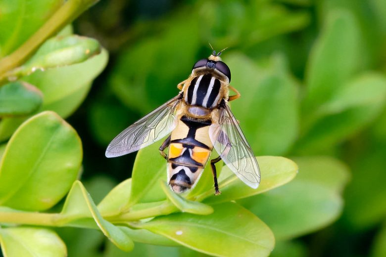
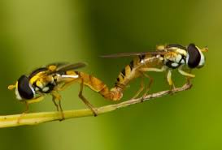
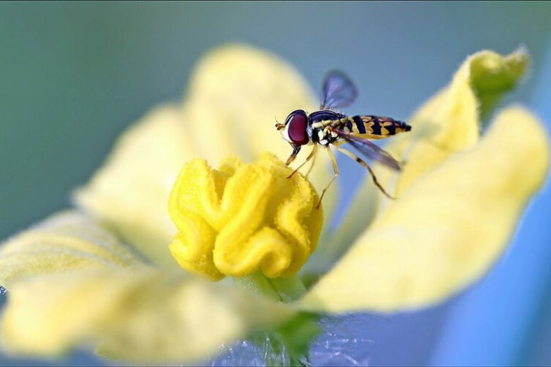
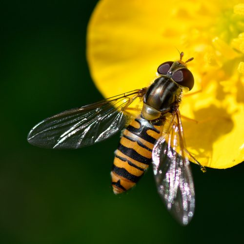
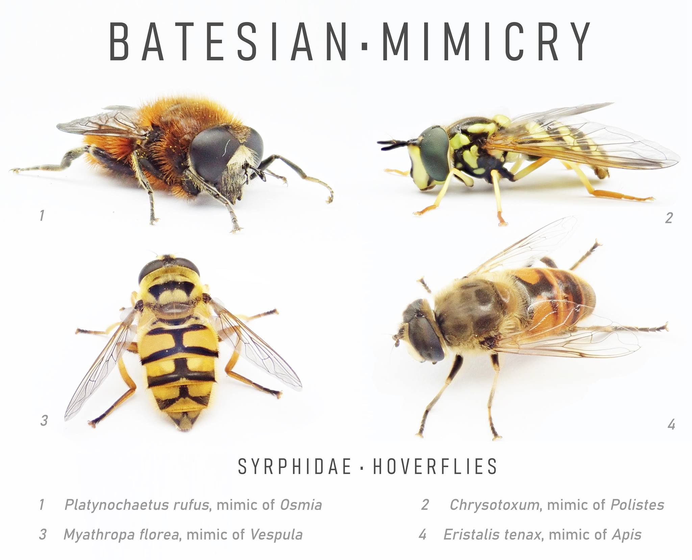

<!--More-->

## Introduction

Hoverflies, also known as syrphid flies, belong to the family *Syrphidae*. These insects are renowned for their mimicry of bees and wasps, a trait that provides them protection from predators. Hoverflies play essential roles in ecosystems, particularly in pollination and biological control of pests. 

  

    
    
Hoverfly

  

One notable species, *Episyrphus balteatus*, is widespread in Europe and North America and is easily recognizable by its black and yellow banded abdomen. This species, like many other hoverflies, is a frequent visitor to gardens and agricultural areas, where it contributes significantly to the pollination of various plants. Beyond their ecological roles, hoverflies are fascinating due to their complex behaviors and life cycles.

The biology of hoverflies includes impressive adaptations for flight and feeding. They are capable of hovering in place, thanks to rapid wing beats and exceptional maneuverability. This ability not only aids in feeding on nectar and pollen but also allows them to evade predators efficiently. Understanding the life cycle, feeding habits, and ecological roles of hoverflies sheds light on their importance in both natural and human-modified environments.

Hoverflies are present in diverse habitats, from woodlands and grasslands to urban gardens. Their adaptability has enabled them to thrive in various conditions and exploit a wide range of food sources. Studying these insects helps us appreciate their contributions to biodiversity and ecosystem stability.

## Life Cycle

  

    
    
Hoverflies mating

  

The life cycle of hoverflies consists of four stages: egg, larva, pupa, and adult. Each stage is crucial for the development and survival of the species.

Eggs: Female hoverflies lay their eggs on or near aphid colonies, which serve as the primary food source for the larvae. The eggs are usually white or yellowish and hatch within a few days.

Larvae: Hoverfly larvae, also known as maggots, are legless and have a tapered body. They are voracious predators of aphids and other soft-bodied insects. The larval stage can last from a few weeks to a couple of months, depending on the species and environmental conditions.

Pupae: After reaching a certain size, the larvae pupate in a protective casing, often attached to plant stems or leaves. The pupal stage is a period of metamorphosis, where the larva transforms into an adult. This stage can last from a few days to several weeks.

Adults: Adult hoverflies emerge from the pupae with fully developed wings and reproductive organs. They are strong fliers and are often seen hovering around flowers. Adult hoverflies primarily feed on nectar and pollen, which provide the energy required for flight and reproduction. The lifespan of an adult hoverfly ranges from a few days to several weeks.

## Feeding Habits and Ecological Roles 

  

    
    
Hoverfly pollinating a flower

  

Hoverflies are primarily known for their role in pollination. As adults, they feed on nectar and pollen from a wide variety of flowering plants. Their feeding activity not only sustains them but also facilitates the transfer of pollen, contributing to the reproductive success of plants.

Hoverfly larvae, on the other hand, are important biological control agents. Many species of hoverfly larvae are predatory, feeding on aphids, thrips, and other plant pests. This predation helps regulate pest populations, reducing the need for chemical pesticides in agriculture and horticulture.

Hoverflies are crucial for maintaining ecological balance. As pollinators, they support the reproduction of many flowering plants, which in turn sustain a variety of other organisms. Their role in biological control helps manage pest populations, contributing to the health of ecosystems and agricultural systems.

By serving as both pollinators and predators, hoverflies enhance biodiversity and ecological stability. They are integral to food webs, providing resources for other species and influencing plant community dynamics. Studying hoverflies offers insights into ecosystem health and the complex interactions that sustain life.

The dual role of hoverflies in pollination and pest control underscores their ecological importance. By promoting healthy plant growth and reducing pest populations, hoverflies support biodiversity and ecosystem resilience. Their presence in gardens and agricultural fields is a sign of a healthy, balanced environment.

## Masters of Batesian Mimicry

Hoverflies are well-known for their impressive mimicry, which is a key survival strategy. Mimicry in hoverflies primarily involves Batesian mimicry, where harmless species imitate the warning signals of harmful or unpalatable species to avoid predation. This form of mimicry is named after the naturalist Henry Walter Bates, who first described it in the 19th century.

In Batesian mimicry, a harmless organism, the mimic, evolves to resemble a harmful or noxious organism, the model. Predators, having learned or instinctively avoiding the harmful model, are deceived into steering clear of the mimic as well. This evolutionary strategy benefits the mimic by reducing its chances of being preyed upon, despite being harmless and often defenseless.

Many hoverfly species exhibit Batesian mimicry by closely resembling bees or wasps. This resemblance includes not only their coloration but also their behavior and flight patterns. For example, the common hoverfly species *Episyrphus balteatus* has a black and yellow striped abdomen that mimics the warning coloration of bees and wasps.

  

    
    
Episyrphus balteatus

  

Hoverflies often exhibit bright yellow and black stripes on their abdomens, which mimic the aposematic (warning) coloration of bees and wasps. This coloration serves as a signal of potential danger to predators, despite hoverflies being incapable of stinging. Additionally, some hoverflies have body shapes that closely resemble bees or wasps, including a segmented abdomen and the illusion of a narrow "waist," which is characteristic of many stinging insects. When at rest, some hoverflies hold their wings in a manner that mimics the folded wing position of wasps, enhancing their deceptive appearance.

Hoverflies are capable of hovering in place, a trait that significantly enhances their resemblance to bees and wasps. This ability allows them to feed on nectar from flowers without being easily detected by predators. They may also exhibit behaviors such as rapid darting movements and hovering near flowers, similar to the foraging behavior of bees and wasps. These behaviors further reinforce their mimicry, making it more convincing to potential predators.

The mimicry exhibited by hoverflies provides them with several survival advantages. Predators such as birds and small mammals often avoid attacking hoverflies due to their resemblance to stinging insects, reducing the likelihood of predation. By mimicking bees and wasps, hoverflies can feed on flowers with less interference from predators, allowing them to spend more time foraging and less time evading threats. This mimicry has contributed to the evolutionary success of hoverflies, enabling them to thrive in various environments and maintain their ecological roles as pollinators and pest controllers.

The effectiveness of Batesian mimicry in hoverflies depends on several factors. The presence of a sufficient number of the harmful model species (bees and wasps) in the environment ensures that predators learn to associate the warning coloration with danger. Predators must have the capacity to learn and remember the association between the warning signals and the harmful consequences of attacking the model species. Additionally, the effectiveness of mimicry can vary depending on the specific ecological context, including the presence of other mimics and the density of the model species.

The mimicry exhibited by hoverflies has broader ecological implications. The presence of mimics can influence predator behavior and predator-prey dynamics, potentially affecting the populations of both the mimics and their models. By deterring predators, mimicry allows hoverflies to spend more time foraging and pollinating, which can influence plant reproductive success and ecosystem health. The ongoing evolutionary arms race between mimics, models, and predators drives the continual adaptation and refinement of mimicry strategies, highlighting the dynamic nature of ecological interactions.

## Flight Agility and Camouflage

Hoverflies employ several defensive mechanisms to avoid predation, with flight agility and camouflage being among the most effective. Hoverflies are capable of rapid, agile flight, which allows them to hover in place, quickly change direction, and even fly backwards. This exceptional flight agility makes them difficult targets for predators, enhancing their chances of survival. Additionally, some hoverfly larvae exhibit cryptic coloration, blending seamlessly into their surroundings to avoid detection. This form of camouflage is particularly advantageous during the vulnerable larval stage, providing an additional layer of protection against potential threats. Together, these defensive mechanisms contribute to the hoverflies' ability to evade predators and thrive in their environments.

## Take Away

Hoverflies are remarkable insects with significant ecological roles. Their contributions to pollination and pest control highlight their importance in both natural and human-modified environments. Understanding their life cycle, behaviors, and ecological interactions enhances our appreciation of these valuable insects. By fostering environments that support hoverflies, we can promote biodiversity and ecosystem resilience.


 All of the insects below are not bees nor wasps, but in fact hoverflies! They truly are masters of disguise. 


  

    
  

