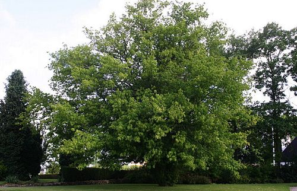
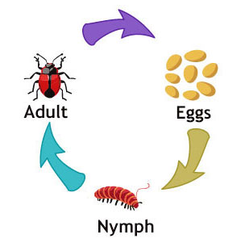
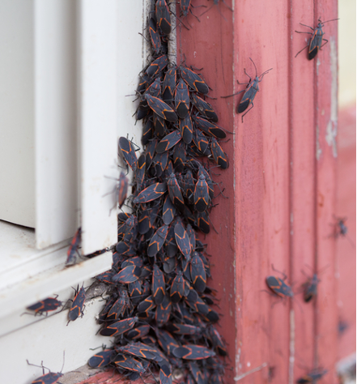
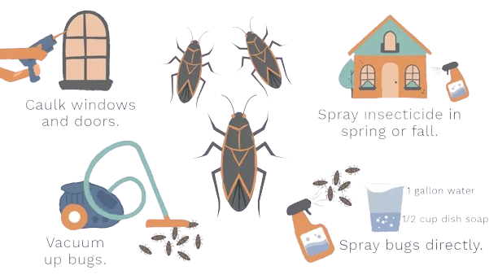
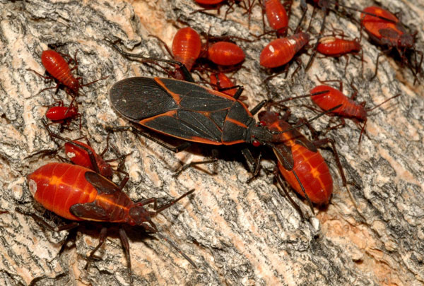

<!--More-->

## Introduction

Boxelder bugs (*Boisea trivittata*) are fascinating insects belonging to the order Hemiptera, commonly known as "true bugs." Their distinctive appearance, marked by vibrant red wing veins, dark coloration, and striking dark red eyes, makes them easily recognizable. These bugs are native to North America and are often found in abundance, particularly in regions where boxelder trees (*Acer negundo*) thrive, hence their name.

In addition to their striking appearance, boxelder bugs are relatively harmless to humans. While they may occasionally enter homes in large numbers seeking shelter, they do not cause significant damage or pose a threat to human health. However, their presence can be a nuisance, especially when they congregate in large numbers on exterior walls or seek refuge indoors during colder months.

During warmer months, boxelder bugs primarily feed on the seeds, leaves, and sap of boxelder trees, although they may also feed on other plants within the Acer genus, as well as some fruit trees. Their diet makes them important contributors to ecosystem dynamics, as they help regulate plant populations and serve as a food source for various predators.

  

    
    
Acer negundo, the Boxelder tree, by <a href="https://calscape.org/Acer-negundo-%28Box-Elder%29">Calscape</a>

  

One interesting aspect of boxelder bug behavior is their tendency to aggregate in large groups, especially during the fall when they prepare to overwinter. These aggregations, known as "congregations," can consist of hundreds or even thousands of individuals gathering on tree trunks, rocks, or buildings.

While boxelder bugs do not bite or sting, they possess scent glands that can produce a pungent odor when disturbed or crushed. This defense mechanism serves to deter potential predators, such as birds or lizards, from preying on them.

Despite their harmless nature, boxelder bugs are sometimes considered pests, particularly in agricultural settings where they may cause minor damage to crops or become a nuisance to homeowners. However, their ecological role as seed feeders and their limited impact on human activities underscore the importance of understanding and coexisting with these fascinating insects.

## Life Cycle

The life cycle of boxelder bugs is intriguing and follows a typical pattern for many true bugs within the Hemiptera order. Understanding their life cycle sheds light on their behavior and population dynamics.

**Egg Stage:** The life cycle of boxelder bugs typically begins in spring when adult females deposit clusters of tiny, reddish-brown eggs on the bark of host trees, particularly boxelder trees. These eggs are usually laid in crevices or on the undersides of leaves. Each cluster may contain dozens of eggs.

**Nymph Stage:** After a period of incubation, which can last anywhere from one to two weeks depending on environmental conditions, the eggs hatch into nymphs. The newly emerged nymphs are small, wingless, and often bright red in color. As they grow, they molt several times, shedding their exoskeleton to accommodate their increasing size. During this stage, the nymphs feed voraciously on the tender leaves, seeds, and sap of boxelder trees.

  

    
    
Boxelder bug life cycle

  

**Adult Stage:** After undergoing several molts over the course of several weeks, the nymphs eventually reach adulthood. Adult boxelder bugs are larger than nymphs and possess fully developed wings, allowing them to fly. They also exhibit the characteristic red wing veins, dark coloration, and red eyes. Adult boxelder bugs primarily feed on seeds, leaves, and sap, continuing the cycle of feeding and reproduction.

**Reproductive Stage:** During the warmer months, adult boxelder bugs mate, and females begin laying eggs, starting the cycle anew. The timing of egg-laying and the development of nymphs can vary depending on environmental factors such as temperature and food availability.

**Overwintering:** As temperatures drop in the fall, boxelder bugs enter a period of dormancy known as overwintering. They seek shelter in protected locations, often congregating in large numbers on the sunny sides of buildings, beneath bark, or within cracks and crevices. During this time, their activity decreases significantly, and they may remain dormant until warmer temperatures return in the spring.


Boxelder bugs that choose to overwinter in a home may become a nuisance. I had personal experience with this and would find 5-10 of them crawling around my old apartment everyday. 


Understanding the life cycle of boxelder bugs is essential for managing their populations and minimizing their impact, particularly when they become a nuisance to homeowners or agricultural areas. By understanding their behavior at each stage of development, individuals can employ effective strategies for control or prevention while also appreciating the ecological role these insects play in their native habitats.

## Behavior

Boxelder bugs exhibit several fascinating behaviors. From their aggregative tendencies to unique defense mechanisms, their behaviors offer insights into their ecology and adaptation strategies:

**Aggregation:** One of the most notable behaviors of boxelder bugs is their propensity to aggregate in large groups, especially during the fall. These aggregations, often referred to as "congregations," can consist of hundreds or even thousands of individuals gathering on surfaces such as tree trunks, rocks, or buildings. Aggregation serves multiple purposes, including thermoregulation, protection from predators, and facilitating mating opportunities. By clustering together, boxelder bugs can collectively generate and retain heat, which is crucial for surviving cooler temperatures during the fall and winter months.

  

    
    
A group of boxelder bugs aggregating by a building.

  

**Overwintering:** As temperatures drop in the late fall, boxelder bugs enter a state of dormancy known as overwintering. They seek out protected locations, such as cracks in rocks, beneath tree bark, or within buildings, to hibernate until warmer weather returns. Overwintering sites are often selected based on factors like sun exposure and proximity to potential food sources. This behavior allows boxelder bugs to survive harsh environmental conditions and emerge when conditions are more favorable for activity and reproduction.

**Defensive Secretions:** When threatened or disturbed, boxelder bugs employ a unique defense mechanism involving the release of pungent defensive secretions. These secretions, produced by specialized scent glands located on their thorax, emit a strong odor that can deter potential predators, such as birds or mammals. The odor serves as a warning signal, alerting predators to the presence of chemical defenses and discouraging further predation attempts. This defensive strategy helps boxelder bugs avoid predation and enhances their chances of survival in their natural environment.

**Feeding Behavior:** Boxelder bugs primarily feed on the seeds, leaves, and sap of boxelder trees, although they may also consume other plant species within the Acer genus. Their feeding behavior can have ecological implications, as they contribute to seed dispersal and nutrient cycling within their native habitats. While boxelder bugs are generally considered nuisance pests when they enter homes in search of shelter, they play a beneficial role in natural ecosystems by facilitating plant reproduction and nutrient recycling processes.

## Boxelder Bugs as Pests

While boxelder bugs (Boisea trivittata) play important ecological roles in their native habitats, they can also become nuisance pests under certain circumstances, particularly when they invade human dwellings in search of shelter. Here are some key points about boxelder bugs as pests:

**Home Invasion:** In the fall, as temperatures drop, boxelder bugs often seek refuge in warm, sheltered locations to overwinter. Homes and other structures provide ideal hiding spots, especially those with sunny exposures. Boxelder bugs can enter buildings through small cracks, gaps in windows or doors, and other openings. Once inside, they may congregate in large numbers in attics, wall voids, and other secluded areas.

**Nuisance Factor:** While boxelder bugs do not pose direct health risks to humans and do not cause structural damage to homes, their presence can be a significant nuisance. Large aggregations of boxelder bugs indoors can create unpleasant odors due to their defensive secretions. Additionally, their constant presence can be visually unappealing and may cause psychological distress for some individuals.

**Staining and Damage:** Although boxelder bugs do not feed on building materials or household items, they can inadvertently cause damage and staining. When crushed or disturbed, they may leave behind reddish-brown stains on fabrics, walls, and other surfaces. Additionally, their fecal matter may accumulate in areas where they congregate, leading to unsightly stains and cleanup challenges.

  

    
    
How to manage boxelder bug invasions

  

**Management Challenges:** Managing boxelder bug infestations can be challenging due to their sheer numbers and their ability to quickly exploit entry points into buildings. While sealing cracks and gaps can help prevent their entry, it may not be entirely effective, especially in older or poorly sealed structures. Chemical insecticides can be used to control boxelder bugs, but their efficacy may be limited, and repeated applications may be necessary.

**Impact on Agriculture:** In agricultural settings, boxelder bugs can occasionally cause minor damage to crops, particularly fruit trees. While they are not major agricultural pests, their feeding activities can lead to cosmetic damage to fruit, reducing its market value. However, significant economic losses due to boxelder bugs are relatively rare compared to other agricultural pests.

## Take Away

While boxelder bugs are fascinating insects with important ecological roles, they can also become troublesome pests under certain circumstances. Their propensity to aggregate in large numbers and seek shelter in human dwellings during the fall can result in nuisance infestations. However, understanding their behavior, life cycle, and management strategies can help individuals coexist with these insects more harmoniously. By implementing preventive measures, such as sealing entry points and maintaining clean surroundings, and utilizing targeted control methods when necessary, homeowners can mitigate the impact of boxelder bugs while appreciating their ecological significance in the broader ecosystem. Ultimately, fostering a balanced approach to managing boxelder bugs can lead to healthier environments for both humans and these intriguing insects.

  

    
  

