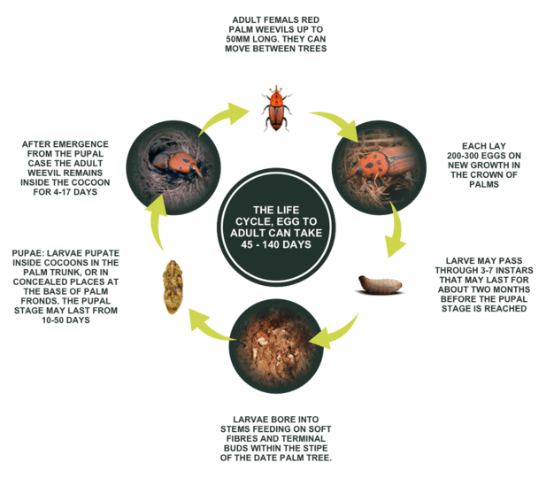
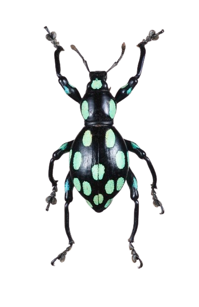
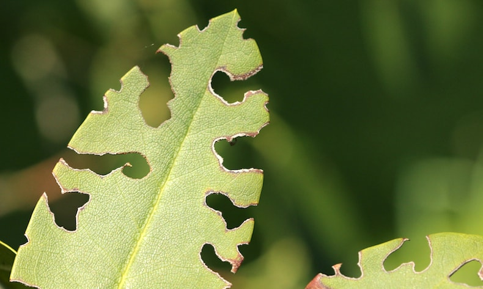
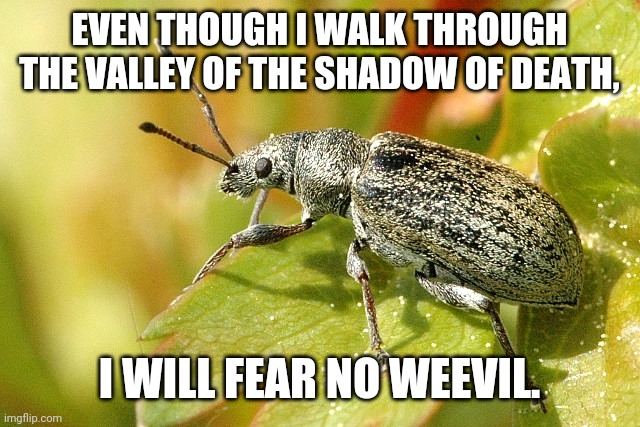

[It's Weevil Time!](https://www.reddit.com/r/weeviltime/)

<!--More-->

## Introduction

Weevils are beetles (Order *Coleoptera*) belonging to the superfamily *Curculionoidea* which are characterized by their lengthy snouts. Their feet bear an uncanny resemblence to a boot and it almost appears as though weevils are wearing little boots, as seen below on *Chrysolopus spectabilis*, the sapphire weevil that can be found in Australia. In my opinion, weevils are one of the most pretty beetles. Their striking colours, unique snout and "boots" make them look very friendly and approachable, if an insect could be described that way!

  

    
    
Chrysolopus spectabilis by <a href="https://www.flickr.com/photos/ogcodes/">Michael Jefferies</a>

  

Weevils truly are fascinating creatures. Their distinct appearance sets them apart from other beetles, making them stand out in the insect world. But there's so much more to these tiny creatures than just their charming looks.

One of the most intriguing aspects of weevils is their incredible diversity. With over [70,000 species](https://www.gbif.org/species/4239) identified worldwide, they occupy a vast array of habitats, from lush rainforests to arid deserts. This adaptability has allowed them to thrive in almost every corner of the globe, showcasing their remarkable resilience and evolutionary success.

But what truly sets weevils apart is their unique feeding habits. Most species are herbivorous, with a particular fondness for plant seeds. Their elongated snouts, or rostrums, aren't just for show – they play a crucial role in the weevil's feeding process. Equipped with powerful mandibles at the tip, these snouts allow weevils to bore into seeds and fruits and extract the nutritious contents within.

But perhaps what's most impressive about weevils is their economic significance. While some species are beneficial as natural pest controllers or pollinators, others can be devastating agricultural pests, causing significant damage to crops and stored grains. The notorious boll weevil, for example, has wreaked havoc on cotton crops in the southern United States for centuries, leading to [extensive control efforts](https://web.archive.org/web/20070204143907/http://www.aphis.usda.gov/publications/plant_health/content/printable_version/fsbollweevil.pdf) and economic losses.

Despite their mixed reputation, there's no denying the importance of weevils in the natural world. From their unique adaptations to their ecological roles, these beetles continue to captivate the curiosity of entomologists and nature enthusiasts alike. So the next time you come across a weevil, take a moment to appreciate the beauty and complexity of this often-overlooked insect – after all, it's weevil time!

## Life Cycle

  

    
    
Red palm weevil life cycle

  

The life cycle of weevils, like many beetles, typically consists of four stages: egg, larva, pupa, and adult. Shown to the left is an example life cycle of a weevil. The specific life cycle will vary from species-to-species.

The life cycle of a weevil begins when a female lays her eggs. Weevil eggs are typically small, oval-shaped, and may be deposited directly onto a host plant or in nearby soil or crevices. The number of eggs laid varies among species and environmental conditions.

Once the eggs hatch, the larvae emerge. Weevil larvae are legless and often grub-like in appearance, with a cylindrical body and a well-developed head capsule. They feed voraciously on plant material, such as seeds, grains, or roots, depending on the species. Larvae go through several instars, or developmental stages, before reaching maturity.

After completing their larval development, weevil larvae typically pupate. During this stage, the larva undergoes metamorphosis inside a cocoon or pupal chamber, transforming into an adult beetle. Pupation may occur within the soil, plant debris, or other protected environments.

Once metamorphosis is complete, the adult weevil emerges from the pupal stage. Adult weevils have a distinct appearance characterized by their elongated snouts and hardened forewings that cover the abdomen. They are capable of flight and often disperse in search of food, mates, or suitable oviposition sites. Adult weevils primarily feed on plant material, with some species exhibiting specialized feeding behaviors such as leaf mining or seed predation.

The duration of each life stage can vary widely depending on factors such as temperature, humidity, and food availability. In general, weevils undergo complete metamorphosis, transitioning through distinct developmental phases as they progress from egg to adult. This life cycle adaptation allows weevils to exploit a wide range of ecological niches and adapt to diverse environments.

## Exploring the Intriguing Behaviors of Weevils

Weevils, with their distinctive elongated snouts and diverse lifestyles, showcase a plethora of intriguing behaviors that captivate the curiosity of scientists and enthusiasts alike. From specialized feeding habits to unique reproductive strategies, these tiny beetles never cease to amaze with their remarkable adaptations.

1. Feeding and Foraging Strategies:

Weevils are renowned for their diverse feeding habits, which can vary widely among species. While many weevils are herbivorous and feed on plant material, others have evolved more specialized diets. Some weevils exhibit remarkable host specificity, targeting particular plant species or even specific plant tissues. For example, certain weevil species are known to feed exclusively on the seeds of particular plant species, displaying adaptations such as elongated rostrums for accessing seeds within seedpods or fruits. The Boll weevil, for example, feeds on cotton buds and flowers. Others are leaf miners, tunneling within plant foliage and feeding on the internal tissues.

2. Defensive Mechanisms:

  

    
    
Pachyrhynchus weevil with a strong exoskeleton by Lawrence Lawry

  

In the face of predation pressure, weevils have evolved various defensive mechanisms to deter or escape from potential predators. Some species possess chemical defenses, secreting noxious compounds or defensive fluids when threatened. These chemical defenses can serve as a deterrent to predators or parasites, effectively protecting weevils from harm. Additionally, weevils may exhibit cryptic coloration or mimicry, blending in with their surroundings or resembling unpalatable species to avoid detection by predators. Moreover, some weevils such as those in the genus *Pachyrhynchus* posess a strong, armour-like exoskeleton to help protect themselves from lizard predators. 

3. Mating and Reproduction:

Weevil mating behaviors can be highly intricate and species-specific, often involving elaborate courtship rituals and communication signals. Male weevils may engage in territorial displays or compete with rival males for access to mates. Once mating occurs, females often exhibit careful oviposition strategies, selecting suitable host plants or substrates for depositing their eggs. Some weevil species display fascinating parental care behaviors, with females guarding or provisioning their offspring to enhance their survival chances.

4. Navigational Abilities:

Despite their small size, weevils are capable navigators, adept at locating suitable food sources, mates, and oviposition sites within their environment. Research has shown that weevils possess sophisticated sensory mechanisms, including chemoreception and tactile sensitivity, which they use to perceive and respond to environmental cues. These abilities allow weevils to navigate complex landscapes, locate potential hosts or mates, and optimize their reproductive success.

5. Social Interactions:

While often viewed as solitary insects, some weevil species exhibit intriguing social behaviors, forming aggregations or colonies under certain conditions. These aggregations may serve various functions, such as providing protection from predators, enhancing mating opportunities, or facilitating resource sharing. Studying the dynamics of social interactions in weevil populations can offer insights into the evolution of cooperation and group living in insects.

## Weevils as Pests

Weevils, while fascinating in their diversity and ecological roles, can also pose significant challenges as pests in various agricultural and storage settings. These small beetles can cause extensive damage to crops, stored grains, and other plant materials. 

One of the primary concerns with weevils is their ability to damage crops during both the larval and adult stages of their life cycle. Weevil larvae often feed on plant roots, stems, or seeds, leading to stunted growth, reduced yields, and even crop failure in severe infestations. Adult weevils may also feed on foliage, causing defoliation and further compromising plant health.

  

    
    
Irregular notches, indicative of vine beetle damage

  

Weevils are notorious for infesting stored grains, such as rice, wheat, maize, and barley, among others. These pests can enter storage facilities during harvest or transport and quickly multiply under favorable conditions. Once inside grain bins or silos, weevil larvae can tunnel into grains, reducing their quality and market value. Adult weevils can also contaminate stored grains with feces and secretions, making them unsuitable for consumption or processing.

Certain species of weevils, such as the powderpost beetle (family Bostrichidae), can also infest structural wood, furniture, and wooden artifacts. These wood-boring weevils can cause significant damage over time by tunneling into timber, weakening its structural integrity, and leading to costly repairs or replacements.

Controlling weevil infestations can be challenging due to several factors. Weevils are prolific breeders, with females capable of laying hundreds to thousands of eggs during their lifetime. Additionally, their small size and cryptic behavior can make detection and monitoring difficult, allowing infestations to go unnoticed until significant damage has occurred. Moreover, weevils may develop resistance to chemical pesticides over time, necessitating integrated pest management strategies that combine cultural, mechanical, and biological control methods.

## Take Away

Weevils are remarkable creatures that exhibit a wide range of behaviors, from their specialized feeding habits to their intricate reproductive strategies and impressive navigational abilities. Despite their small size, weevils play significant ecological roles and have adapted to thrive in diverse environments worldwide. However, their status as pests in agriculture, storage, and structural settings highlights the challenges they pose to human activities and resource management. Effective pest management strategies are essential for mitigating the economic losses and environmental impacts associated with weevil infestations while preserving the vital ecological functions performed by these intriguing insects. By understanding the complexities of weevil behavior and ecology, we can better appreciate their place in the natural world and work towards harmonious coexistence with these often misunderstood organisms.

  

    
  

