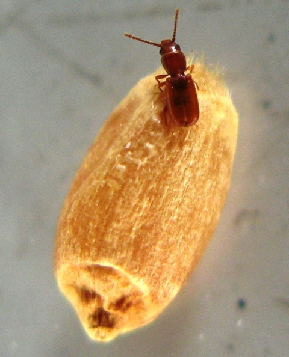
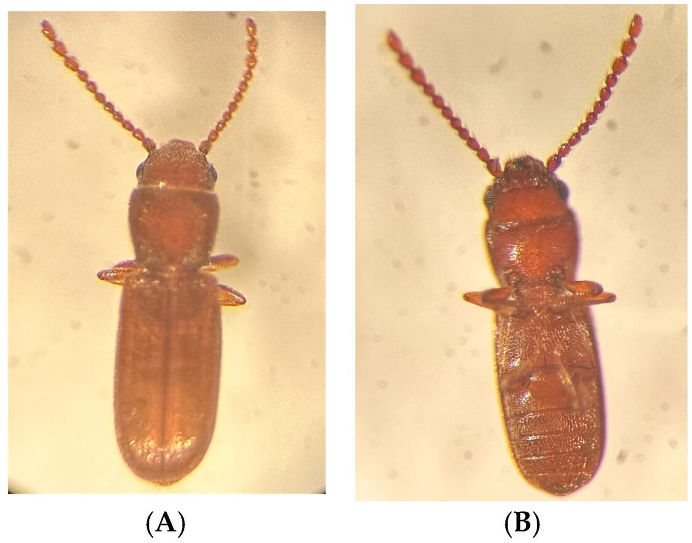

<!--More-->

## Introduction

  

    
    
Rusty grain beetle on a wheat kernel

  

The rusty grain beetle, *Cryptolestes ferrugineus* (Order *Coleoptera*, Family *Laemophloeidae*), is the main pest of stored grain, dry plants, and dry plant products in the Canadian Praries. While native to Europe, its distribution is largely cosmopolitan. This beetle thrives in warm, humid environments, and grain storage facilities with elevated moisture levels provide ideal habitats for its growth and reproduction. Infestations can result in significant economic losses, as the beetles feed on the germ layer of grain kernels, diminishing the grain's nutritional value and lowering its germination potential. Moreover, in large infestations, the beetles can heat the grain, causing it to spoil. The presence of the beetle can also encourage molds such as *Fusarium* and *Aspergillus* (which are both linked to various types of cancer) growth, further accelerating spoilage ([Frazer, 2004](https://www-jstor-org.berlioz.brandonu.ca/stable/pdf/3435637.pdf?refreqid=fastly-default%3Ae369bee837d3465d776c7ad189dd460b&ab_segments=0%2Fbasic_search_gsv2%2Fcontrol&initiator=&acceptTC=1)).

Experts at Purdue University's Agricultural Department estimates that stored grain pest infestations result in the loss of 5-10% of the world's food production annually, wih some countries experiencing up to a 50% loss depending on the severity of the infestation. With sky-rocketing food prices, every percentage point of loss makes a difference.

These pests can be found in grain elevators, flour mills and in farm-stored grain.

## Identification

  

    
    
Dorsal (A) and ventral (B) view of the rusty grain beetle.

  

The rusty grain beetle is rectangular and reddish brown. They are small, less than 2 milimetres long with long, bead-like antennae (when magnified), which are about half the length of their body. Many stored grain insect pests can be confused with the rusty grain beetle. Thus, identification of the insect is important in order to determine the best method for deinfestation. For example, the foreign grain beetle (*Ahasverus advena*), has a rounded abdomen and clubbed antennae, while the rusty grain beetle has a square abdomen and non-clubbed, beaded antennae. Misidentification can lead to ineffective treatments, making it essential for pest management professionals to be able to differentiate between these species through careful examination. It may also be confused with the flour mill beetle, 

## Life Cycle

Each female rusty grain beetle is capable of laying 200-500 eggs, depositing them on or among grain kernels or in crevices. Upon hatching, larvae seek out food, preferring to feed on the germs of kernels. The high reproductive rate and rapid development cycle of the rusty grain beetle enable populations to increase swiftly under favorable conditions. Under optimal temperatures and humidity levels, a complete generation can develop in as little as 21 days. This rapid population growth makes infestations particularly challenging to control in stored grain facilities, emphasizing the need for regular monitoring and effective pest management strategies.

  

    
    
Life stages of the rusty grain beetle (larvae, pupae, adult)

  

## Strength

One of the most astonishing characteristics of the Goliath beetle is its immense strength. These beetles are capable of lifting objects that weigh up to 850 times their own body weight. For perspective, this is akin to a human lifting 65 tons! This incredible strength is attributed to their powerful legs and exoskeleton, which provide the leverage they need to grip and manipulate their environment.

Their ability to withstand harsh environmental conditions is another key to their success. Goliath beetles have adapted to thrive in the warm, humid environments of tropical Africa, but they can tolerate a wide range of temperatures and conditions. This adaptability makes them resilient in the face of environmental changes, though they are still vulnerable to habitat destruction.

  

    
    
Goliathus goliatus with spread wings

  

## Ecological Significance

Goliath beetles play an essential role in the ecosystems of tropical Africa. As larvae, they are decomposers, breaking down dead plant material and returning nutrients to the soil. This activity supports the health of the forest by promoting nutrient cycling and helping maintain the balance of the ecosystem.

In addition, adult Goliath beetles serve as a food source for a variety of predators, including birds, small mammals, and reptiles. Their presence in the food web helps sustain the biodiversity of their habitat, making them an integral part of their ecosystem.

## Conservation Status

Although Goliath beetles are not currently classified as endangered, they face significant threats from deforestation and habitat loss. The tropical forests of Africa, where these beetles are found, are under increasing pressure from logging, agriculture, and human development. As their habitats shrink, the populations of Goliath beetles could decline, affecting the health of the ecosystems they help support.

Conservation efforts aimed at preserving tropical forests are critical to the survival of these beetles. By protecting their natural habitats, we can ensure that Goliath beetles, along with countless other species, continue to thrive.

## Fascination in Captivity

Goliath beetles have captured the imagination of people for centuries due to their size, strength, and striking appearance. They are popular in insect collections and museums, where they are often displayed as one of the largest insects in the world. In some regions, they are even kept as pets, though their size and dietary needs make them a challenging species to care for.

These beetles are also featured in scientific research, where their muscle strength and exoskeleton structure have inspired studies in biomechanics and robotics. Engineers have drawn inspiration from Goliath beetles to develop new materials and machines that mimic the strength and resilience of these insects.

## Take Away

The Goliath beetle is a symbol of nature's incredible diversity and strength. From its massive size and remarkable strength to its vital role as a decomposer in the ecosystem, this insect continues to amaze and inspire. Although their future is uncertain due to environmental threats, efforts to protect their habitats could help ensure that these giants of the insect world continue to thrive for generations to come.

