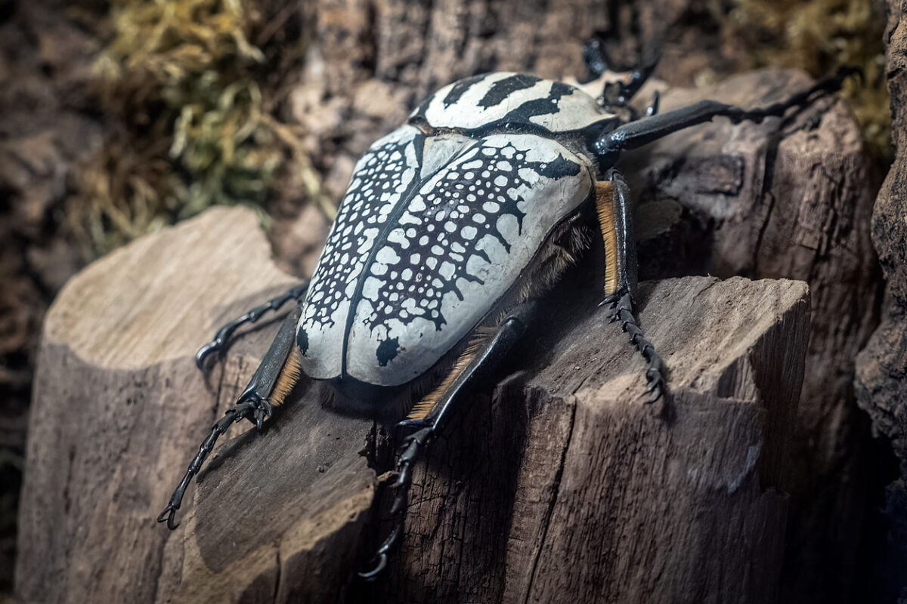
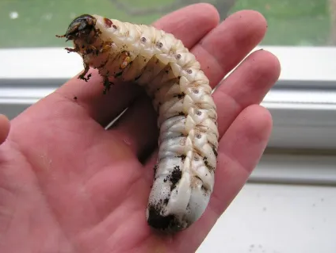
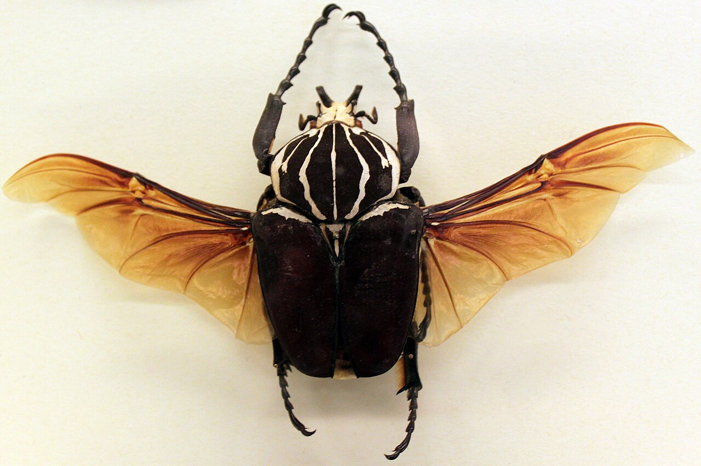

<!--More-->

## Introduction

The Goliath beetle, a member of the *Scarabaeidae* family, is one of the largest and heaviest insects in the world, named after the biblical giant for its impressive size and strength. Native to the tropical forests of West and Central Africa, these beetles are marvels of insect evolution, captivating scientists and insect enthusiasts alike for their massive size, powerful build, and essential role in their ecosystem. Let’s take an in-depth look at these incredible creatures.

  

    
    
Goliath Beetle

  

Goliath beetles are visually striking insects that come in a variety of colors, often with beautiful and intricate patterns. These color patterns are typically a mix of black, white, and brown, though some species exhibit more vibrant tones. The specific color and pattern variations depend on the species and can help individuals distinguish between the five primary species of the Goliathus genus:

1. *Goliathus goliatus*
2. *Goliathus regius*
3. *Goliathus cacicus*
4. *Goliathus orientalis*
5. *Goliathus albosignatus*

*Goliathus regius* , is predominantly black and white, with bold streaks across its hardened forewings (elytra), while the more commonn *Goliathus goliatus* often displays a more reddish-brown hue.

Adult Goliath beetles range from 6 to 11 centimeters (2.4 to 4.3 inches) in length, making them one of the largest insects by volume. Their weight is equally impressive, especially during the larval stage when they can weigh up to 100 grams (3.5 ounces). In adulthood, they typically weigh between 40 and 60 grams, which still makes them one of the heaviest flying insects.

Male Goliath beetles are particularly notable for the Y-shaped horn protruding from their head. This horn is primarily used in combat with other males, often during fights for access to mates or food resources. The males use their horns to flip their opponents over—a behavior known as ritualized combat—which helps them establish dominance without causing severe injury. Females, on the other hand, lack these horns and have a more rounded and robust appearance.

Despite their massive size, Goliath beetles are strong fliers. Their large hind wings, concealed beneath their hard elytra, allow them to travel between trees in search of food and mates. When in flight, the beetles are surprisingly agile, though their weight can make landing tricky. Their thoracic muscles are incredibly powerful, enabling them to lift their heavy bodies off the ground and fly in search of food sources.

## Life Cycle

  

    
    
Goliath beetle larvae

  

Goliath beetles undergo complete metamorphosis, moving through four distinct life stages: egg, larva, pupa, and adult. Their life cycle is typical of scarab beetles but is remarkable in its duration and the sheer size the beetles attain during their development.

**Egg Stage:** The female Goliath beetle lays her eggs in moist soil, often near rotting logs or areas rich in decaying plant material. The eggs are tiny relative to the adult beetle, but they hatch within several weeks into the larval stage.

**Larval Stage:** The larval stage is the longest and arguably the most important phase of the Goliath beetle’s life. During this stage, the larvae feed voraciously on decaying organic matter such as rotting wood and leaves. The larvae grow to extraordinary sizes, often reaching lengths of 15 centimeters (5.9 inches) and weighing as much as 100 grams. These larvae are considered among the heaviest insect larvae in the world.

To support their rapid growth, the larvae need an abundant supply of food, which they find in the forest’s nutrient-rich soil. As they grow, they molt several times, shedding their exoskeleton to accommodate their increasing size. This stage can last anywhere from several months to a year, depending on environmental conditions such as temperature and food availability.

**Pupal Stage:** Once the larva has reached its full size, it burrows into the ground to construct a protective chamber, where it will undergo pupation. The pupal stage lasts a few months, during which the beetle undergoes a complete transformation, emerging as a fully formed adult. This process, known as complete metamorphosis, is a critical time for the beetle as it transitions from a soft-bodied larva to a hard-shelled adult.

Adult Stage: As adults, Goliath beetles emerge from their pupal chamber, ready to search for mates and feed on sugary substances like tree sap and fruits. Their adult lifespan is relatively short, typically lasting a few months, during which they focus on reproduction.

## Feeding Habits

In their larval stage, Goliath beetles are detritivores, feeding primarily on decaying plant material. This diet plays a crucial role in their ecosystem, as the larvae help break down and recycle dead organic matter, enriching the soil and aiding in nutrient cycling.

Once they reach adulthood, Goliath beetles switch to a frugivorous diet, feeding on tree sap, nectar, and overripe fruits. The adult beetles are equipped with strong, sharp mandibles that allow them to pierce the skin of fruits and trees to access the sugary liquids inside. In captivity, they are often fed a diet of bananas and other fruits, which provides them with the nutrients and energy they need for flying and reproduction.

## Strength

One of the most astonishing characteristics of the Goliath beetle is its immense strength. These beetles are capable of lifting objects that weigh up to 850 times their own body weight. For perspective, this is akin to a human lifting 65 tons! This incredible strength is attributed to their powerful legs and exoskeleton, which provide the leverage they need to grip and manipulate their environment.

Their ability to withstand harsh environmental conditions is another key to their success. Goliath beetles have adapted to thrive in the warm, humid environments of tropical Africa, but they can tolerate a wide range of temperatures and conditions. This adaptability makes them resilient in the face of environmental changes, though they are still vulnerable to habitat destruction.

  

    
    
Goliathus goliatus with spread wings

  

## Ecological Significance

Goliath beetles play an essential role in the ecosystems of tropical Africa. As larvae, they are decomposers, breaking down dead plant material and returning nutrients to the soil. This activity supports the health of the forest by promoting nutrient cycling and helping maintain the balance of the ecosystem.

In addition, adult Goliath beetles serve as a food source for a variety of predators, including birds, small mammals, and reptiles. Their presence in the food web helps sustain the biodiversity of their habitat, making them an integral part of their ecosystem.

## Conservation Status

Although Goliath beetles are not currently classified as endangered, they face significant threats from deforestation and habitat loss. The tropical forests of Africa, where these beetles are found, are under increasing pressure from logging, agriculture, and human development. As their habitats shrink, the populations of Goliath beetles could decline, affecting the health of the ecosystems they help support.

Conservation efforts aimed at preserving tropical forests are critical to the survival of these beetles. By protecting their natural habitats, we can ensure that Goliath beetles, along with countless other species, continue to thrive.

## Fascination in Captivity

Goliath beetles have captured the imagination of people for centuries due to their size, strength, and striking appearance. They are popular in insect collections and museums, where they are often displayed as one of the largest insects in the world. In some regions, they are even kept as pets, though their size and dietary needs make them a challenging species to care for.

These beetles are also featured in scientific research, where their muscle strength and exoskeleton structure have inspired studies in biomechanics and robotics. Engineers have drawn inspiration from Goliath beetles to develop new materials and machines that mimic the strength and resilience of these insects.

## Take Away

The Goliath beetle is a symbol of nature's incredible diversity and strength. From its massive size and remarkable strength to its vital role as a decomposer in the ecosystem, this insect continues to amaze and inspire. Although their future is uncertain due to environmental threats, efforts to protect their habitats could help ensure that these giants of the insect world continue to thrive for generations to come.

