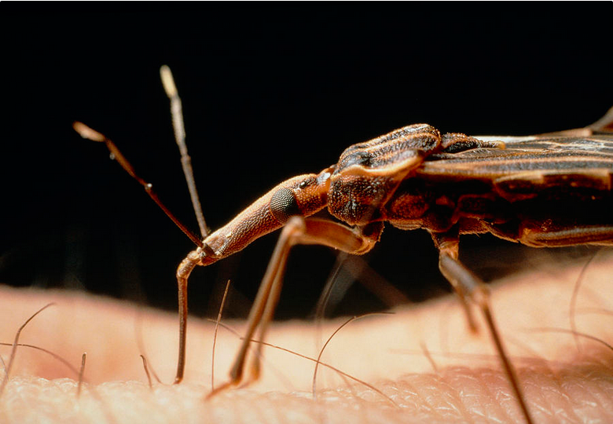
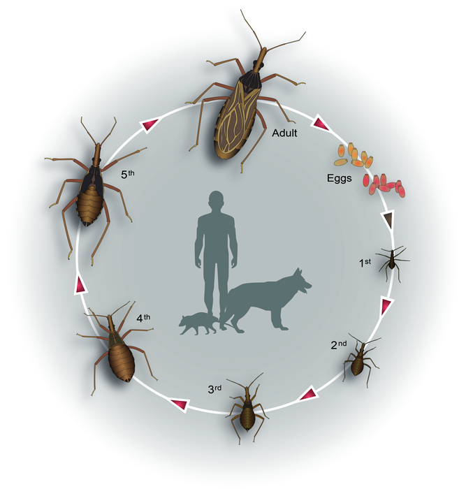
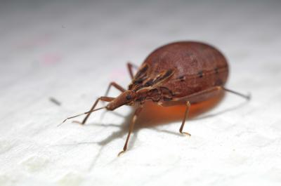
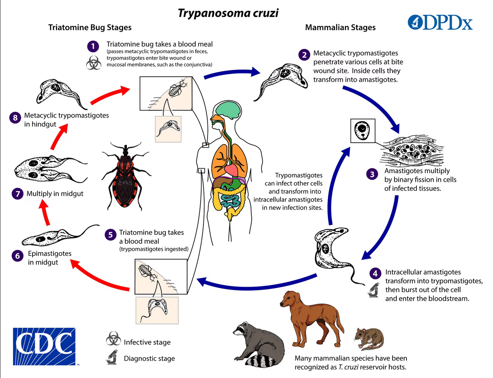
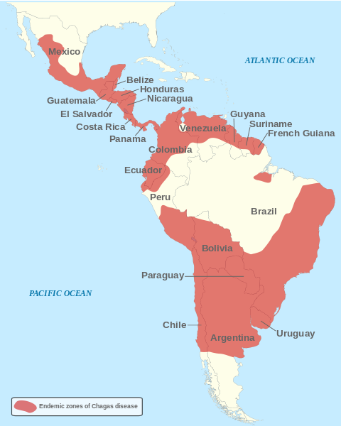

<!--More-->

## Introduction

Kissing bugs, or Triatominae, are a subfamily of assassin bugs (*Reduviidae*) known for their hematophagous feeding habits. These insects are notorious vectors of Chagas disease, a significant health concern in Latin America. Despite their less-than-pleasant common name, which stems from their tendency to bite around the mouth and face, kissing bugs have a fascinating biology and ecology.

The species *Rhodnius prolixus*, commonly found in Central and South America, is one of the primary vectors of Chagas disease. This species, along with others like *Triatoma infestans*, plays a crucial role in the epidemiology of the disease. However, there's much more to these insects than their role as disease vectors.

Kissing bugs are fascinating creatures with unique adaptations that make them effective at finding and feeding on their hosts. Their life cycle, feeding behaviors, and ecological roles offer a glimpse into the complex interactions between insects and their environments. Understanding the biology of kissing bugs not only provides insights into their role in disease transmission but also highlights their importance in the broader ecological context.

The distinct behavior and physiological traits of kissing bugs have evolved over millennia, allowing them to thrive in diverse habitats ranging from tropical rainforests to arid regions. These adaptations have enabled kissing bugs to exploit a wide range of vertebrate hosts, including humans, domestic animals, and wildlife. The ability to find hosts, often during the night, and the mechanisms they use to feed on blood while minimizing detection are testaments to their evolutionary success.

  

    
    
Rhodius prolixus by <a href="">Martin Dohrn</a>

  

The story of kissing bugs is also a tale of human impact. Changes in land use, urbanization, and the movement of people and animals have influenced the distribution and behavior of these insects. In some regions, efforts to control Chagas disease have included improving housing conditions and developing new strategies for managing kissing bug populations. These efforts highlight the dynamic relationship between humans and the natural world, as well as the ongoing challenge of balancing health concerns with ecological preservation.

Kissing bugs serve as a reminder of the interconnectedness of all living things and the importance of understanding even the most seemingly insignificant creatures. By studying their life cycles, feeding habits, and roles within ecosystems, scientists can gain valuable knowledge that informs public health strategies and conservation efforts. Kissing bugs, with their complex behaviors and significant impact on human health, underscore the need for continued research and education to mitigate their threats while appreciating their place in the natural world.

## Life Cycle

  

    
    
Kissing bug life cycle

  

The life cycle of kissing bugs consists of five nymphal stages before they reach adulthood, each stage requiring a blood meal to progress to the next. This hemimetabolous development contrasts with the complete metamorphosis seen in beetles like weevils.

**Eggs**: Female kissing bugs lay their eggs in dark, hidden places close to their food sources, such as cracks in walls or in animal burrows. The eggs are small, oval, and white when first laid, turning darker as they near hatching.

**Nymph**s: Upon hatching, the nymphs are small and lack wings. They go through five molts, each requiring a blood meal. During these stages, the nymphs gradually increase in size and develop more pronounced characteristics of adult kissing bugs.

**Adults**: After the fifth molt, the kissing bug becomes an adult. Adult kissing bugs are characterized by their flattened, oval bodies, and well-developed wings. They continue to feed on blood throughout their lifespan, which can last up to two years.

The ability to find and feed on a host is critical at each life stage, as without a blood meal, the nymphs cannot molt, and adults cannot reproduce.

 
 

## Feeding Habits and Disease 

Kissing bugs are nocturnal feeders, emerging at night to feed on the blood of sleeping hosts. Their preference for biting around the face gives them their common name. The bugs use heat and carbon dioxide sensors to locate their hosts, usually mammals, but sometimes birds or reptiles.

  

    
    
Blood-fed 5th instar Rhodnius prolixus

  

The feeding process involves piercing the skin with their proboscis and injecting saliva that contains anticoagulants and anesthetics, allowing them to feed without causing immediate discomfort to the host. However, the real danger lies in their feces. After feeding, kissing bugs defecate near the bite site, and if the host inadvertently rubs the feces into the wound or a mucous membrane such as their eyes, the parasite *Trypanosoma cruzi* can enter the bloodstream, leading to Chagas disease. This type of transmission is reffer to as **posterior-station transmission**. *Trypanosoma cruzi* parasites can then be transmitted back to kissing bugs, which can then transmit them back to humans. Moreover, the *Trypanosoma* parasites can also be transmitted to children via mother-to-child transmission. 

Chagas Disease itself is a severe infection with multiple phases. In the acute phase, which occurs shortly after infection, the patient can experience feder, fatigue, body aches, headache, rash, loss of appetite, diarrhea and vomiting. Perhaps the most recognizable sign of Chagas disease is swelling around the eyes and one side of the face, known as *Romana's Sign*, which occurs if the kissing bug's feces are accidentally rubbed into the eye. The acute phase can last for weeks or months, and the parasite can be detected in the bloodstream by laboratory tests. 

  

    
    
Chagas Disease CDC Fact Sheet

  

After the acute phase, the infection enters a prolonged asymptomatic period known as the chronic phase. This can last for years or even decades. Many individuals remain asymptomatic, but approximately 20-30% of infected individuals eventually develop severe and potentially life-threatening complications. Chronic Chagas disease can lead to cardiac complications, such as heart failure, arrhythmias, and sudden cardiac arrest, as well as digestive system problems like megaesophagus and megacolon, which cause difficulties in swallowing and severe constipation.

Treating Chagas disease, caused by the parasite *Trypanosoma cruzi*, involves a combination of antiparasitic medications and symptomatic management, especially in chronic cases. The effectiveness of treatment varies depending on the stage of the disease, the age of the patient, and other health factors. Below is an overview of the current approaches to treating Chagas disease, along with the challenges and ongoing research efforts to improve outcomes. Unfortunately, the treatment for Chagas disease can be just as bad as the disease itself. 

 

## Vector Control

Since kissing bugs often inhabit cracks and crevices in poorly constructed homes, improving housing conditions is a key preventive measure. Plastering walls, replacing thatched roofs with more durable materials, and installing insect screens can significantly reduce the presence of kissing bugs. Residual insecticides can be applied to walls and roofs to kill kissing bugs and prevent re-infestation. Community-wide spraying campaigns have been effective in many regions to control kissing bug populations.

Using bed nets and insect repellents can provide personal protection against kissing bugs, particularly in endemic areas. Educating communities about the risks of Chagas disease and the habits of kissing bugs is crucial for encouraging preventive behaviors and early detection of infestations. Since T. cruzi can be transmitted through blood transfusions and organ transplants, screening blood donors and organ donors in endemic areas is essential to prevent the spread of Chagas disease through medical procedures.

Domestic animals can serve as reservoirs for T. cruzi and can attract kissing bugs. Managing animal housing and using insecticides in these areas can help reduce the risk of transmission.

## Defensive Mechanisms and Behavior

Despite the ability of kissing bugs to transmit disease, kissing bugs have several natural predators and defensive behaviors:

**Chemical Defenses**: Some species can produce and release noxious chemicals from glands located in their thorax, deterring predators.

**Camouflage**: Their cryptic coloration helps them blend into their surroundings, making it difficult for predators to spot them.

**Behavioral Adaptations**: Kissing bugs are nocturnal, which helps them avoid many diurnal predators. They are also capable of flight, aiding in their dispersal and evasion from threats.

## Ecological Role

Kissing bugs play a crucial role in their ecosystems by helping regulate insect populations. As members of the *Reduviidae* family, they are predatory, feeding on other insects during their nymphal stages, which helps control pest populations that could otherwise disrupt the ecological balance. Additionally, as part of the food web, kissing bugs serve as prey for various predators, including birds, reptiles, and larger insects, contributing to nutrient cycling and energy flow within their habitats. This dual role as predator and prey underscores their importance in maintaining ecological stability and biodiversity.

The blood-feeding behavior of kissing bugs also influences the behavior and distribution of their vertebrate hosts. Animals that are bitten by kissing bugs might change their resting places or behaviors to avoid these pests, which can, in turn, affect the distribution of these animals and the plants they interact with. Furthermore, kissing bugs' role as vectors for *Trypanosoma cruzi*, the parasite causing Chagas disease, highlights a significant ecological interaction that impacts multiple species, including humans. These interactions drive evolutionary changes as hosts develop defenses against parasitism and kissing bugs evolve more effective feeding methods.

Overall, kissing bugs are integral components of their ecosystems, influencing both the populations of other species and broader environmental processes. By acting as both predators and prey, they maintain biodiversity and ecological integrity. Understanding their ecological roles provides insight into ecosystem health and highlights the interconnectedness of species.

## Take Away

Kissing bugs are complex insects with unique behaviors and adaptations that make them both fascinating and formidable pests. Understanding their life cycle, feeding habits, and ecological roles is crucial in managing their populations and mitigating the health risks they pose. While their association with Chagas disease gives them a fearsome reputation, studying these insects also offers insights into the intricate dynamics of parasite-host interactions and the broader ecosystem. By appreciating the complexities of kissing bugs, we can better address the challenges they present and recognize their place in the natural world.

  

    
  

