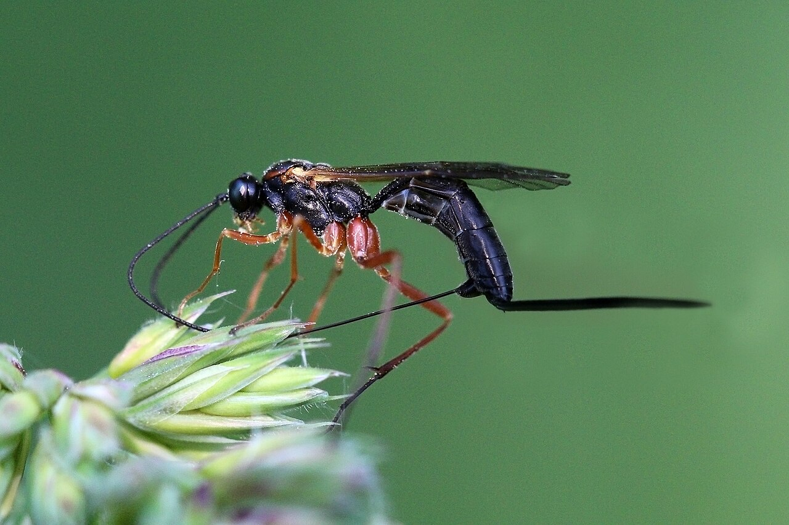
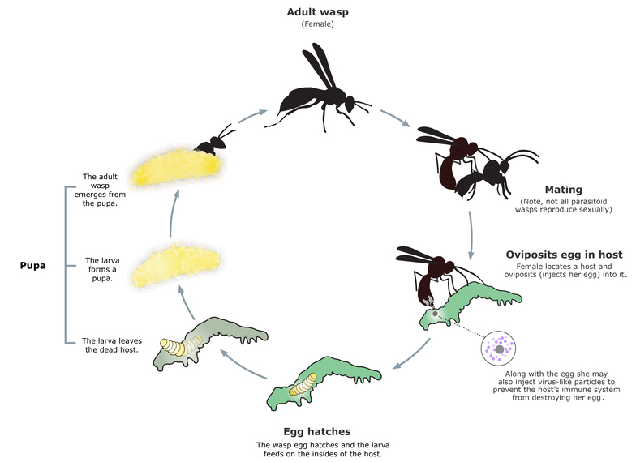
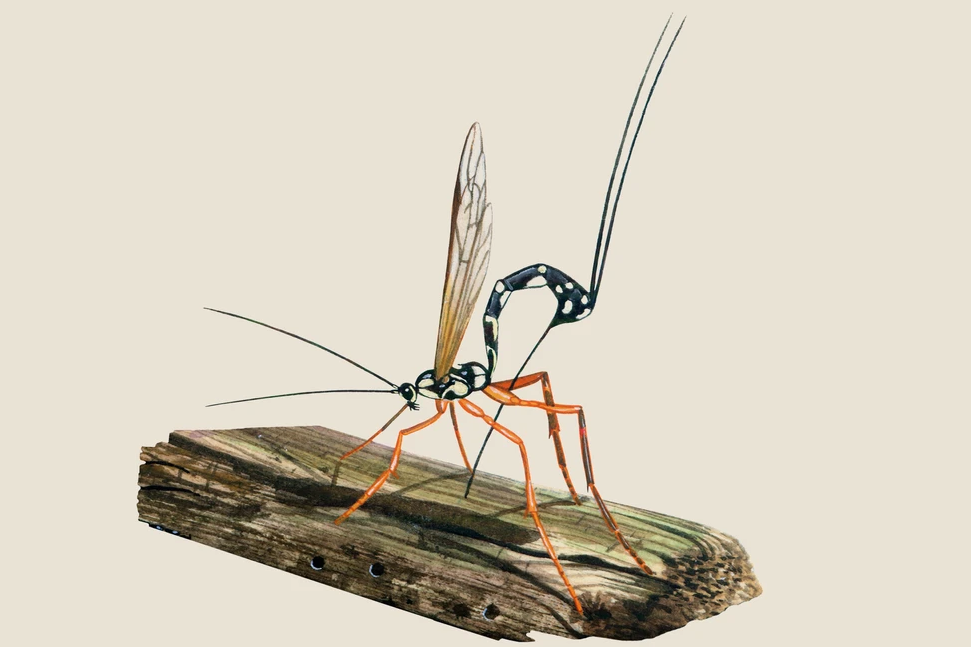
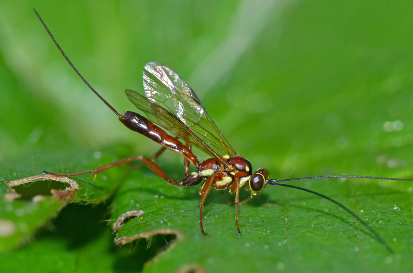

<!--More-->

## Introduction

Ichneumon wasps, members of the family *Ichneumonidae*, represent one of the most diverse and ecologically significant groups of insects in the world. With over 25,000 species formally described—and estimates suggesting there could be upwards of 100,000 species globally, ichneumon wasps are among the most abundant parasitoids found in natural ecosystems. These solitary wasps are crucial in regulating insect populations, making them valuable allies in both natural and agricultural settings.

  

    
    
Ichneumon wasp

  

What sets ichneumon wasps apart is their extraordinary life strategy as parasitoids. Unlike predators that kill their prey outright, parasitoids like ichneumon wasps lay their eggs in or on a host, with the developing larvae slowly consuming the host over time. This unique parasitic relationship is vital for controlling populations of pests such as caterpillars, beetles, and other insects that can cause significant damage to crops and forests.

Ichneumon wasps exhibit an astonishing range of adaptations that allow them to locate, parasitize, and exploit specific hosts, often in habitats that are difficult to access. From their specialized antennae, capable of detecting subtle chemical cues, to their remarkable ovipositors that can drill into wood or soil, ichneumon wasps have evolved to become highly effective biological control agents.

Despite their sinister reputation due to their parasitic nature, ichneumon wasps are harmless to humans and play an essential role in maintaining ecological balance. They are often mistaken for stinging wasps due to their bright, warning coloration, which is a form of Batesian Mimicry—an evolutionary tactic that deters predators by mimicking the appearance of more dangerous insects.

In addition to their ecological roles, ichneumon wasps offer a glimpse into the complexities of evolutionary biology. Their highly specialized behaviors, host specificity, and adaptations make them an important subject of study for scientists interested in parasitism, co-evolution, and biodiversity. Understanding the life cycles and interactions of these wasps provides insight into broader ecological processes and highlights the intricate relationships that sustain healthy ecosystems.

Through their dual role as natural pest controllers and as subjects in the study of evolutionary biology, ichneumon wasps contribute significantly to our understanding of nature's balance. By promoting environments that support these parasitoids, we can reduce the need for chemical pesticides, support sustainable agriculture, and foster biodiversity.

## Life Cycle

  

    
    
General ichneumon wasp life cycle

  

The life cycle of ichneumon wasps is a captivating process that revolves around parasitism. Like many insects, their development includes four key stages: egg, larva, pupa, and adult. However, it’s their unique interaction with host organisms during these stages that sets them apart.

Eggs: The journey begins when a female ichneumon wasp locates a suitable host. Using her highly sensitive antennae, she detects chemical signals emitted by the host or its environment. Once identified, the female wasp uses her ovipositor to lay eggs directly on, inside, or near the host. Depending on the species, hosts can range from caterpillars and beetle larvae to spiders and other insects. Some ichneumon wasps even drill through wood or plant tissue to reach hidden larvae, showcasing the remarkable precision and specialization of their ovipositors.

Larvae: After hatching, the wasp larvae feed on the host, either externally (ectoparasitically) or internally (endoparasitically). Internal parasitoids consume the host from within, strategically eating non-vital tissues first to keep the host alive as long as possible. This controlled feeding ensures that the larvae have a continuous source of nutrients, allowing them to complete their development. In some cases, the larvae produce chemicals that alter the host’s behavior, making it less likely to move or defend itself, further benefiting the developing wasps.

Pupae: Once the larvae have consumed enough of the host and reached maturity, they enter the pupal stage. The location of pupation depends on the species and type of parasitism. For internal parasitoids, the pupation often occurs within the host’s body, while external parasitoids may spin a cocoon nearby. The pupal stage is a period of metamorphosis during which the larvae transform into fully developed adult wasps. This stage can last from several days to several months, depending on environmental conditions and the specific species.

Adults: Adult ichneumon wasps emerge from the pupae with fully developed wings, reproductive organs, and, in females, a functional ovipositor. These adults are now ready to seek out mates and new hosts to continue the cycle. Although their larval stage is focused on parasitism, adult ichneumon wasps feed primarily on nectar, pollen, and sometimes honeydew. This diet provides them with the energy needed for flight, host-seeking, and reproduction. The lifespan of adult ichneumon wasps can range from a few weeks to several months, depending on the species and environmental factors.

The life cycle of ichneumon wasps is a finely tuned evolutionary process that balances the need for survival with the effective exploitation of host organisms. Their parasitic strategies have allowed them to become one of nature’s most effective pest controllers, making them indispensable in both natural ecosystems and agricultural systems.

## Behavioral Adaptations 

  

    
    
Illustration of ichneumon wasp penetrating wood to lay eggs inside of insects within the wood

  

Ichneumon wasps are renowned for their specialized behavioral adaptations that allow them to locate hosts with precision and ensure the successful development of their offspring. These adaptations include a combination of keen sensory abilities, strategic host-seeking behaviors, and intricate host manipulation. Each of these traits is finely tuned to the specific lifestyle and environmental conditions of the ichneumon wasps, making them highly effective parasitoids.

The ability to locate hosts hidden within their environment is one of the most crucial aspects of the ichneumon wasp's behavior. These wasps rely heavily on their antennae, which are equipped with highly sensitive chemoreceptors and mechanoreceptors. These sensory structures allow ichneumon wasps to detect a wide range of cues, including the chemical signatures released by potential hosts, pheromones, and environmental signals such as plant volatiles that indicate host presence.

For example, some ichneumon wasps are specialized to parasitize caterpillars that feed on specific plants. By detecting volatile compounds emitted by damaged plants, they can hone in on areas where their hosts are likely to be feeding. Once in proximity, they can use more refined chemical and tactile cues to pinpoint the exact location of the host, even if it is concealed within leaves, soil, or wood.

The host-seeking behavior of ichneumon wasps varies greatly depending on the species and the type of host they target. Some species are active hunters, searching through foliage or soil for visible signs of their hosts. Others rely on more specialized behaviors, such as tapping plant surfaces with their antennae or ovipositors to detect vibrations or movements that indicate the presence of a host.

For wood-boring larvae, some ichneumon wasps have evolved the ability to detect vibrations within tree trunks or branches. They tap the surface with their antennae or abdomen, sensing the subtle movements of larvae deep within the wood. Once a host is detected, the wasp’s ovipositor, which can be several times the length of its body, is used to drill through the wood and inject eggs directly into the host.

After locating a host, ichneumon wasps exhibit specialized oviposition behaviors to maximize the chances of successful parasitism. Depending on the species, the female wasp may lay her eggs on the surface of the host, inside its body, or even within its egg. The oviposition process is often precise and highly adapted to the host’s biology. For instance, wasps that parasitize hosts within tough substrates like wood have evolved long, flexible ovipositors that can navigate complex paths to reach the host.

Certain ichneumon wasps have developed intricate strategies to overcome host defenses. For instance, some parasitoids inject venom or chemicals into the host along with their eggs, suppressing the host’s immune response and preventing it from encapsulating or destroying the wasp larvae. Others produce substances that modify the host’s behavior, rendering it less active or more tolerant to parasitism, thereby increasing the likelihood that the wasp larvae will survive and develop.

The success of parasitism in ichneumon wasps often depends on synchronizing the development of the wasp larvae with the life cycle of the host. Many ichneumon wasps are highly selective in choosing hosts that are at specific developmental stages. For example, some wasps prefer hosts in the larval stage, while others target pupae. This selectivity ensures that the host provides sufficient resources at the right time for the developing wasp larvae.

In some species, ichneumon wasp larvae actively manipulate the host’s behavior to create a more favorable environment for themselves. For example, the larvae of certain ichneumon wasps induce caterpillars to spin protective silk cocoons not for themselves, but for the developing wasp larvae. In other cases, the host may be compelled to guard the wasp pupae against potential threats, even at the cost of its own life.

Over time, ichneumon wasps have evolved varying degrees of host specificity. Some species are generalists, capable of parasitizing a wide range of hosts, while others are highly specialized and will only parasitize a single host species or a narrow group of related species. This host specificity is often reflected in their behavior, with specialized wasps exhibiting precise and highly adapted strategies for locating and exploiting their chosen hosts. The high degree of co-evolution between these wasps and their hosts has driven the development of sophisticated behavioral traits, resulting in a delicate ecological balance between parasitism, host defenses, and environmental factors.

## Mimicry and Defense 

Ichneumon wasps are masters of deception and survival, employing a variety of mimicry and defense strategies to avoid predation and thrive in their environments. Despite being harmless to humans, their striking appearance and behavior have led them to be mistaken for more dangerous stinging wasps. These adaptations are crucial for their survival, especially given their often solitary nature and lack of group defenses like those seen in social wasps or bees.

The primary form of mimicry in ichneumon wasps is Batesian mimicry, where a harmless species evolves to resemble a harmful or noxious species to deter predators. Many ichneumon wasps have evolved bright coloration—typically combinations of black, yellow, orange, or red—similar to the aposematic (warning) colors of stinging wasps like yellowjackets or hornets. This resemblance creates a strong visual signal to predators, such as birds, that they may be dealing with a dangerous, stinging insect. Although ichneumon wasps do not sting or pose a threat, predators often avoid attacking them due to this convincing mimicry.

In addition to visual mimicry, ichneumon wasps also exhibit behavioral mimicry that enhances their resemblance to more dangerous species. Some ichneumon wasps mimic the flight patterns, movement, and even the aggressive postures of stinging wasps. For example, when threatened, certain ichneumon wasps may raise their abdomen or wave their antennae in a way that mimics the threat display of a true wasp. This behavior reinforces the visual warning signals, making the mimicry more effective in deterring predators.

  

    
    
Ichneumon wasp

  

Not all ichneumon wasps rely on mimicry for defense. Some species, particularly those that target hosts in concealed habitats like wood or soil, have evolved cryptic coloration that allows them to blend seamlessly into their surroundings. These wasps are often brown, green, or dull-colored, helping them remain hidden from both predators and potential hosts. Their slender bodies and quiet movements further aid in evading detection, allowing them to approach their hosts or avoid danger unnoticed.

Ichneumon wasps are also highly agile fliers, capable of quick directional changes and rapid escape maneuvers. This flight agility is an important defense mechanism, allowing them to evade predators that rely on speed and precision, such as birds or larger insects. The ability to hover, dart away suddenly, or maneuver through dense vegetation makes ichneumon wasps difficult targets, enhancing their chances of survival.

Although ichneumon wasps are generally harmless and do not sting, the long, sharp ovipositors of some species can be intimidating. While primarily used for laying eggs, the ovipositor can also be a deterrent against would-be predators. The sight of this sharp appendage, coupled with the wasp’s bold coloration, may be enough to convince predators to steer clear. In some cases, larger ichneumon wasps have been observed using their ovipositors defensively to jab at attackers, though this is rare and typically ineffective as a true defense.

## Take Away

Ichneumon wasps are remarkable insects with significant ecological roles as natural pest controllers. Their complex life cycles, specialized adaptations, and behavioral strategies highlight their importance in maintaining ecosystem balance. Understanding the life history and ecological contributions of ichneumon wasps underscores their value in sustainable pest management and biodiversity conservation. By appreciating the role of these parasitoids, we can better support the natural systems that keep ecosystems healthy and resilient.

